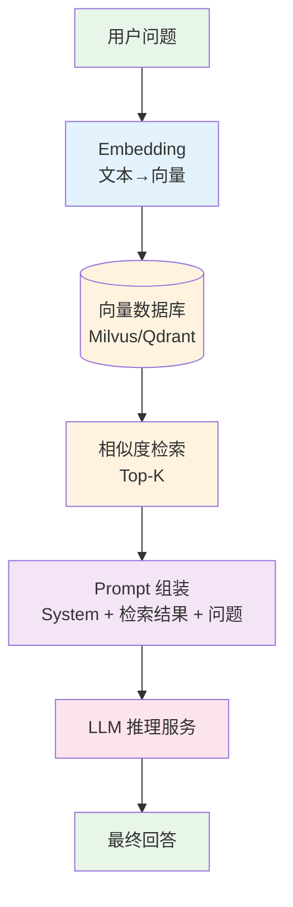
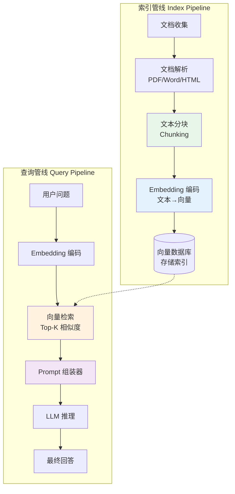
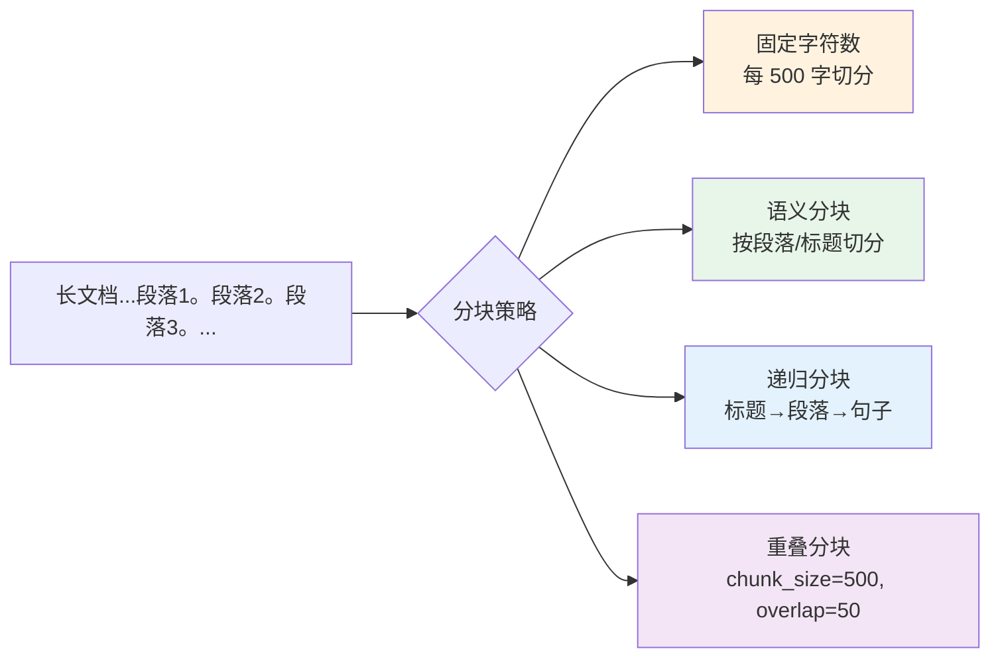
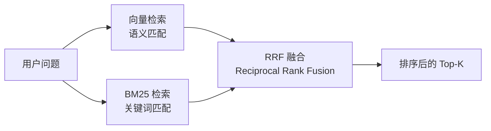
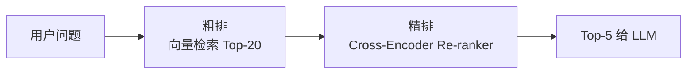
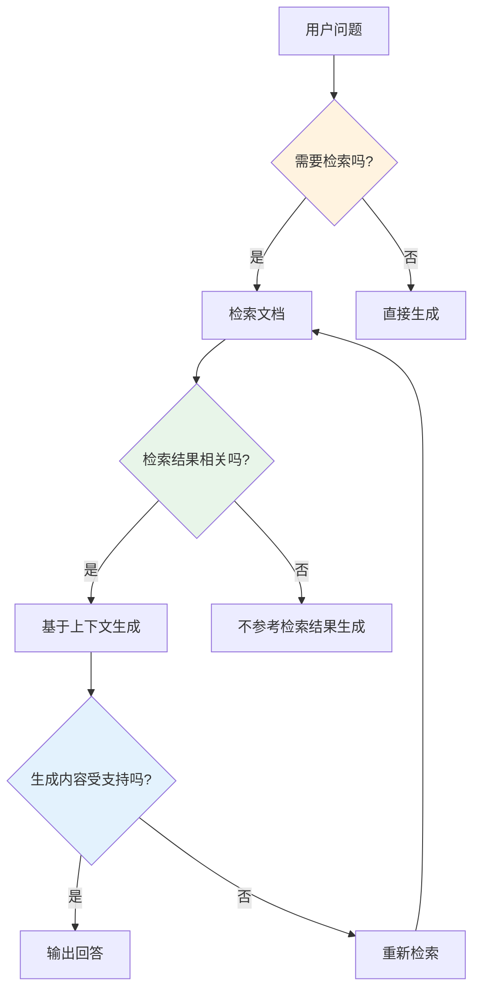
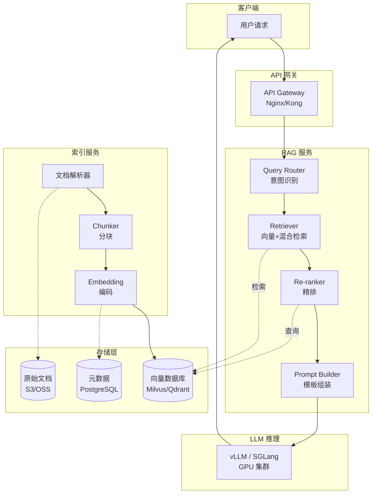
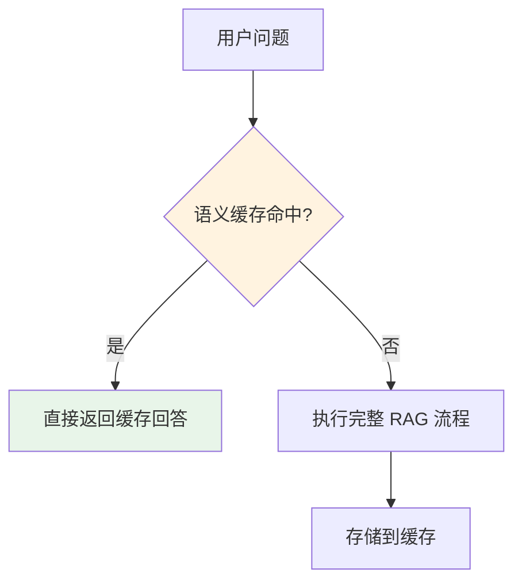

# RAG 原理及应用 — 让大模型拥有"外挂知识库"

> RAG（检索增强生成）是企业在生产环境中最常用的 AI 架构——它不需要训练模型，就能让 LLM 基于私有知识给出准确回答。

---

## 前置知识

- [提示词工程](./prompt-engineering.md)
- [Transformer 架构](../02-model-architecture/transformer-overview.md)
- [KV Cache](../02-model-architecture/kv-cache.md)

---

## 什么是 RAG

RAG = **R**etrieval（检索）+ **A**ugmented（增强）+ **G**eneration（生成）

核心思路：**先检索，再生成**——从外部知识库中找到与用户问题最相关的信息，拼接到 Prompt 中，让 LLM 基于这些信息生成回答。



### 为什么需要 RAG？

| 问题 | 纯 LLM | RAG |
|------|--------|-----|
| 训练数据外的知识 | 幻觉/不知道 | 检索到就能回答 |
| 知识时效性 | 受限于训练截止日期 | 更新知识库即可 |
| 私有数据 | 无法访问 | 可以检索企业内部文档 |
| 可追溯性 | 无法给出来源 | 可以标注引用来源 |
| 成本 | 需要微调才能适应领域 | 不需要训练，直接部署 |

> 一行话：**RAG 让 LLM 不用训练就能"读"你的私有文档。**

---

## RAG 核心组件拆解



### 1. 文档分块（Chunking）

分块策略直接影响检索质量。



| 策略 | 优点 | 缺点 | 适用场景 |
|------|------|------|---------|
| 固定字符数 | 简单、均匀 | 可能切断语义 | 快速原型 |
| 语义分块 | 保持语义完整 | 块大小不均 | 技术文档 |
| 递归分块 | 层级结构清晰 | 实现复杂 | 结构化文档 |
| 重叠分块 | 减少边界信息丢失 | token 有冗余 | 通用场景 |

**Chunk Size 的 trade-off：**

```
Chunk 太小 → 信息不完整，检索不到关键内容
Chunk 太大 → 引入噪声，浪费 Prompt token，LLM 注意力分散

经验值：
- 技术文档：500-800 tokens
- 对话记录：200-400 tokens
- 法律合同：300-600 tokens
- 代码文件：按函数/类切分
```

### 2. Embedding 模型选型

| 模型 | 维度 | 支持语言 | 特点 |
|------|------|---------|------|
| text-embedding-3-large (OpenAI) | 3072 | 多语言 | 效果最好，但闭源 |
| text-embedding-3-small (OpenAI) | 1536 | 多语言 | 性价比高 |
| bge-large-zh-v1.5 | 1024 | 中文优化 | 开源，中文检索最佳 |
| m3e (Moka) | 1024 | 中文 | 中文语义匹配优秀 |
| Cohere embed-v3 | 1024 | 多语言 | 可指定输入类型（search/document） |
| Jina Embeddings v3 | 1024 | 多语言 | 免费、多任务 |

**选择建议：**
- 中文为主 → `bge-large-zh-v1.5`（开源）或 OpenAI `text-embedding-3-large`（付费）
- 多语言 → OpenAI `text-embedding-3-large` 或 Cohere embed-v3
- 自建部署 → `bge` 系列，推理快、显存占用小

### 3. 向量数据库选型

| 数据库 | 部署 | 规模 | 特点 |
|--------|------|------|------|
| **Milvus** | 自建/云 | 亿级 | 生产级、支持混合检索、多租户 |
| **Qdrant** | 自建/云 | 千万级 | Rust 实现、高性能、过滤查询强 |
| **Pinecone** | SaaS | 亿级 | 全托管、零运维、适合初创 |
| **Chroma** | 本地/嵌入 | 百万级 | 轻量、开发友好、适合原型 |
| **Weaviate** | 自建/云 | 千万级 | GraphQL 接口、支持混合搜索 |
| **Elasticsearch** | 自建 | 亿级 | BM25 + 向量混合、已有 ES 可直接用 |

### 4. 相似度度量

```python
# 常用相似度算法
import numpy as np

def cosine_similarity(a: np.ndarray, b: np.ndarray) -> float:
    """余弦相似度 — 最常用，衡量方向差异"""
    return np.dot(a, b) / (np.linalg.norm(a) * np.linalg.norm(b))

def dot_product(a: np.ndarray, b: np.ndarray) -> float:
    """点积 — OpenAI embedding 推荐"""
    return np.dot(a, b)

def euclidean_distance(a: np.ndarray, b: np.ndarray) -> float:
    """欧氏距离 — 衡量绝对距离"""
    return np.linalg.norm(a - b)
```

| 度量方式 | 适用场景 | 说明 |
|---------|---------|------|
| 余弦相似度 | 通用 | 最常用，不受向量长度影响 |
| 点积 | OpenAI embedding | OpenAI 官方推荐 |
| 欧氏距离 | 需要绝对距离 | 对向量大小敏感 |

---

## 高级 RAG 技术

### 1. 混合检索（Hybrid Search）



向量检索擅长语义理解，但可能漏掉关键词精确匹配的结果。混合检索 = 向量检索 + BM25 关键词检索。

**RRF（Reciprocal Rank Fusion）公式：**

```
RRF(d) = Σ 1 / (k + rank(d))

其中 k = 60（经验值），rank(d) 是文档在某个检索结果中的排名

示例：
文档 A：向量检索排第 1，BM25 排第 5
RRF(A) = 1/(60+1) + 1/(60+5) = 0.0164 + 0.0154 = 0.0318

文档 B：向量检索排第 3，BM25 排第 2
RRF(B) = 1/(60+3) + 1/(60+2) = 0.0159 + 0.0161 = 0.0320

→ B 排前面
```

### 2. 重排序（Re-ranking）



向量检索（双塔模型）是近似相似度，Cross-Encoder Re-ranker 会把 query 和 document 一起输入模型做精确打分。

**常用 Re-ranker：**

| 模型 | 语言 | 说明 |
|------|------|------|
| `bge-reranker-v2-m3` | 多语言 | 开源，效果最好 |
| `Cohere rerank-v3` | 多语言 | API 调用，效果好 |
| `jina-reranker-v2` | 多语言 | 开源 + API |
| `RankGPT` | 多语言 | 用 GPT 做排序，成本高 |

**Re-ranker 的 trade-off：**

```
不加 Re-ranker：
  延迟：低（只走一次向量检索）
  准确率：中等
  适用：对延迟敏感的场景

加 Re-ranker：
  延迟：+50-200ms（需要额外推理）
  准确率：显著提升（MRR +10-30%）
  适用：对准确率要求高的场景
```

### 3. 上下文压缩（Context Compression）

检索到的上下文可能包含大量无关信息，需要压缩：

```python
# 上下文压缩的三种方式

# 1. 句子级别过滤 — 只保留与问题相关的句子
def sentence_filter(sentences: list[str], query: str) -> list[str]:
    """用轻量模型给每个句子打分，保留高分句子"""
    ...

# 2. Token 级别压缩 — 去掉低信息量的 token
def token_compression(text: str, query: str) -> str:
    """用压缩模型去掉冗余信息，保留关键内容"""
    ...

# 3. 摘要式压缩 — 把长文本压缩为简短摘要
def summarization(text: str, max_tokens: int = 500) -> str:
    """用 LLM 对检索到的上下文做摘要"""
    ...
```

### 4. 多跳检索（Multi-hop Retrieval / Self-RAG）

当单次检索无法完整回答问题时，模型可以主动进行多轮检索：

```
用户: "GPT-4 相比 GPT-3.5 在哪些 benchmark 上有显著提升？"

Step 1: 检索 "GPT-4 benchmark"
→ 得到 MMLU、GSM8K 等数据

Step 2: 模型判断信息不足，发起第二轮检索 "GPT-3.5 benchmark MMLU"
→ 得到 GPT-3.5 的对比数据

Step 3: 综合两轮检索结果生成回答
```

**Self-RAG 框架（Asai et al., 2024）：**



---

## RAG 在生产环境中的架构



### 关键设计决策

| 决策点 | 选项 | 推荐 |
|--------|------|------|
| Embedding 服务 | 在线 API vs 自建 | 生产推荐自建（bge 系列） |
| Chunk Size | 固定 vs 动态 | 根据文档类型配置 |
| Top-K | K=3 vs K=10 | 先取 10，经 re-rank 后取 5 |
| Re-ranker | 需要 vs 不需要 | 生产强烈推荐 |
| 上下文窗口 | 截断 vs 摘要 | 长文档用摘要压缩 |

### 性能指标

```
典型 RAG 请求的延迟分布：

组件              | P50    | P95    | P99
─────────────────|────────|────────|────────
Embedding 编码   | 10ms   | 25ms   | 50ms
向量检索 (Top-10)| 15ms   | 40ms   | 80ms
Re-ranker        | 50ms   | 120ms  | 200ms
Prompt 组装      | 5ms    | 10ms   | 15ms
LLM 推理         | 800ms  | 2000ms | 4000ms
─────────────────|────────|────────|────────
端到端            | 880ms  | 2195ms | 4345ms

LLM 推理占端到端延迟的 90%+，是优化重点。
```

---

## RAG 评估体系

### 核心指标（RAGAS 框架）

```
RAGAS (RAG Assessment) 四大指标：

1. Faithfulness（忠实度）
   → 回答是否基于检索到的上下文？有无幻觉？
   → 测量：LLM 判断回答中的事实是否能在 context 中找到

2. Answer Relevance（回答相关性）
   → 回答是否切题？
   → 测量：LLM 判断回答是否直接回应了用户问题

3. Context Precision（上下文精确度）
   → 检索到的上下文中，有多少是真正有用的？
   → 测量：相关 chunk 数 / 总 chunk 数

4. Context Recall（上下文召回率）
   → 是否检索到了回答所需的全部信息？
   → 测量：基于 ground truth 答案反推需要的事实是否都被检索到
```

### 评估 Pipeline

```python
# 用 ragas 框架评估 RAG 系统
from ragas import evaluate
from ragas.metrics import faithfulness, answer_relevance, context_precision, context_recall

# 测试数据集
dataset = [
    {
        "question": "GPT-4 的 MMLU 得分是多少？",
        "answer": "GPT-4 的 MMLU 得分为 86.4%",
        "contexts": ["根据 OpenAI 技术报告，GPT-4 在 MMLU 上得分为 86.4%"],
        "ground_truth": "86.4%"
    },
    ...
]

results = evaluate(dataset, metrics=[
    faithfulness,
    answer_relevance,
    context_precision,
    context_recall
])

print(results)
# faithfulness: 0.92
# answer_relevance: 0.88
# context_precision: 0.85
# context_recall: 0.78
```

---

## 部署视角

### RAG 的显存和成本分析

```
RAG 的额外开销：

1. Embedding 服务
   - bge-large 模型：约 1.2GB 显存
   - 单次推理：<10ms（单卡）
   - 成本：几乎可忽略

2. Re-ranker 服务
   - bge-reranker 模型：约 1.4GB 显存
   - 单次推理：30-100ms（取决于 query-doc 对数）
   - 成本：中等

3. 向量数据库
   - Milvus：4 核 16GB 起步
   - 存储：1M 个 1024 维向量 ≈ 4GB（FP32）

4. LLM 推理（最大开销）
   - Prompt 变长：原始 prompt + Top-K 上下文
   - 如果每个 chunk 500 tokens，Top-5 = 额外 2500 input tokens
   - 成本增加：约 2-3x 普通对话

优化策略：
- 用更小的 Embedding 模型（384 维 vs 1024 维）
- Re-ranker 只对 Top-10 做精排
- 上下文压缩，减少给 LLM 的 token 数
- 缓存高频问题的检索结果
```

### 缓存策略



```python
# 语义缓存示例
from sentence_transformers import SentenceTransformer
import numpy as np

model = SentenceTransformer("bge-large-zh-v1.5")

# 缓存结构：[(embedding, answer, question), ...]
cache = []

def query_cache(question: str, threshold: float = 0.95) -> str | None:
    q_emb = model.encode(question)
    for cached_emb, cached_answer, cached_question in cache:
        sim = np.dot(q_emb, cached_emb) / (np.linalg.norm(q_emb) * np.linalg.norm(cached_emb))
        if sim > threshold:
            return cached_answer
    return None
```

---

## 面试视角

### 常考问题

1. **"RAG 是什么？为什么要用它？"**

   回答框架：
   - RAG = 检索 + 增强 + 生成
   - 解决 LLM 的三大问题：知识时效性、私有数据访问、幻觉
   - 不需要训练模型，成本低，见效快
   - 企业落地 AI 的第一步

2. **"怎么提升 RAG 的准确率？"**

   分阶段回答：
   - 检索层：换更好的 Embedding 模型、加大 Top-K、混合检索（向量 + BM25）
   - 排序层：加入 Cross-Encoder Re-ranker
   - 文档层：优化 Chunking 策略（大小、重叠、语义边界）
   - 生成层：优化 Prompt 模板，让 LLM 严格基于上下文回答
   - 评估层：用 RAGAS 框架定位瓶颈（是检索差还是生成差？）

3. **"RAG 的延迟怎么优化？"**

   - Embedding 服务自建部署，减少网络延迟
   - 向量检索用 GPU 加速的数据库（Milvus GPU 版本）
   - Re-ranker 只对 Top-10 做精排，不检索 100 个再排序
   - 语义缓存：高频问题直接返回缓存
   - 异步化：检索和 LLM 推理并行（在 LLM 推理时同时做下一轮检索准备）

4. **"你怎么评估一个 RAG 系统好不好？"**

   - 用 RAGAS 四大指标：Faithfulness、Answer Relevance、Context Precision、Context Recall
   - 构建测试集（100-500 条问答对），包含领域内典型问题
   - 关注 Context Recall——如果检索不到需要的信息，LLM 再强也没用
   - 线上监控：用户满意度、回答采纳率、人工介入率

5. **"RAG 和微调怎么选？"**

   | 场景 | 推荐 | 原因 |
   |------|------|------|
   | 知识型问答 | RAG | 不需要训练，更新知识库即可 |
   | 风格/格式适配 | 微调 | RAG 学不会特定输出风格 |
   | 专业术语理解 | RAG + 微调 | RAG 提供知识，微调提供理解 |
   | 实时数据 | RAG | 微调无法包含实时信息 |

---

## 扩展阅读

- [Retrieval-Augmented Generation for Knowledge-Intensive NLP Tasks](https://arxiv.org/abs/2005.11401) — RAG 原始论文（Lewis et al., 2020）
- [Self-RAG: Learning to Retrieve, Generate, and Critique](https://arxiv.org/abs/2310.11511) — Asai et al., 2024
- [RAGAS Evaluation Framework](https://github.com/explodinggradients/ragas) — 开源 RAG 评估工具
- [LlamaIndex](https://www.llamaindex.ai/) — RAG 框架
- [LangChain RAG](https://python.langchain.com/docs/recipes/rag/) — RAG 实现参考

---

*下一步：[Agent 架构与实战](./agent-architecture.md)*
