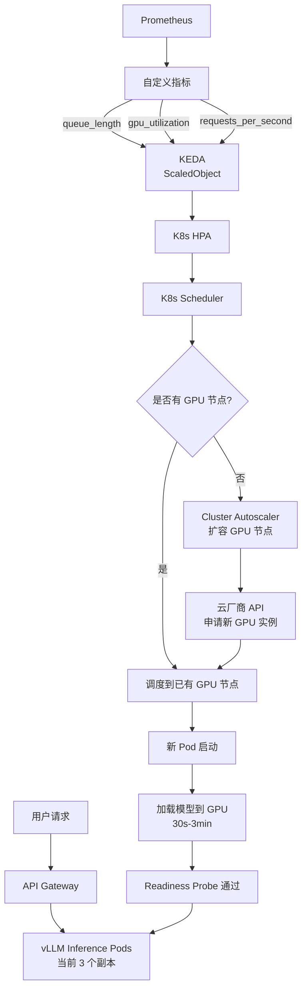
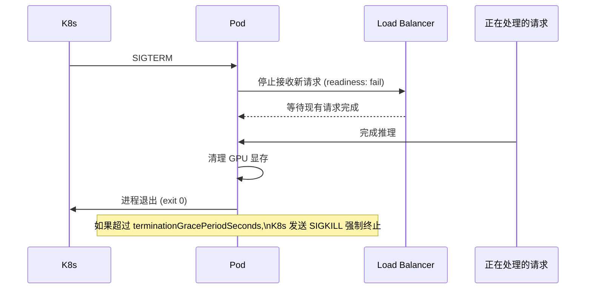
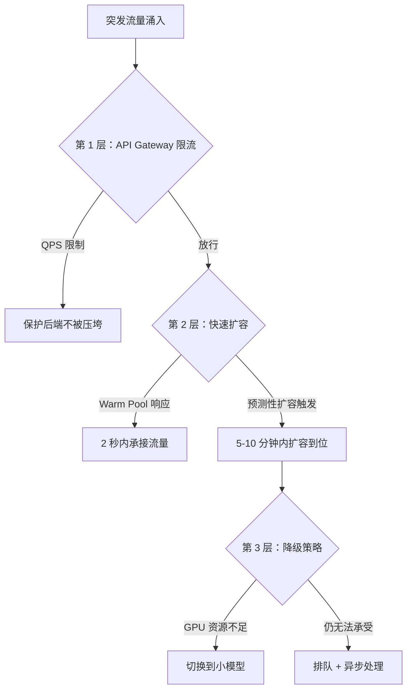

# 弹性扩缩容

> LLM 推理服务的扩缩容不是简单的 "CPU 高了就加 Pod"，而是需要感知 GPU 显存、队列深度和模型加载时间的智能调度。

## 核心概念（含架构图）

### HPA + KEDA 自动扩缩架构



这张图揭示了 LLM 扩缩容的核心难点：**从触发扩容到 Pod 能处理请求，中间有 30s-3min 的模型加载时间**，这是传统 HPA 无法解决的。

## 部署视角

### HPA 基础与局限性

#### 标准 HPA（基于 CPU）

```yaml
apiVersion: autoscaling/v2
kind: HorizontalPodAutoscaler
metadata:
  name: vllm-hpa
spec:
  scaleTargetRef:
    apiVersion: apps/v1
    kind: Deployment
    name: vllm-llm
  minReplicas: 2
  maxReplicas: 10
  metrics:
  - type: Resource
    resource:
      name: cpu
      target:
        type: Utilization
        averageUtilization: 70
```

**为什么标准 HPA 不适合 LLM 推理？**

| 问题 | 原因 |
|------|------|
| CPU 不是瓶颈 | LLM 推理是 GPU-bound，CPU 可能才 30% 但 GPU 已经 100% |
| 扩缩滞后 | 等 CPU 指标升高再扩容时，用户请求已经超时 |
| 冷启动代价高 | 新 Pod 加载 70B 模型需要 1-3 分钟，远长于无状态服务 |
| 显存不可弹性 | 一张 GPU 上能跑几个副本取决于模型大小，无法动态调整 |

#### 基于自定义指标的 HPA

```yaml
apiVersion: autoscaling/v2
kind: HorizontalPodAutoscaler
metadata:
  name: vllm-hpa-custom
spec:
  scaleTargetRef:
    apiVersion: apps/v1
    kind: Deployment
    name: vllm-llm
  minReplicas: 2
  maxReplicas: 10
  metrics:
  # GPU 利用率指标
  - type: Pods
    pods:
      metric:
        name: gpu_utilization_percent
      target:
        type: AverageValue
        averageValue: "80"
  # 请求队列长度
  - type: Pods
    pods:
      metric:
        name: vllm_queue_length
      target:
        type: AverageValue
        averageValue: "16"
```

### KEDA（Kubernetes Event-driven Autoscaling）

KEDA 是对 HPA 的增强，支持更多触发器和更灵活的扩缩策略。

```yaml
apiVersion: keda.sh/v1alpha1
kind: ScaledObject
metadata:
  name: vllm-scaling
  namespace: llm-serving
spec:
  scaleTargetRef:
    name: vllm-llm
  pollingInterval: 15      # 每 15 秒检查一次指标
  cooldownPeriod: 300      # 缩容冷却 5 分钟（避免抖动）
  minReplicaCount: 2       # 始终保留 2 个副本
  maxReplicaCount: 20
  advanced:
    horizontalPodAutoscalerConfig:
      behavior:
        scaleUp:
          stabilizationWindowSeconds: 60  # 扩缩稳定窗口
          policies:
          - type: Pods
            value: 2        # 每次最多加 2 个 Pod
            periodSeconds: 60
        scaleDown:
          stabilizationWindowSeconds: 600  # 缩容更保守（10 分钟）
          policies:
          - type: Pods
            value: 1        # 每次只缩 1 个 Pod
            periodSeconds: 120
  triggers:
  # Prometheus 指标触发
  - type: prometheus
    metadata:
      serverAddress: http://prometheus.monitoring:9090
      query: avg_over_time(vllm_num_requests_waiting{namespace="llm-serving"}[2m])
      threshold: "10"       # 排队请求超过 10 个开始扩容
  # GPU 利用率触发
  - type: prometheus
    metadata:
      serverAddress: http://prometheus.monitoring:9090
      query: avg(DCGM_FI_DEV_GPU_UTIL{namespace="llm-serving"})
      threshold: "85"       # GPU 利用率超过 85% 扩容
```

### 自定义指标扩缩详解

#### 关键指标选型

| 指标 | 采集方式 | 扩容阈值 | 说明 |
|------|----------|----------|------|
| **Queue Length** | vLLM `/metrics` 端点 | > 10 | 最直接的服务压力指标 |
| **GPU 利用率** | NVIDIA DCGM → Prometheus | > 85% | 反映 GPU 是否饱和 |
| **QPS** | API Gateway | > 50 req/s | 预测性指标 |
| **KV Cache 使用率** | vLLM 内部指标 | > 80% | 缓存快满时新请求会被 reject |
| **P99 延迟** | Prometheus Histogram | > 2s | SLO 驱动扩缩 |

#### GPU 感知扩缩策略

```python
# 自定义 Metrics Adapter 示例（Prometheus Adapter 配置）
rules:
  - seriesQuery: 'vllm_gpu_cache_usage_ratio{namespace!="",pod!=""}'
    resources:
      overrides:
        namespace: {resource: "namespace"}
        pod: {resource: "pod"}
    name:
      matches: "vllm_gpu_cache_usage_ratio"
    metricsQuery: 'avg by(pod) (rate(vllm_gpu_cache_usage_ratio[2m]))'
```

**GPU 扩缩的特殊性**：一个 GPU 能同时服务多少请求取决于模型大小和 KV Cache 配置：

| 模型 | 量化 | 单卡最大 batch | 单卡可部署 Pod 数 |
|------|------|---------------|-----------------|
| 7B | FP16 | 256 | 1（独占） |
| 7B | INT4 | 512 | 2（共享，需要 MIG 或时间片） |
| 70B | INT4 | 32 | 4 卡（Tensor Parallel） |
| 70B | FP16 | 16 | 8 卡 |

### 冷启动问题深度分析

**冷启动时间分解**：

```mermaid
gantt
    title 新 Pod 冷启动时间分解（70B INT4, 4xA100）
    dateFormat X
    axisFormat %s

    section Pod 生命周期
    拉取镜像           :0, 10
    Init Container     :10, 25
    主容器启动         :25, 30

    section 模型加载
    权重文件从存储加载  :30, 55
    加载到 GPU 显存    :55, 70
    KV Cache 预分配    :70, 75

    section 就绪验证
    Warmup 推理       :75, 78
    Readiness Probe   :78, 80
```



**总耗时约 80 秒**，在这期间用户请求排队或超时。

#### 冷启动缓解方案

| 方案 | 原理 | 效果 | 成本 |
|------|------|------|------|
| **Warm Pool** | 始终保持 1-2 个已加载模型的空闲 Pod | 消除冷启动 | 额外 GPU 成本 |
| **预测性扩容** | 根据历史流量曲线提前 5-10 分钟扩容 | 大部分场景消除冷启动 | 需要流量预测 |
| **模型预热** | 新 Pod 启动后做一次 dummy inference 触发 CUDA kernel 编译 | 减少首次推理延迟 | 几乎无成本 |
| **镜像优化** | 模型权重预打包在镜像中 + init container 预加载 | 减少模型下载时间 | 镜像变大 |
| **eBPF 加速** | Cilium eBPF 加速网络，减少 Pod 启动网络延迟 | 减少 2-5 秒 | 需要 Cilium |

```yaml
# Warm Pool 实现：使用 KEDA 保持最小副本 + Cluster Autoscaler 预 provision
# 策略：始终保持 minReplicaCount = 2
# 即使用户请求为 0，也保留 2 个已加载模型的 Pod

# 预测性扩容实现：KEDA Cron Scaler
  triggers:
  - type: cron
    metadata:
      timezone: Asia/Shanghai
      start: 0 9 * * *     # 每天 9:00 开始
      end: 0 10 * * *      # 每天 10:00 结束
      desiredReplicas: "8"  # 早高峰扩容到 8 个
```

### 弹性缩容的优雅处理

#### Graceful Shutdown 流程



```yaml
spec:
  template:
    spec:
      terminationGracePeriodSeconds: 120  # 给 2 分钟完成优雅退出
      containers:
      - name: vllm
        lifecycle:
          preStop:
            exec:
              command:
              - /bin/sh
              - -c
              - |
                # 1. 通知 LB 停止分发流量
                sleep 10
                # 2. 等待正在处理的请求完成
                # 3. 清理 GPU 资源
                curl -X POST http://localhost:8000/shutdown
```

**关键配置**：
- `terminationGracePeriodSeconds`：至少设置为模型最长推理时间 × 2
- `preStop` hook：给 LB 时间感知 Pod 即将下线
- SIGTERM 信号处理：vLLM 需要正确实现 signal handler

## 面试视角

### 面试题：LLM 服务突发流量（如产品上线、热点事件），如何处理？

**标准答案**（分三层防御）：



**详细策略**：

1. **事前（预防）**：
   - 流量预测：基于历史数据建立模型，预测早晚高峰
   - 预热策略：KEDA Cron Scaler 提前扩容
   - Warm Pool：始终保留 2-3 个热备 Pod

2. **事中（应对）**：
   - **0-2 秒**：Warm Pool 直接承接
   - **2-60 秒**：API Gateway 限流 + 排队，HPA 开始扩容
   - **1-5 分钟**：KEDA 触发扩缩，新 Pod 启动
   - **5-15 分钟**：Cluster Autoscaler 扩容 GPU 节点（云厂商）

3. **降级（兜底）**：
   - 优先保障核心业务（通过 PriorityClass 调度）
   - 非核心业务降级到小模型（70B → 7B）
   - 最坏情况：返回排队提示，异步处理

**关键追问**：

**Q: 如果流量突增 10 倍，扩容来不及怎么办？**

A：
1. 立限流（保护系统不崩溃）
2. 切小模型（7B 单卡可部署更多副本）
3. 启用请求队列 + 异步响应（用户提交后拿到 task_id，轮询结果）
4. 同时联系云厂商紧急加配额（GPU 实例可能需要预留）

**Q: 缩容时如何判断一个 Pod 是否可以安全缩掉？**

A：
1. 检查该 Pod 是否有正在处理的请求（active requests = 0）
2. 检查整体队列长度是否低于阈值（不需要这个 Pod 了）
3. 执行 graceful shutdown：先发 SIGTERM，等待 120s
4. 监控缩容后剩余 Pod 的 GPU 利用率和队列长度（不能导致过载）

---

*下一节：[可观测性](./observability.md)*
