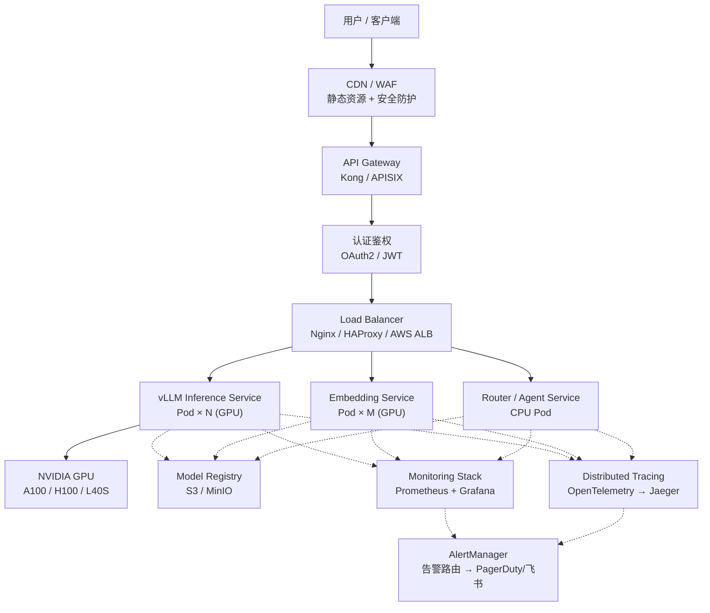
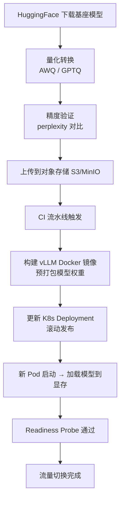
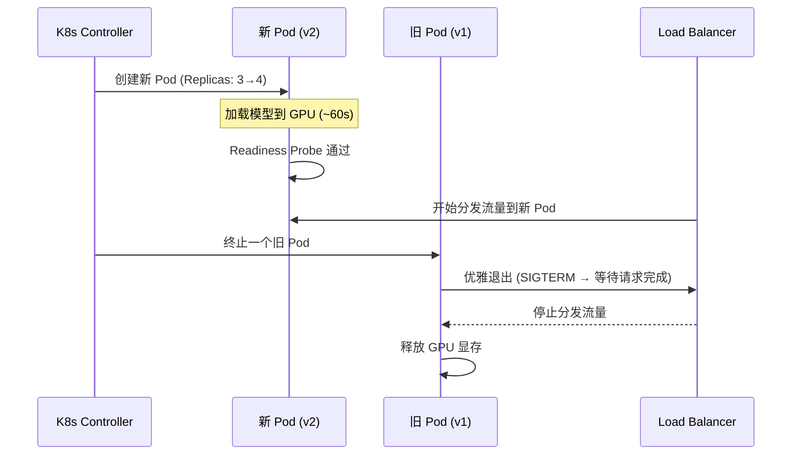
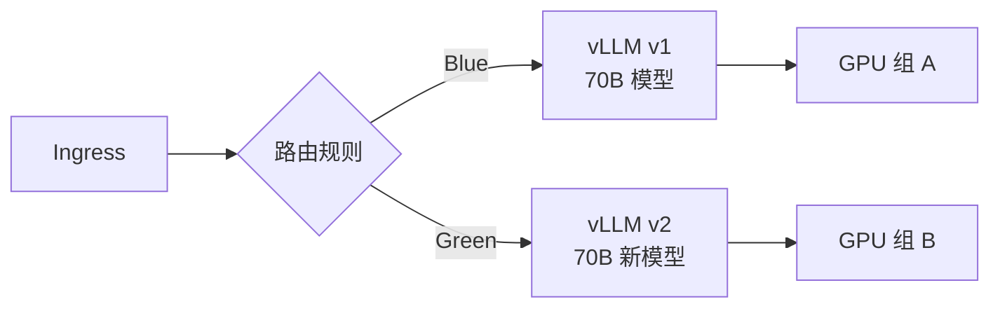
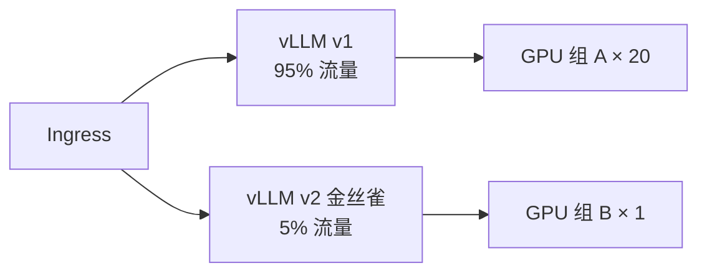
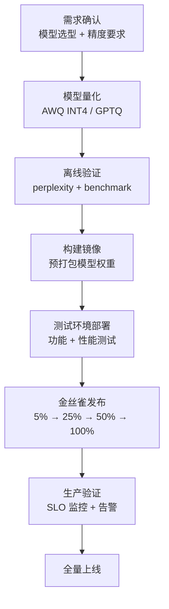

# 部署架构设计

> 生产级 LLM 部署需要完整的组件选型、K8s 编排、GPU 调度和模型生命周期管理，远不止 "启动一个 Docker 容器"。

## 核心概念（含架构图）

### 完整部署架构



这张图展示了一个生产级 LLM 推理服务的全链路。每个组件的选型和职责如下：

## 部署视角

### 典型部署架构组件详解

#### 1. API Gateway（Kong / APISIX）

职责：统一入口、路由分发、限流、认证、协议转换。

| 维度 | Kong | APISIX |
|------|------|--------|
| 性能 | 高（Nginx 底层） | 更高（动态配置无需 reload） |
| 生态 | 插件丰富 | 云原生优先 |
| 适用场景 | 稳定生产环境 | 频繁变更、需要热更新 |

在 LLM 场景中的关键能力：
- **请求限流**：按 API Key 控制 QPS，防止单用户挤占 GPU 资源
- **请求路由**：按模型名称/版本路由到不同后端
- **协议转换**：OpenAI 兼容接口的标准化
- **响应缓冲**：SSE（Server-Sent Events）流式响应的稳定传输

#### 2. Load Balancer

```
Layer 4 (LVS) → Layer 7 (Nginx) → vLLM Pods
```

- **Layer 4**：IPVS 负载均衡，处理 TCP 连接分发，高性能
- **Layer 7**：Nginx/Envoy，处理 HTTP 路由、健康检查、TLS 终结

关键配置：
- **连接保持**：长连接复用减少 TLS 握手开销
- **健康检查**：对 `/health` 端点主动探测，异常 Pod 自动摘除
- **负载均衡算法**：`least_conn`（最少连接数）优于 `round_robin`，因为 LLM 请求时长差异大

#### 3. Inference Service（vLLM / TRT-LLM）

LLM 推理引擎选择：

| 引擎 | 特点 | 适用场景 |
|------|------|----------|
| vLLM | PagedAttention、高吞吐 | 通用推理、多模型 |
| TRT-LLM | TensorRT 优化、极致性能 | NVIDIA GPU、生产追求极致 |
| TGI | HuggingFace 官方、易用 | 快速上线、HuggingFace 模型 |
| SGLang | RadixAttention、KV Cache 共享 | 多轮对话、Agent 场景 |

#### 4. Model Registry（模型注册中心）

模型从训练到上线的标准流程：


**量化选型指南**：

| 量化方式 | 精度 | 显存压缩 | 精度损失 | 硬件要求 |
|----------|------|----------|----------|----------|
| FP16 | 半精度 | 2x | 无 | 标准 GPU |
| AWQ INT4 | 4-bit | 4x | 极小 | 支持 INT4 解码 |
| GPTQ INT4 | 4-bit | 4x | 较小 | 通用 |
| FP8 | 8-bit 浮点 | 2x | 极小 | H100+ |

#### 5. Monitoring Stack

见 [可观测性体系](./observability.md)。

### Kubernetes 部署 LLM 完整 YAML 示例

```yaml
---
# ConfigMap：模型配置
apiVersion: v1
kind: ConfigMap
metadata:
  name: vllm-config
  namespace: llm-serving
data:
  MODEL_NAME: "Qwen2.5-72B-Instruct-AWQ"
  MAX_MODEL_LEN: "8192"
  GPU_MEMORY_UTILIZATION: "0.90"
  ENFORCE_EAGER: "false"
  MAX_NUM_SEQS: "256"
  MAX_NUM_BATCHED_TOKENS: "32768"

---
# Deployment
apiVersion: apps/v1
kind: Deployment
metadata:
  name: vllm-llm
  namespace: llm-serving
  labels:
    app: vllm
    model: qwen2.5-72b
spec:
  replicas: 3
  strategy:
    type: RollingUpdate
    rollingUpdate:
      maxUnavailable: 0  # 零停机：先启动新 Pod
      maxSurge: 1
  selector:
    matchLabels:
      app: vllm
  template:
    metadata:
      labels:
        app: vllm
        model: qwen2.5-72b
    spec:
      # GPU 节点亲和性：只调度到指定 GPU 型号的节点
      affinity:
        nodeAffinity:
          requiredDuringSchedulingIgnoredDuringExecution:
            nodeSelectorTerms:
            - matchExpressions:
              - key: gpu-type
                operator: In
                values: ["A100-80GB", "H100-80GB"]
        # Pod 反亲和性：让 vLLM Pod 分散到不同 GPU 节点
        podAntiAffinity:
          preferredDuringSchedulingIgnoredDuringExecution:
          - weight: 100
            podAffinityTerm:
              labelSelector:
                matchExpressions:
                - key: app
                  operator: In
                  values: ["vllm"]
              topologyKey: kubernetes.io/hostname
              # topologyKey 定义"什么维度相同的 Pod 被视为在同一位置"
              # kubernetes.io/hostname = 同一台主机上的 Pod 尽量分散
      # 容忍 GPU 节点的污点（防止非 GPU Pod 被调度到 GPU 节点）
      tolerations:
      - key: "nvidia.com/gpu"
        operator: "Exists"
        effect: "NoSchedule"
      containers:
      - name: vllm
        image: vllm/vllm-openai:latest
        command:
        - "python3"
        - "-m"
        - "vllm.entrypoints.openai.api_server"
        - "--model"
        - "$(MODEL_NAME)"
        - "--tensor-parallel-size"
        - "4"
        - "--max-model-len"
        - "$(MAX_MODEL_LEN)"
        - "--gpu-memory-utilization"
        - "$(GPU_MEMORY_UTILIZATION)"
        - "--max-num-seqs"
        - "$(MAX_NUM_SEQS)"
        envFrom:
        - configMapRef:
            name: vllm-config
        resources:
          requests:
            nvidia.com/gpu: 4
            memory: "128Gi"
            cpu: "16"
          limits:
            nvidia.com/gpu: 4
            memory: "128Gi"
            cpu: "16"
        ports:
        - containerPort: 8000
          protocol: TCP
        # 就绪探针：模型加载完成后才接收流量
        readinessProbe:
          httpGet:
            path: /health
            port: 8000
          initialDelaySeconds: 120  # 70B 模型加载约 60-90s
          periodSeconds: 10
          failureThreshold: 6
        # 存活探针：死锁检测
        livenessProbe:
          httpGet:
            path: /health
            port: 8000
          initialDelaySeconds: 180
          periodSeconds: 30
          failureThreshold: 3
        volumeMounts:
        - name: model-cache
          mountPath: /root/.cache/huggingface
        - name: shm
          mountPath: /dev/shm
      volumes:
      - name: model-cache
        emptyDir:
          medium: Memory
          sizeLimit: "80Gi"  # 量化后模型 ~40GB，留余量
      - name: shm
        emptyDir:
          medium: Memory
          sizeLimit: "16Gi"  # PyTorch DataLoader 和 NCCL 使用 /dev/shm 做进程间通信
                              # Tensor Parallel 多进程间需要大共享内存，默认 64M 不够

---
# Service
apiVersion: v1
kind: Service
metadata:
  name: vllm-service
  namespace: llm-serving
  annotations:
    service.beta.kubernetes.io/aws-load-balancer-type: "nlb"
    service.beta.kubernetes.io/aws-load-balancer-internal: "true"
spec:
  type: ClusterIP
  selector:
    app: vllm
  ports:
  - name: http
    port: 80
    targetPort: 8000
    protocol: TCP
```

### GPU 节点配置详解

#### NVIDIA Device Plugin 安装

```bash
# 1. 安装 NVIDIA Container Toolkit
curl -fsSL https://nvidia.github.io/libnvidia-container/gpgkey | \
  sudo gpg --dearmor -o /usr/share/keyrings/nvidia-container-toolkit-keyring.gpg
curl -s -L https://nvidia.github.io/libnvidia-container/stable/deb/nvidia-container-toolkit.list | \
  sed 's#deb https://#deb [signed-by=/usr/share/keyrings/nvidia-container-toolkit-keyring.gpg] https://#' | \
  sudo tee /etc/apt/sources.list.d/nvidia-container-toolkit.list
sudo apt-get update && sudo apt-get install -y nvidia-container-toolkit

# 2. 安装 Device Plugin（K8s 自动发现 GPU）
kubectl apply -f https://raw.githubusercontent.com/NVIDIA/k8s-device-plugin/v0.14.1/deployments/static/nvidia-device-plugin.yml
```

安装后，K8s Node 自动报告 GPU 资源：

```yaml
# kubectl describe node gpu-node-01
Capacity:
  nvidia.com/gpu: 8        # 8 张 A100
Allocatable:
  nvidia.com/gpu: 8
```

#### Taints & Tolerations

```yaml
# 给 GPU 节点打污点（防止普通 Pod 调度到 GPU 节点）
# 注意：污点的 key 必须和 Pod toleration 中的 key 一致
kubectl taint nodes gpu-node-01 nvidia.com/gpu=:NoSchedule

# Pod 需要声明容忍才能调度（与上方 taint 的 key 匹配）
tolerations:
- key: "nvidia.com/gpu"
  operator: "Exists"
  effect: "NoSchedule"
```

#### 多 GPU 拓扑感知调度

> **注意**：K8s 原生不直接做 GPU 拓扑感知（如保证 NVLink 域内分配）。
> PriorityClass 仅用于控制 Pod 的调度优先级，拓扑感知需要借助 NVIDIA GPU Operator 的 device-plugin 配置或自定义调度器（如 Volcano）。

```yaml
# PriorityClass 控制调度优先级，确保 GPU 推理 Pod 优先于普通 Pod 被调度
# 真正的拓扑感知需要 NVIDIA Device Plugin 的 topology manager 配合
apiVersion: scheduling.k8s.io/v1
kind: PriorityClass
metadata:
  name: llm-high-priority
value: 1000000
globalDefault: false
description: "LLM 推理服务，高优先级确保 GPU 资源优先分配"
```

### 模型加载流程



**关键时间节点**（70B AWQ INT4，A100 80GB × 4）：

| 阶段 | 耗时 |
|------|------|
| 模型从 S3 下载到本地 | ~30s |
| 加载到显存（TP=4） | ~20s |
| KV Cache 预分配 | ~5s |
| Warmup 推理 | ~3s |
| **总计** | **~60s** |

### 多副本部署与滚动更新策略

```yaml
strategy:
  type: RollingUpdate
  rollingUpdate:
    maxUnavailable: 0      # 零停机：不能减少可用 Pod 数
    maxSurge: 1            # 最多允许超出期望 1 个 Pod
```

**滚动更新流程**：



### 蓝绿部署与金丝雀发布

#### 蓝绿部署（适合模型版本切换）



```yaml
# 初始：100% 流量 → Blue
apiVersion: networking.k8s.io/v1
kind: Ingress
metadata:
  name: llm-ingress
  annotations:
    nginx.ingress.kubernetes.io/service-weight: |
      vllm-blue: 100, vllm-green: 0

# 切换后：100% 流量 → Green
# nginx.ingress.kubernetes.io/service-weight: |
#   vllm-blue: 0, vllm-green: 100
```

#### 金丝雀发布（逐步切流验证）



步骤：
1. **5%** 流量 → 验证 P99 延迟、错误率
2. **25%** 流量 → 观察 10 分钟
3. **50%** 流量 → 观察 30 分钟
4. **100%** 流量 → 全量上线，旧版本保留 1 小时可快速回滚

**LLM 场景特别关注**：
- 切换过程中监控 **首字延迟（TTFT）** 是否退化
- 验证输出质量（可用 LLM-as-a-Judge 自动化检查）
- 大模型切换需要 **双倍的 GPU 资源**（蓝 + 绿同时在线）

## 面试视角

### 面试题：描述生产部署一个 70B 模型的完整流程

**标准答案**：



关键检查点：
1. **资源评估**：70B INT4 ≈ 35GB，TP=4 需要 4 张 A100（考虑 KV Cache）
2. **网络要求**：4 卡之间需要 NVLink / NVSwitch（PCIe 会导致通信瓶颈）
3. **模型加载时间**：预留 readiness probe 的 initialDelaySeconds
4. **回滚预案**：旧版本镜像保留，5 分钟内可回滚
5. **监控就绪**：上线前确认 Grafana Dashboard 和 AlertManager 规则生效

### 常见追问

**Q: 模型文件很大（~40GB），每次部署都从 S3 下载太慢怎么办？**

A：三个方案：
1. **镜像预打包**：将模型权重打包到 Docker 镜像中（镜像较大，但启动快）
2. **Init Container 预拉取**：用 init container 提前下载模型到共享 volume
3. **P2P 分发**：使用 Dragonfly / Kraken 等 P2P 镜像分发系统，减少 S3 压力

**Q: 如何保证滚动更新期间的服务不中断？**

A：`maxUnavailable: 0` + `readinessProbe` 配合。新 Pod 完全加载模型并通过健康检查后才接收流量，旧 Pod 收到 SIGTERM 后继续处理完已有请求再退出。

---

*下一节：[推理网关](./inference-gateway.md)*
