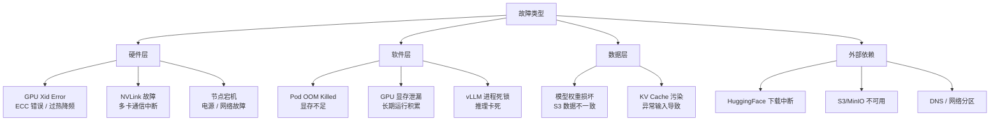
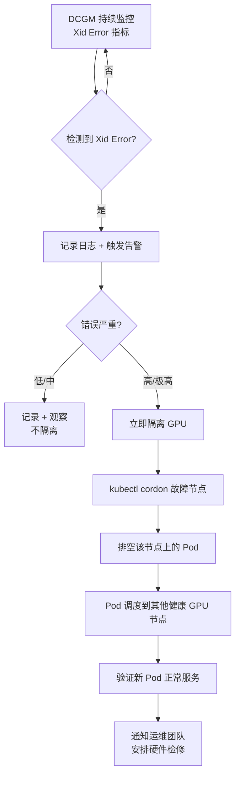
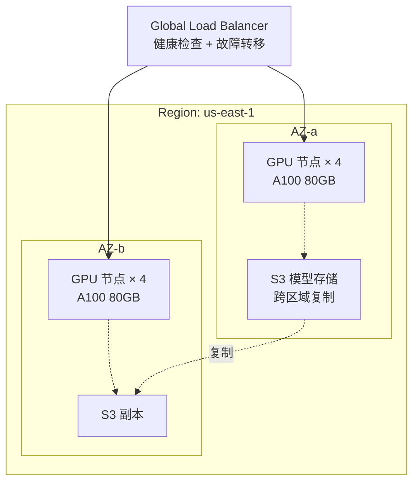
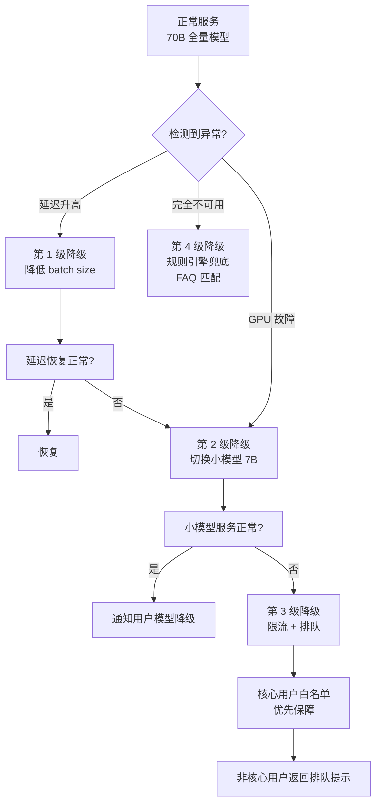
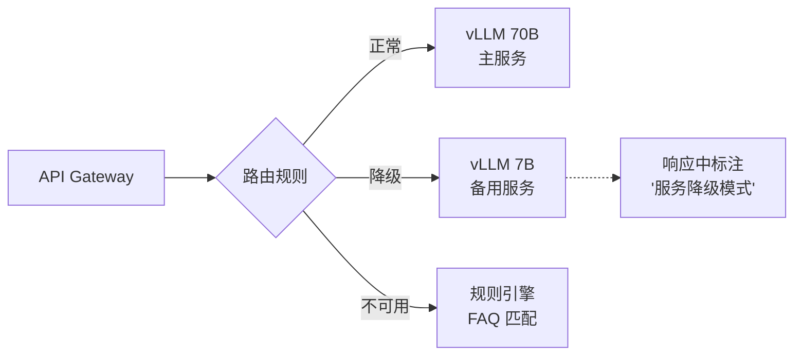
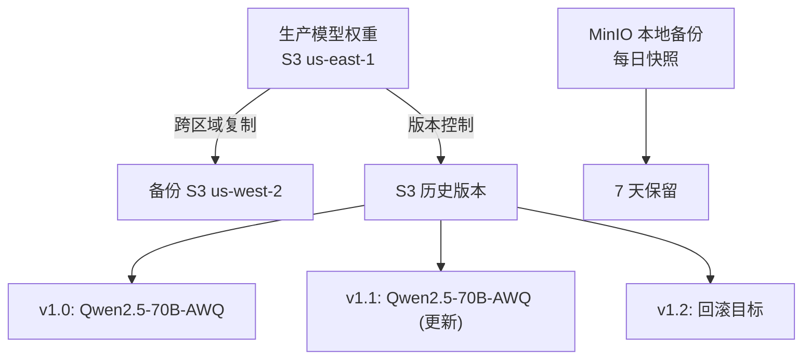
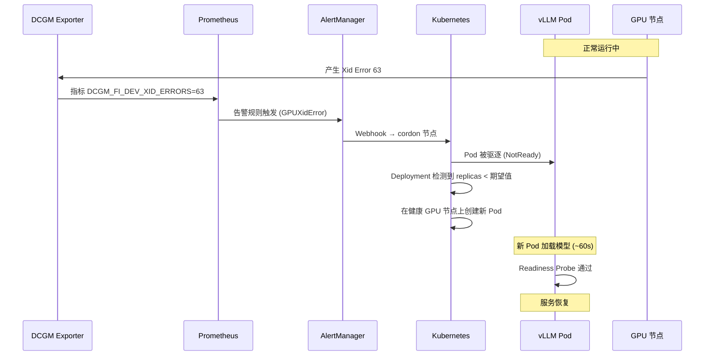

# 容灾与降级

> LLM 推理服务的容灾不只是"备用服务器"，还涉及 GPU 硬件故障、模型权重损坏、显存泄漏等特有风险，需要分层次的防御体系。

## 核心概念（含架构图）

### 故障场景全景分析



## 部署视角

### GPU 故障处理（Xid Error 检测与自动隔离）

#### Xid Error 类型

| Xid | 含义 | 严重性 | 处理方式 |
|-----|------|--------|----------|
| 13 | Graphics Engine Exception | 中 | 重启 CUDA 上下文 |
| 31 | GPU Memory Page Fault | 高 | 重启进程 |
| 43 | GPU Stopped Processing | 高 | Pod 重建 |
| 63 | ECC Page Uncorrectable Error | 极高 | 隔离 GPU，换卡 |
| 79 | GPU Has Fallen Off Bus | 极高 | 节点隔离，报修 |

#### 自动检测与隔离流程



```python
# 自动化脚本：Xid Error 检测 + 节点隔离
import subprocess
import json

def check_gpu_health():
    """通过 DCGM 检查 GPU 健康状态"""
    result = subprocess.run(
        ['dcgmi', 'diag', '-r', '1', '-j'],
        capture_output=True, text=True
    )
    diagnostics = json.loads(result.stdout)

    for gpu_id, diag in diagnostics.items():
        if diag.get('error_count', 0) > 0:
            xid_errors = diag.get('xid_errors', [])
            for err in xid_errors:
                if err['xid'] in [13, 31, 43, 63, 79]:
                    isolate_gpu(gpu_id, err['xid'])

def isolate_gpu(gpu_id, xid):
    """隔离故障 GPU 所在节点"""
    node = get_node_for_gpu(gpu_id)
    # 1. 标记节点不可调度
    subprocess.run(['kubectl', 'cordon', node])
    # 2. 排空 Pod
    subprocess.run(['kubectl', 'drain', node,
                    '--ignore-daemonsets',
                    '--delete-emptydir-data',
                    '--grace-period=120'])
    # 3. 发送告警
    send_alert(f"GPU {gpu_id} on {node} Xid={xid}, node cordoned")
```

#### Kubernetes 侧实现（Node Problem Detector + 自动恢复）

```yaml
# Node Problem Detector：自动将不健康的 GPU 节点标记为 NotReady
apiVersion: apps/v1
kind: DaemonSet
metadata:
  name: node-problem-detector
  namespace: kube-system
spec:
  template:
    spec:
      containers:
      - name: node-problem-detector
        image: registry.k8s.io/node-problem-detector/node-problem-detector:v0.8.14
        env:
        - name: CUSTOM_PLUGINS
          value: |
            # 自定义 GPU 健康检查插件
            # 当检测到 Xid Error 时，向 K8s 报告 Condition
---
# 自动恢复：GPU 故障后 Pod 自动调度到健康节点
apiVersion: apps/v1
kind: Deployment
spec:
  template:
    spec:
      # 容忍短暂的 NotReady 状态，给节点恢复时间
      tolerations:
      - key: "node.kubernetes.io/not-ready"
        operator: "Exists"
        effect: "NoExecute"
        timeoutSeconds: 60  # 60 秒后 K8s 自动迁移 Pod
      affinity:
        podAntiAffinity:
          requiredDuringSchedulingIgnoredDuringExecution:
          - labelSelector:
              matchExpressions:
              - key: app
                operator: In
                values: ["vllm"]
            topologyKey: "kubernetes.io/hostname"
```

### 容灾策略：多 AZ 部署



**多 AZ 部署要点**：

| 维度 | 配置 | 说明 |
|------|------|------|
| 流量分配 | 80/20 或 50/50 | 取决于成本和延迟要求 |
| 故障切换 | < 30 秒 | DNS TTL + 健康检查 |
| 模型同步 | S3 Cross-Region Replication | 保证模型权重一致 |
| 数据一致性 | 只读模型 + 主区域更新 | 避免脑裂 |

```yaml
# Pod 拓扑分布约束：确保跨 AZ 均匀分布
topologySpreadConstraints:
- maxSkew: 1
  topologyKey: topology.kubernetes.io/zone
  whenUnsatisfiable: DoNotSchedule
  labelSelector:
    matchLabels:
      app: vllm
```

### 降级策略详解



**各级降级详细说明**：

#### 第 1 级：降低 Batch Size

```yaml
# 通过 ConfigMap 热更新 vLLM 配置
# max-num-seqs: 256 → 64
# 效果：单请求延迟降低，总吞吐下降
# 适用：延迟升高但 GPU 仍有能力
```

#### 第 2 级：切换小模型



```yaml
# API Gateway 降级路由
# 正常路由
- match: { prefix: "/v1/chat/completions" }
  route: { cluster: vllm-70b }
# 降级路由（通过 feature flag 切换）
# - match: { prefix: "/v1/chat/completions" }
#   route: { cluster: vllm-7b }
```

#### 第 3 级：限流 + 排队

```python
# Token Bucket 限流（API Gateway 层）
# 核心用户：100 req/min
# 普通用户：10 req/min
# 降级期间：核心用户 50 req/min, 普通用户 2 req/min

# 排队响应
{
  "status": "queued",
  "position": 15,
  "estimated_wait_seconds": 45,
  "task_id": "task-xyz789",
  "poll_url": "/v1/tasks/task-xyz789/status"
}
```

### 数据恢复与模型回滚

#### 模型权重备份策略



**关键措施**：

| 措施 | 频率 | RPO | 说明 |
|------|------|-----|------|
| S3 版本控制 | 实时 | 0 | 每次上传自动生成新版本 |
| 跨区域复制 | 实时 | < 1 分钟 | 防单区域故障 |
| 本地快照 | 每日 | 24 小时 | MinIO snapshot |
| 离线备份 | 每周 | 7 天 | 冷存储（Glacier） |

#### 模型回滚流程

```yaml
# 回滚命令（K8s 原生支持）
kubectl rollout undo deployment/vllm-llm --to-revision=2
# 回滚到第 2 个版本（即上一版本）

# 回滚验证
# 1. 检查新 Pod 状态: kubectl get pods -l app=vllm
# 2. 验证健康: curl http://vllm-service/health
# 3. 冒烟测试: 发几个标准 prompt 验证输出
# 4. 监控 SLO: 确认延迟恢复正常
```

## 面试视角

### 面试题：GPU 故障导致 Pod 崩溃，如何自动恢复？

**标准答案**：



**完整自动恢复链**：

1. **检测（0-15 秒）**：DCGM Exporter 每 15 秒 scrape 一次 Xid Error 指标
2. **告警（15-30 秒）**：Prometheus 告警规则 `increase(DCGM_FI_DEV_XID_ERRORS[5m]) > 0` 触发
3. **隔离（30-60 秒）**：AlertManager Webhook 调用脚本执行 `kubectl cordon + drain`
4. **迁移（60-120 秒）**：K8s Deployment 自动在健康节点重建 Pod
5. **恢复（120-180 秒）**：新 Pod 加载模型完成，通过 Readiness Probe

**如果只有有限 GPU 资源无法调度怎么办？**

1. **优先保障**：通过 PriorityClass，核心业务优先调度
2. **降级运行**：自动切换到小模型部署（7B 只需 1 张 A100，70B 需要 4 张）
3. **排队等待**：请求进入队列，待资源释放后自动处理
4. **弹性扩容**：触发 Cluster Autoscaler 申请新 GPU 实例（云厂商，5-15 分钟）

### 常见追问

**Q: GPU 显存泄漏如何检测和处理？**

A：
- **检测**：监控 `DCGM_FI_DEV_FB_USED` 的趋势，正常情况下 Pod 重启后显存应该完全释放。如果发现显存使用量随时间线性增长（Pod 不重启也不释放），说明存在泄漏
- **处理**：设置定期 Pod 滚动重启（`maxSurge: 1` 保证不停机）；在 vLLM 层面检查是否有未释放的 CUDA 上下文
- **预防**：使用 `nvidia-smi` 定期检查进程 - 显存映射，确保每个进程退出后显存完全释放

**Q: 多 AZ 部署时模型权重如何保证一致性？**

A：
1. S3 跨区域复制（CRR）保证模型文件的最终一致性
2. 每次部署前校验模型 hash（SHA256）
3. Pod 启动时从本地缓存加载，不实时依赖 S3
4. 更新时滚动发布：先更新 AZ-a 验证通过，再更新 AZ-b

**Q: 如何避免降级期间的"降级雪崩"（小模型也被压垮）？**

A：
1. 小模型部署保持独立的资源池（不被 70B 挤占）
2. 降级时同步收紧限流策略（70B 的限流 > 7B 的限流）
3. 监控小模型的 GPU 利用率，如果也在升高，触发第 3 级降级
4. 保留最低限度的规则引擎兜底（完全不依赖 GPU）

---

*下一节：[多租户与平台化](./multi-tenant.md)*
