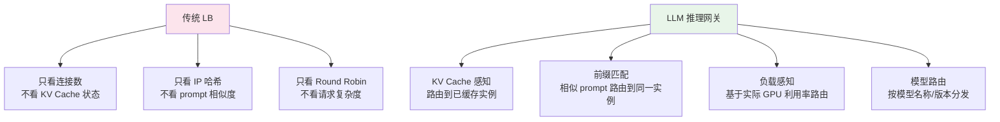
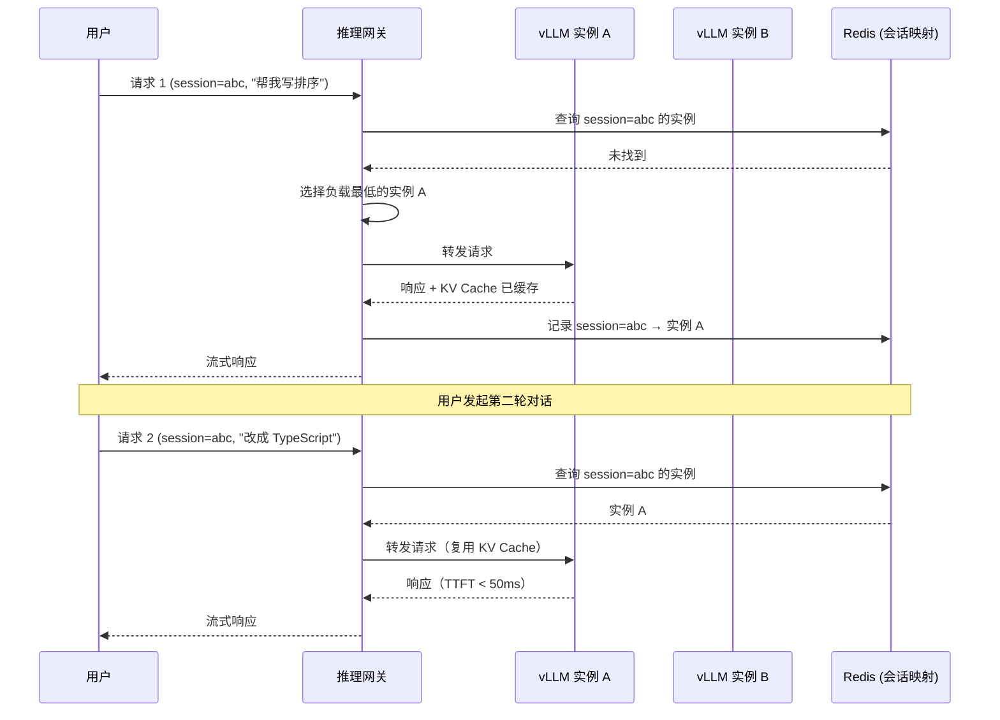
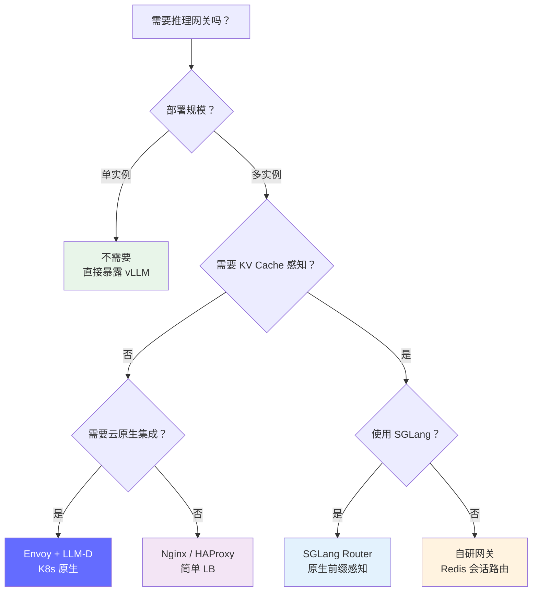
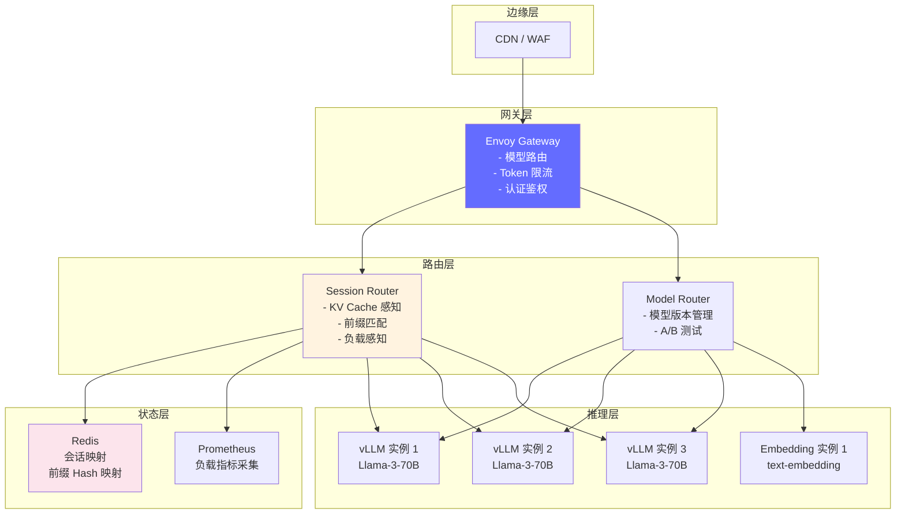

# 推理网关与智能路由 — LLM 流量调度的核心组件

> 当 LLM 服务从单实例扩展到多副本、多模型、多集群时，传统的 HTTP 负载均衡不再够用。KV-Cache 感知路由、前缀缓存感知调度、Prompt 路由等 LLM 原生能力成为 2025-2026 年 FDE 的必备技能。

---

## 前置知识

- [部署架构设计](./deployment-architecture.md)
- [Prefill-Decode 分离](./prefill-decode-separation.md)
- [KV Cache](../02-model-architecture/kv-cache.md)

---

## 核心概念：为什么需要推理网关

### 传统 HTTP 负载均衡的问题

```
传统 LB（Nginx / HAProxy）的负载均衡算法:
  - Round Robin: 轮流分发
  - Least Connections: 分发给连接数最少的实例
  - IP Hash: 同一 IP 分发到同一实例

LLM 场景的问题:

问题 1: 请求时长差异极大
  短 prompt (10 tokens) → 50ms
  长 prompt (4000 tokens) → 2000ms
  → Round Robin 导致负载严重不均

问题 2: 忽略 KV Cache 状态
  实例 A 已经缓存了用户的历史对话 KV
  实例 B 没有缓存
  → 如果 LB 把多轮对话请求分到 B，KV Cache 失效，TTFT 暴增

问题 3: 不懂 LLM 语义
  无法根据 prompt 内容、模型名称、max_tokens 等参数做智能路由
  → 简单问题和复杂推理被同等对待
```



---

## LLM 推理网关的核心能力

### 1. KV-Cache Aware Routing

```
核心思想: 将请求路由到已经缓存了相关 KV Cache 的实例

场景: 多轮对话
  用户第 1 轮: "帮我写一个 Python 快速排序"
    → 路由到实例 A，A 缓存了该对话的 KV

  用户第 2 轮: "改成用 TypeScript 写"
    → 网关识别这是同一会话 → 路由到实例 A
    → A 已有历史 KV，只需处理新 prompt → TTFT < 50ms

  如果路由到实例 B:
    → B 没有历史 KV → 需要重新 Prefill 整个对话
    → TTFT > 500ms，用户体验下降 10 倍

实现方式:
  1. 网关维护 session_id → instance_id 映射表
  2. 请求携带 session_id（Header 或 Cookie）
  3. 网关查表路由到对应实例
  4. 如果该实例不可用，选择 KV Cache 最空闲的实例
```



### 2. Prefix-Aware Routing（前缀感知路由）

```
核心思想: 将具有相同 system prompt 或相似前缀的请求路由到同一实例

场景: RAG 系统
  所有请求都带有相同的 system prompt + 检索到的文档片段
  System prompt: "你是一个法律助手，基于以下法律条文回答问题..."
  + 检索到的 10 篇法律条文（约 3000 tokens）

  如果每个实例都独立处理:
    → 每份 system prompt 都需要 Prefill → 浪费 compute

  使用前缀感知路由:
    → 相同 system prompt 的请求都路由到实例 A
    → 实例 A 的 KV Cache 中已有 system prompt 的缓存
    → 只需 Prefill 用户问题部分（通常 < 100 tokens）
    → TTFT 降低 90%+

实现:
  1. 网关计算 prompt 前缀的 hash（如前 500 tokens 的 MD5）
  2. 维护 prefix_hash → instance_id 映射
  3. 相同前缀的请求路由到同一实例
  4. 结合 RadixAttention（SGLang）或 Prefix Caching（vLLM）使用
```

### 3. Model-Aware Routing（模型路由）

```
核心思想: 根据请求的模型名称/版本路由到对应的 GPU 实例组

场景: 多模型服务
  用户 A 请求: GPT-4 → 路由到 H100 集群
  用户 B 请求: Llama-3-8B → 路由到 A10 集群
  用户 C 请求: embedding → 路由到 CPU 集群

实现:
  1. 解析 OpenAI 兼容请求中的 model 字段
  2. 查找 model → backend 路由表
  3. 支持模型别名（如 "gpt-4" → "llama-3-70b-v2"）
  4. 支持 A/B 测试（10% 流量 → 新模型）
```

### 4. Load-Aware Routing（负载感知路由）

```
核心思想: 基于 GPU 实例的实际负载（而非连接数）做路由决策

传统 LB 看连接数:
  实例 A: 10 个连接（每个都在 decode，GPU 利用率 90%）
  实例 B: 5 个连接（每个都在 prefill，GPU 利用率 30%）
  → Least Connections 选 B → 但 B 的 prefill 可能很快结束

LLM 网关看实际负载:
  实例 A: GPU 利用率 90%，KV Cache 使用率 85%
  实例 B: GPU 利用率 30%，KV Cache 使用率 20%
  → 选 B（有足够的 compute 和 memory 余量）

关键指标:
  - GPU 利用率（compute 占用）
  - KV Cache 使用率（memory 占用）
  - 排队请求数
  - 当前 TTFT / TPOT
  - Prefill 队列长度
```

---

## 主流方案对比

### 1. Envoy Proxy + LLM-D

**Envoy Proxy** 是云原生领域最流行的服务网格数据面，Red Hat 的 **LLM-D** 项目将其扩展为 LLM 推理网关。

```
架构:
  Envoy Proxy 作为 LLM 推理的前置网关
  + LLM 特定的 HTTP 过滤器:
    - prompt_token_count / completion_token_count 提取
    - SSE（Server-Sent Events）流式响应处理
    - 模型路由（基于 model 字段）
    - 限流（基于 token 而非请求数）
    - 速率限制（Token Bucket，按 API Key）

关键特性:
  - 原生支持 OpenAI 兼容接口
  - 与 Kubernetes / Istio 无缝集成
  - 支持 gRPC 和 HTTP/2
  - 热重载配置（无需重启）
  - 与 Prometheus / OpenTelemetry 集成

优势:
  - 云原生生态成熟（K8s, Istio, gRPC）
  - 社区活跃，Red Hat 背书
  - 适合大规模生产部署

劣势:
  - 配置复杂度高
  - KV Cache 感知需要自定义开发
```

### 2. vLLM Frontend Proxy

```
架构:
  vLLM 官方推荐的简单代理
  Nginx / Envoy → 多个 vLLM 实例

特点:
  - 简单，只需要基本 LB 配置
  - 适合单模型、小规模部署
  - 无 LLM 特定的智能路由

适用:
  - 单模型部署
  - QPS < 50
  - 不需要会话保持
```

### 3. SGLang Router

```
架构:
  SGLang 内置的分布式路由器
  Router → 多个 SGLang Worker

关键特性:
  - RadixAttention: 跨 Worker 共享 KV Cache 索引
  - 前缀感知路由: 自动将相似前缀请求路由到同一 Worker
  - 负载均衡: 基于 Worker 的 KV Cache 命中率决策

优势:
  - 原生支持前缀缓存感知
  - 多轮对话场景下 KV Cache 命中率 > 80%
  - 部署简单（SGLang 内置）

劣势:
  - 只支持 SGLang 引擎
  - 不支持多模型
```

### 4. 自定义网关（自研）

```
架构:
  网关（Go/Python）→ Redis（会话映射）→ 多个推理后端

核心实现:
  1. Session Router:
     - Redis 存储 session_id → instance_id 映射
     - 支持 TTL（会话超时自动清理）

  2. Load Balancer:
     - 定期从各实例拉取负载指标（GPU 利用率、KV Cache 使用率）
     - 加权路由算法: score = w1 * gpu_util + w2 * kv_usage + w3 * queue_len
     - 选择 score 最低的实例

  3. Model Router:
     - 配置路由表: model_name → [backend_urls]
     - 支持权重分发（A/B 测试）

  4. Token Rate Limiter:
     - 按 API Key 限制 token/min（而非请求/min）
     - Redis + Lua 实现滑动窗口限流

适用:
  - 有特殊路由逻辑的场景
  - 需要与公司现有系统集成
  - 需要细粒度的 KV Cache 感知
```

### 方案对比

| 维度 | Envoy + LLM-D | vLLM Proxy | SGLang Router | 自研网关 |
|------|--------------|------------|---------------|---------|
| **部署复杂度** | 中 | 低 | 低 | 高 |
| **KV Cache 感知** | 需定制 | ❌ | ✅ 原生 | 需自研 |
| **前缀路由** | 需定制 | ❌ | ✅ 原生 | 需自研 |
| **多模型支持** | ✅ | ✅ | ❌ | ✅ |
| **云原生集成** | ✅ 最佳 | 基本 | ❌ | 需自研 |
| **社区活跃度** | 高 | 中 | 中 | 取决于团队 |
| **适用规模** | 大规模 | 小规模 | 中规模 | 任意 |
| **Red Hat OpenShift** | ✅ 原生支持 | ✅ | ❌ | 需适配 |

---

## Envoy + LLM-D 实战

### 基础配置

```yaml
# envoy-llm.yaml
static_resources:
  listeners:
  - name: llm_listener
    address:
      socket_address:
        address: 0.0.0.0
        port_value: 8080
    filter_chains:
    - filters:
      - name: envoy.filters.network.http_connection_manager
        typed_config:
          "@type": type.googleapis.com/envoy.extensions.filters.network.http_connection_manager.v3.HttpConnectionManager
          stat_prefix: llm_ingress
          route_config:
            name: local_route
            virtual_hosts:
            - name: llm_backend
              domains: ["*"]
              routes:
              # 路由到 vLLM 实例
              - match:
                  prefix: "/v1/completions"
                route:
                  cluster: vllm_cluster
              - match:
                  prefix: "/v1/chat/completions"
                route:
                  cluster: vllm_cluster
              - match:
                  prefix: "/v1/embeddings"
                route:
                  cluster: embedding_cluster

          http_filters:
          # LLM 特定的 token 计数过滤器
          - name: envoy.filters.http.llm_token_counter
            typed_config:
              "@type": type.googleapis.com/envoy.extensions.filters.http.llm_token_counter.v3.Config
              count_input_tokens: true
              count_output_tokens: true

          # 限流过滤器
          - name: envoy.filters.http.local_ratelimit
            typed_config:
              "@type": type.googleapis.com/envoy.extensions.filters.http.local_ratelimit.v3.LocalRateLimit
              stat_prefix: llm_rate_limit
              token_bucket:
                max_tokens: 100000    # 100K tokens/min
                tokens_per_fill: 100000
                fill_interval: 60000  # 每 60s 填充

          - name: envoy.filters.http.router
            typed_config:
              "@type": type.googleapis.com/envoy.extensions.filters.http.router.v3.Router

  clusters:
  - name: vllm_cluster
    connect_timeout: 30s
    type: STRICT_DNS
    lb_policy: LEAST_REQUEST  # LLM 场景比 Round Robin 更好
    load_assignment:
      cluster_name: vllm_cluster
      endpoints:
      - lb_endpoints:
        - endpoint:
            address:
              socket_address:
                address: vllm-0.llm-serving.svc.cluster.local
                port_value: 8000
        - endpoint:
            address:
              socket_address:
                address: vllm-1.llm-serving.svc.cluster.local
                port_value: 8000
        - endpoint:
            address:
              socket_address:
                address: vllm-2.llm-serving.svc.cluster.local
                port_value: 8000

  - name: embedding_cluster
    connect_timeout: 10s
    type: STRICT_DNS
    lb_policy: ROUND_ROBIN
    load_assignment:
      cluster_name: embedding_cluster
      endpoints:
      - lb_endpoints:
        - endpoint:
            address:
              socket_address:
                address: embedding-0.llm-serving.svc.cluster.local
                port_value: 8000
```

### SSE 流式响应处理

```
LLM 流式响应的特殊挑战:

1. SSE（Server-Sent Events）是长连接
   传统 LB 可能超时断开连接
   → Envoy 需要配置 idle_timeout > 最大生成时间

2. 流式响应的限流
   不能按请求数限流（一个请求可能持续 30 秒）
   → 需要按 token 速率限流

3. 健康检查
   流式连接不表示实例健康
   → 需要独立的健康检查端点 (/health)

Envoy SSE 配置:
  route:
    timeout: 300s                    # 5 分钟超时
    idle_timeout: 60s                # 60 秒无数据传输超时
    max_stream_duration:
      grpc_timeout_header_max: 300s  # gRPC 超时
```

---

## 部署视角：推理网关的架构选型

### 决策树



### 实际建议

| 场景 | 推荐方案 | 原因 |
|------|---------|------|
| 单模型、QPS < 50 | Nginx / vLLM Proxy | 简单够用 |
| 多轮对话、需要会话保持 | 自研网关 + Redis | 灵活的 KV Cache 路由 |
| 多模型、大规模 | Envoy + LLM-D | 云原生生态、可扩展 |
| SGLang 引擎 | SGLang Router | 原生 RadixAttention |
| Red Hat OpenShift | Envoy + LLM-D | 原生支持、企业级 |
| 需要前缀缓存优化 | SGLang Router 或自研 | 前缀感知路由 |

---

## 生产架构：完整推理网关部署



---

## 面试视角

### 常考问题

1. **"为什么 LLM 需要专门的推理网关，而不是直接用 Nginx？"**

   回答框架：
   - LLM 请求时长差异极大（50ms vs 2000ms），Round Robin / Least Connections 都不适用
   - 多轮对话需要 KV Cache 复用，传统 LB 不懂会话状态
   - 需要基于 token 而非请求数做限流
   - 需要理解 LLM 语义（model 字段、SSE 流式响应、prompt 前缀匹配）
   - 需要基于 GPU 利用率、KV Cache 使用率等 LLM 特定指标做路由

2. **"KV Cache 感知路由是怎么实现的？"**

   - 网关维护 session_id → instance_id 的映射（Redis 存储）
   - 请求携带 session_id，网关查表路由到对应实例
   - 如果该实例不可用，选择 KV Cache 最空闲的实例
   - 结合 vLLM 的 Prefix Caching 或 SGLang 的 RadixAttention 使用
   - 效果：多轮对话场景下 TTFT 降低 90%+

3. **"Envoy + LLM-D 相比其他方案的优势？"**

   - 云原生生态成熟（K8s, Istio, gRPC）
   - 原生支持 OpenAI 兼容接口
   - 与 Red Hat OpenShift 无缝集成
   - 热重载配置，无需重启
   - 社区活跃，企业级支持
   - 缺点：KV Cache 感知需要自定义开发

4. **"前缀感知路由解决了什么问题？"**

   - RAG 系统中，所有请求共享相同的 system prompt + 检索文档
   - 这些前缀（通常 2000-5000 tokens）如果每次都 Prefill，浪费大量 compute
   - 前缀感知路由将相同前缀的请求路由到同一实例
   - 该实例的 KV Cache 中已有前缀缓存，只需 Prefill 用户问题
   - 结合 RadixAttention，KV Cache 命中率可达 80%+

---

## 扩展阅读

- [LLM-D Project](https://github.com/llm-d) — Red Hat 的 LLM on Kubernetes 项目
- [Envoy Proxy](https://www.envoyproxy.io/) — 云原生服务网格数据面
- [SGLang Router](https://github.com/sgl-project/sglang) — 原生前缀感知路由
- [RadixAttention Paper](https://arxiv.org/abs/2312.07104) — 高效 KV Cache 复用

---

*上一节：[部署架构设计](./deployment-architecture.md)*
*下一节：[Prefill-Decode 分离](./prefill-decode-separation.md)*
