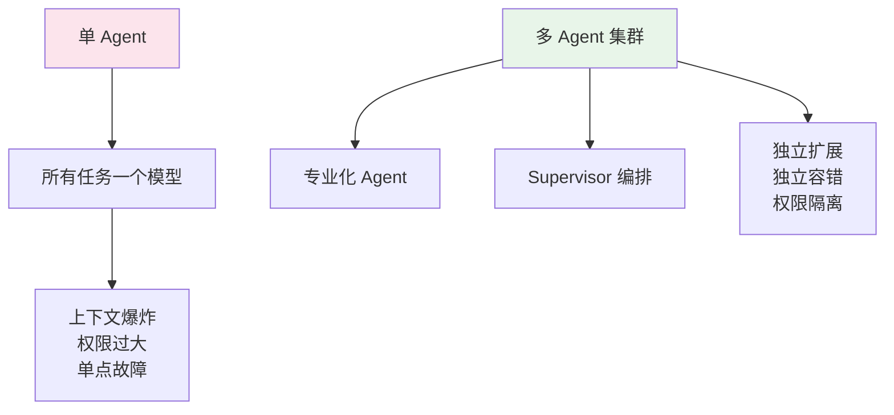
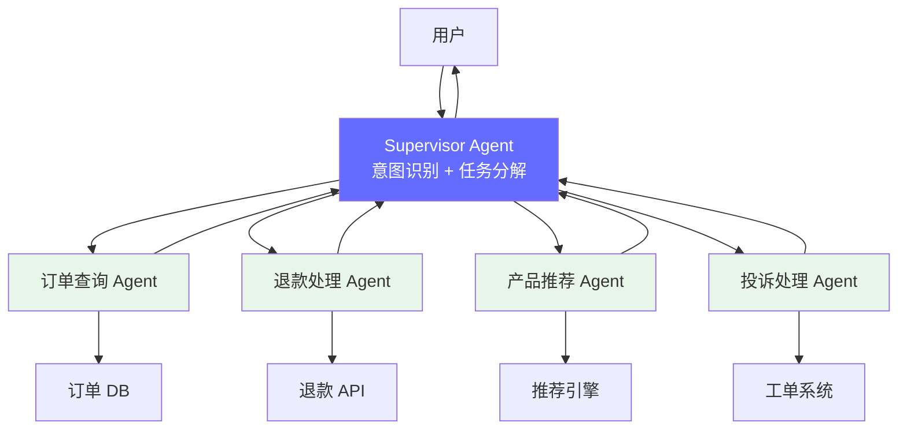
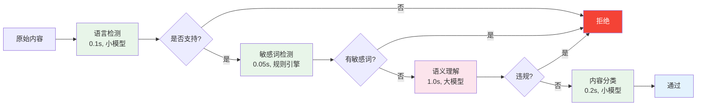
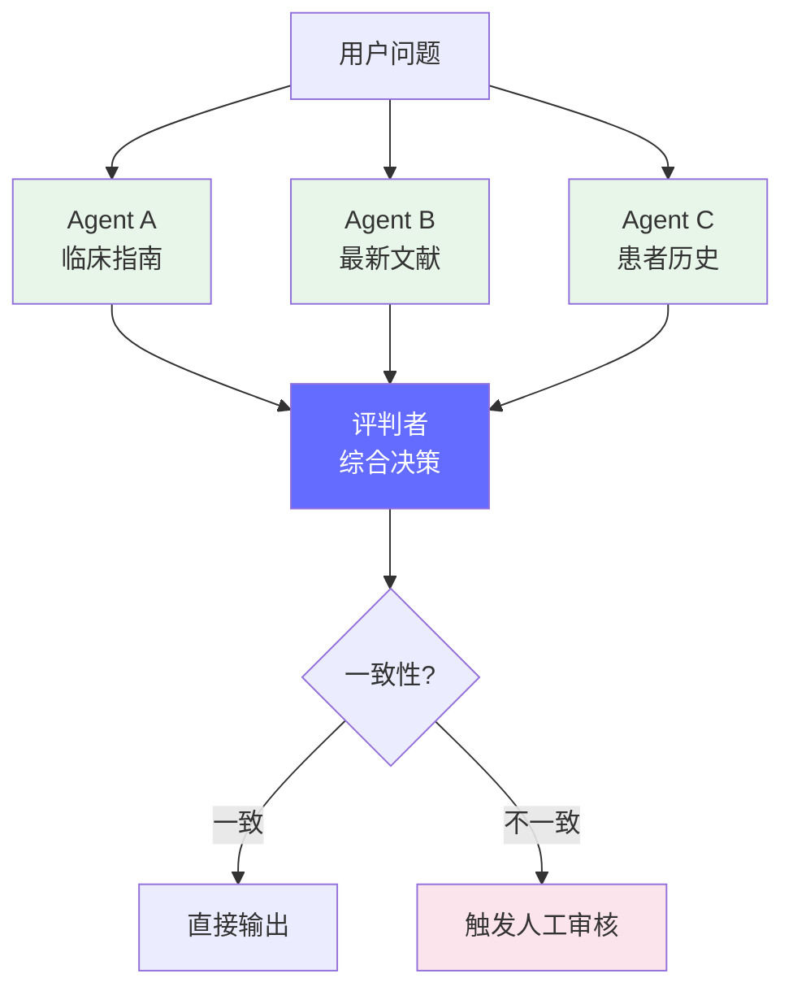
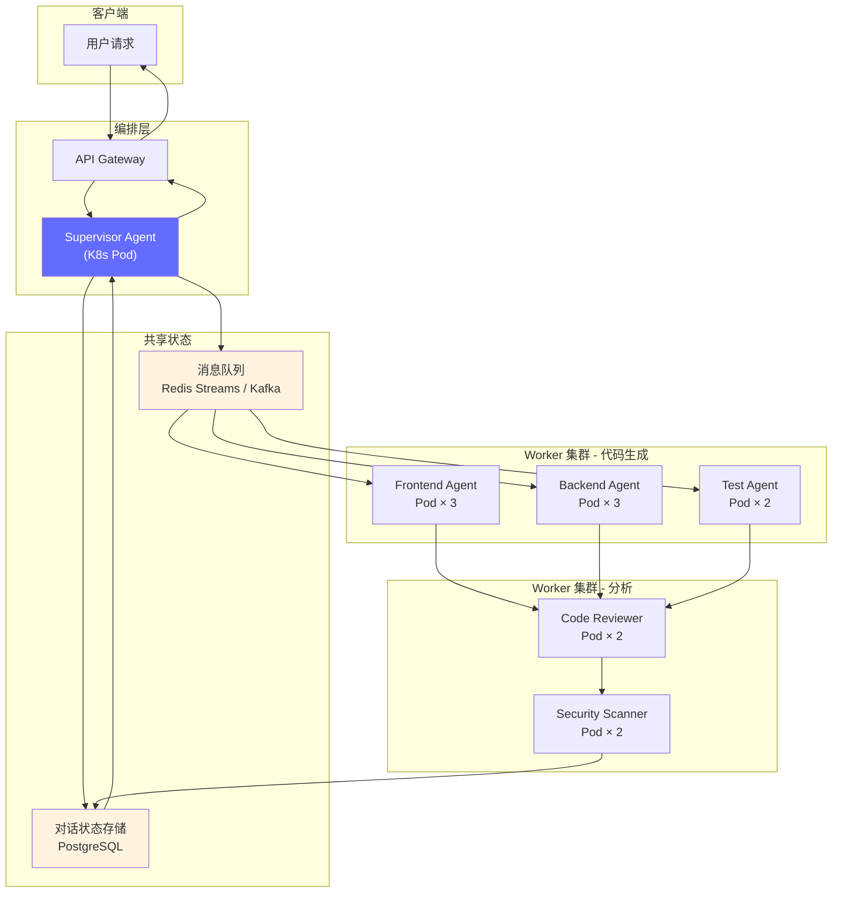
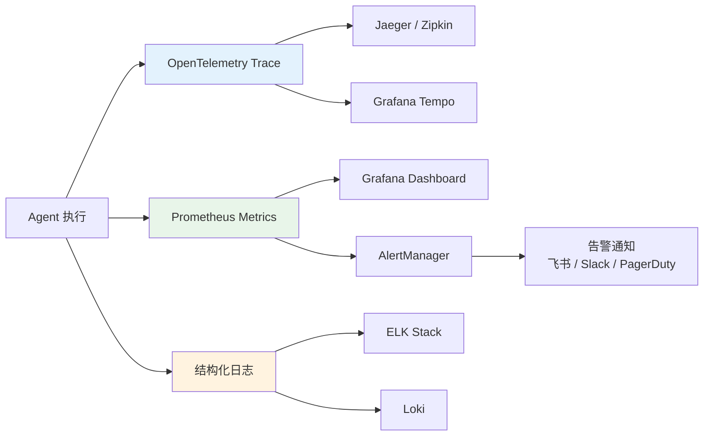

# 多 Agent 部署模式 — 从单 Agent 到 Agent 集群

> 2025-2026 年，FDE 的角色从部署单一 LLM 扩展到管理多 Agent 协作系统。Agent 编排、状态管理、工具调用和集群调度成为新的工程挑战。

---

## 前置知识

- [Agent 架构](../08-ai-engineering-tech-stack/agent-architecture.md)
- [部署架构设计](./deployment-architecture.md)
- [推理网关](./inference-gateway.md)

---

## 核心概念：从单 Agent 到多 Agent 集群

### 为什么需要多 Agent

```
单 Agent 的问题:
  1. 单点故障: Agent 崩溃 = 整个流程失败
  2. 能力局限: 一个模型无法擅长所有任务
  3. 上下文窗口: 单个 Agent 受限于上下文长度
  4. 并发瓶颈: 一个 Agent 同时只能处理一个任务
  5. 安全隔离: 无法限制 Agent 的权限范围

多 Agent 的优势:
  1. 专业化: 每个 Agent 专精一个领域
  2. 容错: 单个 Agent 失败不影响全局
  3. 扩展性: 可以独立扩展不同类型的 Agent
  4. 安全: 每个 Agent 有独立的权限边界
  5. 并行: 多个 Agent 可以同时执行不同任务
```



---

## 多 Agent 架构模式

### 模式 1: Supervisor + Workers

```
架构:
  Supervisor Agent: 接收用户请求，分解任务，分配给 Worker
  Worker Agents:     执行具体任务，返回结果

典型场景: 客服系统
  Supervisor: 理解用户意图，分类问题
  Workers:
    - 订单查询 Agent: 查询订单状态
    - 退款处理 Agent: 处理退款请求
    - 产品推荐 Agent: 推荐产品
    - 投诉处理 Agent: 处理投诉

数据流:
  用户请求 → Supervisor → 分类 → Worker Agent → 结果 → Supervisor → 整合 → 用户
```



### 模式 2: Pipeline（流水线）

```
架构:
  请求按顺序通过多个 Agent，每个 Agent 处理一个阶段

典型场景: 内容审核流水线
  Agent 1: 语言检测（中文/英文/日文）
  Agent 2: 敏感词检测（暴力、色情、政治）
  Agent 3: 语义理解（是否违规，即使没有敏感词）
  Agent 4: 内容分类（新闻/广告/用户生成）
  Agent 5: 最终决策（通过/拒绝/人工审核）

数据流:
  内容 → Agent1 → Agent2 → Agent3 → Agent4 → Agent5 → 决策

特点:
  - 顺序执行，延迟累加
  - 任一 Agent 拒绝 → 流水线终止（短路）
  - 每个 Agent 可以是不同模型（小的做简单判断，大的做复杂判断）
```



### 模式 3: Debate（辩论/多路投票）

```
架构:
  多个独立 Agent 对同一问题给出答案，由投票器/评判者决定最终输出

典型场景: 高风险决策（医疗诊断、金融风控）
  Agent A: 基于临床指南分析
  Agent B: 基于最新文献分析
  Agent C: 基于患者历史数据分析
  评判者: 综合三个意见，给出最终诊断

优势:
  - 减少幻觉（多个独立模型都犯错的概率极低）
  - 提高鲁棒性
  - 可追溯（每个 Agent 的推理链可审计）

劣势:
  - 成本高（3x LLM 调用）
  - 延迟高（可以并行执行降低延迟）
```



### 模式 4: Hierarchical（分层）

```
架构:
  多层 Agent，高层负责规划和协调，低层负责执行

典型场景: 软件开发 Agent
  Level 0 (Orchestrator): 接收需求，制定整体计划
  Level 1 (Architect): 技术方案设计
  Level 2 (Engineer):
    - Frontend Agent: 前端代码
    - Backend Agent: 后端代码
    - Test Agent: 测试代码
  Level 3 (Reviewer): 代码审查

数据流:
  需求 → L0 Orchestrator → 计划
  计划 → L1 Architect → 技术方案
  方案 → L2 Engineers → 代码（并行）
  代码 → L3 Reviewer → 审查意见
  审查意见 → L2 Engineers → 修复
  修复 → L3 Reviewer → 通过 → 输出
```

---

## 部署架构

### 单实例 vs 分布式部署

```
单实例部署（LangGraph 本地模式）:
  所有 Agent 运行在同一个进程中
  优点: 简单，无网络开销
  缺点: 无法扩展，单点故障

分布式部署:
  每个 Agent 运行在独立的进程中
  Agent 之间通过网络通信
  优点: 独立扩展、容错、异构模型
  缺点: 网络延迟、通信复杂度
```



### 关键组件

#### 1. 状态管理

```
多 Agent 系统的状态:
  - 对话历史
  - 当前任务状态
  - 中间结果
  - Agent 执行结果

存储方案:
  短期状态: Redis（TTL = 会话超时）
  长期状态: PostgreSQL（审计、追溯）
  大对象: S3/MinIO（生成的文件、代码）

状态同步:
  - Agent 执行完成 → 写结果到状态存储
  - 下游 Agent → 监听状态变化，触发执行
  - 使用 Redis Pub/Sub 或 Kafka 实现事件驱动
```

#### 2. 消息队列

```
为什么需要消息队列:
  - Agent 之间解耦
  - 异步执行（长时间运行的任务不阻塞）
  - 重试机制（Agent 失败后自动重试）
  - 流量削峰（突发请求先入队列）

方案对比:

| 方案 | 延迟 | 吞吐量 | 复杂度 | 适用场景 |
|------|------|--------|--------|---------|
| Redis Streams | < 1ms | 高 | 低 | 中小规模，Agent 间快速通信 |
| Kafka | 1-10ms | 极高 | 中 | 大规模，需要持久化和回放 |
| RabbitMQ | < 1ms | 中 | 中 | 需要复杂路由和确认机制 |
| Celery | 10-100ms | 中 | 低 | Python 生态，定时任务 |

推荐:
  - 小团队: Redis Streams（简单，和状态存储复用）
  - 大规模: Kafka（持久化、回放、多消费者）
```

#### 3. Agent 发现与注册

```
问题: Supervisor 怎么知道有哪些 Worker 可用？

方案 1: 静态配置
  - Supervisor 的配置文件中写明 Worker 列表
  - 简单，但不够灵活
  - 适用: Agent 数量少且固定

方案 2: 服务注册（Consul / etcd / K8s Service）
  - Worker 启动时注册到服务发现
  - Supervisor 从服务发现获取可用 Worker
  - 支持动态扩缩容
  - 适用: 大规模、动态 Agent 集群

方案 3: 混合
  - 核心 Agent 静态配置（如 Supervisor、评判者）
  - Worker Agent 动态注册
  - 适用: 大多数生产场景
```

### K8s 部署示例

```yaml
# Supervisor Agent Deployment
apiVersion: apps/v1
kind: Deployment
metadata:
  name: supervisor-agent
  namespace: agents
spec:
  replicas: 2  # Supervisor 需要高可用
  selector:
    matchLabels:
      app: supervisor
  template:
    metadata:
      labels:
        app: supervisor
    spec:
      containers:
      - name: supervisor
        image: myregistry/supervisor-agent:v1.2.0
        env:
        - name: REDIS_URL
          value: "redis://redis.agents.svc.cluster.local:6379"
        - name: PG_DSN
          valueFrom:
            secretKeyRef:
              name: pg-secret
              key: dsn
        - name: MAX_WORKERS
          value: "10"
        resources:
          requests:
            cpu: "2"
            memory: "4Gi"
          limits:
            cpu: "4"
            memory: "8Gi"
        readinessProbe:
          httpGet:
            path: /health
            port: 8080
          initialDelaySeconds: 10
          periodSeconds: 5

---
# Worker Agent Deployment (GPU)
apiVersion: apps/v1
kind: Deployment
metadata:
  name: code-reviewer-agent
  namespace: agents
spec:
  replicas: 2
  selector:
    matchLabels:
      app: code-reviewer
  template:
    metadata:
      labels:
        app: code-reviewer
    spec:
      containers:
      - name: code-reviewer
        image: myregistry/agent-worker:v1.2.0
        env:
        - name: AGENT_TYPE
          value: "code-reviewer"
        - name: MODEL_NAME
          value: "claude-sonnet-4-6"
        - name: REDIS_URL
          value: "redis://redis.agents.svc.cluster.local:6379"
        resources:
          requests:
            cpu: "4"
            memory: "8Gi"
            nvidia.com/gpu: "1"
          limits:
            cpu: "8"
            memory: "16Gi"
            nvidia.com/gpu: "1"
        readinessProbe:
          httpGet:
            path: /health
            port: 8080
          initialDelaySeconds: 30
          periodSeconds: 10
```

---

## 性能优化

### 1. 并行执行

```
流水线顺序执行:
  Agent A (2s) → Agent B (3s) → Agent C (1s) = 6s 总延迟

并行执行 (独立任务):
  Agent A (2s) ┐
  Agent B (3s) ├→ 最大 3s（取决于最慢的 Agent）
  Agent C (1s) ┘

依赖感知的并行:
  A (2s) ┐
         ├→ C (需要 A 和 B 的结果, 1s) → 总延迟 4s
  B (3s) ┘

LangGraph 实现:
  from langgraph.graph import StateGraph

  # 并行执行独立的 Agent
  workflow.add_node("agent_a", run_agent_a)
  workflow.add_node("agent_b", run_agent_b)
  workflow.add_node("agent_c", run_agent_c)

  workflow.add_edge("agent_a", "agent_c")
  workflow.add_edge("agent_b", "agent_c")
  # A 和 B 并行执行，C 等待两者完成后执行
```

### 2. 模型路由

```
不同 Agent 使用不同模型:
  简单任务 → 小模型（Llama-3-8B）, 延迟低, 成本低
  复杂任务 → 大模型（Claude Opus / GPT-4）, 质量高

路由策略:
  - 规则路由: 根据任务类型选择模型
  - 评分路由: 先用小模型评分，高难度转大模型
  - 成本路由: 在预算范围内选择最佳模型

效果:
  - 成本降低 60-80%（大部分请求走小模型）
  - 延迟降低 50%（小模型响应快）
  - 质量保持（关键任务仍用大模型）
```

### 3. Agent 缓存

```
Agent 结果缓存:
  - 相似输入 → 相似输出
  - 缓存 Agent 的输入输出对
  - 新请求先查缓存，命中则直接返回

缓存粒度:
  - 工具调用结果: 数据库查询、API 调用（高命中率）
  - Agent 决策: 分类结果、路由决策（中命中率）
  - 完整响应: 完整 Agent 输出（低命中率）

实现:
  - 工具调用: Redis 缓存 TTL=5min
  - Agent 决策: 向量相似度检索（cosine > 0.95 视为命中）
  - 完整响应: 语义缓存（embedding 相似度 > 0.9）
```

---

## 监控与可观测性

### 关键指标

```
单 Agent 指标:
  - 执行时间（P50/P95/P99）
  - Token 消耗（输入 + 输出）
  - 工具调用次数和成功率
  - 错误率（幻觉、超时、异常）

多 Agent 指标:
  - 端到端延迟（从用户请求到最终响应）
  - Agent 间通信延迟
  - 队列等待时间
  - 并行度（同时活跃的 Agent 数）
  - 状态存储读写延迟
  - Agent 失败率和重试次数

业务指标:
  - 任务完成率
  - 人工介入率（多 Agent 无法处理的比例）
  - 用户满意度（CSAT）
  - 成本 per 任务（token 消耗 × 模型单价）
```



### 分布式追踪

```
Trace 结构（一个多 Agent 请求的完整链路）:

Trace: request-abc123
  ├─ Span 1: API Gateway (5ms)
  │   └─ Span 2: Supervisor Agent (15ms)
  │       ├─ Span 3: Worker A - Code Generation (2000ms)
  │       │   ├─ Span 4: LLM Call - Llama-3-8B (1800ms)
  │       │   │   ├─ Span 5: Prefill (300ms)
  │       │   │   └─ Span 6: Decode (1500ms)
  │       │   └─ Span 7: Tool Call - File Write (50ms)
  │       ├─ Span 8: Worker B - Unit Tests (3000ms)
  │       │   └─ Span 9: Test Runner (2800ms)
  │       └─ Span 10: Worker C - Code Review (1500ms)
  │           └─ Span 11: LLM Call - Claude Opus (1400ms)
  └─ Span 12: Response (5ms)

分析:
  - 端到端延迟: 3000ms (取最长路径: Supervisor → Worker B)
  - 瓶颈: Worker B 的测试运行（2800ms）
  - 优化方向: 并行化 Worker A 和 B，或使用更快的测试运行器
```

---

## 安全与权限

### Agent 权限隔离

```
问题: Agent 可能执行危险操作（删除数据库、发送恶意请求）

方案:
  1. 最小权限原则
     - 每个 Agent 只有执行任务所需的最小权限
     - 数据库 Agent: 只读权限，不能 DELETE/UPDATE
     - 文件 Agent: 只能访问指定目录

  2. 沙箱执行
     - 代码执行 Agent 运行在容器沙箱中
     - 网络隔离: 只能访问允许的域名
     - 资源限制: CPU、内存、磁盘配额

  3. 人工审批
     - 敏感操作（发邮件、转账）需要人工确认
     - Agent 生成操作 → 人工审核 → 执行

  4. 审计日志
     - 记录每个 Agent 的每个操作
     - 可追溯、可回滚
```

---

## 面试视角

### 常考问题

1. **"多 Agent 系统相比单 Agent 有什么优势？"**

   - 专业化：每个 Agent 专精一个领域，可以使用最适合的模型
   - 容错：单个 Agent 失败不影响全局，可以重试或降级
   - 扩展性：热门 Agent 可以独立扩展（如代码生成 Agent 需要更多实例）
   - 安全：每个 Agent 有独立的权限边界，遵循最小权限原则
   - 成本：简单任务用小模型，复杂任务用大模型，总体成本更低

2. **"多 Agent 之间的状态怎么管理？"**

   - 短期状态用 Redis（TTL 过期），长期状态用 PostgreSQL（持久化）
   - Agent 间通过消息队列（Redis Streams / Kafka）异步通信
   - 使用 LangGraph 的 StateGraph 管理任务状态和依赖
   - 关键：状态变更通过事件驱动，而非轮询

3. **"如何降低多 Agent 系统的端到端延迟？"**

   - 并行执行：没有依赖关系的 Agent 并行执行
   - 模型路由：简单任务用小模型，减少等待时间
   - 缓存：工具调用结果和 Agent 决策结果缓存
   - 短路：一旦满足条件就终止流水线（如敏感词检测不通过）
   - 预判：Supervisor 预判可能需要的数据，提前获取

4. **"多 Agent 系统上线后，怎么监控？"**

   - 分布式追踪（OpenTelemetry）追踪每个 Agent 的执行链路
   - 每个 Agent 暴露 Prometheus 指标（延迟、Token 消耗、错误率）
   - 结构化日志记录 Agent 的决策过程和工具调用
   - 告警规则：端到端延迟 > SLO、Agent 错误率 > 阈值、Token 费用异常

---

## 扩展阅读

- [LangGraph Documentation](https://langchain-ai.github.io/langgraph/) — Agent 编排框架
- [CrewAI](https://github.com/crewAIInc/crewAI) — 多 Agent 编排框架
- [AutoGen](https://github.com/microsoft/autogen) — Microsoft 多 Agent 框架
- [OpenTelemetry for LLM](https://opentelemetry.io/docs/concepts/llm-monitoring/) — LLM 可观测性

---

*上一节：[Prefill-Decode 分离](./prefill-decode-separation.md)*
*下一节：[自动扩缩容](./autoscaling.md)*
