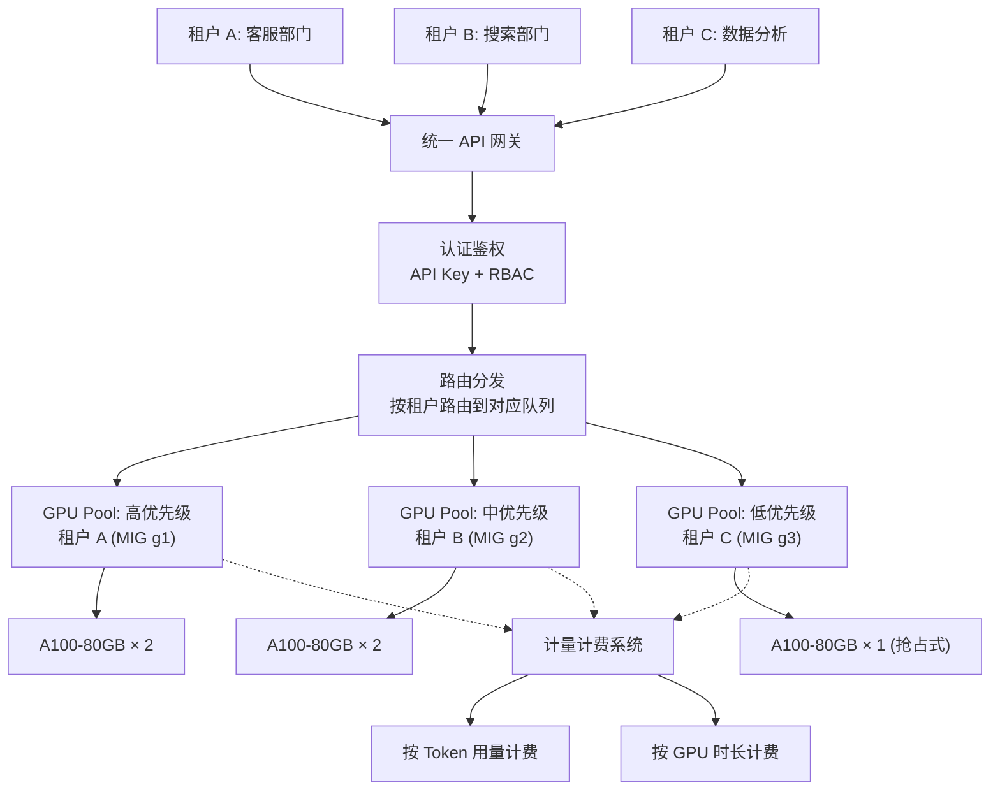
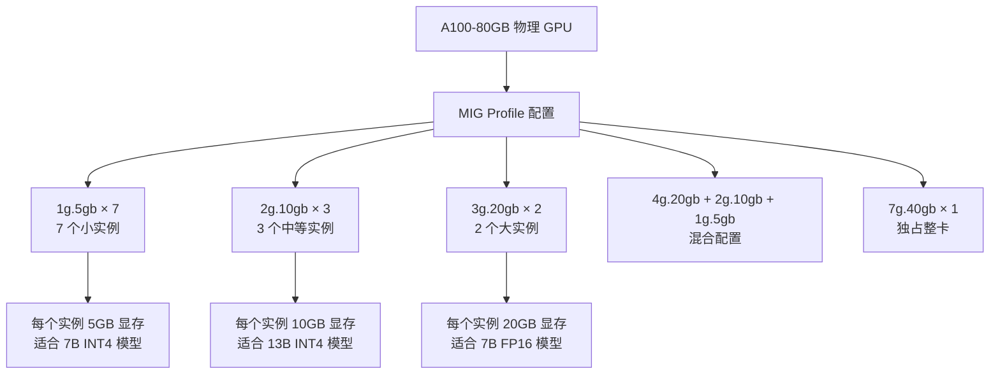
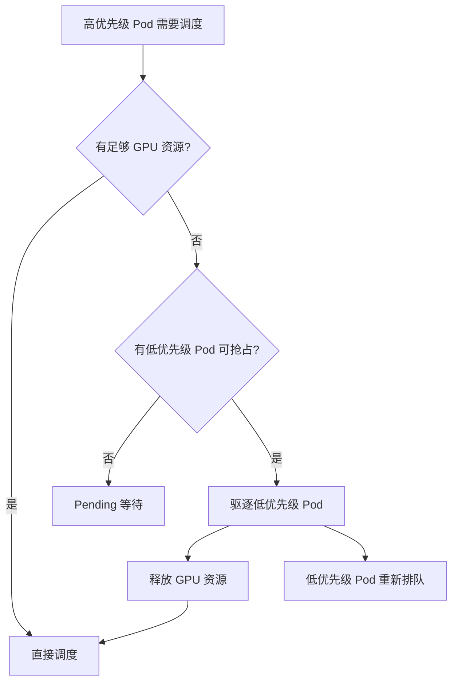
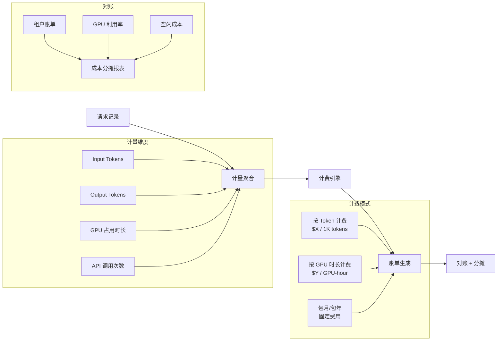
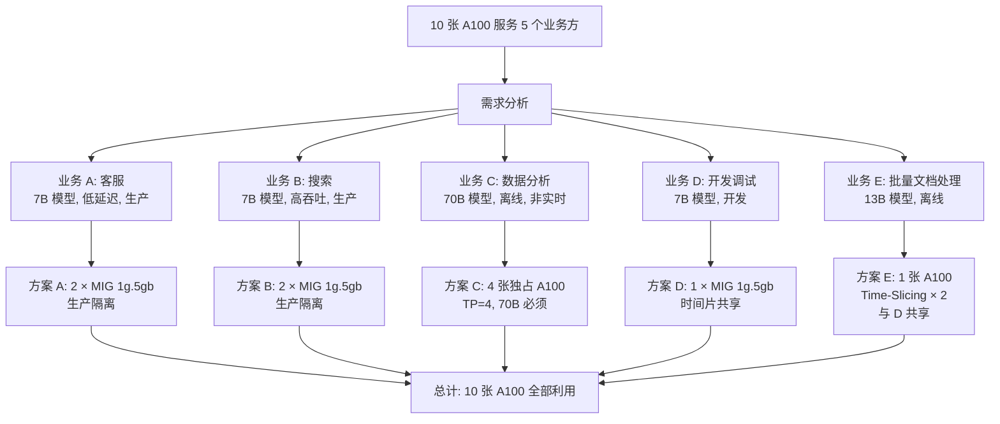

# 多租户与平台化

> 多租户是 LLM 推理平台化的核心挑战：如何在有限的 GPU 上安全、公平、可计量地服务多个业务方，是 FDE 面试中的高频场景。

## 核心概念（含架构图）

### 多租户推理平台架构



## 部署视角

### 资源隔离策略对比

| 隔离方式 | 隔离程度 | 性能影响 | 成本 | 适用场景 |
|----------|----------|----------|------|----------|
| **硬隔离（独占 GPU）** | 完全 | 无干扰 | 高（GPU 独占） | 核心生产业务 |
| **MIG 分片** | 中等 | 内存/计算硬隔离 | 适中（A100 特有） | 中等负载多租户 |
| **时间片分片（Time-Slicing）** | 低 | 可能互相影响 | 低 | 开发/测试环境 |
| **逻辑隔离（Namespace + 优先级）** | 最低 | 依赖调度器公平性 | 最低 | 内部团队共享 |

### Kubernetes Namespace + ResourceQuota 隔离

```yaml
# 为每个租户创建独立 Namespace
apiVersion: v1
kind: Namespace
metadata:
  name: tenant-customer-service
  labels:
    tenant: customer-service
    team: support

---
# ResourceQuota：限制租户可使用的资源总量
apiVersion: v1
kind: ResourceQuota
metadata:
  name: gpu-quota
  namespace: tenant-customer-service
spec:
  hard:
    requests.nvidia.com/gpu: "4"    # 最多申请 4 张 GPU
    limits.nvidia.com/gpu: "4"
    requests.memory: "256Gi"
    limits.memory: "256Gi"
    requests.cpu: "32"
    limits.cpu: "32"
    pods: "20"                       # 最多 20 个 Pod

---
# LimitRange：限制单个容器的资源范围
apiVersion: v1
kind: LimitRange
metadata:
  name: gpu-limit-range
  namespace: tenant-customer-service
spec:
  limits:
  - type: Container
    default:                        # 默认限制
      nvidia.com/gpu: "1"
      memory: "64Gi"
      cpu: "8"
    defaultRequest:
      nvidia.com/gpu: "1"
      memory: "32Gi"
      cpu: "4"
    max:                            # 单个容器不能超过
      nvidia.com/gpu: "4"
      memory: "128Gi"
    min:
      nvidia.com/gpu: "1"
```

### MIG（Multi-Instance GPU）详解

#### 什么是 MIG？

NVIDIA A100/H100 支持将一张物理 GPU 切分为最多 7 个独立的 **MIG 实例**，每个实例拥有独立的：
- GPU 计算核心（SM）
- 显存（Memory）
- L2 Cache
- NVDEC/NVENC 编码器



#### MIG 配置示例

```bash
# 1. 启用 MIG 模式
nvidia-smi -mig 1

# 2. 查看支持的 MIG Profile
nvidia-smi mig -lgip

# 3. 创建 MIG 实例（例如 2 个 3g.20gb 实例）
nvidia-smi mig -cgi 3g.20gb -C 2

# 4. 创建 GPU Instance 后，再创建 Compute Instance
nvidia-smi mig -lgi   # 查看 GPU Instance
nvidia-smi mig -cci -gi <GI_ID>  # 创建 Compute Instance

# 5. 验证 MIG 实例
nvidia-smi
# +-----------------------------------------------------------------------------+
# | MIG devices:                                                                |
# |  GPU  GI  CI  Memory    GPU  SM  DEC  ENC  OFA  ECC  Compute Mode           |
# |   0    0   0   20.0GiB  40   28   2    1    1   On   Default               |
# |   0    1   0   20.0GiB  40   28   2    1    1   On   Default               |
# +-----------------------------------------------------------------------------+
```

#### K8s 中使用 MIG

```yaml
# 安装 NVIDIA GPU Operator（自动管理 MIG）
helm install gpu-operator nvidia/gpu-operator \
  --namespace gpu-operator \
  --create-namespace \
  --set mig.strategy=single  # single 或 mixed

# Pod 申请 MIG 实例
apiVersion: v1
kind: Pod
metadata:
  name: tenant-a-llm
  namespace: tenant-customer-service
spec:
  containers:
  - name: vllm
    image: vllm/vllm-openai:latest
    resources:
      limits:
        # 申请一个 3g.20gb 的 MIG 实例
        nvidia.com/mig-3g.20gb: 1
      requests:
        nvidia.com/mig-3g.20gb: 1
```

#### MIG 适用场景

| 场景 | 推荐 MIG Profile | 原因 |
|------|-----------------|------|
| 多团队共享 A100 跑 7B 模型 | 1g.5gb × 7 | 最大化利用率 |
| 生产 + 测试环境共存 | 3g.20gb + 4g.40gb | 生产独占更多资源 |
| 推理 + 微调混合 | 7g.40gb（推理）+ 剩余（微调） | 微调需要更多显存 |
| 单一大模型（70B+） | 不使用 MIG，独占多卡 | TP 需要 NVLink，MIG 不支持跨实例 |

**MIG 限制**：
- 每个 MIG 实例是独立的 GPU，**不支持 NVLink 互联**，因此无法用于 Tensor Parallel
- 适合单卡能跑下的模型（7B、13B），不适合需要多卡的大模型（70B+）

### GPU 时间片分片（Time-Slicing）

```yaml
# GPU Time-Slicing：多租户共享一张 GPU，时间片轮转
# 通过 NVIDIA GPU Operator 配置
apiVersion: v1
kind: ConfigMap
metadata:
  name: time-slicing-config
  namespace: gpu-operator
data:
  any: |
    version: v1
    flags:
      migStrategy: none
    sharing:
      timeSlicing:
        resources:
        - name: nvidia.com/gpu
          replicas: 4     # 一张 GPU 虚拟化为 4 个共享设备
---
# 4 个 Pod 可以同时申请 nvidia.com/gpu: 1
# 但实际上共享一张物理卡，时间片轮转
# 适合：开发、测试、低负载推理
```

**时间片 vs MIG 对比**：

| 维度 | MIG | Time-Slicing |
|------|-----|-------------|
| 显存隔离 | 硬件级（严格） | 软件级（可能互相影响） |
| 计算隔离 | 硬件级（严格） | 时间片轮转 |
| 性能可预测性 | 高 | 中（取决于邻居） |
| 支持的 GPU | A100/H100 仅 | 所有 NVIDIA GPU |
| Tensor Parallel | 不支持 | 不支持 |

### 优先级队列与抢占调度

```yaml
# PriorityClass 定义
apiVersion: scheduling.k8s.io/v1
kind: PriorityClass
metadata:
  name: tenant-critical
value: 1000000         # 最高优先级
globalDefault: false
description: "核心业务租户，不可抢占"

---
apiVersion: scheduling.k8s.io/v1
kind: PriorityClass
metadata:
  name: tenant-normal
value: 500000          # 中等优先级
globalDefault: true
description: "普通业务租户"

---
apiVersion: scheduling.k8s.io/v1
kind: PriorityClass
metadata:
  name: tenant-batch
value: 100000          # 低优先级
globalDefault: false
description: "批量任务/离线推理，可被抢占"
```

**Pod 抢占流程**：



```yaml
# 高优先级 Pod（可抢占其他 Pod）
spec:
  priorityClassName: tenant-critical
  preemptionPolicy: PreemptLowerPriority  # 默认值

# 低优先级 Pod（标记为可被抢占）
spec:
  priorityClassName: tenant-batch
  # 当高优先级 Pod 需要资源时，此 Pod 会被优雅驱逐
  # terminationGracePeriodSeconds 控制等待时间
```

### 计费与对账

#### 计费模型设计



**计费指标采集**：

```python
# vLLM Prometheus 指标
# 每个租户的请求统计
vllm_request_total{tenant="customer-service",model="qwen2.5-7b"}
vllm_request_success_total{tenant="customer-service"}
vllm_prompt_tokens_total{tenant="customer-service"}
vllm_generation_tokens_total{tenant="customer-service"}

# 计费 SQL 示例（从 Prometheus 查询）
# 租户 A 本月费用 = Input Tokens × $0.001/1K + Output Tokens × $0.003/1K
# + GPU 占用时长(h) × $5/h
```

**对账关键字段**：

| 字段 | 来源 | 用途 |
|------|------|------|
| `tenant_id` | API Key | 归属租户 |
| `model_name` | 请求体 | 区分模型单价 |
| `input_tokens` | vLLM metrics | 计费 |
| `output_tokens` | vLLM metrics | 计费 |
| `gpu_seconds` | Pod 资源记录 | GPU 时长计费 |
| `timestamp` | 系统时间 | 按时段统计 |

### 安全与权限隔离

```yaml
# NetworkPolicy：租户间网络隔离
apiVersion: networking.k8s.io/v1
kind: NetworkPolicy
metadata:
  name: tenant-isolation
  namespace: tenant-customer-service
spec:
  podSelector:
    matchLabels:
      app: vllm
  policyTypes:
  - Ingress
  - Egress
  ingress:
  # 只允许 API Gateway 访问
  - from:
    - namespaceSelector:
        matchLabels:
          name: api-gateway
    ports:
    - protocol: TCP
      port: 8000
  egress:
  # 只允许访问模型存储和监控
  - to:
    - namespaceSelector:
        matchLabels:
          name: monitoring
    - namespaceSelector:
        matchLabels:
          name: model-registry
```

**安全隔离清单**：

| 层面 | 措施 | 工具 |
|------|------|------|
| **网络** | Namespace NetworkPolicy | Calico / Cilium |
| **RBAC** | 租户只能管理自己的 Namespace | K8s RBAC + ServiceAccount |
| **Secret** | 模型密钥按 Namespace 隔离 | K8s Secrets / HashiCorp Vault |
| **审计** | 所有 API 调用记录审计日志 | K8s Audit Log |
| **数据** | 不同租户的 prompt 数据严格隔离 | 日志脱敏 + 存储隔离 |
| **API Key** | 每租户独立 API Key + 速率限制 | Kong / APISIX 限流插件 |

## 面试视角

### 面试题：如何在有限的 GPU 上服务多个业务方？

**标准答案**（分层策略）：



**详细策略**：

1. **生产业务独占**：客服、搜索等低延迟场景使用 MIG 隔离，保证互不影响
2. **大模型独占多卡**：70B 模型必须独占 4 卡（TP=4），不能用 MIG
3. **开发环境共享**：用 Time-Slicing 共享 GPU，成本最低
4. **离线业务低优先级**：批量任务设为低 PriorityClass，GPU 空闲时运行，忙时让出
5. **弹性配额**：允许租户短时超配额（Borrow），但需要归还

```yaml
# 弹性配额（ClusterResourceQuota 或 Kueue）
# 保证配额 + 借用额度
apiVersion: kueue.x-k8s.io/v1beta1
kind: ResourceFlavor
metadata:
  name: a100-80gb
---
apiVersion: kueue.x-k8s.io/v1beta1
kind: ClusterQueue
metadata:
  name: tenant-customer-service
spec:
  namespaceSelector:
    matchLabels:
      tenant: customer-service
  resourceGroups:
  - coveredResources: ["nvidia.com/gpu"]
    flavors:
    - name: a100-80gb
      resources:
      - name: "nvidia.com/gpu"
        nominalQuota: 2       # 保证 2 张 GPU
        borrowingLimit: 2     # 最多借用 2 张
        lendingLimit: 0       # 不借出给别人
```

### 常见追问

**Q: MIG 和 Time-Slicing 如何选择？**

A：
- **MIG**：需要强隔离、性能可预测的场景（生产环境多租户），但只能 A100/H100
- **Time-Slicing**：成本低、支持所有 GPU、适合开发测试，但邻居可能影响性能
- **混合**：生产用 MIG，开发用 Time-Slicing

**Q: 如何防止某个租户的异常请求影响其他租户？**

A：
1. **资源硬限制**：ResourceQuota 防止超额申请
2. **请求限流**：API Gateway 按租户限制 QPS
3. **超时控制**：单个请求最大执行时间，超时强制中断
4. **Prompt 长度限制**：防止超长 prompt 占满 KV Cache
5. **优先级调度**：关键业务优先，异常租户的请求排队靠后

**Q: 多租户场景如何做容量规划？**

A：
1. 统计每个租户的日均/峰值 QPS 和 Token 用量
2. 根据模型大小和 GPU 型号计算单卡吞吐（如 A100 跑 7B ≈ 100 tok/s）
3. 预留 20-30% 缓冲容量应对突发
4. 监控实际利用率，持续调整配额
5. 定期生成容量报告，预测未来增长

---

*实战篇部署完成 → 进入 [成本优化](../08-cost-operations/cost-breakdown.md)*
