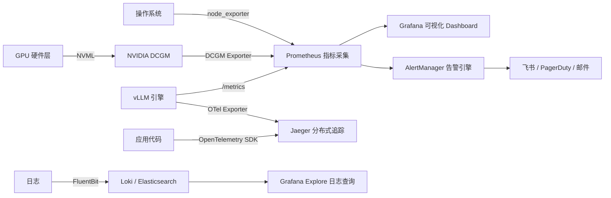
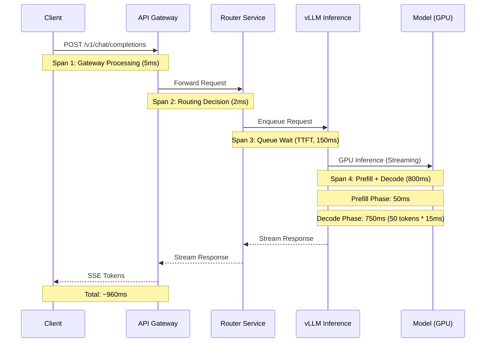
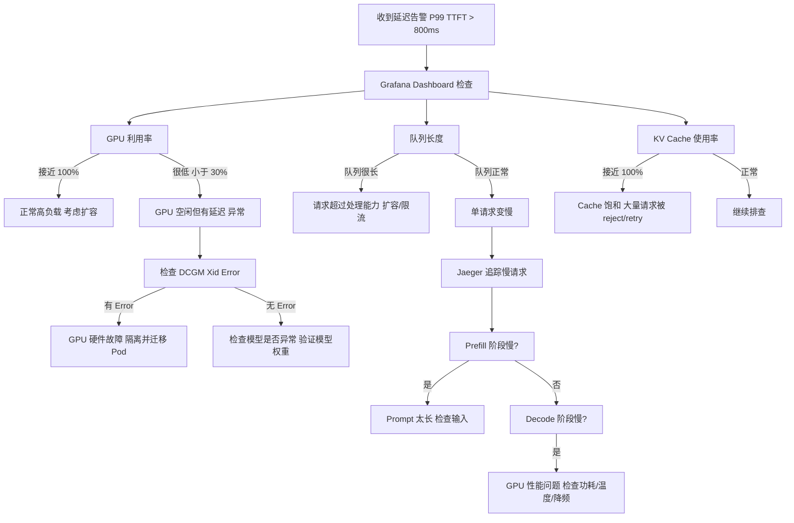

# 可观测性体系

> 没有可观测性的 LLM 服务就像在黑暗中开飞机，你不知道什么时候会坠毁。LLM 推理的可观测性需要覆盖 GPU 硬件、推理引擎、业务指标三个层次。

## 核心概念（含架构图）

### 监控数据流全景



### 可观测性的三个层次

| 层次 | 解决问题 | 数据形式 | 典型工具 |
|------|----------|----------|----------|
| **Metrics（指标）** | "系统现在健康吗？" | 聚合数值（Gauge/Counter/Histogram） | Prometheus + Grafana |
| **Traces（链路追踪）** | "慢在哪里？" | 带时间戳的 Span 树 | OpenTelemetry + Jaeger |
| **Logs（日志）** | "具体发生了什么？" | 结构化文本 | FluentBit + Loki |

三者关系：AlertManager 基于 Metrics 触发告警，查看 Grafana Dashboard 定位异常指标，在 Jaeger 中追踪慢请求的完整链路，在 Loki 中查看具体日志条目。

## 部署视角

### LLM 推理关键监控指标

#### 1. 延迟指标（Latency）

```
TTFT（Time To First Token）: 用户发出请求到收到第一个 token 的时间
TPOT（Time Per Output Token）: 每个 token 生成的平均时间
End-to-End Latency: 从请求发出到完整响应完成的总时间
```

| 指标 | P50 | P95 | P99 | 说明 |
|------|-----|-----|-----|------|
| TTFT | 小于 200ms | 小于 400ms | 小于 800ms | 用户体验最敏感的指标 |
| TPOT | 小于 30ms | 小于 50ms | 小于 100ms | 影响流式输出流畅度 |
| 总延迟 | 小于 1s | 小于 3s | 小于 5s | 短请求（约 128 tokens） |

```yaml
# Prometheus 中记录延迟的 Histogram 配置
# 在 vLLM 指标中自动暴露
# vllm_e2e_request_latency_seconds_bucket
# vllm_time_to_first_token_seconds_bucket
# vllm_time_per_output_token_seconds_bucket

# Grafana 面板中计算 P99：
# histogram_quantile(0.99, rate(vllm_time_to_first_token_seconds_bucket[5m]))
```

#### 2. 吞吐指标（Throughput）

| 指标 | 含义 | 典型值 |
|------|------|--------|
| **Request/sec** | 每秒完成请求数 | 70B: 约 2-5 req/s/GPU |
| **Token/sec** | 每秒生成 token 数 | 70B: 约 50-100 tok/s/GPU |
| **Batch Size** | 当前并发处理请求数 | 受 KV Cache 限制 |

#### 3. GPU 硬件指标

| 指标 | DCGM 指标名 | 正常范围 | 告警阈值 |
|------|------------|----------|----------|
| GPU 利用率 | `DCGM_FI_DEV_GPU_UTIL` | 70-95% | 小于 30% 或大于 98% |
| 显存使用 | `DCGM_FI_DEV_FB_USED` | 70-90% | 大于 95%（OOM 前兆） |
| GPU 温度 | `DCGM_FI_DEV_GPU_TEMP` | 40-75 摄氏度 | 大于 85 摄氏度 |
| GPU 功耗 | `DCGM_FI_DEV_POWER_USAGE` | 参考 TDP | 大于 90% TDP |
| NVLink 带宽 | `DCGM_FI_PROF_NVLINK_TX/RX` | 根据拓扑 | 异常低时排查 |
| Xid Error | `DCGM_FI_DEV_XID_ERRORS` | 0 | 大于 0 立即告警 |

#### 4. 应用层指标

| 指标 | vLLM 指标名 | 含义 |
|------|------------|------|
| 请求队列长度 | `vllm_num_requests_waiting` | 排队未处理的请求数 |
| KV Cache 使用率 | `vllm_gpu_cache_usage_perc` | 大于 90% 时开始 reject 请求 |
| 活跃请求数 | `vllm_num_requests_running` | 正在推理的请求数 |
| 推理中断率 | `vllm_request_success_total` | 被 preempt 的请求比例 |
| Prompt 长度分布 | `vllm_prompt_tokens_total` | 分析输入特征 |
| 生成长度分布 | `vllm_generation_tokens_total` | 分析输出特征 |

### Prometheus + Grafana 部署方案

#### Prometheus 配置

```yaml
# prometheus-values.yaml
server:
  global:
    scrape_interval: 15s
    evaluation_interval: 15s
  extraScrapeConfigs: |
    # 采集 vLLM 指标
    - job_name: 'vllm'
      kubernetes_sd_configs:
      - role: pod
      relabel_configs:
      - source_labels: [__meta_kubernetes_pod_label_app]
        action: keep
        regex: vllm
      - source_labels: [__address__]
        action: replace
        regex: (.+):8000
        replacement: ${1}:8000
        target_label: __address__
      metrics_path: /metrics

    # 采集 NVIDIA DCGM 指标
    - job_name: 'dcgm'
      kubernetes_sd_configs:
      - role: pod
      relabel_configs:
      - source_labels: [__meta_kubernetes_pod_label_app]
        action: keep
        regex: dcgm-exporter
      metrics_path: /metrics

    # 采集 K8s 节点指标
    - job_name: 'node-exporter'
      kubernetes_sd_configs:
      - role: pod
      relabel_configs:
      - source_labels: [__meta_kubernetes_pod_label_app_kubernetes_io_name]
        action: keep
        regex: node-exporter
```

#### Grafana Dashboard 核心面板

```json
{
  "dashboard": {
    "title": "LLM Inference Service",
    "panels": [
      {
        "title": "P99 TTFT",
        "targets": [{
          "expr": "histogram_quantile(0.99, rate(vllm_time_to_first_token_seconds_bucket[5m]))"
        }],
        "thresholds": [
          {"value": 0.4, "color": "yellow"},
          {"value": 0.8, "color": "red"}
        ]
      },
      {
        "title": "GPU Utilization",
        "targets": [{
          "expr": "avg(DCGM_FI_DEV_GPU_UTIL) by (gpu)"
        }]
      },
      {
        "title": "GPU Memory Usage",
        "targets": [{
          "expr": "DCGM_FI_DEV_FB_USED / (DCGM_FI_DEV_FB_USED + DCGM_FI_DEV_FB_FREE) * 100"
        }]
      },
      {
        "title": "Request Queue Length",
        "targets": [{
          "expr": "sum(vllm_num_requests_waiting)"
        }],
        "thresholds": [
          {"value": 10, "color": "yellow"},
          {"value": 50, "color": "red"}
        ]
      },
      {
        "title": "Tokens/sec per GPU",
        "targets": [{
          "expr": "rate(vllm_generation_tokens_total[1m])"
        }]
      }
    ]
  }
}
```

### Distributed Tracing（OpenTelemetry + Jaeger）

#### 链路追踪在推理服务中的价值

LLM 请求的完整链路：



#### OpenTelemetry 集成

```python
# vLLM 启用 OpenTelemetry（vLLM 内置支持）
from vllm.entrypoints.openai.api_server import app
from opentelemetry import trace
from opentelemetry.sdk.trace import TracerProvider
from opentelemetry.exporter.jaeger.thrift import JaegerExporter

trace.set_tracer_provider(TracerProvider())
trace.get_tracer_provider().add_span_processor(
    BatchSpanProcessor(
        JaegerExporter(
            agent_host_name="jaeger-collector.monitoring",
            agent_port=6831,
        )
    )
)

# 关键 Span 定义
# - vllm.handle_request: 完整请求处理
# - vllm.scheduler.schedule: 调度决策
# - vllm.worker.execute_model: GPU 推理
# - vllm.engine.add_request: 请求入队
```

### 日志收集（EFK / Loki）

#### Loki 方案（轻量级，与 Grafana 原生集成）

```yaml
# loki-values.yaml
loki:
  config:
    limits_config:
      max_line_size: 65536       # 单行最大 64KB（适应长 prompt）
      max_query_series: 1000
    schema_config:
      configs:
      - from: 2024-01-01
        store: boltdb-shipper
        object_store: s3
        schema: v12
        index:
          prefix: loki_index_
          period: 24h

# Promtail / FluentBit 采集配置
fluent-bit:
  config:
    service: |
      [SERVICE]
        Flush 1
        Log_Level info
    pipeline: |
      [INPUT]
        Name tail
        Path /var/log/containers/*vllm*.log
        Parser docker
        Tag kube.*
        Mem_Buf_Limit 50MB

      [FILTER]
        Name kubernetes
        Match kube.*

      [OUTPUT]
        Name loki
        Match kube.*
        Host loki.monitoring
        Port 3100
```

#### 结构化日志关键字段

```json
{
  "timestamp": "2026-05-11T10:30:45.123Z",
  "level": "info",
  "service": "vllm",
  "pod": "vllm-llm-5d8f7b6c4-xk9m2",
  "model": "Qwen2.5-72B-Instruct-AWQ",
  "request_id": "req-abc123",
  "trace_id": "0123456789abcdef",
  "event": "request_completed",
  "prompt_tokens": 512,
  "completion_tokens": 256,
  "ttft_ms": 145,
  "total_latency_ms": 2340,
  "gpu_id": 0,
  "status": "success"
}
```

### 告警规则设计

```yaml
# alertmanager-rules.yaml
groups:
- name: llm-inference
  rules:
  # 1. 延迟告警（最核心）
  - alert: HighTTFTP99
    expr: histogram_quantile(0.99, rate(vllm_time_to_first_token_seconds_bucket[5m])) > 0.8
    for: 2m
    labels:
      severity: warning
    annotations:
      summary: "TTFT P99 过高 ({{ $value | humanizeDuration }})"
      description: "用户感知明显延迟，检查 GPU 利用率和队列长度"

  - alert: CriticalTTFTP99
    expr: histogram_quantile(0.99, rate(vllm_time_to_first_token_seconds_bucket[2m])) > 2.0
    for: 1m
    labels:
      severity: critical
    annotations:
      summary: "TTFT P99 严重超标"
      description: "服务可能异常，立即排查"

  # 2. GPU OOM 告警
  - alert: GPUMemoryNearFull
    expr: DCGM_FI_DEV_FB_USED / (DCGM_FI_DEV_FB_USED + DCGM_FI_DEV_FB_FREE) * 100 > 95
    for: 1m
    labels:
      severity: critical
    annotations:
      summary: "GPU 显存即将耗尽 ({{ $value }}%)"
      description: "Pod {{ $labels.pod }} GPU {{ $labels.gpu }} 显存使用率超过 95%"

  # 3. GPU 温度告警
  - alert: GPUTemperatureHigh
    expr: DCGM_FI_DEV_GPU_TEMP > 85
    for: 5m
    labels:
      severity: warning
    annotations:
      summary: "GPU 温度过高 ({{ $value }} 摄氏度)"

  # 4. GPU 硬件错误告警
  - alert: GPUXidError
    expr: increase(DCGM_FI_DEV_XID_ERRORS[5m]) > 0
    for: 0m
    labels:
      severity: critical
    annotations:
      summary: "GPU Xid Error 检测"
      description: "GPU {{ $labels.gpu }} 发生硬件级错误 Xid={{ $value }}"

  # 5. 请求队列堆积
  - alert: RequestQueueBuilding
    expr: sum(vllm_num_requests_waiting) > 50
    for: 3m
    labels:
      severity: warning
    annotations:
      summary: "请求队列堆积 ({{ $value }} 个请求排队)"

  # 6. 错误率告警
  - alert: HighErrorRate
    expr: |
      sum(rate(vllm_request_success_total{status="error"}[5m]))
      /
      sum(rate(vllm_request_success_total[5m]))
      > 0.05
    for: 2m
    labels:
      severity: critical
    annotations:
      summary: "请求错误率超过 5%"

  # 7. KV Cache 饱和
  - alert: KVCacheSaturation
    expr: avg(vllm_gpu_cache_usage_perc) > 0.9
    for: 2m
    labels:
      severity: warning
    annotations:
      summary: "KV Cache 使用率超过 90%"
```

## 面试视角

### 面试题：线上推理延迟突然升高，怎么排查？

**标准排查路径**（5 分钟内定位问题）：



**详细排查步骤**：

| 步骤 | 操作 | 工具 | 预期 |
|------|------|------|------|
| 1 | 查看 Grafana 延迟 Dashboard | Grafana | 确认是哪个百分位升高 |
| 2 | 检查 GPU 利用率 | `dcgmi dmon -d 1` | 判断是否过载 |
| 3 | 检查显存使用 | `nvidia-smi` | 排除 OOM 前兆 |
| 4 | 检查队列长度 | Grafana / 指标 API | 判断是否超负载 |
| 5 | 检查 GPU 温度/功耗 | `dcgmi diag -r 1` | 排除硬件降频 |
| 6 | 查看错误日志 | Loki `pod=vllm` | 排查异常请求 |
| 7 | 追踪慢请求 | Jaeger | 定位瓶颈在 Prefill 还是 Decode |
| 8 | 检查网络 | `kubectl top pod` | 排除网络延迟 |

**常见根因**：
1. **流量突增**：队列长度飙升，需要扩容
2. **GPU 硬件故障**：Xid Error，隔离节点并迁移 Pod
3. **KV Cache 饱和**：大 prompt 占满 cache，调整 max_num_seqs
4. **模型退化**：模型权重损坏，回滚到上一版本
5. **热其他进程**：同一 GPU 上有其他进程，检查 `nvidia-smi`

### 面试进阶问题

1. **"可观测性的三个层次（Metrics/Traces/Logs）各解决什么问题？"**
   - Metrics 回答"系统是否健康"，是聚合数值，适合告警和趋势分析
   - Traces 回答"慢在哪里"，展示请求完整链路，定位瓶颈
   - Logs 回答"具体发生了什么"，提供上下文细节，用于根因分析

2. **"如何设计 LLM 推理服务的告警规则？"**
   - 核心延迟指标：TTFT P99 超过 800ms 告警，超过 2s 严重告警
   - GPU 硬件：显存使用率超过 95%、温度超过 85 摄氏度、Xid Error
   - 应用层：KV Cache 使用率超过 90%、请求队列长度超过 50、错误率超过 5%

3. **"Prometheus 中如何计算 P99 延迟？"**
   - 使用 `histogram_quantile(0.99, rate(bucket_metric[5m]))`
   - Histogram 类型指标自动记录分桶数据，P99 表示 99% 的请求延迟低于该值

## 最佳实践

1. **三层可观测性缺一不可**：Metrics 用于告警，Traces 用于定位，Logs 用于根因分析，三者配合才能快速排查问题。
2. **告警规则分层设计**：warning 级别留给运维人员响应时间，critical 级别需要立即介入。避免告警疲劳。
3. **Grafana Dashboard 标准化**：所有服务使用统一的 Dashboard 模板，包含延迟、吞吐、GPU 利用率、KV Cache 使用率四大核心面板。
4. **日志结构化**：使用 JSON 格式日志，包含 request_id、trace_id、model_name 等关键字段，方便关联分析。
5. **OpenTelemetry 作为标准**：vLLM 内置 OpenTelemetry 支持，统一 Trace 和 Metrics 的采集协议，方便后续扩展。

---

*下一节：[容灾与降级](./disaster-recovery.md)*
