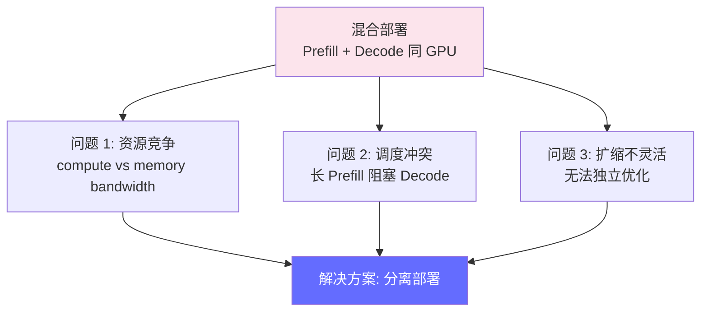
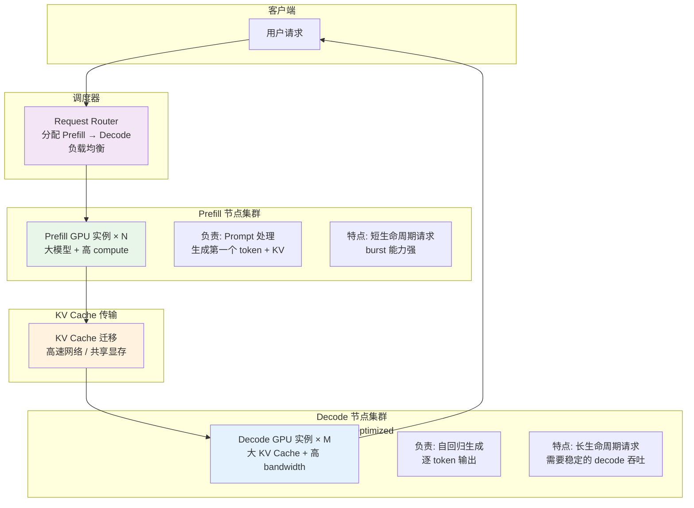
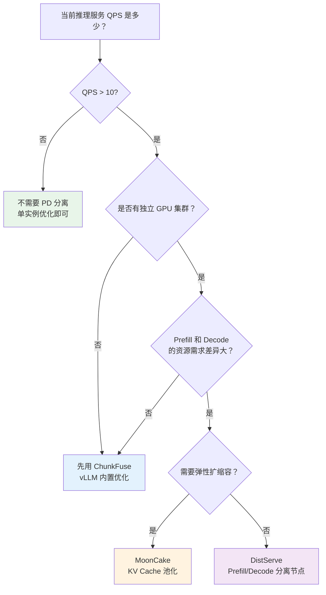

# Prefill-Decode 分离部署 — 高吞吐推理的新标准

> DistServe、MoonCake 和 ChunkFuse 等方案在 2024-2026 年验证了 Prefill 和 Decode 分离部署的可行性，成为大流量 LLM 服务的标准架构。

---

## 前置知识

- [推理引擎概览](../04-inference-optimization/engine-overview.md)
- [vLLM 深度解析](../04-inference-optimization/vllm-deep-dive.md)
- [KV Cache](../02-model-architecture/kv-cache.md)

---

## 核心概念：为什么要分离 Prefill 和 Decode

### Prefill 和 Decode 的本质差异

```
Prefill 阶段:
  - 一次性处理整个 prompt
  - 计算特点: compute-bound（大量矩阵乘法）
  - GPU 利用率: 80-95%
  - 延迟: 与 prompt 长度线性相关（100 tokens → 10ms, 4000 tokens → 350ms）
  - 优化目标: 用大 batch、多 GPU 加速

Decode 阶段:
  - 逐 token 生成
  - 计算特点: memory-bound（反复读写 KV Cache）
  - GPU 利用率: 10-30%
  - 延迟: 与生成 token 数成正比
  - 优化目标: 减少 KV Cache 访问、增大 batch
```

### 混合部署的问题

当同一个 GPU 实例同时处理 Prefill 和 Decode 时：

```
问题 1: 资源竞争
  Prefill 需要大量 compute（矩阵乘法）
  Decode 需要大量 memory bandwidth（KV Cache 访问）
  两者在同一 GPU 上竞争资源，互相拖累

问题 2: 调度冲突
  长 prompt 的 Prefill 会占用 GPU 几秒
  同一时间 Decode 请求被阻塞，TPOT 飙升

问题 3: 扩缩容不灵活
  Prefill 和 Decode 的资源需求比例随流量变化
  混合部署只能整体扩缩，无法独立优化
```



---

## 分离部署的架构



### 工作流程

```
1. 用户请求 → 调度器 → Prefill 节点
2. Prefill 节点处理整个 prompt，计算出第一个 token 和 KV Cache
3. KV Cache 传输到 Decode 节点（通过高速网络或共享显存）
4. Decode 节点接管，执行自回归生成
5. 生成的 token 流式返回给用户
```

---

## 三大方案对比

### 1. DistServe

**核心思想**：Prefill 和 Decode 放在不同的 GPU 实例，通过 RDMA 传输 KV Cache。

```
架构:
  Prefill Worker: 处理 prompt，产出 KV Cache
  Decode Worker:  接收 KV Cache，执行 decode
  KV Transmission:  高速网络（RDMA）传输 KV Cache

关键优化:
  - KV Cache 压缩传输（减少网络带宽）
  - 拓扑感知调度（同 rack 内的 Prefill→Decode 对）
  - Chunked Prefill（超长 prompt 分块处理）
```

### 2. MoonCake

**核心思想**：将 KV Cache 放到分布式共享显存池中，Prefill 和 Decode 节点从同一池中读写。

```
架构:
  KVStore: 分布式 KV Cache 存储层（类似 Redis，但针对 KV Cache 优化）
  Prefill Node: 计算完 KV 后写入 KVStore
  Decode Node: 从 KVStore 读取 KV 进行 decode

关键优势:
  - KV Cache 不依赖于计算节点，灵活迁移
  - 多 Decode 节点可以共享同一个 KV Cache
  - 弹性扩缩容
```

### 3. ChunkFuse

**核心思想**：在 vLLM 内部实现 Chunked Prefill + 动态资源融合，无需外部传输。

```
架构:
  单个 vLLM 实例，但 Prefill 和 Decode 分优先级调度
  Prefill 被拆分为多个 chunk，与 Decode 交错执行

关键优化:
  - 不需要额外的 GPU 实例
  - 在现有 vLLM 实例内优化调度
  - 部署简单（vLLM 原生支持）
```

### 方案对比

| 维度 | DistServe | MoonCake | ChunkFuse |
|------|-----------|----------|-----------|
| **架构** | Prefill/Decode 分离节点 | KV Cache 池化 | 实例内优化调度 |
| **部署复杂度** | 高（需要多集群 + RDMA） | 中（需要 KVStore） | 低（vLLM 配置） |
| **性能提升** | 吞吐 2x+ | 吞吐 1.5-2x | 吞吐 1.3-1.5x |
| **适用场景** | 大流量、独立 GPU 集群 | 弹性扩缩、多租户 | 单实例优化 |
| **网络要求** | RDMA / 高速网络 | 高速网络 | 无需额外网络 |
| **维护成本** | 高 | 中 | 低 |

---

## 性能数据

### 混合 vs 分离的定量对比

```
以 Llama-3-70B 为例（A100 × 8）：

混合部署（传统）：
  Prefill + Decode 在同一 GPU
  最大 QPS: ~5
  P50 TTFT: ~250ms
  P99 TPOT: ~25ms
  GPU 利用率: 40-60%（Prefill 和 Decode 互相等待）

分离部署（DistServe）：
  Prefill 节点: 4 × A100（compute 优化）
  Decode 节点: 8 × A100（memory 优化）
  最大 QPS: ~12
  P50 TTFT: ~150ms（↓40%）
  P99 TPOT: ~15ms（↓40%）
  吞吐提升: 2.4x
```

### ChunkFuse vs 传统 vLLM

```
vLLM 实例（A100-80G, Llama-3-8B）：

传统调度：
  batch=32, QPS: 8, TTFT P99: 500ms, TPOT P99: 15ms

ChunkFuse 调度：
  batch=32（Prefill chunked + Decode 交错）
  QPS: 10.5（↑31%）
  TTFT P99: 300ms（↓40%）
  TPOT P99: 12ms（↓20%）
```

---

## Thinking 模型对 PD 分离的影响

```
Thinking 模型的推理特征:
  Prefill: 很短（用户问题通常 < 500 tokens）
  Decode: 极长（thinking + answer = 2000-10000 tokens）

→ PD 分离特别适合 Thinking 模型！

原因:
  - Prefill 节点只需要处理很短的 prompt → 可以用小 GPU 实例
  - Decode 节点需要处理极长的生成 → 需要大规模 GPU 集群
  - 两个节点的资源需求差异极大 → 独立扩缩容收益巨大
```

---

## 部署视角：什么时候该用 PD 分离

### 决策树



### 实际建议

| 场景 | 推荐方案 | 原因 |
|------|---------|------|
| 小团队、单实例 | ChunkFuse | 零额外成本，vLLM 配置即可 |
| 中等流量、有 GPU 集群 | ChunkFuse 优先 | 部署简单，效果够用 |
| 大流量、独立 GPU 机房 | DistServe | 吞吐提升最大，有独立运维能力 |
| 多租户、弹性需求 | MoonCake | KV Cache 池化，灵活调度 |
| Thinking 模型部署 | DistServe | Prefill/Decode 资源差异极大 |

---

## 面试视角

### 常考问题

1. **"为什么要把 Prefill 和 Decode 分开部署？"**

   回答框架：
   - Prefill 是 compute-bound（矩阵乘法），GPU 利用率高但时间短
   - Decode 是 memory-bound（KV Cache 访问），GPU 利用率低但时间长
   - 两者在同一 GPU 上资源竞争、调度冲突、扩缩不灵活
   - 分离后可以各自优化：Prefill 用 compute 优化的实例，Decode 用 memory 优化的实例
   - 实际效果：吞吐提升 2x+，延迟降低 40%

2. **"PD 分离有什么缺点？"**

   - 部署复杂度高（需要多集群 + 网络传输）
   - KV Cache 传输需要高速网络（RDMA 最佳）
   - 对小流量服务不值得（QPS < 10 时收益不明显）
   - 维护成本高（两套基础设施）

3. **"vLLM 有没有内置的 PD 优化？"**

   - Chunked Prefill：将长 prompt 拆分为多个 chunk，与 decode 交错执行
   - 这可以在单实例内减少 Prefill 对 Decode 的阻塞
   - 效果不如完整 PD 分离（1.3-1.5x vs 2x+），但零额外成本

---

## 扩展阅读

- [DistServe Paper](https://arxiv.org/abs/2401.09670) — 原始论文
- [MoonCake](https://github.com/kvcache-ai/MoonCake) — KV Cache 池化方案
- [vLLM Chunked Prefill](https://docs.vllm.ai/) — vLLM 文档

---

*上一节：[推理网关](./inference-gateway.md)*
*下一节：[多 Agent 部署](./multi-agent-deployment.md)*
