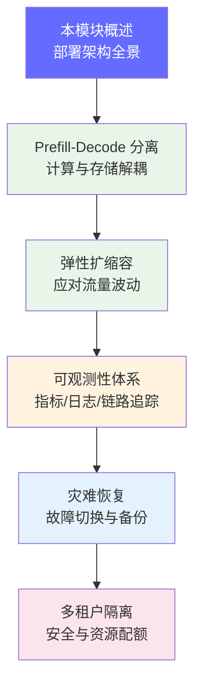
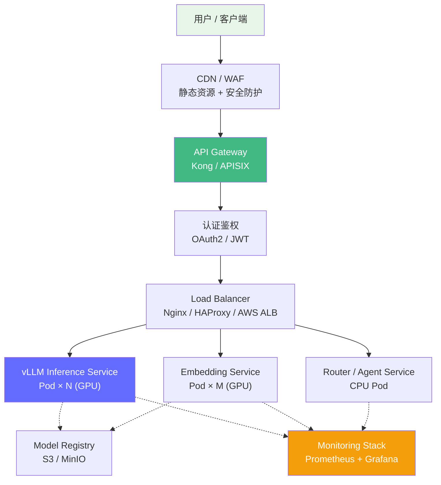
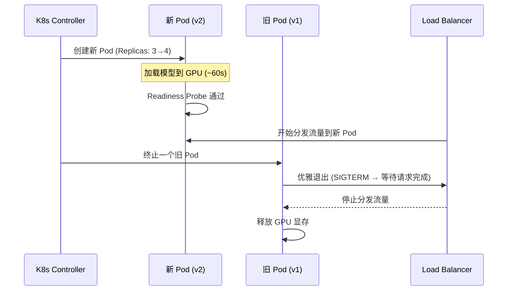

# 生产环境部署架构

> 生产级 LLM 部署需要完整的组件选型、K8s 编排、GPU 调度和模型生命周期管理，远不止 "启动一个 Docker 容器"。

## 前置知识

- [推理引擎概述](../04-inference-optimization/engine-overview.md) — 理解 vLLM/TRT-LLM 的工作原理
- [分布式推理](../05-distributed-inference/distributed-overview.md) — 理解 TP/PP/DP 的通信需求
- [Transformer Prefill/Decode](../02-model-architecture/transformer-overview.md) — 理解两阶段的计算特征差异

## 为什么需要学这个

模型调通不等于能上线。从 "本地跑通一个 vLLM" 到 "生产环境稳定服务" 之间隔着巨大的工程鸿沟：

- **高可用性**：GPU 节点故障、模型加载超时、OOM——任何一个环节出错都不能影响用户
- **弹性扩缩容**：流量波动 10x 时，如何自动扩缩而不浪费 GPU 资源？
- **可观测性**：P99 延迟升高、吞吐量下降、GPU 利用率异常——如何第一时间发现并定位？
- **灾难恢复**：主集群挂了怎么办？数据丢了怎么恢复？
- **多租户隔离**：多个团队共用 GPU 集群，如何互相不影响？

本模块覆盖从架构设计到日常运维的完整生产链路。

## 本模块学习地图



学习顺序说明：
1. **部署架构设计**（本文档）：先看全景图，理解所有组件和它们的职责
2. **Prefill-Decode 分离**：理解 LLM 推理两阶段的计算差异，学习如何将它们解耦部署以优化成本
3. **弹性扩缩容**：在分离部署的基础上，学习如何根据流量自动扩缩
4. **可观测性体系**：扩缩容需要指标驱动，所以先学监控和告警
5. **灾难恢复**：有了监控后，学习如何应对故障和灾难
6. **多租户隔离**：最后学习如何在同一集群服务多个团队/业务线

| 顺序 | 文档 | 解决什么问题 | 时长 |
|------|------|-------------|------|
| 1 | [部署架构设计](./deployment-architecture.md)（本文档） | 生产环境需要哪些组件？如何编排？ | 45 分钟 |
| 2 | [Prefill-Decode 分离](./prefill-decode-separation.md) | 为什么两阶段应该分离部署？怎么拆分？ | 30 分钟 |
| 3 | [弹性扩缩容](./autoscaling.md) | 流量波动时如何自动扩缩？HPA/KEDA 怎么用？ | 30 分钟 |
| 4 | [可观测性体系](./observability.md) | 如何监控延迟、吞吐、GPU 利用率？告警怎么设？ | 45 分钟 |
| 5 | [灾难恢复](./disaster-recovery.md) | 主集群挂了怎么办？数据怎么备份？ | 30 分钟 |
| 6 | [多租户隔离](./multi-tenant.md) | 多个团队共用 GPU 集群如何互不影响？ | 30 分钟 |

## 核心概念速览

### 完整部署架构全景



### 关键组件职责

| 组件 | 代表产品 | 核心职责 | LLM 场景特殊要求 |
|------|---------|---------|----------------|
| **API Gateway** | Kong, APISIX | 统一入口、限流、认证、路由 | SSE 流式响应稳定传输、按模型路由 |
| **Load Balancer** | Nginx, HAProxy, AWS ALB | TCP/HTTP 负载均衡、健康检查 | `least_conn` 优于 `round_robin`（LLM 请求时长差异大） |
| **Inference Service** | vLLM, TRT-LLM, SGLang | 模型推理、批处理、KV Cache | GPU 显存管理、Continuous Batching |
| **Model Registry** | S3, MinIO + MLflow | 模型版本管理、元数据记录 | 大文件分发（40GB+）、蓝绿部署双版本并存 |
| **Monitoring** | Prometheus + Grafana | 指标采集、可视化、告警 | GPU 利用率、TTFT、TPOT、Token 吞吐 |

### 模型生命周期管理


**70B AWQ INT4 模型加载时间线**（A100 80GB × 4）：

| 阶段 | 耗时 |
|------|------|
| 模型从 S3 下载到本地 | ~30s |
| 加载到显存（TP=4） | ~20s |
| KV Cache 预分配 | ~5s |
| Warmup 推理 | ~3s |
| **总计** | **~60s** |

### 部署策略

| 策略 | 适用场景 | 优点 | 缺点 |
|------|---------|------|------|
| **滚动更新** | 小版本升级、配置变更 | 零停机、资源开销小 | 新旧版本并存期间可能不一致 |
| **蓝绿部署** | 模型版本切换 | 秒级切换、快速回滚 | 需要双倍 GPU 资源 |
| **金丝雀发布** | 大版本验证 | 逐步验证、风险可控 | 需要流量管理能力 |

**金丝雀发布推荐步骤**：5% → 25% → 50% → 100%，每步观察 10-30 分钟，重点关注 TTFT 和输出质量。

### K8s 关键配置要点

- **GPU 资源声明**：`resources.limits.nvidia.com/gpu: 4`（Tensor Parallel 需要多卡）
- **就绪探针**：`initialDelaySeconds: 120`（模型加载需要 60-90s）
- **共享内存**：`/dev/shm` 至少 16GB（NCCL 进程间通信，默认 64M 不够）
- **反亲和性**：同一模型的 Pod 分散到不同主机，避免单点故障
- **滚动更新**：`maxUnavailable: 0` + `maxSurge: 1` 实现零停机

> 完整的 K8s YAML 示例和各组件详细配置见下方 [部署视角](#部署视角)。

## 部署视角

### 典型部署架构组件详解

#### 1. API Gateway（Kong / APISIX）

职责：统一入口、路由分发、限流、认证、协议转换。

| 维度 | Kong | APISIX |
|------|------|--------|
| 性能 | 高（Nginx 底层） | 更高（动态配置无需 reload） |
| 生态 | 插件丰富 | 云原生优先 |
| 适用场景 | 稳定生产环境 | 频繁变更、需要热更新 |

在 LLM 场景中的关键能力：
- **请求限流**：按 API Key 控制 QPS，防止单用户挤占 GPU 资源
- **请求路由**：按模型名称/版本路由到不同后端
- **协议转换**：OpenAI 兼容接口的标准化
- **响应缓冲**：SSE（Server-Sent Events）流式响应的稳定传输

#### 2. Load Balancer

```
Layer 4 (LVS) → Layer 7 (Nginx) → vLLM Pods
```

- **Layer 4**：IPVS 负载均衡，处理 TCP 连接分发，高性能
- **Layer 7**：Nginx/Envoy，处理 HTTP 路由、健康检查、TLS 终结

关键配置：
- **连接保持**：长连接复用减少 TLS 握手开销
- **健康检查**：对 `/health` 端点主动探测，异常 Pod 自动摘除
- **负载均衡算法**：`least_conn`（最少连接数）优于 `round_robin`，因为 LLM 请求时长差异大

#### 3. Inference Service（vLLM / TRT-LLM）

| 引擎 | 特点 | 适用场景 |
|------|------|----------|
| vLLM | PagedAttention、高吞吐 | 通用推理、多模型 |
| TRT-LLM | TensorRT 优化、极致性能 | NVIDIA GPU、生产追求极致 |
| TGI | HuggingFace 官方、易用 | 快速上线、HuggingFace 模型 |
| SGLang | RadixAttention、KV Cache 共享 | 多轮对话、Agent 场景 |

#### 4. Model Registry（模型注册中心）

**量化选型指南**：

| 量化方式 | 精度 | 显存压缩 | 精度损失 | 硬件要求 |
|----------|------|----------|----------|----------|
| FP16 | 半精度 | 2x | 无 | 标准 GPU |
| AWQ INT4 | 4-bit | 4x | 极小 | 支持 INT4 解码 |
| GPTQ INT4 | 4-bit | 4x | 较小 | 通用 |
| FP8 | 8-bit 浮点 | 2x | 极小 | H100+ |

#### 5. GPU 节点配置

```bash
# 安装 NVIDIA Device Plugin（K8s 自动发现 GPU）
kubectl apply -f https://raw.githubusercontent.com/NVIDIA/k8s-device-plugin/v0.14.1/deployments/static/nvidia-device-plugin.yml
```

安装后，K8s Node 自动报告 GPU 资源：
```yaml
Capacity:
  nvidia.com/gpu: 8        # 8 张 A100
Allocatable:
  nvidia.com/gpu: 8
```

#### 6. Kubernetes 部署 LLM 核心 YAML

```yaml
apiVersion: apps/v1
kind: Deployment
metadata:
  name: vllm-llm
  namespace: llm-serving
spec:
  replicas: 3
  strategy:
    type: RollingUpdate
    rollingUpdate:
      maxUnavailable: 0  # 零停机
      maxSurge: 1
  selector:
    matchLabels:
      app: vllm
  template:
    metadata:
      labels:
        app: vllm
        model: qwen2.5-72b
    spec:
      affinity:
        nodeAffinity:
          requiredDuringSchedulingIgnoredDuringExecution:
            nodeSelectorTerms:
            - matchExpressions:
              - key: gpu-type
                operator: In
                values: ["A100-80GB", "H100-80GB"]
        podAntiAffinity:
          preferredDuringSchedulingIgnoredDuringExecution:
          - weight: 100
            podAffinityTerm:
              labelSelector:
                matchExpressions:
                - key: app
                  operator: In
                  values: ["vllm"]
              topologyKey: kubernetes.io/hostname
      tolerations:
      - key: "nvidia.com/gpu"
        operator: "Exists"
        effect: "NoSchedule"
      containers:
      - name: vllm
        image: vllm/vllm-openai:latest
        command:
        - "python3"
        - "-m"
        - "vllm.entrypoints.openai.api_server"
        - "--model"
        - "Qwen2.5-72B-Instruct-AWQ"
        - "--tensor-parallel-size"
        - "4"
        - "--gpu-memory-utilization"
        - "0.90"
        resources:
          requests:
            nvidia.com/gpu: 4
            memory: "128Gi"
            cpu: "16"
          limits:
            nvidia.com/gpu: 4
            memory: "128Gi"
            cpu: "16"
        readinessProbe:
          httpGet:
            path: /health
            port: 8000
          initialDelaySeconds: 120
          periodSeconds: 10
        volumeMounts:
        - name: shm
          mountPath: /dev/shm
      volumes:
      - name: shm
        emptyDir:
          medium: Memory
          sizeLimit: "16Gi"
```

### 多副本部署与滚动更新



### 模型大文件分发优化

**问题**：模型文件 ~40GB，每次部署都从 S3 下载太慢。

| 方案 | 原理 | 优缺点 |
|------|------|--------|
| **镜像预打包** | 将模型权重打包到 Docker 镜像中 | 镜像较大，但启动快 |
| **Init Container 预拉取** | 用 init container 提前下载模型到共享 volume | 灵活，支持动态模型 |
| **P2P 分发** | Dragonfly / Kraken 等 P2P 系统 | 大规模集群最优方案 |

## 面试视角

### 面试题：描述生产部署一个 70B 模型的完整流程

**标准回答框架**：

1. **需求确认**：模型选型 + 精度要求（FP16/INT4/FP8）
2. **模型量化**：AWQ INT4 / GPTQ + 离线验证（perplexity + benchmark）
3. **构建镜像**：预打包模型权重 + vLLM 环境
4. **测试环境部署**：功能 + 性能测试
5. **金丝雀发布**：5% → 25% → 50% → 100%，每步验证 SLO
6. **生产验证**：SLO 监控 + 告警生效
7. **全量上线**：旧版本保留 1 小时可快速回滚

**关键检查点**：
- 资源评估：70B INT4 ≈ 35GB，TP=4 需要 4 张 A100（考虑 KV Cache）
- 网络要求：4 卡之间需要 NVLink / NVSwitch（PCIe 会导致通信瓶颈）
- 模型加载时间：预留 readiness probe 的 initialDelaySeconds ≥ 120s
- 回滚预案：旧版本镜像保留，5 分钟内可回滚
- 监控就绪：上线前确认 Grafana Dashboard 和 AlertManager 规则生效

### 常见追问

| 问题 | 回答要点 |
|------|---------|
| "滚动更新期间服务不中断怎么保证？" | `maxUnavailable: 0` + readinessProbe + 优雅退出 |
| "GPU 利用率只有 30% 怎么优化？" | 增大 batch size、Continuous Batching、减少实例数 |
| "Prefill 和 Decode 为什么要分离？" | 两阶段计算特征完全不同，分离部署可独立扩缩和优化 |

## 学完本模块后，你应该能够...

- [ ] 画出 LLM 生产部署的完整架构图
- [ ] 解释为什么 Prefill 和 Decode 应该分离部署
- [ ] 设计合理的 autoscaling 策略应对流量波动
- [ ] 配置完整的可观测性 pipeline（指标、日志、链路追踪）
- [ ] 制定灾难恢复方案和多租户隔离策略
- [ ] 描述 70B 模型从量化到金丝雀发布的完整流程

*上一节：[用 LLM 构建应用](../06-ai-engineering/index.md) | 下一节：[Prefill-Decode 分离](./prefill-decode-separation.md)*
