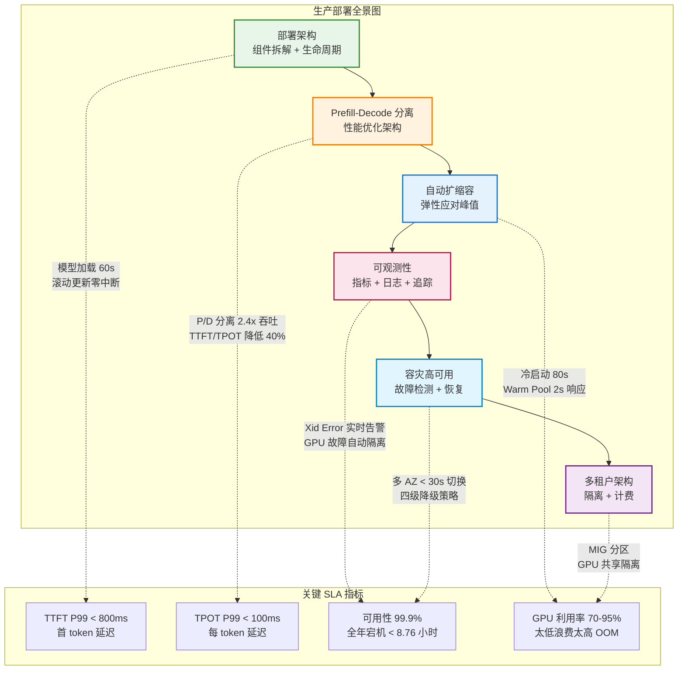
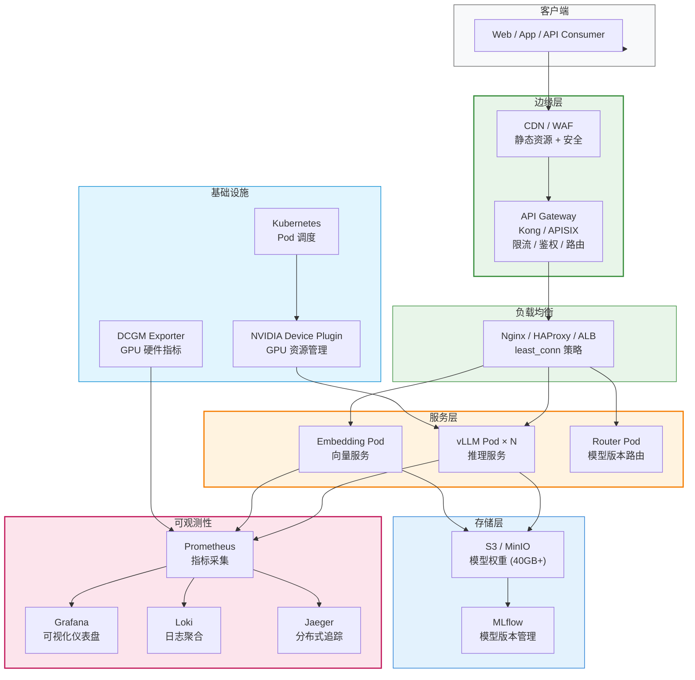
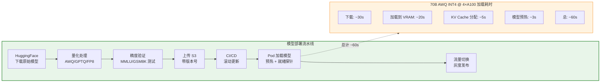
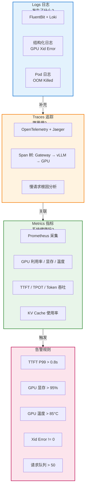
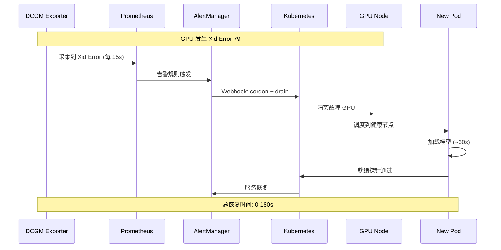
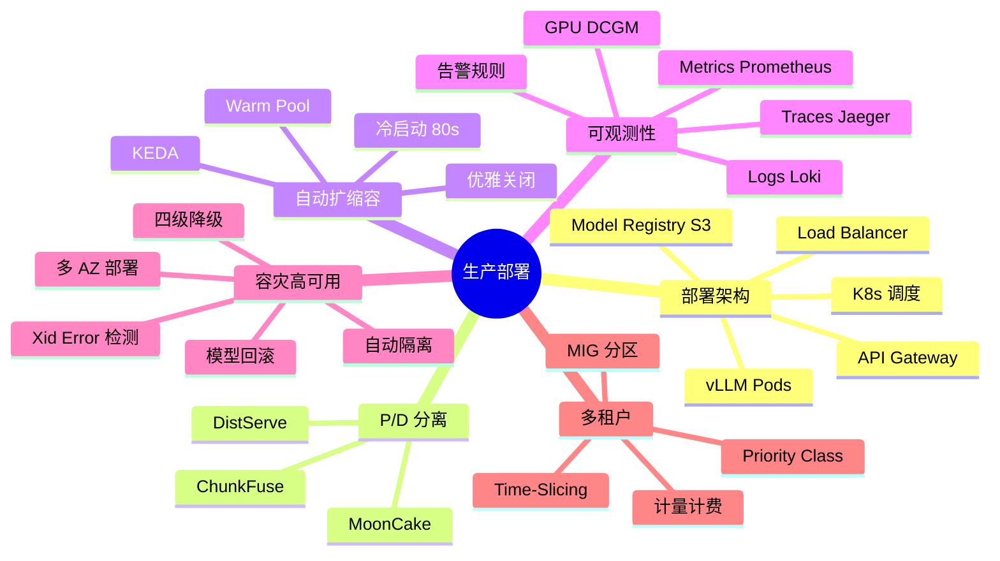

# 生产环境部署架构

> 从本地推理到线上服务，需要解决高可用、扩缩容、可观测性等一系列工程问题。

## 为什么这个模块对 FDE 至关重要

"模型跑起来了"和"服务稳定跑了 99.9% 的 SLA"之间有巨大的工程鸿沟。FDE 候选人经常能部署 vLLM，但回答不了：

- "70B INT4 模型部署到 4× A100，冷启动需要多长时间？怎么优化？"
- "GPU 出现 Xid Error 79 (Fallen Off Bus)，从检测到恢复需要几步？多久？"
- "P99 延迟突然从 200ms 飙升到 2s，怎么排查？"
- "Prefill-Decode 分离架构能带来多大收益？什么场景下值得做？"

**生产环境部署的核心不是"能跑"，而是"怎么在故障、峰值、升级时不中断地跑"。**

## 生产环境部署架构全景

## 模型生命周期管理

**冷启动 80 秒是自动扩缩容的最大瓶颈。** 70B INT4 在 4× A100 上的完整冷启动：10s 镜像拉取 + 15s 初始化 + 5s 主容器启动 + 25s 权重加载 + 15s VRAM 加载 + 5s KV Cache 分配 + 3s 预热 + 2s 就绪探针。

## Prefill-Decode 分离架构

```mermaid
flowchart LR
    subgraph Request["用户请求"]
        R1["长 Prompt\n高并发"]
    end

    subgraph Router["请求路由器"]
        RT["根据请求特征\n路由到 P 或 D 集群"]
    end

    subgraph Prefill["Prefill 集群\nCompute-Optimized"]
        P1["GPU: 高算力\n利用率 80-95%"]
        P2["任务: 矩阵乘法\ncompute-bound"]
        P3["输出: KV Cache"]
    end

    subgraph Transfer["KV Cache 传输"]
        T1["高速网络 / 共享内存\nDistServe / MoonCake"]
    end

    subgraph Decode["Decode 集群\nMemory-Optimized"]
        D1["GPU: 大显存\n利用率 10-30%"]
        D2["任务: KV Cache 访问\nmemory-bound"]
        D3["输出: 生成 Token"]
    end

    Request --> R1
    R1 --> RT
    RT --> P1
    P1 --> P2 --> P3
    P3 --> T1
    T1 --> D1
    D1 --> D2 --> D3

    style Prefill fill:#e8f5e9,stroke:#388e3c,stroke-width:2px
    style Decode fill:#fce4ec,stroke:#c2185b,stroke-width:2px
    style Transfer fill:#fff3e0,stroke:#f57c00
```

### P/D 分离效果（Llama-3-70B @ A100×8）

| 指标 | 混合部署 | 分离部署 | 提升 |
|------|---------|---------|------|
| 最大 QPS | ~5 | ~12 | **2.4x** |
| TTFT | 基准 | -40% | 降低 40% |
| TPOT | 基准 | -40% | 降低 40% |

### P/D 分离方案对比

| 方案 | 架构 | 部署复杂度 | 吞吐提升 | 网络要求 |
|------|------|-----------|---------|---------|
| DistServe | 独立 P/D 节点 | 高 (RDMA) | 2x+ | RDMA |
| MoonCake | KV Cache 池化 | 中 (KVStore) | 1.5-2x | 高速网络 |
| ChunkFuse | 实例内调度 | 低 (vLLM 配置) | 1.3-1.5x | 无 |

## 可观测性三层体系

## GPU 故障自动恢复流程

### 四级降级策略

| 级别 | 策略 | 效果 | 适用场景 |
|------|------|------|---------|
| Level 1 | 减小 batch size (256→64) | 降低延迟，减少吞吐 | 轻度过载 |
| Level 2 | 切换小模型 (70B→7B) | 大幅降低计算量 | 中度过载 |
| Level 3 | 限流 + 排队 | 核心用户白名单 | 严重过载 |
| Level 4 | 规则引擎兜底 | FAQ 匹配，不依赖 GPU | 完全不可用 |

## 学习路径

| 顺序 | 文档 | 核心内容 | 面试考点 |
|------|------|---------|---------|
| 1 | [部署架构概述](./deployment-architecture.md) | 生产环境架构设计、组件拆解 | 如何设计高可用 LLM 服务 |
| 2 | [Prefill-Decode 分离](./prefill-decode-separation.md) | 分离架构的原理和实现 | 为什么 P/D 分离能提升吞吐 |
| 3 | [自动扩缩容](./autoscaling.md) | K8s HPA、基于 QPS/延迟的扩缩容 | 如何设置自动扩容阈值 |
| 4 | [可观测性](./observability.md) | 指标监控、日志、分布式追踪 | 如何监控 LLM 服务健康状态 |
| 5 | [容灾与高可用](./disaster-recovery.md) | 故障恢复、降级策略 | 服务挂了如何快速恢复 |
| 6 | [多租户架构](./multi-tenant.md) | 资源共享、QoS、优先级 | 如何隔离不同用户的资源 |

## 模块知识结构图

## 前置知识

建议先完成 [用 LLM 构建应用](/06-ai-engineering/) 了解应用层架构。

---

*上一节：[用 LLM 构建应用](/06-ai-engineering/)*
*下一节：[部署架构概述](./deployment-architecture.md)*
