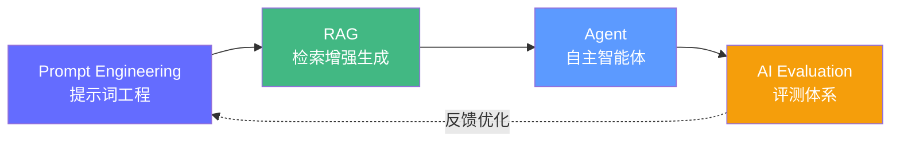

# AI 工程核心技术栈

> 掌握 AI 应用的四大核心技术：提示词工程、RAG、Agent 和 AI 评测——这是构建生产级 AI 应用的基础能力。

---

## 本章概览

这四门技术构成了 AI 应用开发的完整闭环：

| 技术 | 一句话概括 | 核心能力 |
|------|-----------|---------|
| **提示词工程** | 用自然语言"编程"大模型 | 结构化指令、思维链、工具调用 |
| **RAG** | 让 LLM 拥有"外挂知识库" | 文档索引、向量检索、上下文增强 |
| **Agent** | 让 LLM 自主完成任务 | 规划、记忆、工具、多 Agent 协作 |
| **AI 评测** | 量化 AI 系统的好坏 | 精度/性能/安全/用户体验评估 |

---

## 学习顺序

建议按以下顺序学习，每节是下一节的基础：

1. **[提示词工程](./prompt-engineering.md)** — 学会如何"问对问题"
2. **[RAG 原理及应用](./rag-principles.md)** — 让模型"读你的私有文档"
3. **[Agent 架构与实战](./agent-architecture.md)** — 让模型"自主行动"
4. **[AI 评测入门指南](./ai-evaluation.md)** — 确保系统"稳定可靠"

---

## 面试关联

这四门技术在 FDE 面试中的考察频率：

| 技术 | 考察频率 | 常考题型 |
|------|---------|---------|
| 提示词工程 | ⭐⭐⭐ | 如何设计生产 Prompt、Prompt vs 微调、减少幻觉 |
| RAG | ⭐⭐⭐⭐⭐ | RAG 架构、检索优化、延迟优化、评估方法 |
| Agent | ⭐⭐⭐⭐ | Agent 架构、记忆系统、Multi-Agent、可靠性 |
| AI 评测 | ⭐⭐⭐ | Benchmark 选择、性能测试、RAG 评估、安全扫描 |

---

*下一步：[提示词工程](./prompt-engineering.md)*
