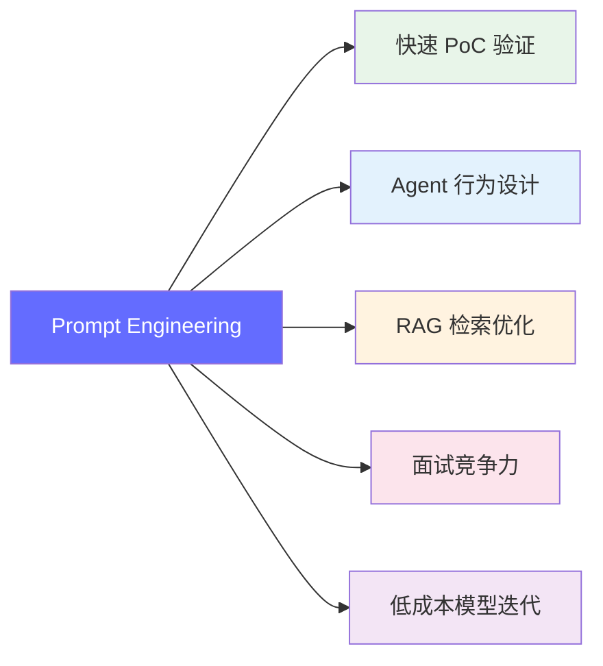
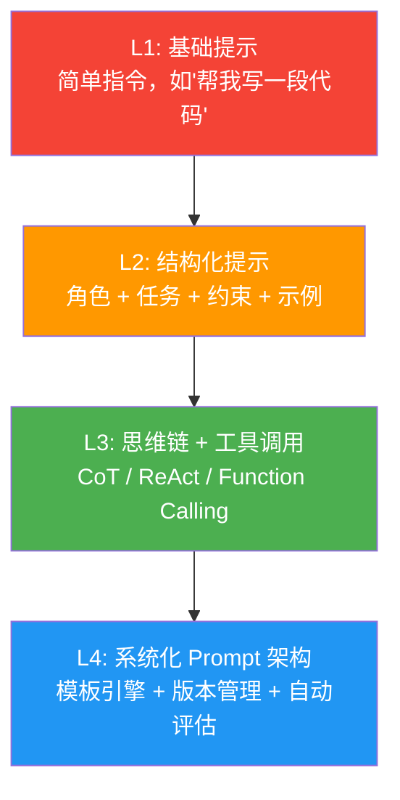
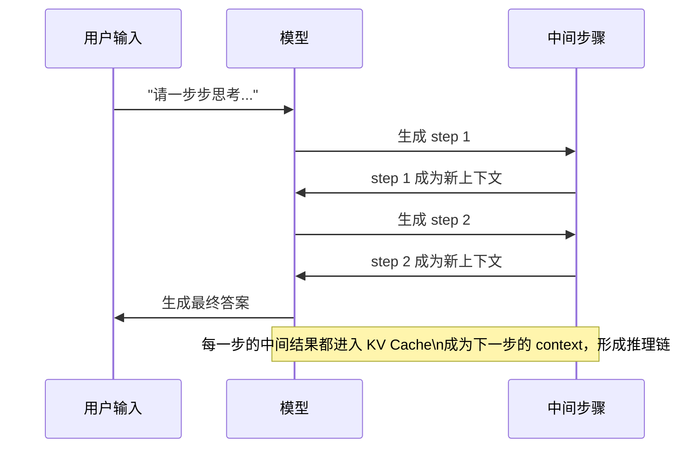
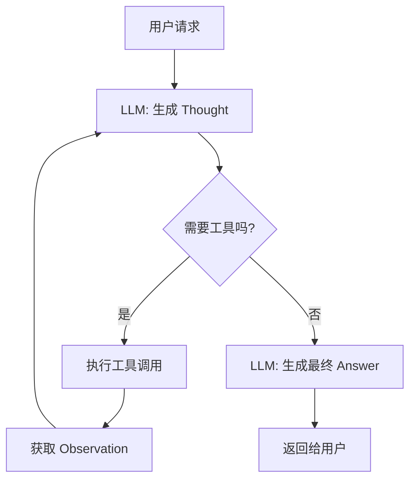
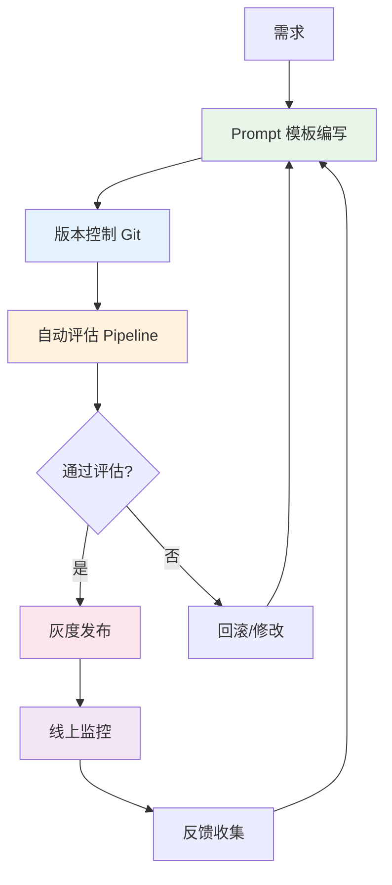
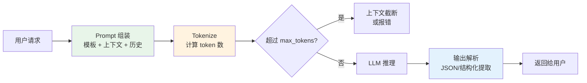

# 提示词工程 — 掌握 AI 时代的"代码"

> Prompt Engineering 不是"写几句话"，而是用结构化、可测试、可迭代的方式与大模型交互——它就是 AI 时代的编程范式。

---

## 前置知识

- [什么是 FDE](../01-ai-basics/01-what-is-fde.md)
- [Transformer 架构](../02-model-architecture/transformer-overview.md)

---

## 为什么 FDE 需要掌握提示词工程

FDE 不只是部署模型，还需要：

1. **用 Prompt 做快速 PoC**——验证新模型能力，不需要训练
2. **设计 Agent 的 System Prompt**——决定 Agent 的行为边界
3. **优化 RAG 的检索 Prompt**——影响检索质量和回答准确度
4. **在面试中展现对 LLM 的理解**——知道 Prompt 怎么影响输出



> 一行话：**Prompt 是你不训练模型就能改变它行为的唯一手段。**

---

## 核心概念：Prompt 的本质

### Prompt 是什么

Prompt 本质上是一段 **自然语言指令**，它通过改变模型的输入上下文来引导输出行为。

从 Transformer 的角度看：

```
输入: [system tokens] + [instruction tokens] + [context tokens] + [user tokens]
输出: [generated tokens] ← 每一步都受前面所有 token 的 attention 影响
```

所以 Prompt 的核心原理是：**用精心设计的上下文，让模型的 attention 机制关注到你希望的部分。**

### Prompt 工程的四个层次



| 层次 | 能力 | 典型应用 |
|------|------|---------|
| L1 基础 | 能问对问题 | 日常对话、简单问答 |
| L2 结构化 | 角色设定 + 约束 + Few-shot | 内容生成、代码编写、数据分析 |
| L3 高级 | 思维链 + ReAct + 工具调用 | Agent、复杂推理、多步任务 |
| L4 系统化 | 模板化 + 版本控制 + 自动评估 | 生产环境、A/B 测试、持续优化 |

---

## L1 → L2：结构化提示词

### 结构化 Prompt 框架（RACES）

```
R - Role（角色）: 你是什么身份？
A - Action（任务）: 你要做什么？
C - Context（上下文）: 背景信息是什么？
E - Expectation（期望）: 输出格式和标准是什么？
S - Scope（边界）: 不能做什么？
```

### 实战对比

**差的 Prompt：**

```
帮我写一个 Python 的 HTTP 服务器
```

**好的 Prompt（RACES 框架）：**

```
你是一名资深 Python 后端工程师（Role）

请实现一个支持以下功能的 HTTP 服务器（Action）：
- 处理 GET/POST 请求
- 支持静态文件服务
- 有简单的请求日志
- 使用 asyncio 实现异步处理

背景：这是一个教学项目，代码需要简洁易读（Context）

要求：
- 代码不超过 150 行
- 每个函数有类型注解和简短注释
- 不需要第三方依赖，只用标准库（Expectation）

注意：不要实现 TLS、认证或数据库功能（Scope）
```

### Few-shot 示例的作用

Few-shot 通过提供输入输出示例，让模型学习任务的格式和风格：

```
请将以下自然语言需求转化为技术任务。

需求: "我想查一下昨天北京的温度"
输出: {
  "tool": "weather_query",
  "params": {"city": "北京", "date": "昨天"}
}

需求: "帮我预约明天下午3点的会议"
输出: {
  "tool": "calendar_create",
  "params": {"title": "会议", "date": "明天", "time": "15:00"}
}

需求: "查一下上海后天会不会下雨"
输出:
```

Few-shot 的本质是 **利用模型的 in-context learning 能力**——模型不需要训练，仅通过几个示例就能学会任务格式。

---

## L3：高级提示词技术

### 思维链（Chain of Thought, CoT）

```
问题: 一个农场有鸡和兔子共 35 个头、94 只脚。鸡和兔子各多少只？

请一步步思考：
1. 设鸡有 x 只，兔子有 y 只
2. 根据头的数量：x + y = 35
3. 根据脚的数量：2x + 4y = 94
4. 从方程 2 得：x = 35 - y
5. 代入方程 3：2(35 - y) + 4y = 94
6. 展开：70 - 2y + 4y = 94
7. 简化：2y = 24
8. 解得：y = 12（兔子），x = 23（鸡）

答案：鸡 23 只，兔子 12 只
```

**为什么 CoT 有效？**

从 Transformer 推理角度看：



关键洞察：**CoT 不是让模型"想得更久"，而是把复杂的单步推理拆解成多步简单推理，每一步都有前面步骤的 KV Cache 作为上下文。**

### ReAct（Reasoning + Acting）

ReAct = 推理（Reason） + 行动（Act）的交替循环：

```
用户: "Python 3.12 相比 3.11 性能提升了多少？"

Thought: 我需要搜索 Python 3.12 的性能数据
Action: search("Python 3.12 vs 3.11 performance improvement benchmark")
Observation: 根据 speed.python.org，3.12 比 3.11 快约 5-25%，取决于场景

Thought: 这个数据不够具体，我需要更详细的 benchmark
Action: search("Python 3.12 pyperformance benchmark results")
Observation: pyperformance 显示平均提升 12%，其中 f-string 提升最大（30%+）

Thought: 现在我有足够的数据来回答了
Answer: Python 3.12 相比 3.11 平均性能提升约 12%...
```

**ReAct 的部署视角：**



### Function Calling / Tool Use

Function Calling 让模型输出结构化的工具调用请求：

```python
# OpenAI API 格式的工具调用
tools = [
    {
        "type": "function",
        "function": {
            "name": "get_weather",
            "description": "获取指定城市的天气信息",
            "parameters": {
                "type": "object",
                "properties": {
                    "city": {"type": "string", "description": "城市名称"},
                    "date": {"type": "string", "description": "日期，格式 YYYY-MM-DD"}
                },
                "required": ["city"]
            }
        }
    }
]

# 模型返回的是结构化的 JSON，不是自然语言
response = client.chat.completions.create(
    model="gpt-4o",
    messages=[{"role": "user", "content": "北京明天天气怎么样？"}],
    tools=tools
)

# 模型输出:
# {
#   "tool_calls": [{
#     "function": {
#       "name": "get_weather",
#       "arguments": '{"city": "北京", "date": "2026-05-19"}'
#     }
#   }]
# }
```

### Zero-shot CoT

不需要示例，只加一句话触发思维链：

```
问题: 如果一列火车以 120km/h 的速度行驶，它需要多长时间才能行驶 300km？

Let's think step by step.
```

这行简单的英文触发语（"Let's think step by step"）来自 Kojima et al. (2022) 的论文，发现它能让大模型自动展开推理步骤。

---

## L4：系统化 Prompt 架构

### 生产环境的 Prompt 管理体系



### Prompt 模板引擎

```python
from string import Template

# 模板文件：prompts/rag_answer.yaml
template = """
你是专业的知识问答助手。

## 上下文信息
以下是从知识库中检索到的相关信息：
{context}

## 用户问题
{question}

## 回答要求
1. 仅基于上下文信息回答，不要使用外部知识
2. 如果上下文中没有足够信息，请说"根据现有信息无法回答"
3. 回答要简洁明了，不超过 200 字
4. 引用上下文中的关键数据或观点时，标注来源编号 [1]、[2] 等
"""

# 渲染模板
def render_prompt(template: str, **kwargs) -> str:
    return Template(template).safe_substitute(**kwargs)

# 使用
prompt = render_prompt(
    template,
    context="根据研究[1]，GPT-4 的 MMLU 得分为 86.4%...",
    question="GPT-4 的 MMLU 得分是多少？"
)
```

### Prompt 版本管理

```yaml
# prompts/rag_answer/v2.3.yaml
version: 2.3
created: 2026-05-18
author: team
description: "优化了引用标注要求，增加了字数限制"

template: |
  你是专业的知识问答助手。
  ...

changelog:
  - v2.3: 增加引用标注格式要求
  - v2.2: 增加"无法回答"的兜底策略
  - v2.1: 优化上下文格式
  - v2.0: 重写为结构化模板
  - v1.0: 初始版本

eval_results:
  accuracy: 0.87
  relevance: 0.92
  hallucination_rate: 0.03
```

### Prompt A/B 测试

```python
# 对比两个 Prompt 版本的输出质量
prompt_v1 = "请简要介绍 Transformer 架构"
prompt_v2 = """你是一名 AI 讲师，请用以下结构介绍 Transformer：
1. 它解决了什么问题
2. 核心创新点（Attention 机制）
3. 相比 RNN 的优势
4. 在 LLM 中的地位
每部分不超过 100 字。"""

# 用同样的测试集评估两个版本
test_cases = [
    {"question": "Transformer 是什么？", "expected_keywords": ["attention", "并行", "encoder-decoder"]},
    {"question": "为什么 Transformer 比 RNN 好？", "expected_keywords": ["并行计算", "长距离依赖", "梯度"]},
]
```

---

## 常见 Prompt 模式和反模式

### ✅ 最佳实践

| 模式 | 说明 | 示例 |
|------|------|------|
| **角色设定** | 给模型一个专业身份 | "你是一名资深系统架构师..." |
| **分步指令** | 复杂任务拆成小步骤 | "第一步...第二步..." |
| **格式约束** | 指定输出的具体格式 | "用 JSON 格式输出，包含 key: ..." |
| **Few-shot** | 给 1-3 个输入输出示例 | 见上方 few-shot 示例 |
| **负向约束** | 明确告诉模型不要做什么 | "不要编造数据，不要超过 200 字" |
| **思维链** | 要求分步推理 | "请一步步思考..." |
| **自我纠错** | 让模型检查自己的输出 | "检查你的答案是否有逻辑错误..." |

### ❌ 常见反模式

| 反模式 | 问题 | 改进 |
|--------|------|------|
| 模糊指令 | "帮我写点东西" | 指定主题、风格、长度 |
| 一次性塞太多 | 一个 prompt 包含 10 个任务 | 拆成多个独立 prompt |
| 假设模型知道上下文 | "继续"、"和上面一样" | 每次都提供完整上下文 |
| 忽略温度参数 | 所有场景用同样的 temperature | 事实问答用 0，创意用 0.7+ |
| 不处理幻觉 | 默认模型输出一定正确 | 加"如果不确定请说明" |

---

## 部署视角

### Prompt 在推理服务中的位置



### Prompt 的 token 成本

```
一个典型的 RAG Prompt 结构：
System Prompt:          ~100 tokens
任务指令:                ~50 tokens
检索到的上下文 (5 段):   ~2000 tokens
用户问题:                ~50 tokens
格式约束:                ~80 tokens
─────────────────────────────────
总计:                   ~2280 tokens

按 GPT-4o 价格 $2.50/1M input tokens:
单次请求成本 ≈ $0.0057
月 100 万次请求 ≈ $5,700
```

> 优化思路：精简 system prompt、控制上下文长度、使用更小的模型——**Prompt 优化直接等于成本优化。**

### Temperature 和 Top-p 的选择

| 场景 | Temperature | Top-p | 说明 |
|------|------------|-------|------|
| 代码生成 | 0.0-0.2 | 0.9 | 需要确定性输出 |
| 事实问答 | 0.0-0.3 | 0.9 | 减少幻觉 |
| 内容创作 | 0.7-0.9 | 0.95 | 需要多样性 |
| 翻译 | 0.2-0.4 | 0.9 | 准确为主 |
| 头脑风暴 | 0.8-1.0 | 0.95 | 最大化创意 |

---

## 面试视角

### 常考问题

1. **"你怎么设计一个生产环境的 Prompt？"**

   回答框架：
   - 第一步：明确任务目标和评估标准（准确率、延迟、成本）
   - 第二步：写结构化 Prompt（角色 + 任务 + 约束 + 格式）
   - 第三步：用 Few-shot 示例提升稳定性
   - 第四步：建自动化评估 pipeline（测试集 + 评分规则）
   - 第五步：版本控制 + A/B 测试 + 线上监控

2. **"Prompt Engineering 和微调有什么区别？什么时候用哪个？"**

   | 维度 | Prompt Engineering | 微调（Fine-tuning） |
   |------|-------------------|-------------------|
   | 成本 | 低（改文字） | 高（GPU + 数据） |
   | 效果上限 | 受限于基座模型 | 可超越基座 |
   | 迭代速度 | 分钟级 | 小时/天级 |
   | 适用场景 | 快速验证、通用任务 | 领域专精、特定格式 |

   策略：**先用 Prompt 验证可行性，确认有价值后再考虑微调。**

3. **"怎么减少 LLM 的幻觉（hallucination）？"**

   - 用 Few-shot 提供准确的示例格式
   - 在 Prompt 中加入"如果不确定请明确说明"
   - 结合 RAG：先检索，再生成，限制模型只基于检索到的信息
   - 使用结构化输出（JSON Schema）约束格式
   - 降低 temperature 到 0-0.3
   - 加入自我检查步骤："请检查你的答案是否有矛盾"

4. **"Function Calling 的原理是什么？"**

   - 模型经过训练后，能识别何时需要调用外部工具
   - 输出结构化的 JSON（工具名 + 参数），而不是自然语言
   - 系统执行工具调用，将结果回灌给模型
   - 模型基于工具结果生成最终回答
   - 关键：**工具描述的质量直接影响模型的选择准确性**

---

## 扩展阅读

- [Attention Is All You Need](https://arxiv.org/abs/1706.03762) — Transformer 原始论文
- [Chain of Thought Prompting](https://arxiv.org/abs/2201.11903) — Kojima et al., 2022
- [ReAct: Synergizing Reasoning and Acting](https://arxiv.org/abs/2210.03629) — Yao et al., 2022
- [OpenAI Prompt Engineering Guide](https://platform.openai.com/docs/guides/prompt-engineering)
- [Anthropic Prompt Engineering Guide](https://docs.anthropic.com/en/docs/build-with-claude/prompt-engineering/)

---

*下一步：[RAG 原理及应用](./rag-principles.md)*
