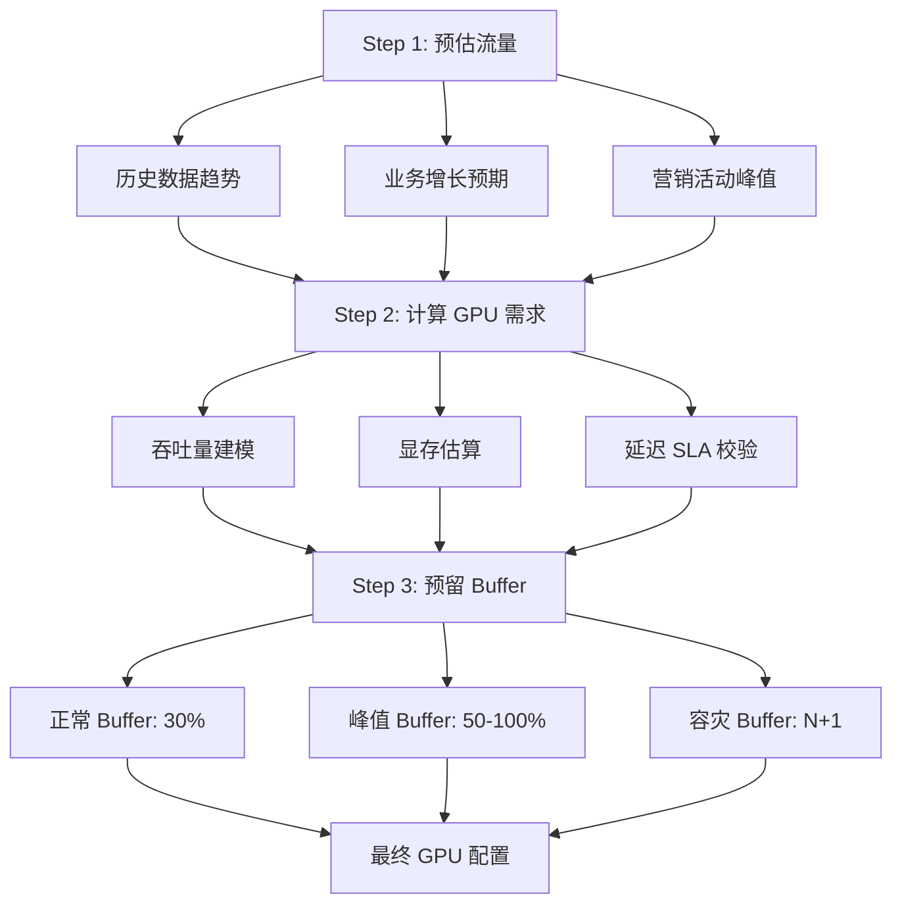
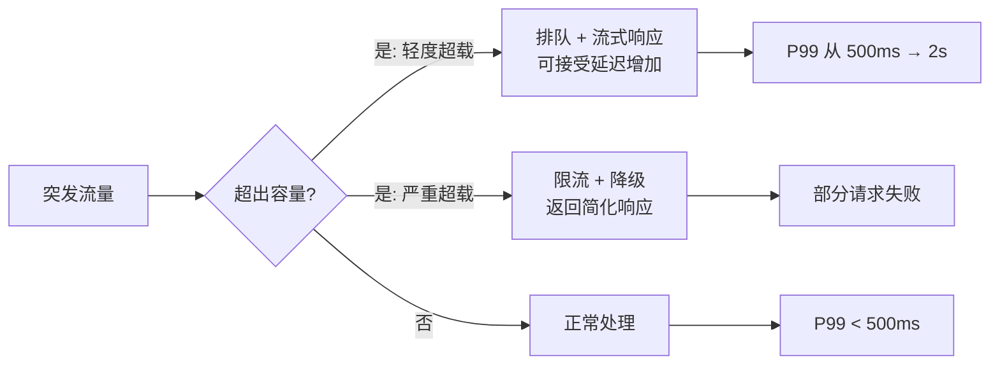
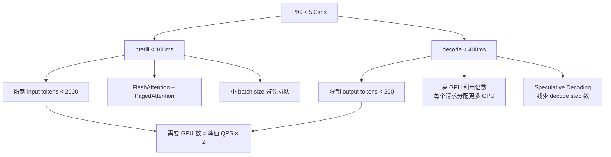

# 容量规划

> 根据 QPS 预估、GPU 吞吐建模和 SLA 要求，精确计算需要多少 GPU 以及何时扩容。

## 核心概念：容量规划三步法



## Step 1：QPS 预估

### 流量建模

| 来源 | 方法 | 精度 |
|------|------|------|
| 历史数据 | 分析过去 30 天的 QPS 曲线 | 高（有数据时） |
| 产品规划 | 新功能/用户增长预期 | 中 |
| 类比推断 | 类似产品的历史数据 | 中 |

**典型日流量曲线（SaaS 产品）：**

```
QPS
600 |         ████████
500 |    ██████████████
400 |   ████████████████
300 |  ██████████████████
200 | ████████████████████
100 |███                 ███
  0 +─────────────────────────
     00  04  08  12  16  20 (时)
```

**关键指标：**

- 日均 QPS：250
- 峰值 QPS（P99）：600（2.4 倍均值）
- 平均请求长度：50 tokens input + 200 tokens output
- 峰值请求长度：200 tokens input + 1000 tokens output

## Step 2：吞吐量建模

### 单 GPU 吞吐计算

```
单 GPU 总吞吐 = 理论峰值吞吐 × 利用率系数 × batch_size

其中：
  理论峰值吞吐：H100 FP16 decode ~1000 tokens/s（单请求）
  利用率系数：Continuous Batching 下 ~0.7-0.85
  batch_size：并发请求数（4-32，取决于模型大小）
```

**不同模型规模的吞吐估算（H100 单卡）：**

| 模型 | batch=1 | batch=8 | batch=16 | batch=32 |
|------|---------|---------|----------|----------|
| 7B | 800 tok/s | 3,500 tok/s | 5,500 tok/s | 7,000 tok/s |
| 13B | 400 tok/s | 1,800 tok/s | 2,800 tok/s | 3,500 tok/s |
| 70B | 80 tok/s | 350 tok/s | 550 tok/s | 700 tok/s |
| 175B | 35 tok/s | 150 tok/s | 220 tok/s | 280 tok/s |

> 注意：decode 阶段（逐 token 生成）是 compute-bound，prefill 阶段是 memory-bound。实际生产中以 decode 吞吐为主。

### 总吞吐计算

```
集群总吞吐 = 单卡吞吐 × GPU 数量 × 集群效率

集群效率：
  单卡部署：100%
  多卡 TP：90-95%（NCCL 通信开销 5-10%）
  多节点 TP：80-90%（跨节点通信开销 10-20%）
```

### 计算 GPU 数量

```
所需 GPU = ceil(峰值 QPS × 平均输出 tokens × decode 延迟 / 单 GPU 每秒 token 吞吐)
```

**示例：峰值 600 QPS，平均 200 tokens 输出**

| 模型 | 单卡 decode 吞吐 | 需要 GPU | TP 配置 | 总 GPU（含 N+1） |
|------|---------------|---------|--------|--------------|
| 7B | 3,500 tok/s (batch=8) | ceil(600 × 200 / 3500) = 35 | 1 | 36 |
| 7B | 5,500 tok/s (batch=16) | ceil(600 × 200 / 5500) = 22 | 1 | 23 |
| 70B | 350 tok/s (batch=8) | ceil(600 × 200 / 350) = 343 | 2 | 344 |
| 70B | 550 tok/s (batch=16) | ceil(600 × 200 / 550) = 219 | 2 | 220 |

> 70B 模型需要 220+ GPU，而 7B 只需 23 GPU → **模型选择是容量的第一决定因素**。

## Step 3：预留 Buffer

### Buffer 类型

| Buffer 类型 | 比例 | 用途 |
|-----------|------|------|
| 正常 Buffer | +30% | 应对日常波动、单卡故障 |
| 峰值 Buffer | +50-100% | 应对突发流量（需弹性方案） |
| 容灾 Buffer | N+1 | 任意一台机器故障不影响服务 |

### 实例组合策略

```
总 GPU = 基础负载 (60%) + 弹性按需 (25%) + 弹性 Spot (15%)

示例：需要 100 GPU
  - 基础：60 张预留实例（月费打 4 折）
  - 弹性：25 张按需实例（随时启停）
  - Spot：15 张 Spot 实例（成本最低的弹性）
```

## 峰值流量处理

### 突发流量 vs 平均流量



### 应对策略矩阵

| 超出比例 | 策略 | 用户体验影响 |
|---------|------|-----------|
| < 20% | 排队 + 流式输出 | 延迟从 500ms → 1s，可接受 |
| 20-50% | 快速弹性扩容（按需实例） | 冷启动 30-120s，期间延迟升高 |
| > 50% | 限流 + 降级 | 部分请求被拒绝或返回简化结果 |

## 不同 SLA 要求下的容量规划

### P99 < 500ms（严格 SLA）



- **GPU 超配比**：按峰值 QPS 的 2 倍部署（确保低延迟时 GPU 不排队）
- **Batch Size**：限制在 4-8（低延迟优先于吞吐）
- **冗余**：N+2 容灾

### P99 < 2s（宽松 SLA）

- **GPU 部署**：按平均 QPS 的 1.5 倍 + Spot 弹性
- **Batch Size**：16-32（最大化吞吐）
- **排队机制**：允许排队，用流式输出改善感知延迟
- **冗余**：N+1 容灾

### SLA 对比

| 指标 | 严格 (P99 < 500ms) | 宽松 (P99 < 2s) |
|------|-------------------|---------------|
| GPU 超配比 | 2.0x | 1.3-1.5x |
| Batch Size | 4-8 | 16-32 |
| GPU 利用率 | 40-50%（低效但低延迟） | 70-85%（高效） |
| 成本差异 | 基准 | 省 40-50% |

## 部署视角

### 容量规划工具

| 工具 | 用途 |
|------|------|
| vLLM benchmark | 实测不同 batch/model 的吞吐和延迟 |
| Locust / k6 | 压测端到端 QPS 和延迟分布 |
| GPU 监控 (DCGM) | 实时监控 GPU 利用率、显存、温度 |
| Prometheus + Grafana | 可视化 QPS、延迟、GPU 使用率趋势 |

### 自动扩缩容配置

```yaml
# Kubernetes HPA 示例（基于自定义 metrics）
apiVersion: autoscaling/v2
kind: HorizontalPodAutoscaler
spec:
  minReplicas: 4
  maxReplicas: 20
  metrics:
    - type: Pods
      pods:
        metric:
          name: gpu_utilization_percent
        target:
          type: Utilization
          averageUtilization: 70
```

## 面试视角

**面试官可能问：**

1. **"峰值 1000 QPS，每个请求平均 100 output tokens，70B 模型需要多少 H100？"**
   - 单 H100 decode 吞吐（70B, batch=8）：~350 tokens/s
   - 总需求：1000 × 100 = 100,000 tokens/s
   - 需要 GPU：100,000 / 350 = ~286 卡
   - TP=2 每模型实例：286 / 2 = 143 个模型实例
   - 考虑利用率（70%）+ N+1：143 / 0.7 + 1 ≈ 205 个实例 → 410 张 H100

2. **"P99 延迟超标怎么排查？"**
   - 先看 TTFT（Time to First Token）：prefill 是否过慢
   - 再看 TPOT（Time Per Output Token）：decode 是否受 KV Cache 或 batch 影响
   - 检查是否有请求排队（queue time）：GPU 是否过载
   - 区分是模型推理慢还是网络/序列化慢

3. **"容量规划的核心公式是什么？"**
   - GPU 数量 = (峰值 QPS × 平均输出 tokens) / (单 GPU 每秒 token 吞吐 × 利用率)
   - 关键是准确测量"单 GPU 吞吐"（用实际压测，不用理论峰值）

## 最佳实践

1. **先压测再规划**：不要相信理论值，用 vLLM benchmark 实测
2. **按峰值的 1.5x 规划**：留 50% 余量应对增长和异常
3. **分阶段部署**：先上 60% 的容量，根据实际数据再扩容
4. **定期复评**：每季度重新评估 QPS 趋势和 GPU 利用率
5. **关注长尾**：P99 延迟比平均延迟更能反映用户体验
6. **弹性优先**：与其一次性买够所有 GPU，不如预留 + Spot 组合

---

*下一节：[自建 vs 云](./self-hosted-vs-cloud.md)*
