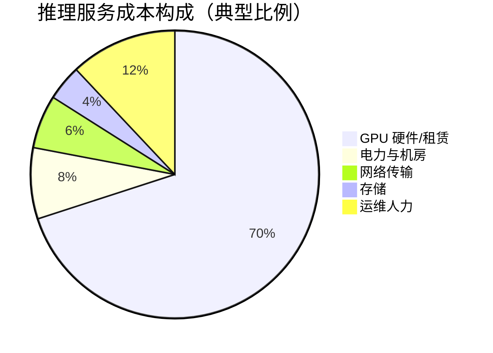
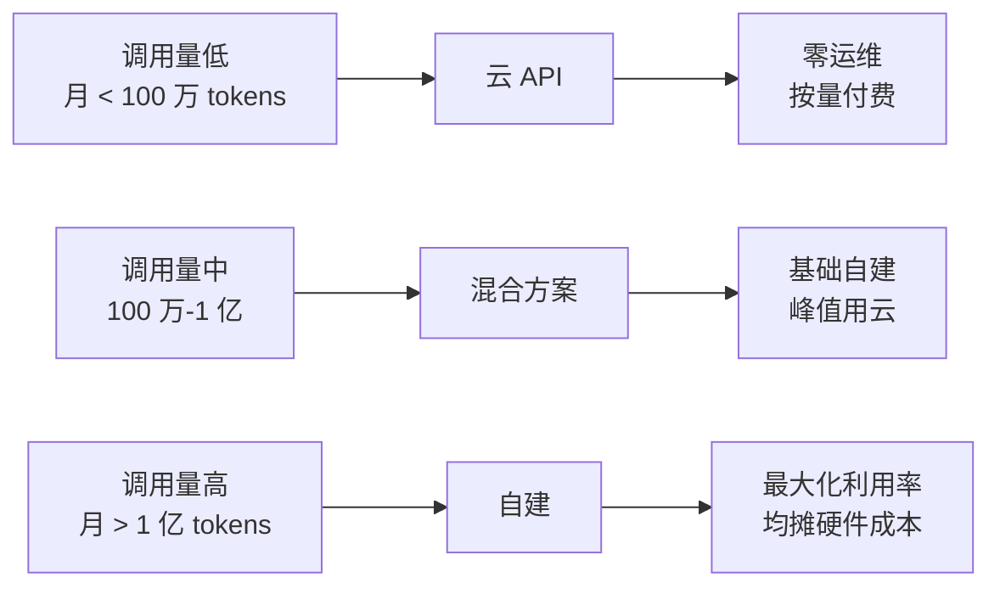

# 成本拆解

> LLM 推理服务中 GPU 成本占 60-80%，理解成本构成是优化和定价的前提。

## 核心概念：LLM 推理成本构成

推理服务的总成本由多个维度组成，理解每一项的占比才能有针对性优化。



### GPU 成本详解（60-80%）

GPU 成本是推理服务的绝对大头，又可以拆分为三个来源：

**1. GPU 硬件折旧（自建场景）**

| GPU 型号 | FP16 峰值算力 | 购置成本 | 3 年折旧/月 |
|---------|-------------|---------|------------|
| A100 80GB | 312 TFLOPS | $15,000 | ~$417 |
| H100 80GB | 989 TFLOPS | $35,000 | ~$972 |
| H200 141GB | 1979 TFLOPS | $50,000+ | ~$1,389 |
| L40S 48GB | 366 TFLOPS | $12,000 | ~$333 |

**2. GPU 云实例租赁（按需）**

| 云厂商 | 实例类型 | GPU | 按需价格/小时 | Spot 价格/小时 |
|--------|---------|-----|-------------|---------------|
| AWS | p4d.24xlarge | 8×A100 40GB | $32.77 | ~$8.19 |
| AWS | p5.48xlarge | 8×H100 80GB | $98.32 | ~$24.58 |
| GCP | a2-ultragpu-8g | 8×A100 80GB | $31.82 | ~$9.55 |
| GCP | g2-standard-8 | 1×L4 24GB | $1.23 | ~$0.37 |
| Azure | ND96asr_v4 | 8×A100 80GB | $32.00 | ~$9.60 |
| Azure | NDm H100 v5 | 8×H100 80GB | $128.00 | N/A |
| 阿里云 | gn7i | 8×A100 | ¥200/h | ~¥60/h |

**3. 电力与散热**

- H100 满载功耗 ~700W，整机（含 CPU、内存、散热）约 1200W
- 工业电价 $0.08-$0.15/kWh → 每台服务器电力成本约 $70-$130/月
- 数据中心 PUE（Power Usage Effectiveness）约 1.2-1.5，意味着总耗电是 IT 设备的 1.2-1.5 倍

### 其他成本项

| 成本项 | 占比 | 说明 |
|-------|------|------|
| 网络传输 | 5-10% | API 出口带宽、跨区域通信 |
| 存储 | 3-5% | KV Cache（大模型可达数 GB/request）、模型权重（70B 约 140GB FP16） |
| 运维人力 | 10-20% | SRE 值班、模型部署、监控告警处理 |

## 成本计算公式

### 按 Token 计算

```
每 1K token 成本 = GPU 小时费 / (每小时处理的 token 数 / 1000)
```

**示例：H100 上运行 70B 模型（FP16）**

- H100 按需：$98.32/8 = $12.29/卡/小时（8 卡实例）
- 单卡 decode 吞吐：~150 tokens/s（70B 模型，无优化）
- 每小时 token 产出：150 × 3600 = 540,000 tokens
- 每 1K token GPU 成本：$12.29 / 540 = **$0.023**（约 2.3 美分 / 1K token）

**考虑 Continuous Batching 后（提升 5x 吞吐）：**

- 每小时 token 产出：540,000 × 5 = 2,700,000 tokens
- 每 1K token GPU 成本：$12.29 / 2,700 = **$0.0046**（约 0.5 美分 / 1K token）

### 按请求计算

```
单请求成本 = GPU 小时费用 × 推理时间 ÷ 并发请求数
```

**示例：100 QPS，平均 500 tokens/request，推理延迟 0.5s**

- 并发数 = QPS × 推理时间 = 100 × 0.5 = 50
- 单请求成本 = $12.29 × 0.5 / 50 = **$0.123/请求**（仅 GPU）
- 优化后（推理 0.1s）：$12.29 × 0.1 / 50 = **$0.025/请求**

## 70B 模型推理成本详细拆解

### 按精度对比

| 精度 | GPU 需求（70B） | 单卡吞吐 (tokens/s) | 每 1K token GPU 成本 |
|------|---------------|-------------------|-------------------|
| FP32 | 4×H100 (TP=4) | ~60 | $0.15 |
| FP16 | 2×H100 (TP=2) | ~150 | $0.06 |
| INT8 | 1×H100 | ~300 | $0.03 |
| INT4 | 1×H100 | ~500 | $0.02 |
| FP8 | 1×H100 | ~400 | $0.025 |

> 70B 模型权重体积：FP16 约 140GB，INT8 约 70GB，INT4 约 35GB，FP8 约 70GB。

### 按云厂商对比（月处理 1 亿 tokens）

| 方案 | GPU 配置 | 月费（按需） | 月费（Spot） |
|------|---------|-----------|------------|
| AWS p5 (8×H100) 按需 | 1 台 | $71,000 | $17,750 |
| GCP a2 (8×A100) 按需 | 1 台 | $23,000 | $6,900 |
| Azure ND96 (8×A100) 按需 | 1 台 | $23,000 | $6,900 |
| 阿里云 gn7i (8×A100) 按需 | 1 台 | ~¥145,000 (~$20,000) | ~¥43,000 |
| 云 API (OpenAI GPT-4) | - | $250,000+ | - |

> 自建 1 台 H100 服务器月折旧约 $1,000-1,500，远低于云实例月费。

## 自建 vs 云租赁成本对比



| 维度 | 自建 GPU 服务器 | 云 GPU 实例 | 云 Serverless API |
|------|---------------|------------|-----------------|
| 单 token 成本 | 最低（量越大越省） | 中等（Spot 可降 70%） | 最高（含厂商利润） |
| 启动成本 | $35,000+（单台 H100） | $0 | $0 |
| 达到盈亏平衡 | 月 > 5000 万 tokens | 随时可用 | 随时可用 |
| 弹性能力 | 差（物理限制） | 好（分钟级扩缩） | 极好（自动） |
| 运维负担 | 高（硬件 + 软件） | 中（仅软件） | 低 |
| 数据安全 | 完全可控 | 可控 | 不可控 |

## 部署视角

### 成本监控

- 部署 GPU 利用率监控（nvidia-smi + Prometheus），利用率低于 40% 意味着资源浪费
- 设置单 token 成本报警线（如超过 $0.05/1K tokens 触发调查）
- 跟踪 Spot 实例中断率（一般 1-5%），准备降级策略

### 成本归因

- 按产品线/租户拆分 GPU 使用（通过 request tagging）
- 计算每个 API endpoint 的边际成本
- 建立 token 计费系统，确保收入 > 成本

## 面试视角

**面试官可能问：**

1. **"70B 模型部署需要多少 GPU 内存？"**
   - FP16：70B × 2 bytes = 140GB → 2×H100 80GB（TP=2）
   - INT8：70B × 1 byte = 70GB → 1×H100 80GB（KV Cache 还需额外 ~10GB）
   - INT4：70B × 0.5 bytes = 35GB → 1×H100 80GB（余量充裕）

2. **"OpenAI GPT-4 定价 $0.03/1K tokens 的成本是多少？"**
   - 推测 GPT-4 级模型在优化集群上成本约 $0.005-$0.01/1K tokens
   - 毛利约 65-80%（含基础设施摊销后）

3. **"如何降低单 token 成本？"**
   - 量化（FP16 → INT8 → FP8）
   - 提高吞吐（Continuous Batching、Speculative Decoding）
   - 用 Spot 实例替代按需实例
   - 缓存高频请求

4. **"如果 GPU 利用率只有 30%，说明什么？"**
   - 请求量不足或 batch size 太小，GPU 计算单元大量空闲
   - 优化方向：增大 batch size、合并请求、减少实例数
   - 长期低于 40% 说明自建不划算，应考虑云 API

**完整成本拆解示例（生产环境）：**

```
服务：70B 模型对话 API
月调用量：2 亿 tokens（1.5 亿 input + 5000 万 output）
GPU 配置：4 台 H100 8 卡（按需，$98.32/台/天）

月成本明细：
  GPU 实例费     $11,800（72%）
  存储（模型+KV）  $800   （5%）
  网络出口        $1,200 （7%）
  运维人力        $2,500 （15%）
  其他            $200   （1%）
  ─────────────────────
  总计           $16,500

单 token 成本：$16,500 / 200,000,000 = $0.0000825
单 1K token 成本：$0.0825
毛利率（按 $0.03/1K tokens 定价）：约 45%
```

## 最佳实践

1. **优先优化吞吐而非延迟**：吞吐提升 5x 等于成本降低 5x
2. **按需 + Spot 混合部署**：基础负载用按需/预留，弹性用 Spot
3. **持续跟踪利用率**：GPU 利用率 > 70% 是健康指标
4. **建立成本模型**：上线前估算单 token 成本，上线后持续验证
5. **多厂商比价**：云 GPU 价格波动大，定期重新评估供应商

---

*下一节：[优化策略](./optimization-strategies.md)*
