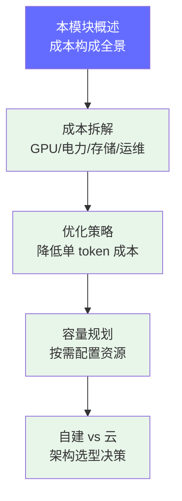

# 成本与运营

> LLM 推理服务中 GPU 成本占 60-80%，理解成本构成是优化和定价的前提。本模块教你拆解成本、制定优化策略、规划容量。

## 前置知识

- [推理引擎概述](../04-inference-optimization/engine-overview.md) — 理解吞吐、延迟、batch size 的概念
- [GPU 基础](../03-gpu-basics/gpu-overview.md) — 理解 GPU 硬件型号和显存模型
- [生产部署架构](../06-production-deployment/deployment-architecture.md) — 理解生产环境的基础设施

## 为什么需要学这个

成本是 FDE 决策的硬约束。选型、架构、量化、扩缩容——每一个技术决策都有成本影响：

- **选型成本**：FP16 还是 INT8？H100 还是 A100？每种选择成本差 2-10 倍
- **运营成本**：GPU 利用率从 30% 提到 70%，等于直接省一半的钱
- **架构成本**：自建、云 API 还是混合？不同规模的最佳方案不同
- **老板关心的问题是**："这个方案贵不贵？有没有更便宜的替代？"

理解成本构成让你能回答这类问题，并用数据支撑技术决策。

## 本模块学习地图



| 顺序 | 文档 | 解决什么问题 | 时长 |
|------|------|-------------|------|
| 1 | [成本拆解](./cost-breakdown.md)（本文档） | GPU/电力/存储/运维各占多少？如何计算单 token 成本？ | 30 分钟 |
| 2 | [优化策略](./optimization-strategies.md) | 量化、吞吐提升、Spot 实例——怎么降本？ | 45 分钟 |
| 3 | [容量规划](./capacity-planning.md) | 1000 QPS 需要多少 GPU？P99 延迟怎么保证？ | 30 分钟 |
| 4 | [自建 vs 云](./self-hosted-vs-cloud.md) | 什么阶段用什么方案？TCO 怎么算？ | 30 分钟 |

## 核心概念速览

### 成本构成

```
推理总成本 = GPU 硬件/租赁（60-80%）+ 电力（5-10%）+ 网络（5-10%）+ 存储（3-5%）+ 运维人力（10-20%）
```

### 单 Token 成本公式

```
每 1K token 成本 = GPU 小时费 / (每小时处理的 token 数 / 1000)
```

示例：H100 上 70B 模型（FP16），单卡 decode 吞吐 150 tokens/s：
- 每 1K token GPU 成本 = $12.29 / 540 = **$0.023**（无优化）
- Continuous Batching 后（5x 吞吐）= **$0.0046**

### 自建 vs 云 vs API 对比

| 维度 | 自建 | 云 GPU | Serverless API |
|------|------|--------|---------------|
| 单 token 成本 | 最低 | 中等 | 最高 |
| 启动成本 | $35,000+ | $0 | $0 |
| 弹性 | 差 | 好 | 极好 |
| 运维 | 高 | 中 | 低 |

### 选型决策树

```
月调用量 < 100 万 tokens → 云 API
月调用量 100 万-1 亿    → 混合方案（基础自建 + 云弹性）
月调用量 > 1 亿         → 自建集群
```

## 面试视角

| 问题 | 回答框架 |
|------|---------|
| "70B 模型部署需要多少 GPU 内存？" | 精度 × 参数量 = 权重体积，加上 KV Cache |
| "如何降低单 token 成本？" | 量化 + 提升吞吐 + Spot + 缓存 |
| "GPU 利用率只有 30% 说明什么？" | 请求量不足或 batch 太小，应增大 batch 或减少实例 |
| "自建 vs API 的盈亏平衡点？" | 月调用量 50M+ tokens 时自建开始省钱 |

## 学完本模块后，你应该能够...

- [ ] 拆解 LLM 推理服务的完整成本构成
- [ ] 计算单 token 成本和盈亏平衡点
- [ ] 设计成本优化方案（量化、吞吐提升、Spot 实例）
- [ ] 根据调用量选择自建/云/API 方案
- [ ] 建立成本监控和归因体系

*上一节：[AI 工程核心技术栈](../08-ai-engineering-tech-stack/index.md) | 下一节：[优化策略](./optimization-strategies.md)*
