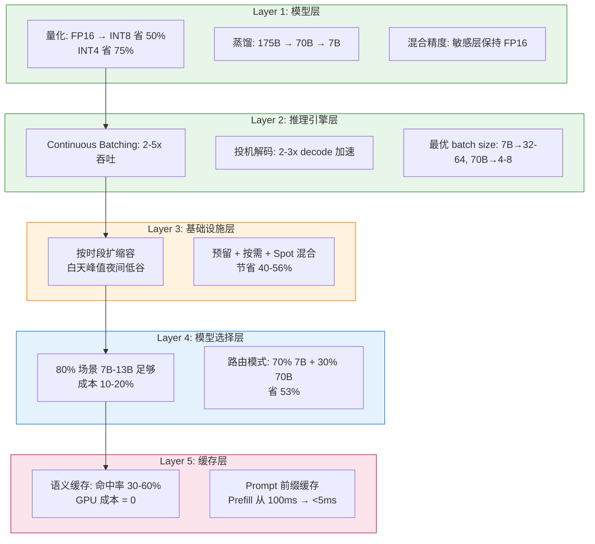
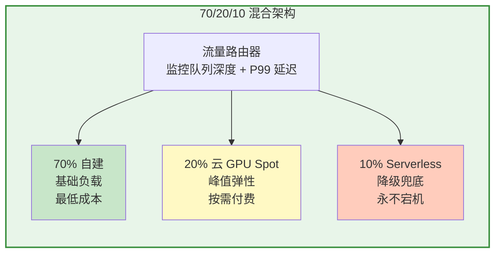
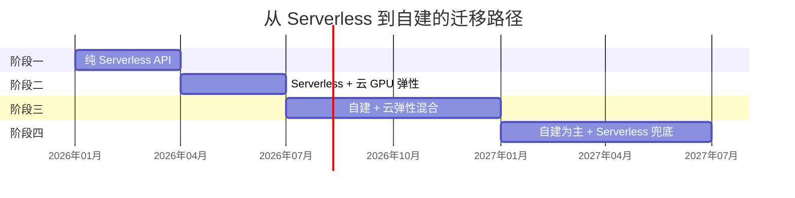
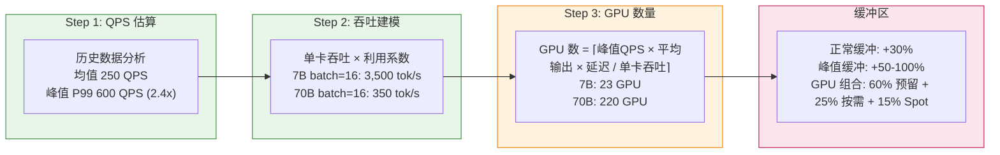
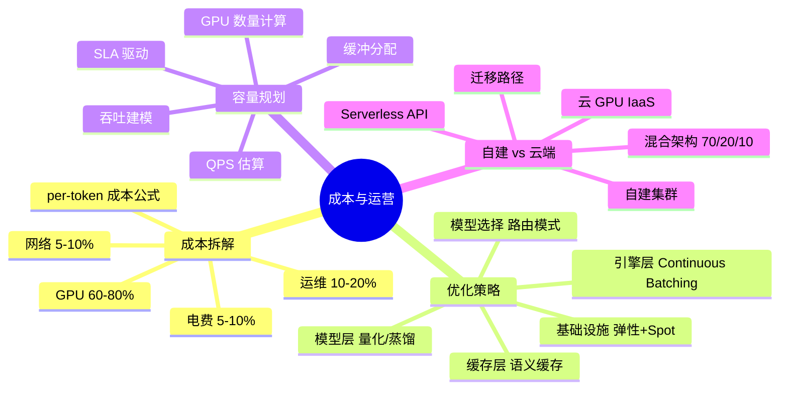

# 成本与运营

> 推理成本是 LLM 商业化的核心瓶颈。理解成本构成、优化策略和容量规划，才能在保证服务质量的同时控制成本。

## 为什么这个模块对 FDE 至关重要

FDE 不是纯粹的工程师，而是**技术决策者**。你需要回答 CEO/CFO 的问题：

- "70B 模型的每 1K token 成本是多少？怎么降到原来的 1/10？"
- "月调用量 5 亿 token，应该自建集群还是用云 API？多久回本？"
- "GPU 利用率只有 30%，是浪费了还是正常的？"
- "未来半年 QPS 预计翻倍，需要采购多少 GPU？"

**推理优化的最终目标不是"跑得快"，而是"在 SLA 约束下跑得最便宜"。**

```mermaid
flowchart TD
    subgraph L1["成本与运营全景"]
        A["成本拆解\nGPU 60-80%\n电费 5-10%\n网络 5-10%\n运维 10-20%"] --> B["优化策略\n五层优化框架\n80-95% 总降幅"]
        B --> C["容量规划\nQPS 估算\nGPU 数量计算\n缓冲分配"]
        C --> D["自建 vs 云端\nTCO 对比\n混合架构"]
    end

    subgraph L2["优化优先级"]
        P1["1. 选对模型尺寸\n30-50% 降幅"]
        P2["2. Continuous Batching\n50-70% 降幅"]
        P3["3. 量化 INT8/FP8\n30-50% 降幅"]
        P4["4. 语义缓存\n5-40% 降幅"]
        P5["5. 自动扩缩 + Spot\n30-50% 降幅"]
    end

    A -. "GPU 占比最高\n所以优化聚焦 GPU" .-> B
    B -. "优化后\nGPU 数量减少" .-> C
    C -. "GPU 数量×单价\n驱动 TCO 决策" .-> D
    P1 --> P2 --> P3 --> P4 --> P5

    style A fill:#e8f5e9,stroke:#388e3c,stroke-width:2px
    style B fill:#fff3e0,stroke:#f57c00,stroke-width:2px
    style C fill:#e3f2fd,stroke:#1976d2,stroke-width:2px
    style D fill:#fce4ec,stroke:#c2185b,stroke-width:2px
    style P1 fill:#c8e6c9
    style P2 fill:#c8e6c9
    style P3 fill:#c8e6c9
    style P4 fill:#fff9c4
    style P5 fill:#fff9c4
```



## 成本拆解全景

```mermaid
flowchart TB
    subgraph CostComponents["推理成本构成"]
        GPU["GPU 硬件/租赁\n60-80%\nA100-80G: $15K-25K/台\nH100-80G: $35K-50K/台"]
        PWR["电力\n5-10%\n单台 8 卡: ~6KW\n月电费 ~$500"]
        NET["网络\n5-10%\n带宽 + IP + CDN"]
        OPS["运维人力\n10-20%\nMLOps + SRE"]
        STO["存储\n3-5%\n模型权重 + 日志"]
    end

    subgraph TokenCost["每 1K token 成本示例"]
        T1["H100 70B FP16\n150 tok/s → $0.023/1K"]
        T2["+ Continuous Batching\n750 tok/s → $0.0046/1K"]
        T3["+ INT8 量化\n1.5x 吞吐 → $0.0031/1K"]
    end

    GPU --> T1
    PWR --> T1
    NET --> T1
    OPS --> T1
    STO --> T1

    T1 -. "5x 吞吐提升"| T2
    T2 -. "1.5x 吞吐提升"| T3

    style CostComponents fill:#e8f5e9,stroke:#388e3c,stroke-width:2px
    style TokenCost fill:#fff3e0,stroke:#f57c00,stroke-width:2px
```

## 五层优化框架



### 优化效果累计

| 优化步骤 | 累计降幅 | 剩余成本 |
|---------|---------|---------|
| 基线 (FP16, 静态 batch) | 0% | 100% |
| 选对模型 (70B→13B for 80% requests) | 30-50% | 50-70% |
| + Continuous Batching | 50-70% | 15-35% |
| + INT8 量化 | 30-50% | 8-25% |
| + 语义缓存 | 5-40% | 5-20% |
| + 自动扩缩 + Spot | 30-50% | **5-20%** |

**综合优化效果：总成本可降低 80-95%。**

## 自建 vs 云端决策框架

```mermaid
flowchart TD
    subgraph Schemes["三种部署方案"]
        S1["Serverless API\nOpenAI / Anthropic / Gemini\n零启动, 零运维\n最高 per-token 成本"]
        S2["云 GPU IaaS\nAWS p5 / GCP A2\n中运维, 好弹性\n中等成本"]
        S3["自建 GPU 集群\n采购 + 托管\n高运维, 低延迟\n最低长期成本"]
    end

    subgraph Decision["决策树"]
        Q1{"月 token 量?"}
        A1["< 100 万\n→ Serverless API"]
        A2["100 万 - 1 亿\n→ 混合方案"]
        A3["> 1 亿\n→ 自建集群"]
    end

    subgraph TCO["3 年 TCO 对比\n70B 模型, 5 亿 token/月"]
        T1["Serverless: $90M (100%)"]
        T2["云 GPU 按需: $20M (20%)"]
        T3["云 GPU 70% Spot: $7.4M (7%)"]
        T4["自建 A100: $4.4M (5%)"]
        T5["自建 H100: $4.8M (7%)"]
        T6["混合方案: $5.6M (6%)"]
    end

    Q1 --> A1
    Q1 --> A2
    Q1 --> A3
    S1 -. "成本对比"| TCO
    S2 -. "成本对比"| TCO
    S3 -. "成本对比"| TCO

    style Schemes fill:#e8f5e9,stroke:#388e3c,stroke-width:2px
    style Decision fill:#fff3e0,stroke:#f57c00,stroke-width:2px
    style TCO fill:#fce4ec,stroke:#c2185b,stroke-width:2px
```

### 混合架构（推荐）



### 迁移路径



## 容量规划三步法



### 不同 SLA 对 GPU 数量的影响

| SLA 要求 | GPU 超额配置 | Batch Size | GPU 利用率 | 冗余 | GPU 数量差异 |
|---------|------------|-----------|-----------|------|-------------|
| 严格 (P99 < 500ms) | 2.0x | 4-8 | 40-50% | N+2 | 基准 |
| 宽松 (P99 < 2s) | 1.3-1.5x | 16-32 | 70-85% | N+1 | **省 40-50%** |

## 学习路径

| 顺序 | 文档 | 核心内容 | 面试考点 |
|------|------|---------|---------|
| 1 | [成本拆解](./cost-breakdown.md) | GPU 成本、推理成本构成、单位 token 成本 | 如何估算 70B 模型的推理成本 |
| 2 | [优化策略](./optimization-strategies.md) | 量化、批处理、模型选择 | 降本增效的最佳实践 |
| 3 | [容量规划](./capacity-planning.md) | 预测未来资源需求 | 如何规划 GPU 采购计划 |
| 4 | [自建 vs 云端](./self-hosted-vs-cloud.md) | 自建集群 vs 云服务商对比 | 什么时候选自建、什么时候选云端 |

## 模块知识结构图



## 前置知识

建议先完成 [动手实验](/09-labs/) 积累实际操作经验。

---

*上一节：[动手实验](/09-labs/)*
*下一节：[成本拆解](./cost-breakdown.md)*
