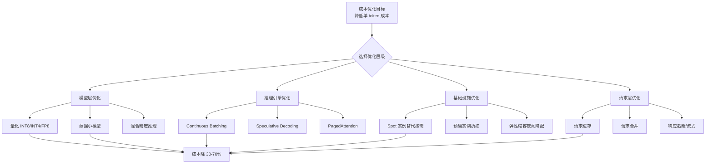
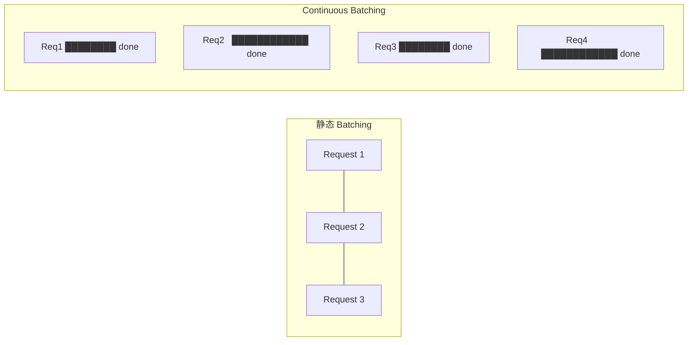
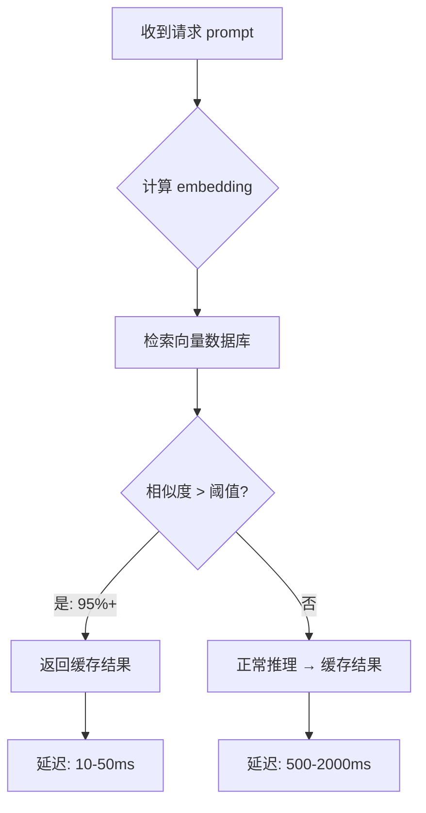
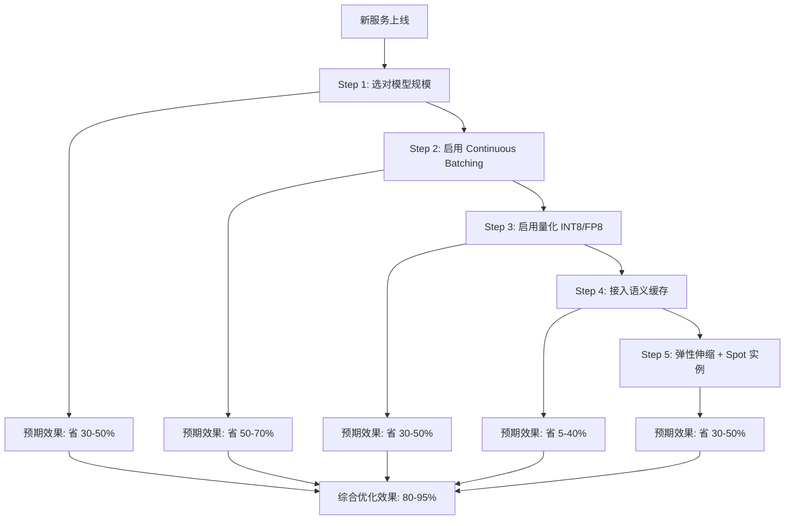

# 成本优化策略

> 通过量化、批处理、弹性伸缩和模型选择，可将 LLM 推理成本降低 50-90%。

## 核心概念：分层优化框架

成本优化不是单一手段，而是多层联动的体系。

## 策略 1：量化降低成本

### 精度对比与成本节省

| 精度 | 位宽 | 模型体积 (70B) | 相对吞吐 | 每 1K token GPU 成本 | 相对节省 |
|------|------|--------------|---------|-------------------|--------|
| FP32 | 32-bit | 280GB | 1.0x (基准) | $0.15 | - |
| FP16/BF16 | 16-bit | 140GB | 1.8-2.0x | $0.08 | ~47% |
| FP8 | 8-bit | 70GB | 2.5-3.0x | $0.05 | ~67% |
| INT8 | 8-bit | 70GB | 2.5-3.0x | $0.05 | ~67% |
| INT4 | 4-bit | 35GB | 3.5-4.0x | $0.04 | ~73% |

**关键洞察：**

- INT8 vs FP16：GPU 成本降低约 40-50%（单卡可放下原本需要 2 卡的模型）
- INT4 vs FP16：GPU 成本降低约 70%，但精度损失 1-3%（取决于任务）
- FP8 的优势（H100+）：硬件原生支持 FP8 Tensor Core，无需反量化步骤，吞吐比 INT8 还高 10-20%

### 量化方案对比

| 方案 | 原理 | 精度损失 | 适合场景 |
|------|------|---------|---------|
| PTQ（训练后量化） | 校准集直接量化 | `<` 1% | 快速上线 |
| QAT（量化感知训练） | 训练中模拟量化噪声 | `<` 0.5% | 精度要求高 |
| AWQ | 激活感知的权重量化 | `<` 0.3% | 4-bit 场景 |
| GPTQ | 逐层贪心量化 | 1-2% | 通用 4-bit |
| GGUF | CPU 友好的量化格式 | 1-3% | 端侧/低资源 |

## 策略 2：批处理优化降低成本

### Continuous Batching 原理

传统的静态 batching 要求一个批次内所有请求同时到达、同时结束，导致 GPU 利用率低下。Continuous Batching（又称 Iteration-Level Batching）允许请求随时加入批次，单个请求完成后立即替换新请求。

**效果量化：**

- 静态 batching：GPU 利用率 ~30-40%
- Continuous Batching：GPU 利用率 ~60-80%
- 吞吐提升：2-5x（取决于请求长度差异）
- 等效成本降低：50-70%

### Batch Size 调优

| 模型规模 | 最优 Batch Size | GPU 利用率 | 说明 |
|---------|---------------|-----------|------|
| 7B | 32-64 | 85%+ | 单卡可跑大批量 |
| 13B | 16-32 | 80%+ | 注意 KV Cache 显存 |
| 70B | 4-8 | 70%+ | 受显存限制，batch 较小 |
| 175B | 2-4 | 60-70% | 多卡 TP，通信开销大 |

> 增大 batch size 提升吞吐（更多 token/s），但也会增加单个请求的排队延迟。需要在吞吐和延迟之间找到平衡点。

## 策略 3：弹性伸缩降低成本

### 按时间模式伸缩

```mermaid
gantt
    title 典型 LLM 服务 24 小时流量模式与实例配置
    dateFormat HH:mm
    axisFormat %H:%m

    section 流量模式
    低峰期 (20 QPS)    :00:00, 6h
    早高峰 (200 QPS)   :06:00, 3h
    白天高峰 (500 QPS)  :09:00, 8h
    晚高峰 (300 QPS)   :17:00, 3h
    低峰期 (20 QPS)    :20:00, 4h

    section GPU 实例
    4 张 GPU（基础）    :00:00, 24h
    额外 4 张（按需）    :06:00, 2h
    额外 12 张（Spot）  :08:00, 9h
    额外 4 张（按需）    :17:00, 2h
```

**节省效果：**

- 全部按需（20 张 GPU × 24h）：$295/天（A100 按需 $1.5/卡/h）
- 基础 4 张 + 弹性 16 张（按实际流量）：$177/天 → 省 **40%**
- 加入 Spot 实例（弹性部分用 70% Spot）：$130/天 → 省 **56%**

### 弹性策略建议

| 组件 | 策略 | 适用场景 |
|------|------|---------|
| 基础负载 | 预留实例（1 年约省 40%） | 稳定的 24/7 流量 |
| 可预测峰值 | 按需实例（定时扩缩） | 工作日早 9 晚 6 |
| 突发峰值 | Spot 实例 + 自动扩缩 | 营销活动期间 |
| 离线批处理 | 纯 Spot 实例 | 数据标注、离线推理 |

## 策略 4：模型选择降低成本

### 模型规模 vs 性价比分析

| 模型 | 参数量 | 场景 | 相对质量 | 单 token 成本 | 性价比 |
|------|-------|------|---------|-------------|-------|
| 7B | 7B | 简单对话、摘要 | 70% | $0.001 | 最优 |
| 13B | 13B | 一般问答、翻译 | 80% | $0.002 | 优秀 |
| 30B | 30B | 复杂推理 | 88% | $0.005 | 中等 |
| 70B | 70B | 深度推理、代码 | 95% | $0.01 | 较高 |
| 175B | 175B | 顶级推理 | 100% | $0.025 | 低（除非必需） |

**选择建议：**

- 80% 的场景用 7B-13B 即可满足，成本仅 10-20%
- 路由策略：先用小模型处理，不满足再升级到大模型（Router 模式）
- 成本对比：全量 70B 处理 1M tokens = $10；Router 模式（70% 用 7B + 30% 用 70B）= $1.7 + $3 = $4.7 → 省 **53%**

## 策略 5：请求合并和缓存

### 语义缓存（Semantic Caching）

对于重复或高度相似的 prompt，直接返回缓存结果，跳过推理。

**效果量化：**

- 客服场景：缓存命中率可达 30-60%（FAQ 类问题高度重复）
- 搜索场景：缓存命中率 10-20%
- 通用对话：缓存命中率 5-10%
- 缓存命中 = 零 GPU 消耗，成本降为 0

### Prompt 前缀缓存

- vLLM 支持自动缓存 common prefix（如 system prompt）
- 效果：system prompt 500 tokens 的 prefill 从 100ms 降到 `<` 5ms
- 多租户场景效果更明显（相同 system prompt 复用）

## 部署视角

### 优化策略优先级

### 监控指标

| 指标 | 健康范围 | 工具 |
|------|---------|------|
| GPU 利用率 | > 70% | nvidia-smi + Prometheus |
| 单 token 成本 | < 目标值 | 自定义埋点 |
| 缓存命中率 | > 20% | 请求日志分析 |
| Spot 中断率 | < 5% | 云平台监控 |
| 平均 Batch Size | > 8 | vLLM metrics |

## 面试视角

**面试官可能问：**

1. **"如何在不损失质量的前提下降低成本？"**
   - 量化（INT8 精度损失 < 1%，成本降 40%+）
   - Continuous Batching（无质量损失，吞吐提升 2-5x）
   - Prompt 缓存（无损失，零成本返回）

2. **"什么时候用 INT4 量化？"**
   - 延迟敏感、成本敏感、质量容忍度高的场景
   - 不适合数学推理、代码生成等精度要求高的任务
   - AWQ/GPTQ 在 70B 上的精度损失约 1-2%，通常可接受

3. **"弹性伸缩和 Spot 实例有什么风险？"**
   - Spot 实例可能被随时回收（中断率 1-5%），需要有回退策略
   - 弹性扩缩有冷启动延迟（加载模型到 GPU 需 30-120s）
   - 建议：基础负载用按需/预留，峰值用 Spot + 排队/限流降级

## 最佳实践

1. **从大到小优化**：先选对模型规模（省 50%），再做工程优化（省 30%），最后精细化（省 10%）
2. **量化先行**：部署前就做好 PTQ 量化，比上线后再做简单 10 倍
3. **缓存优先**：识别高频 prompt 模式，语义缓存是性价比最高的优化
4. **混合计费**：基础用预留实例 + 峰值 Spot + 极端峰值按需
5. **持续测量**：没有监控就没有优化，建立单 token 成本的 dashboard

---

*下一节：[容量规划](./capacity-planning.md)*
