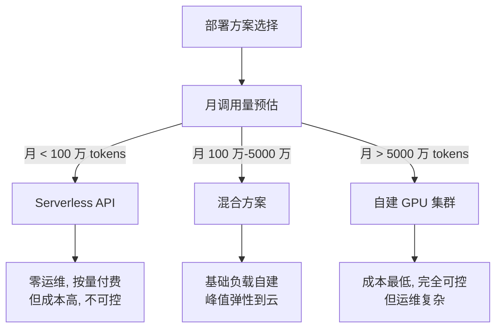
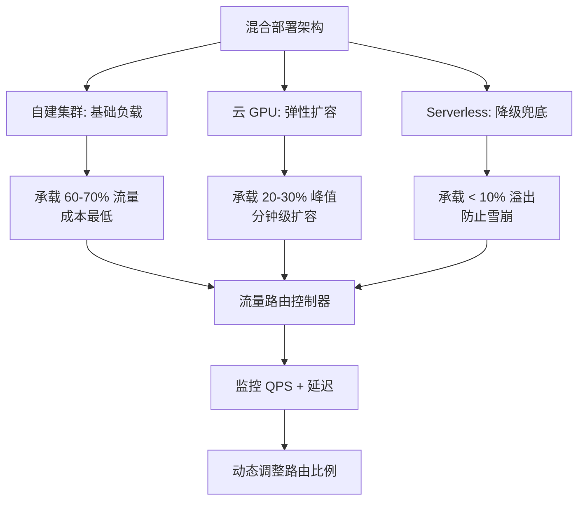
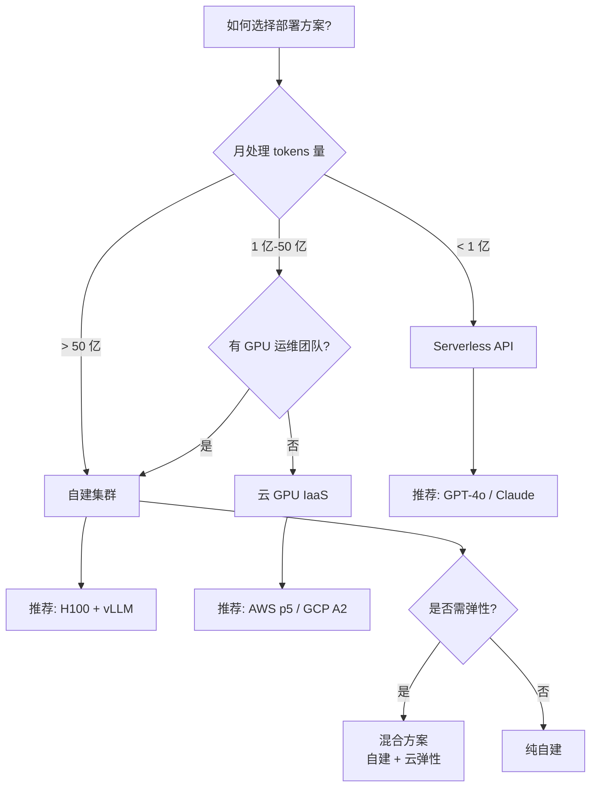

# 自建 vs 云 API

> 三种部署方案（自建 GPU 集群 / 云 GPU 实例 / Serverless API）各有优劣，核心在于找到成本和灵活性的最优平衡。

## 核心概念：三种方案全景对比



## 方案 1：Serverless API

**代表服务：** OpenAI API、Anthropic Claude API、Google Gemini API

| 维度 | 说明 |
|------|------|
| 单价 | GPT-4: $0.03/1K input + $0.06/1K output\nGPT-4o: $0.005/1K input + $0.015/1K output\nClaude Sonnet: $0.003/1K input + $0.015/1K output |
| 启动成本 | $0 |
| 运维 | 零运维 |
| 弹性 | 自动，无限制 |
| 数据安全 | 数据发送到第三方（合规风险） |
| 延迟 | 网络往返 + 排队，P99 通常 1-5s |
| 可控性 | 无（不能选模型版本、不能调参） |

**适合场景：**

- PoC / MVP 阶段快速验证
- 月调用量 < 100 万 tokens（成本可控）
- 非核心业务、非实时场景
- 初创团队（无 GPU 运维能力）

## 方案 2：云 GPU 实例（IaaS）

**代表服务：** AWS EC2 p5、GCP A2、Azure NDm H100 v5

| 维度 | 说明 |
|------|------|
| GPU 月费 | H100 8 卡: $7,500-$10,000/月（按需）\nA100 8 卡: $2,300-$3,200/月（按需） |
| 启动时间 | 分钟级（Spot 可能需排队申请） |
| 运维 | 中等（需管理 GPU 驱动、推理框架、容器编排） |
| 弹性 | 好（可按需扩缩，Spot 节省 70%） |
| 数据安全 | 可控（数据在云厂商内不出域） |

**适合场景：**

- 月调用量 100 万 - 5000 万 tokens
- 需要数据合规（金融、医疗）
- 需要定制化推理框架

## 方案 3：自建 GPU 集群

**代表方案：** 购买 GPU 服务器托管在 IDC / 云专线

| 维度 | 说明 |
|------|------|
| 硬件成本 | H100 8 卡服务器: $35,000-$50,000/台\nA100 8 卡服务器: $15,000-$25,000/台 |
| 机房托管 | $500-$1,500/月/台（含电力） |
| 运维 | 高（硬件故障处理、驱动更新、网络运维） |
| 弹性 | 差（采购周期 4-12 周） |
| 数据安全 | 完全可控 |
| 网络 | 可专线直连，延迟低 |

**适合场景：**

- 月调用量 > 5000 万 tokens
- 有 GPU 运维团队
- 对数据安全和延迟有严格要求

## TCO 分析（3 年总拥有成本）

### 场景设定

- 70B 模型，持续稳定负载
- 平均 1000 QPS
- 月处理 5 亿 tokens（~5B tokens）

### 3 年 TCO 对比

```mermaid
bar
    title 3 年 TCO 对比（百万美元）
    "Serverless API" : 90.00
    "云 GPU (按需)" : 18.00
    "云 GPU (70% Spot)" : 6.50
    "自建 (A100)" : 4.50
    "自建 (H100)" : 6.00
    "混合方案" : 5.00
```

**详细拆解：**

| 方案 | 计算成本 | 运维人力 | 其他 | 3 年总计 |
|------|---------|---------|------|--------|
| Serverless (GPT-4) | $90M | $0 | $0 | **$90M** |
| 云 GPU 按需 (H100) | $18M | $1.5M | $0.5M | **$20M** |
| 云 GPU 70% Spot | $5.4M | $1.5M | $0.5M | **$7.4M** |
| 自建 A100 (6 台) | $1.2M | $2.4M | $0.8M | **$4.4M** |
| 自建 H100 (4 台) | $1.6M | $2.4M | $0.8M | **$4.8M** |
| 混合 (4 台自建 + 云弹性) | $1.6M + $1.5M | $2.0M | $0.5M | **$5.6M** |

> Serverless API 在大规模场景下比自建贵 15-20 倍，但启动成本为零。

### 盈亏平衡点

```
自建盈亏平衡点 = 自建启动成本 / (Serverless 单价 - 自建单位成本)

示例：
  自建启动成本 = $50,000（1 台 H100 服务器）
  Serverless 单价 = $0.01/1K tokens
  自建单位成本 = $0.002/1K tokens（含运维摊销）
  盈亏平衡点 = $50,000 / ($0.01 - $0.002) = 6.25B tokens
  即：月处理 > 200M tokens，6 个月回本
```

## 各方案优劣势汇总

| 维度 | Serverless API | 云 GPU IaaS | 自建集群 | 混合方案 |
|------|---------------|-----------|---------|--------|
| **启动成本** | $0 | $0 | $35,000+ | $35,000+ |
| **单位成本** | 最高 | 中等 | 最低 | 低 |
| **弹性** | 极好 | 好 | 差 | 好 |
| **运维复杂度** | 零 | 中 | 高 | 高 |
| **数据安全** | 低 | 中 | 高 | 高 |
| **延迟** | 高（网络+排队） | 中 | 低 | 低-中 |
| **模型可控性** | 无 | 完全 | 完全 | 完全 |
| **采购周期** | 即时 | 分钟级 | 4-12 周 | 4-12 周 |
| **适合阶段** | MVP/PoC | 增长期 | 成熟期 | 增长期+ |

## 混合方案推荐



**混合方案配置建议：**

| 层级 | 配置 | 流量占比 | 用途 |
|------|------|--------|------|
| L1: 自建 | 4 台 H100 8 卡 | 70% | 日常请求，成本最优 |
| L2: 云 GPU | Spot 按需弹性 | 20% | 工作时段峰值 |
| L3: Serverless | API fallback | 10% | 极端峰值/降级 |
| 路由层 | 统一 API Gateway | 100% | 智能路由 + 负载均衡 |

**路由策略：**

1. 正常流量 → 自建集群
2. 自建队列深度 > 阈值 → 溢出到云 GPU
3. 云 GPU 也满 → 降级到 Serverless API
4. 流量回落 → 自动缩容云实例

## 部署视角

### 迁移路径

```
阶段 1 (0-3 月):  Serverless API → 快速验证产品
阶段 2 (3-6 月):  Serverless + 云 GPU → 混合，降低核心流量成本
阶段 3 (6-12 月): 自建 + 云弹性 → 大规模成本优化
阶段 4 (12+ 月): 自建为主 + Serverless 降级 → 极致成本
```

### 决策树



## 面试视角

**面试官可能问：**

1. **"什么时候从 API 切换到自建？"**
   - 当月 API 费用 > $5,000 且持续增长时，开始评估自建
   - 核心考量：调用量规模、数据合规要求、延迟要求
   - 盈亏平衡：通常月处理 2 亿 tokens 以上自建开始省钱

2. **"自建集群的隐式成本有哪些？"**
   - 硬件采购周期长（GPU 供应紧张时 12+ 周）
   - 运维人力成本（至少 1-2 名专职 SRE）
   - 硬件故障风险和替换成本
   - 网络带宽和跨地域部署复杂性
   - 技术债积累（自研 vs 使用成熟服务）

3. **"混合方案的流量路由怎么做？"**
   - 在 API Gateway 层实现基于队列深度的动态路由
   - 监控指标：自建队列长度、P99 延迟、GPU 利用率
   - 当自建队列 > N 且 P99 > 目标值时，溢出到云
   - 回退时逐步切换，避免路由震荡

## 最佳实践

1. **从 API 开始，数据驱动决策**：先用 Serverless 验证，根据实际用量决定是否自建
2. **不要低估运维成本**：自建省下的 GPU 费用可能被运维人力抵消
3. **混合方案是最优解**：纯自建或纯 API 都不是最佳，70/30 混合性价比最高
4. **保持迁移能力**：抽象推理服务接口，确保可以随时切换后端
5. **建立成本监控体系**：持续跟踪各层的单 token 成本，确保优化方向正确

---

*成本优化完成 → 进入 [前沿技术](../09-evaluation-frontier/frontier-overview.md)*
