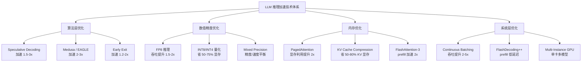
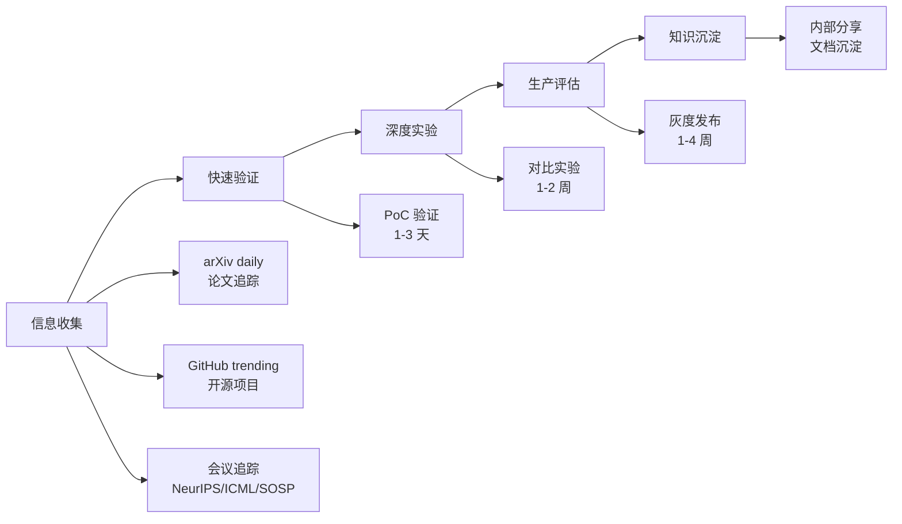

# 前沿技术概述

> 掌握推理加速前沿技术（Speculative Decoding、FP8、KV Cache Compression 等），在面试中展现技术深度和前瞻性。

## 核心概念：推理加速技术全景

## 技术分类详解

### 1. 算法层优化（减少计算量）

| 技术 | 核心思想 | 加速比 | 适用场景 |
|------|---------|-------|---------|
| **Speculative Decoding** | 小模型 draft + 大模型 verify | 1.5-3x | 文本生成、代码补全 |
| **Medusa** | 多头并行解码，无需额外模型 | 2-3x | 训练后可直接使用 |
| **EAGLE** | 基于特征的自回归预测 | 2-3x | 通用文本生成 |
| **Early Exit** | 简单样本提前退出 | 1.2-2x | 混合难度任务 |
| **MoE (Mixture of Experts)** | 按需激活部分参数 | 4-8x 有效 | 大规模模型推理 |
| **Prefill-Decode 分离** | 两类计算分开调度 | 吞吐 +2x | 大流量服务 |

### 2. 数值精度优化（减少每操作计算量）

| 技术 | 核心思想 | 效果 | 硬件要求 |
|------|---------|------|---------|
| **FP8** | 8-bit 浮点，H100 原生支持 | 吞吐 +50-100% | H100+ |
| **INT8** | 8-bit 整数量化 | 吞吐 +50-100% | 通用 |
| **INT4** | 4-bit 量化 | 显存 -75% | 通用 |
| **MXFP6** | 6-bit 混合浮点 | 实验性 | H100 |

### 3. 内存优化（减少显存瓶颈）

| 技术 | 核心思想 | 效果 |
|------|---------|------|
| **PagedAttention** | 分页管理 KV Cache | 显存利用率 +2x |
| **KV Cache Compression** | 压缩/丢弃低重要性 KV | KV 显存 -50-80% |
| **FlashAttention-3** | 分块计算减少 HBM 访问 | Prefill 加速 2x |

## 近期值得关注的论文和技术（2025-2026）

### Speculative Decoding 方向

1. **EAGLE-2 / EAGLE-3** (2025)
   - 使用训练后的特征预测层替代独立小模型
   - 接受率从 50% 提升到 70%+
   - 加速比 2-3x（70B 模型实测）

2. **Lookahead Decoding** (2024-2025)
   - 并行生成 n-gram candidates 并验证
   - 不需要额外模型或训练
   - 加速比 1.3-2x

3. **SpecInfer / Prompt Lookup Decoding**
   - 利用 prompt 中的 n-gram 直接 lookup
   - 对代码补全特别有效（代码有大量重复模式）
   - 加速比 2-4x（代码场景）

### 数值精度方向

1. **FP8 E4M3 on H100**
   - NVIDIA Hopper 架构原生支持
   - H100 Tensor Core FP8 吞吐 3.9 PFLOPS vs FP16 2.0 PFLOPS
   - 实际推理加速 1.5-2x

2. **Microscaling (MX) Formats**
   - NVIDIA H200 引入 MXFP4/MXFP6
   - 比 FP8 更激进但仍保持可用精度

### 系统优化方向

1. **FlashDecoding++** (2025)
   - 针对 decode 阶段优化的 FlashAttention
   - 低延迟 decode（适合 interactive 场景）
   - P99 延迟降低 30-50%

2. **MoonCake / DistServe**
   - Prefill-Decode 分离部署
   - Prefill 节点（compute-bound）和 Decode 节点（memory-bound）分开调度
   - 吞吐提升 2x+，延迟降低 40%

## 如何保持技术敏感度

### 信息来源推荐

| 来源 | 频率 | 内容类型 |
|------|------|---------|
| arXiv cs.CL / cs.LG | 每天 | 最新论文 |
| NVIDIA Blog / GTC | 每季度 | 硬件和框架更新 |
| vLLM / SGLang GitHub | 每周 | 推理框架更新 |
| LMSYS Chatbot Arena | 每月 | 模型排行榜 |
| ML 会议 (NeurIPS, ICML, MLSys) | 每年 2-4 次 | 前沿技术论文 |

### 技术评估 Checklist

在评估一项新技术时，回答以下问题：

1. **原理是否清晰？** 能否用 5 分钟向同事解释？
2. **加速/收益有多少？** 有论文数据吗？开源实现验证了吗？
3. **适用条件是什么？** 有场景限制吗？（如只适合长文本？）
4. **精度影响多大？** 是否有 benchmark 证明精度不降？
5. **部署成本多少？** 需要额外硬件？额外训练？额外依赖？
6. **生态成熟度？** 主流推理框架支持了吗？（vLLM, TGI, TensorRT-LLM）

## 面试视角

**面试官可能问：**

1. **"最近 LLM 推理领域有什么值得关注的新方向？"**
   - Speculative Decoding 从 draft model → Medusa 多头 → EAGLE 特征预测
   - FP8 成为新一代标准精度（H100 原生支持）
   - Prefill-Decode 分离架构（DistServe / MoonCake）
   - KV Cache 优化（PagedAttention / RadixAttention / Cache Compression）

2. **"这些新技术你怎么评估？"**
   - 先看论文数据和开源实现
   - 快速 PoC 验证核心 claim
   - 在自己的 workload 上跑 benchmark
   - 评估部署成本和生态成熟度
   - 给出量化数据后再推荐

3. **"你怎么保持技术更新？"**
   - 日常关注 arXiv 热门论文和 GitHub trending
   - 参与推理框架社区（vLLM SGLang）
   - 定期做技术 PoC 并写内部报告
   - 参加行业会议和社区交流

4. **"这些技术在实际生产中有什么限制？"**
   - Speculative Decoding 在低接受率场景（如创意写作）加速效果有限
   - FP8 需要 H100 或更新硬件，A100 无法加速
   - KV Cache Compression 可能影响长上下文的精度
   - Prefill-Decode 分离需要额外的网络和调度基础设施
   - 任何新技术都需要在真实业务数据上验证，不能只看论文数字

5. **"你会优先考虑引入哪项技术？"**
   - 如果已有 H100：FP8 量化是第一步（改动最小，收益最大）
   - 如果延迟是瓶颈：Speculative Decoding 或 Early Exit
   - 如果显存是瓶颈：PagedAttention + KV Cache Compression
   - 如果吞吐是瓶颈：Continuous Batching + 混合精度

## 部署视角

### 技术成熟度分级

| 分级 | 技术 | 状态 |
|------|------|------|
| 已采用 | Continuous Batching, PagedAttention | 生产环境标配 |
| 推广中 | FP8, Speculative Decoding | H100 环境推荐 |
| 评估中 | Medusa, EAGLE, DistServe | 有开源实现，待验证 |
| 观望中 | MXFP4, FlashDecoding++ | 论文阶段，框架未成熟 |

## 最佳实践

1. **聚焦核心加速技术**：Speculative Decoding 和 FP8 是近期收益最大的两项
2. **关注开源生态**：vLLM、SGLang、TensorRT-LLM 的更新直接反映业界方向
3. **量化验证**：不要只看论文数据，要在自己的 workload 上实测
4. **渐进式采用**：从非核心服务开始灰度，验证后再推广
5. **建立技术雷达**：定期更新团队的技术雷达，标注"采用/试验/评估/暂缓"
6. **技术选型要考虑团队能力**：再好的技术如果团队无法维护也是负担

---

*下一节：[Speculative Decoding](./speculative-decoding.md)*
