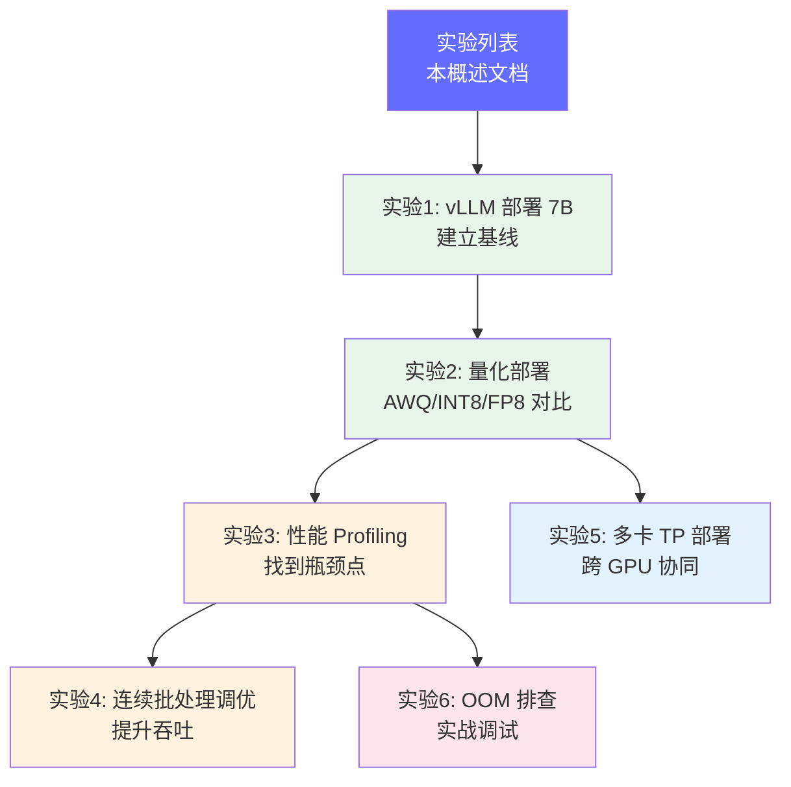

# 动手实验

> 光看不够，必须动手。这些实验按难度递增排列，覆盖 FDE 核心技能栈。建议按顺序完成，积累可讲述的实战经验。

## 前置知识

- [推理引擎概述](../04-inference-optimization/engine-overview.md) — 理解 vLLM/SGLang 的基本原理
- [量化基础](../04-inference-optimization/quantization-basics.md) — 理解 INT8/FP8/AWQ 的概念
- [分布式推理](../05-distributed-inference/distributed-overview.md) — 理解 Tensor Parallel 的原理
- [GPU 性能瓶颈](../03-gpu-basics/performance-bottleneck.md) — 理解 Memory-bound vs Compute-bound

## 为什么需要动手实验

面试问的是 "你做过什么" 而不是 "你读过什么"。这些实验让你：
- **积累真实经验**：亲手跑通部署、量化、profiling 全流程
- **形成项目故事**：每个实验都是一个可以讲述的 STAR 故事
- **建立直觉**：只有亲自看到日志、碰到 OOM、调过 batch size，才能真正理解技术文档在讲什么

## 本模块学习地图

实验分为三条线：
- **基础线**（实验 1 → 2 → 3 → 4）：从部署到量化到性能调优的完整链路
- **并行线**（实验 2 → 5）：量化之后直接学习多卡部署
- **实战线**（实验 3 → 6）：profiling 之后学习 OOM 排查

| 实验 | 难度 | 涉及技术 | 关联技能 | 预计时间 |
|------|------|----------|---------|----------|
| [用 vLLM 部署 7B 模型](./vllm-7b-deploy.md) | ⭐ | vLLM、OpenAI API | 推理引擎基础 | 30 分钟 |
| [量化部署实验](./quantization-workflow.md) | ⭐⭐ | AWQ、INT8、FP8 | 量化策略选择 | 2 小时 |
| [性能 Profiling](./profiling-workshop.md) | ⭐⭐ | nsight、nvidia-smi | 瓶颈分析 | 1 小时 |
| [连续批处理调优](./batching-tuning.md) | ⭐⭐⭐ | Continuous Batching | 吞吐优化 | 1 小时 |
| [多卡 TP 部署](./tensor-parallel-lab.md) | ⭐⭐⭐ | vLLM TP | 分布式推理 | 1 小时 |
| [OOM 排查演练](./oom-troubleshooting.md) | ⭐⭐ | 显存分析 | 故障排查 | 30 分钟 |

## 面试视角

| 实验 | 对应的面试问题 |
|------|-------------|
| 实验 1 | "你部署过哪些模型？遇到过什么问题？" |
| 实验 2 | "量化后精度下降怎么办？" |
| 实验 3 | "你怎么找到推理服务的性能瓶颈？" |
| 实验 4 | "Continuous Batching 的原理是什么？" |
| 实验 5 | "解释 Tensor Parallel 的通信开销" |
| 实验 6 | "遇到 OOM 你怎么排查？" |

## 学完本模块后，你应该能够...

- [ ] 独立部署一个 7B 模型并提供 OpenAI 兼容 API
- [ ] 对模型进行量化并对比精度/性能差异
- [ ] 使用 profiling 工具定位推理瓶颈
- [ ] 调整 batch size 参数优化吞吐
- [ ] 在多 GPU 上配置 Tensor Parallel
- [ ] 独立排查 OOM 问题并给出解决方案

*上一节：[成本与运营](/08-cost-operations/) | 下一节：[AI 驱动业务流程](/10-business-workflows/)*
