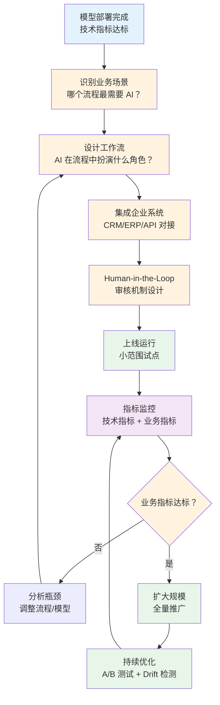
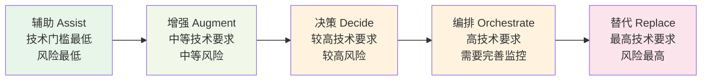

# AI 商业工作流 — 从"模型部署"到"业务价值"

> AI 从"跑得快"到"办成事"的转变：让模型能力真正嵌入企业商业流程，产生可衡量的业务价值。

---

## 前置知识

- [Agent 架构与实战](../06-ai-engineering/agent-architecture.md)
- [生产部署架构](../07-production-deployment/deployment-architecture.md)
- [AI 评测入门](../06-ai-engineering/ai-evaluation.md)

---

## 为什么 FDE 需要理解商业工作流

### 从"跑得快"到"办成事"

很多团队成功部署了 LLM 服务 —— 低延迟、高吞吐、成本可控。但 **模型部署完成不等于业务成功**。

```
技术团队视角：  GPU 利用率 85% | P99 延迟 500ms | Token 成本降低 40%  ✅ 完成！
业务团队视角：  工单处理时长没变 | 客户满意度没提升 | 人力成本没下降  ❌ 没价值
```

**AI 商业工作流** 关注的是：如何让 AI 能力嵌入到企业的真实业务流程中，从客户咨询到售后处理，从销售线索到订单转化，每一步都能被 AI 辅助、增强或自动化。

### 从"模型部署完成"到"业务价值实现"的完整闭环



---

## AI 在商业流程中的 5 种角色

| 角色 | 定义 | 典型场景 | AI 自主度 | 人工介入 |
|------|------|---------|----------|---------|
| **替代 (Replace)** | AI 完全替代人工操作 | 自动回复 FAQ、智能路由 | 高 | 无需 |
| **辅助 (Assist)** | AI 提供信息和建议，人工决策 | 客服辅助推荐回复 | 中 | 必须 |
| **增强 (Augment)** | AI 增强人工能力，提高效率 | 工单自动摘要、文档翻译 | 中低 | 审核 |
| **决策 (Decide)** | AI 自动做出业务决策 | 信用评分、风险预警 | 高 | 异常时介入 |
| **编排 (Orchestrate)** | AI 协调整个工作流 | 多步骤工单处理、跨系统操作 | 中高 | 关键节点审核 |

### 各角色的技术要求和风险



**实践建议：** 企业 AI 落地通常从"辅助"开始，逐步向"增强"和"编排"推进，最后才考虑"替代"。

---

## 核心概念

### 商业工作流 vs 传统自动化

```
传统自动化（RPA/规则引擎）：
  IF 工单包含"退款" THEN 转退款组
  IF 工单包含"投诉" THEN 优先级设为高

AI 商业工作流：
  理解工单语义 → 提取关键信息 → 查询客户历史 → 生成个性化回复 → 人工审核 → 发送
```

### 关键概念矩阵

| 概念 | 说明 | 在 FDE 中的位置 |
|------|------|---------------|
| **Workflow（工作流）** | 定义好的步骤序列，有明确的输入输出 | 业务层 |
| **Orchestration（编排）** | 协调多个服务、工具、模型的执行顺序 | 中间层 |
| **Human-in-the-Loop（人在回路）** | 关键节点引入人工审核和决策 | 安全层 |
| **State Machine（状态机）** | 用状态转移描述流程的每一步 | 实现层 |
| **Compensation（补偿）** | 流程失败时的回退和恢复机制 | 可靠性层 |
| **Observability（可观测性）** | 业务指标和技术指标的映射 | 运营层 |

---

## 文档导航

| 文档 | 内容 |
|------|------|
| [业务流程编排](./workflow-orchestration.md) | 工作流引擎、Human-in-the-Loop、审批流、状态机建模 |
| [企业系统集成](./enterprise-integration.md) | CRM/ERP 对接、Webhook、数据一致性、补偿事务 |
| [业务指标体系](./business-metrics.md) | 技术指标到业务指标的映射、A/B 测试、Drift 检测 |

---

*上一节：[动手实验](/09-labs/)* *下一节：[业务流程编排](./workflow-orchestration.md)*
