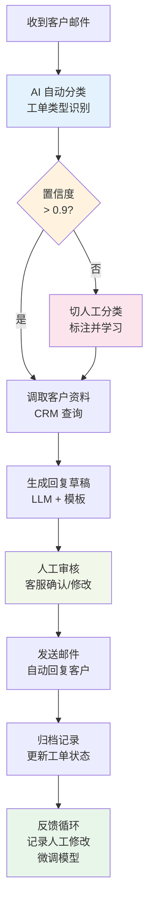
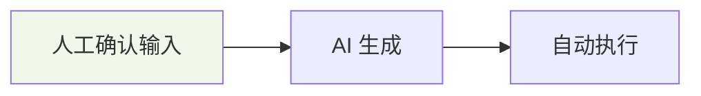
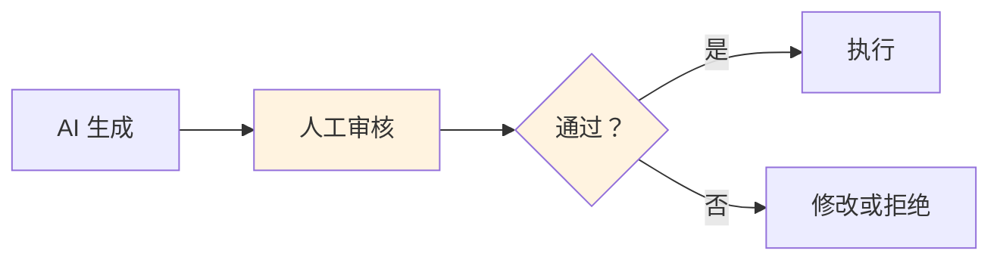
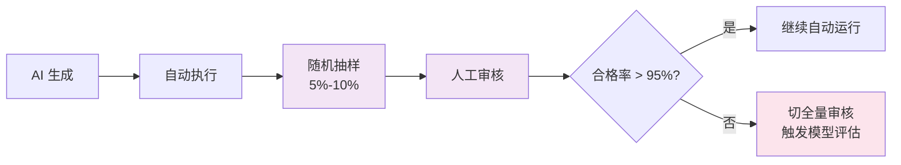
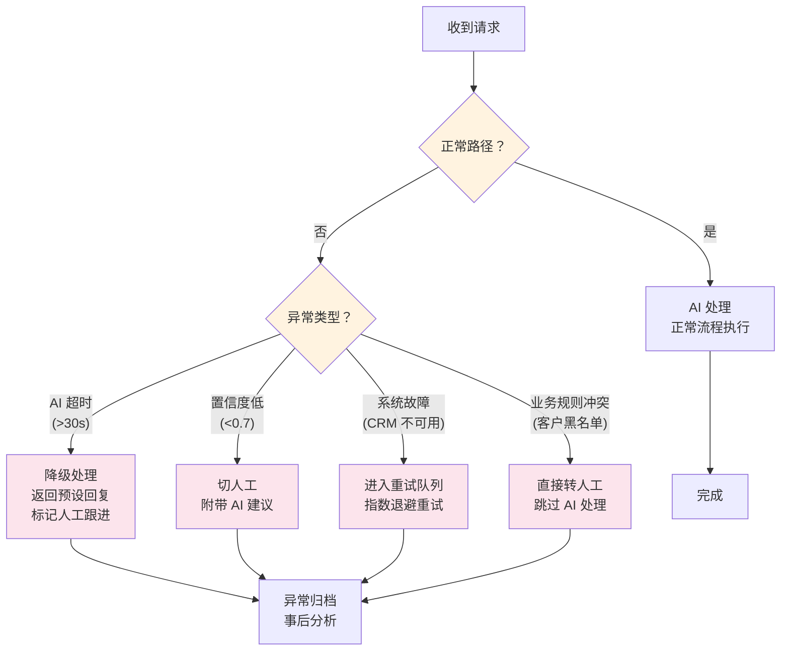
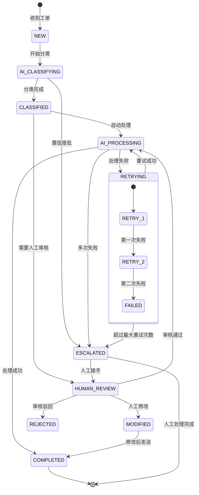
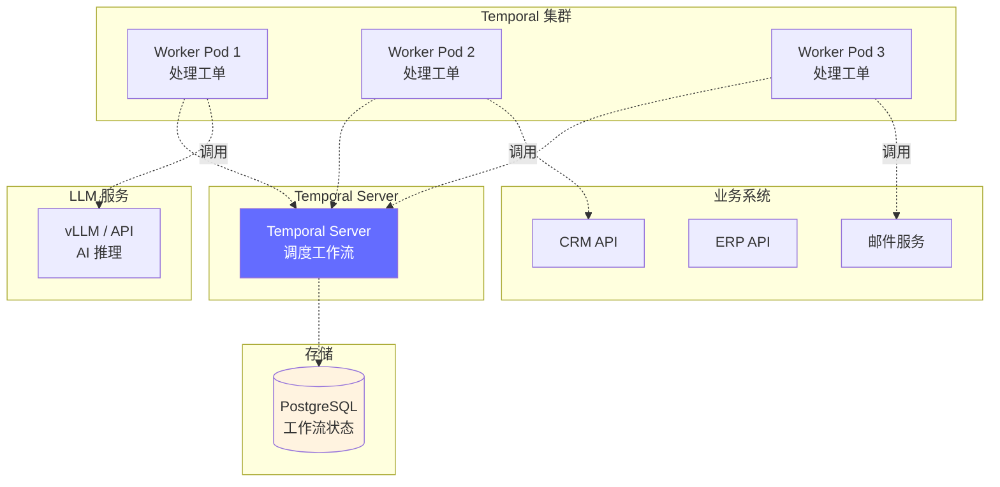

# 业务流程编排 — 让 AI 按规则办事

> 业务工作流是有明确规则和边界的"受控 Agent"：每一步做什么、什么时候切人工、失败了怎么回退，都有清晰定义。

---

## 前置知识

- [Agent 架构与实战](../06-ai-engineering/agent-architecture.md)
- [AI 商业工作流概述](./index.md)

---

## 业务工作流 vs Agent

### 核心区别

| 维度 | Agent | 业务工作流 (Workflow) |
|------|-------|----------------------|
| **自主性** | 高：自己决定下一步做什么 | 低：流程预先定义好 |
| **灵活性** | 动态规划，可调整策略 | 固定步骤，可配置分支 |
| **可控性** | 低：可能出现意外行为 | 高：每一步都可审计 |
| **适用场景** | 探索性任务（研究、分析） | 确定性流程（工单处理、审批） |
| **可预测性** | 每次执行路径可能不同 | 相同输入产生相同流程 |
| **调试难度** | 高：非确定性行为 | 低：日志可追踪每一步 |
| **合规要求** | 难满足（黑盒决策） | 易满足（每步可审计） |

```
简单理解：
  Agent = 给你目标，你自己想办法完成
  Workflow = 按这个流程走，每步做什么我都规定好了
```

在商业场景中，**工作流是主流，Agent 是补充**。企业需要可控、可审计、可预测的 AI 系统，而不是一个自由发挥的 Agent。

---

## 典型业务工作流

### 客户邮件自动处理流程



**这个流程的关键设计点：**

1. **自动分类**：用 NLP 模型识别工单类型（退款、投诉、咨询、技术支持）
2. **置信度阈值**：低于 0.9 时不信任 AI，切人工处理
3. **人工审核**：AI 生成的回复必须经过人工确认才能发送
4. **反馈循环**：人工修改过的回复用于模型微调，形成数据飞轮

---

## Human-in-the-Loop 设计模式

### 模式 1：前置审核（Pre-Approval）

```
人工确认输入 → AI 生成 → 自动执行
```

**流程：** 人工先确认问题描述和上下文，AI 基于确认后的信息生成结果，自动执行。



**适用场景：**
- 输入质量不确定，AI 容易误解意图
- 生成成本低，但执行成本高（比如发邮件给客户）
- 典型例子：客服先确认客户问题，AI 再检索知识库生成回复

**Trade-off：**
- 优点：避免 AI 基于错误理解做出错误操作
- 缺点：增加人工步骤，降低自动化率

### 模式 2：后置审核（Post-Approval）

```
AI 生成 → 人工审核 → 确认后执行
```

**流程：** AI 自动生成结果（回复、决策、报告），人工审核通过后才执行。



**适用场景：**
- AI 生成质量较高（>90% 通过率）
- 执行后果较重（法律文件、对外通信）
- 典型例子：AI 生成客服回复草稿，客服确认后发送

**Trade-off：**
- 优点：AI 做了大部分工作，人工只做审核，效率提升明显
- 缺点：如果通过率低，人工审核反而成为瓶颈

### 模式 3：抽检审核（Spot-Check）

```
AI 生成 → 自动执行 → 定期抽样审核 → 统计合格率
```

**流程：** AI 全自动生成和执行，系统定期随机抽样，人工审核样本质量。



**适用场景：**
- AI 已稳定运行较长时间，质量可信
- 执行后果较轻（内部报告、分类标记）
- 典型例子：AI 自动分类工单，每周抽检 10% 验证准确率

**Trade-off：**
- 优点：自动化率最高，人工成本最低
- 缺点：可能漏掉错误，发现问题的延迟较高

### 三种模式对比

| 维度 | 前置审核 | 后置审核 | 抽检审核 |
|------|---------|---------|---------|
| 自动化率 | 30-50% | 60-80% | 95%+ |
| 安全性 | 最高 | 高 | 中 |
| 人工成本 | 最高 | 中 | 最低 |
| 适用阶段 | 新系统上线 | 系统成熟期 | 系统稳定期 |
| 建议切换条件 | AI 分类准确率 > 85% 后切换 | AI 审核通过率 > 90% 后切换 | 连续 4 周合格率 > 95% |

---

## 审批流、回退、异常处理编排

### 正常路径 vs 异常路径



### 超时处理策略

当 AI 服务 30 秒内没有响应时：

```python
# 超时降级策略示例
TIMEOUT_MS = 30_000  # 30 秒超时

async def handle_request_with_fallback(request):
    try:
        # 主路径：AI 处理
        result = await asyncio.wait_for(
            ai_process(request),
            timeout=TIMEOUT_MS / 1000
        )
        return result
    except asyncio.TimeoutError:
        # 降级 1：返回预设的兜底回复
        metrics.record("ai_timeout")
        return {
            "type": "fallback",
            "message": "我们正在处理您的请求，请稍候...",
            "ticket_id": create_ticket(request),  # 创建工单后续处理
        }
    except ExternalServiceError as e:
        # 降级 2：外部服务不可用，切人工
        metrics.record("external_service_error")
        return route_to_human(request, reason=str(e))
```

### 回退规则（Confidence-Based Routing）

```
置信度 >= 0.9  → AI 自动处理
置信度 0.7~0.9 → AI 生成 + 人工审核
置信度 < 0.7   → 直接转人工 + AI 建议作为参考
```

---

## 业务状态机建模

用状态机描述工单处理流程的每一步状态转移：



### 状态机设计要点

| 原则 | 说明 | 示例 |
|------|------|------|
| **每个状态必须有出口** | 不能有死状态 | `RETRYING` 必须能到 `ESCALATED` |
| **超时转移** | 每个状态设超时 | `AI_CLASSIFYING` 30s 超时 → `ESCALATED` |
| **幂等性** | 同一操作重复执行不产生副作用 | 重复工单创建返回已有 ticket_id |
| **可审计** | 每次状态转移记录日志 | `NEW → AI_CLASSIFYING` 记录时间戳、原因 |

---

## 工作流引擎工具对比

| 工具 | 定位 | LLM 集成 | 学习曲线 | 适用场景 |
|------|------|---------|---------|---------|
| **Temporal** | 代码优先的分布式工作流 | 原生支持 Python/Go SDK 调用 LLM | 中 | 需要复杂编排、长期运行任务 |
| **Camunda** | BPMN 标准的工作流引擎 | 通过 REST API 调用 LLM | 高 | 企业级审批流、合规要求高 |
| **Airflow** | 数据管道编排 | 通过 PythonOperator 调用 LLM | 低 | 批处理、ETL + LLM 场景 |
| **LangGraph** | Agent 工作流框架 | 原生 LLM 集成 | 低 | Agent 场景、状态机驱动的 Agent |
| **Dify** | 低代码 AI 应用平台 | 内置 LLM 节点 | 极低 | 快速搭建 AI 工作流原型 |

### Temporal 示例：AI 工单处理

```python
from temporalio.client import Client
from temporalio.worker import Worker
from temporalio import activity, workflow

@activity.defn
async def classify_ticket(ticket: dict) -> dict:
    """调用 LLM 对工单分类"""
    response = await llm_client.chat.completions.create(
        model="gpt-4o",
        messages=[{"role": "user", "content": f"分类此工单: {ticket['body']}"}]
    )
    return {"category": response.choices[0].message.content, "confidence": 0.92}

@activity.defn
async def generate_reply(ticket: dict, customer_data: dict) -> str:
    """基于客户资料和工单内容生成回复"""
    ...

@activity.defn
async def send_email(to: str, subject: str, body: str) -> bool:
    """发送邮件"""
    ...

@workflow.defn
class TicketProcessingWorkflow:
    @workflow.run
    async def run(self, ticket: dict) -> str:
        # Step 1: 分类
        classification = await workflow.execute_activity(
            classify_ticket, ticket, start_to_close_timeout=timedelta(seconds=30)
        )

        # Step 2: 置信度检查
        if classification["confidence"] < 0.7:
            await workflow.execute_activity(escalate_to_human, ticket)
            return "escalated"

        # Step 3: 查询客户资料
        customer_data = await workflow.execute_activity(fetch_customer, ticket["customer_id"])

        # Step 4: 生成回复（等待人工审核）
        reply = await workflow.execute_activity(generate_reply, ticket, customer_data)

        # Step 5: 等待人工审核（Human-in-the-Loop）
        approved = await workflow.execute_activity(wait_for_human_approval, reply)
        if not approved:
            return "rejected"

        # Step 6: 发送邮件
        await workflow.execute_activity(send_email, ticket["email"], "回复", reply)
        return "completed"
```

---

## 部署视角

### 工作流引擎在 K8s 中的部署模式



**部署模式选择：**

| 模式 | 说明 | 适用场景 |
|------|------|---------|
| Worker Deployment | 多个 Worker Pod 水平扩展 | 高并发工单处理 |
| Sidecar Pattern | 工作流引擎与业务服务共部署 | 轻量级场景 |
| External SaaS | 使用 Temporal Cloud / Camunda Cloud | 不想运维工作流引擎 |

**关键配置：**

```yaml
# Temporal Worker HPA 配置
apiVersion: autoscaling/v2
kind: HorizontalPodAutoscaler
metadata:
  name: temporal-worker-hpa
spec:
  scaleTargetRef:
    apiVersion: apps/v1
    kind: Deployment
    name: temporal-worker
  minReplicas: 3
  maxReplicas: 20
  metrics:
  - type: Pods
    pods:
      metric:
        name: temporal_task_queue_depth
      target:
        type: AverageValue
        averageValue: "100"
```

---

## 面试视角

### "设计一个 AI 工单处理系统"满分回答框架

```
面试官：设计一个 AI 工单处理系统，日均 10 万工单。

1. 需求分析（1 分钟）
   → 日均 10 万，峰值约 5 万/小时
   → 工单类型：咨询(50%)、投诉(20%)、退款(15%)、技术支持(15%)
   → 目标：减少人工处理量 60%，保证客户满意度不降

2. 架构设计（2 分钟）
   → 流程：接收 → 分类 → 处理 → 审核 → 发送 → 归档
   → 用 Temporal 做工作流编排（需要长期运行、失败重试、状态持久化）
   → Human-in-the-Loop：分类置信度 `<` 0.7 转人工，回复需审核后发送

3. 关键设计决策（2 分钟）
   → 超时处理：AI 30s 超时 → 降级为预设回复 + 创建人工工单
   → 回退规则：基于置信度动态路由（全自动/审核/全人工）
   → 数据飞轮：人工修改的回复用于模型微调，每周更新一次

4. 运维和监控（1 分钟）
   → 技术指标：分类准确率、响应延迟、Worker 队列深度
   → 业务指标：自动处理率、人工审核通过率、客户满意度
   → 告警：自动处理率跌破 50% 触发告警

5. 扩展性（30 秒）
   → Worker 水平扩展，按工单类型分队列
   → 多模型降级策略：主模型 GPT-4o，备用 Claude，兜底规则引擎
```

---

## 最佳实践

1. **从小场景开始**：先选一个高频率、低风险的场景（如 FAQ 自动回复）试点
2. **定义清晰的边界**：哪些步骤 AI 做、哪些步骤人工做、切换条件是什么
3. **可观测性先行**：上线前先埋好指标（自动处理率、人工介入率、满意度）
4. **渐进式自动化**：前置审核 → 后置审核 → 抽检审核 → 全自动，每步达标后再推进
5. **建立反馈闭环**：人工修改的数据必须回流到训练集，否则 AI 不会进步
6. **设计降级路径**：AI 服务挂了怎么办？模型质量下降了怎么办？要有兜底方案
7. **合规和审计**：每个决策保留完整日志，包括 AI 的输入、输出、置信度
8. **定期评估**：每月评估一次模型质量，检测是否有退化（Drift Detection）

---

*上一节：[概述](./index.md)* *下一节：[企业系统集成](./enterprise-integration.md)*
