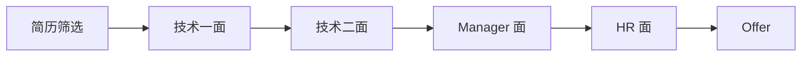

# 面试答题框架

> 一套结构化答题体系，帮助候选人在 FDE 五轮面试中稳定输出高质量回答

---

## FDE 面试全流程



整个面试周期通常为 **2-4 周**。简历通过后，技术面间隔 2-3 天安排，Manager 面和 HR 面通常在技术面通过后的 1 周内完成。

---

## FDE 面试四大考察维度

FDE（Foundation Deployment Engineer）岗位的面试围绕四个核心维度展开：

### 1. 技术深度

- **考察内容**：Transformer 架构细节、推理引擎原理（vLLM / TensorRT-LLM）、GPU 显存模型、量化技术（INT8 / INT4 / FP8）、分布式推理（TP / PP）
- **常见题型**："vLLM 的 PagedAttention 怎么解决显存碎片化？""FP8 和 INT8 量化如何选择？"
- **期望回答深度**：能从底层原理解释，给出具体数据（显存利用率从 60% 提升到 95%），能对比不同方案的优劣

### 2. 工程能力

- **考察内容**：线上部署经验、服务稳定性保障（SLA / SLO / SLI）、性能 profiling 和调优、容量规划、K8s 运维
- **常见题型**："流量翻 10 倍怎么扛？""线上 P99 延迟突然升高怎么排查？"
- **期望回答深度**：有真实项目经验，能画出系统架构图，能用数据说话（QPS、延迟、吞吐、GPU 利用率）

### 3. 项目管理

- **考察内容**：技术方案推进、跨团队协作、风险管理、优先级排序
- **常见题型**："怎么推动一个新技术落地？""技术方案遇到阻力怎么办？"
- **期望回答深度**：有方法论（PoC → 小范围试点 → 全量推广），能识别和化解风险，有量化成果

### 4. 沟通协作

- **考察内容**：技术表达清晰度、跨团队沟通能力、冲突处理能力
- **常见题型**："和上级意见不一致怎么办？""讲一次技术变革的推动过程"
- **期望回答深度**：逻辑清晰，能用 STAR 法则讲述，体现以数据驱动决策的习惯

---

## 各轮面试重点与答题策略

### 第一轮：技术一面（45-60 分钟）

**面试官**：高级工程师 / Tech Lead

**考察重点**：
- 基础知识扎实程度
- 核心技术栈的掌握深度
- 基本的问题分析能力

**高频题型**：
- 原理类：Transformer 架构、Attention 机制、KV Cache
- 工具类：vLLM 核心特性、TensorRT-LLM 对比
- 算法类：量化原理、批处理策略

**答题策略**：
1. **先定义再展开**：先给出一句话核心定义，再分层次展开
2. **用数据说话**：给出具体性能数据（"PagedAttention 让显存利用率从 60% 提升到 95%"）
3. **对比分析**：主动对比不同方案的优劣（"vLLM vs TGI 的核心差异在于..."）
4. **控制深度**：先给出中层回答，观察面试官反应再决定是否深入

**示例答题框架**：
```
问题：解释 vLLM 的 PagedAttention

1. 一句话定义（10s）："把 KV Cache 按 block 分页管理，借鉴操作系统虚拟内存思想"
2. 核心问题（20s）："传统方式 KV Cache 连续分配，导致显存碎片化，利用率只有 60%"
3. 方案原理（60s）："按 token block 分配，动态映射，支持非连续存储，自动 GC"
4. 效果数据（15s）："显存利用率提升到 95%，吞吐提升 2-4 倍"
5. 延伸思考（如有兴趣）："Continuous Batching 进一步解决了批次内的异构问题"
```

### 第二轮：技术二面（45-60 分钟）

**面试官**：技术总监 / 架构师

**考察重点**：
- 实际项目经验和线上踩坑
- 系统架构设计能力
- 问题排查和解决的深度

**高频题型**：
- 项目深挖：选一个你最自豪的项目详细讲述
- 场景题：设计一个支持 10 万 QPS 的推理服务
- 故障排查：线上延迟突然升高的排查思路

**答题策略**：
1. **准备 3 个深度项目**：每个项目能用 STAR 法则讲 5-8 分钟
2. **画出架构图**：能白板画出系统架构，标注关键数据
3. **展示思考过程**：不只是讲做了什么，更重要的是讲为什么这么做、考虑过哪些替代方案
4. **主动提及踩坑**：面试官喜欢听"踩坑故事"，这体现真实经验

### 第三轮：Manager 面（30-45 分钟）

**面试官**：部门经理 / 技术负责人

**考察重点**：
- 技术规划能力
- 技术选型的方法论
- 团队管理和协作能力
- 技术热情和成长潜力

**高频题型**：
- "你对推理引擎未来的技术方向怎么看？"
- "怎么推动一个新技术在团队落地？"
- "讲一次技术决策的过程"
- "你未来的职业规划是什么？"

**答题策略**：
1. **展现全局视野**：不只讲技术细节，要讲技术如何服务业务
2. **方法论 + 案例**：先讲方法论，再用具体案例佐证
3. **体现管理思维**：展示你考虑成本、效率、团队成长等维度
4. **表达热情和野心**：对技术有热情，对自己的成长有规划

### 技术面 vs Manager 面的核心差异

| 维度 | 技术面 | Manager 面 |
|------|--------|------------|
| 关注点 | "怎么做"（How） | "为什么做"（Why） |
| 深度要求 | 技术细节、源码级理解 | 架构视野、方法论 |
| 评估标准 | 正确答案、深度思考 | 决策能力、沟通表达 |
| 答题节奏 | 快速、精确、有数据 | 从容、结构化、有观点 |
| 失败容忍 | 原理答错直接扣分 | 允许"没有标准答案" |
| 加分项 | 读过源码、有 benchmark | 有技术规划、带过团队 |

### 第四轮：交叉面（30-45 分钟）

**面试官**：其他团队的 Senior / 架构师

**考察重点**：
- 技术广度
- 跨领域知识（分布式、网络、数据库）
- 快速学习和适应能力

**答题策略**：
1. **坦诚边界**：不熟悉的领域坦诚承认，但展示分析思路
2. **迁移能力**：把熟悉的领域知识迁移到新问题
3. **系统性思维**：即使不精通某个领域，也能从系统角度分析

### 第五轮：HR 面（30 分钟）

**面试官**：HR / HRBP

**考察重点**：
- 离职动机是否合理
- 文化匹配度
- 薪资预期
- 职业稳定性

**答题策略**：
1. **正面表达**：离职原因聚焦"追求更大发展空间"
2. **了解公司**：提前调研公司文化、业务方向
3. **合理预期**：薪资谈判有底线也有弹性
4. **准备好反问**：展示你对岗位的真实兴趣

---

## 如何准备 FDE 面试

### 时间规划（建议 4 周）

```mermaid
gantt
    title FDE 面试准备时间线
    dateFormat  X
    axisFormat %W

    section 第1周：基础复习
    Transformer 架构            :a1, 0, 2d
    vLLM / TensorRT-LLM 原理    :a2, 2, 2d
    GPU 显存模型                :a3, 4, 1d

    section 第2周：项目梳理
    项目 STAR 故事整理          :b1, 7, 3d
    架构图绘制                  :b2, 10, 2d
    量化数据整理                :b3, 12, 2d

    section 第3周：模拟面试
    技术面模拟                  :c1, 14, 3d
    Manager 面模拟              :c2, 17, 2d
    HR 面准备                   :c3, 19, 2d

    section 第4周：冲刺
    高频题精练                  :d1, 21, 3d
    自我介绍打磨                :d2, 24, 2d
    公司调研                    :d3, 26, 2d
```



### 知识体系梳理

**第一层：核心基础（必须精通）**
- Transformer 架构：Self-Attention、Multi-Head Attention、FFN、LayerNorm
- KV Cache：原理、内存布局、优化策略（PagedAttention、Prefix Caching）
- 推理引擎：vLLM 核心特性、TGI、TensorRT-LLM 对比

**第二层：工程实践（必须有项目）**
- 模型部署：7B / 13B / 70B 模型的部署方案
- 量化技术：INT8 / INT4 / FP8 的实践经验和精度评估
- 性能调优：Profiling 方法、瓶颈定位、优化手段

**第三层：架构视野（能讨论）**
- 分布式推理：Tensor Parallel、Pipeline Parallel
- 容量规划：如何根据业务量做 GPU 规划
- 服务治理：SLA、监控、告警、弹性伸缩

**第四层：前沿跟踪（能聊观点）**
- Speculative Decoding
- MoE 架构的部署挑战
- 推理引擎发展趋势

---

## 面试视角：常见失误

1. **只讲结论不给数据**："性能提升了"不如"P99 延迟从 800ms 降到 400ms，吞吐从 50 tok/s 提升到 100 tok/s"
2. **只讲成功不讲思考**：面试官更关心你 "为什么选这个方案" 而非 "选了什么"
3. **背诵感太强**：回答像背稿，缺乏对话感。应该像技术交流一样自然
4. **不敢承认不会**：遇到不会的问题，坦诚 + 分析思路 > 瞎编
5. **Manager 面太技术化**：Manager 面需要展示全局视野，不是继续抠技术细节

---

*下一节：[自我介绍](./self-intro.md)*
