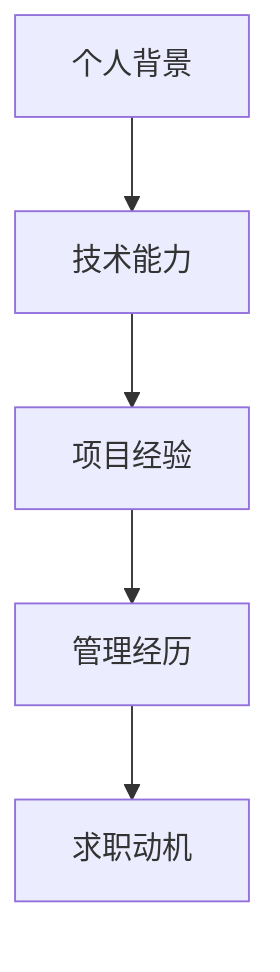

# 自我介绍模板

> 用 3-5 分钟讲清楚你的技术实力、项目经验和管理能力，给面试官留下深刻第一印象

---

## 自我介绍结构框架



每个模块的时间分配：

| 模块 | 3 分钟版 | 5 分钟版 |
|------|----------|----------|
| 个人背景 | 30 秒 | 45 秒 |
| 技术能力 | 45 秒 | 90 秒 |
| 项目经验 | 60 秒 | 90 秒 |
| 管理经历 | 30 秒 | 60 秒 |
| 求职动机 | 15 秒 | 30 秒 |

---

## STAR 法则自我介绍

STAR 法则（Situation、Task、Action、Result）同样适用于自我介绍的组织，让你的介绍有主线、有逻辑：

### Situation（背景）
"我在阿里工作了 X 年，目前负责大模型推理部署和性能优化方向，带一个 X 人的团队。我们服务内部多个业务线，日均处理请求量达到 X 万次。"

### Task（任务/角色）
"我的核心职责是：
1. 选型和部署各类大模型（7B 到 70B），确保在有限 GPU 资源下高效运行
2. 推理服务的性能调优，降低延迟、提升吞吐、控制成本
3. 搭建服务稳定性保障体系（监控、告警、弹性伸缩）
4. 带领团队完成技术攻关和知识传承"

### Action（行动/能力）
"我在这几个方向有深度实践：
- **技术选型**：对比过 vLLM、TGI、TensorRT-LLM 等主流推理引擎，主导选择了 vLLM 作为核心方案
- **性能优化**：通过 INT8 量化、Continuous Batching、前缀缓存等手段，将单请求成本降低 X%
- **工程落地**：搭建基于 K8s 的推理服务平台，支持自动弹性扩缩容
- **团队管理**：建立了技术轮转、知识分享、1v1 等团队培养机制"

### Result（结果/数据）
"核心成果包括：
- 部署了 X 个大模型，支撑峰值 QPS 达到 X
- 单请求成本降低 X%，GPU 利用率从 X% 提升到 X%
- P99 延迟稳定在 X ms 以内，SLA 达到 99.9%
- 团队 X 人中有 X 人晋升，技术分享累计 X 场"

---

## 3 分钟精简版模板

```
"面试官你好，我是 [名字]，目前在 [公司] 担任 [职级]，带 [X] 人团队，
负责大模型推理部署和性能优化方向。

我的核心工作可以概括为三件事：

第一，模型部署和优化。我主导过从 7B 到 70B 多个大模型的生产环境部署，
核心手段包括 INT8 量化、Continuous Batching、前缀缓存等。
成果是把单请求成本降低了 [X]%，GPU 利用率提升到 [X]%。

第二，服务稳定性保障。搭建了基于 K8s 的推理服务平台，
建立了完整的监控和弹性伸缩体系，SLA 达到 99.9%。

第三，团队建设。建立了技术轮转、知识分享等培养机制，
团队技术氛围和战斗力都有明显提升。

我关注 FDE 方向，是因为大模型高效稳定地跑在生产环境里，
这个中间的技术挑战和商业价值都非常大。我希望在这个方向深耕，
也相信我的经验能帮团队快速产生价值。"
```

**要点**：
- 控制在 3 分钟内（约 250-300 字）
- 突出 3 个核心能力点，不展开细节
- 数据用占位符，实际准备时填入真实数字
- 最后一句自然过渡到"为什么来这家公司"

---

## 5 分钟详细版模板

```
"面试官你好，我是 [名字]，在 [公司] 工作了 [X] 年，目前 [职级]，
带 [X] 人的 FDE 方向团队。

让我先介绍一下我们的业务背景。我们团队服务内部 [X] 条业务线，
涵盖 [具体业务场景]，日均处理推理请求 [X] 万次。在 GPU 资源有限的情况下，
如何高效部署和运行大模型是我们面临的核心挑战。

我在这个方向的工作主要有三个层面：

**技术层面**：
- 主导推理引擎选型，对比了 vLLM、TGI、TensorRT-LLM，最终基于 [理由] 选择了 vLLM
- 推动 INT8 / FP8 量化落地，在保证精度损失 < 1% 的前提下，显存占用降低 50%
- 搭建 K8s 推理服务平台，支持自动弹性伸缩，峰值 QPS 从 [X] 扩展到 [X]
- 建立 profiling 和 benchmark 体系，每个模型上线前必须有性能基线数据

**工程层面**：
- 设计了完整的监控体系：GPU 利用率、请求延迟、吞吐、错误率等核心指标
- 建立了模型上线 SOP，从评估、测试、灰度到全量，标准化流程
- 主导过 [X] 次线上故障排查，最复杂的一次是 [简述故障和解决]

**团队层面**：
- 建立了月度技术轮转机制，每人每月 deep dive 一个技术方向
- 搭建了团队知识库，包含模型卡片、踩坑记录、最佳实践等
- 带过的 [X] 人中，有 [X] 人获得晋升

数据上，核心指标：
- 部署了 [X] 个大模型，支撑峰值 QPS [X]
- 单请求成本降低 [X]%，GPU 利用率 [X]% → [X]%
- P99 延迟 [X]ms，SLA 99.9%

我关注 FDE 方向是因为，这个领域正处于技术和工程的交叉点，
既有深度的技术挑战（kernel 优化、新量化方案），又有巨大的商业价值。
我对贵公司的 [具体方向] 很感兴趣，相信我的经验能快速产生价值。"
```

**要点**：
- 控制在 5 分钟内（约 500-600 字）
- 技术、工程、管理三个维度都要覆盖
- 数据要具体且可验证
- 对公司有了解，表达真实的兴趣

---

## 如何突出管理经验和技术深度

### 突出管理经验的技巧

FDE 岗位通常要求候选人有一定的技术管理能力。在自我介绍中要自然体现：

1. **带团队的具体动作**：
   - 不要只说"带过团队"，要说"带 X 人团队，建立了技术轮转、1v1、知识分享等机制"
   - 体现你"有意地在做管理"而非"被动地当 Team Lead"

2. **用团队成果证明管理能力**：
   - "团队 X 人中 X 人晋升"
   - "技术分享累计 X 场，人均每月产出 X 篇技术文档"
   - "团队离职率为 0"

3. **展现管理方法论**：
   - 提到你如何做技术选型决策、如何推动技术方案、如何处理团队分歧
   - 体现你"用数据和实验说话"的管理风格

### 突出技术深度的技巧

1. **讲原理而非只讲工具**：
   - 不只说"用了 vLLM"，要说"深入理解了 PagedAttention 的分页管理机制，并在生产环境中调优过 block size"
   - 不只说"做了量化"，要说"对比了 INT8 和 FP8 在 70B 模型上的精度损失和加速比"

2. **给出底层数据**：
   - "GPU 利用率从 45% 提升到 75%"比"性能提升明显"有说服力得多
   - "KV Cache 显存碎片率从 40% 降到 5%"体现你对底层机制的理解

3. **提及源码级理解**：
   - "阅读过 vLLM 的 scheduler 源码，理解了 Continuous Batching 的实现逻辑"
   - 这直接区分了"使用者"和"理解者"

---

## 常见自我介绍问题和标准回答

### Q1: "介绍一下你自己"（开场）
**错误示范**："我叫 XX，来自 XX，在 XX 公司工作了 X 年..."（流水账）

**标准回答**：用上面的 3 分钟或 5 分钟模板，结构化表达。重点：背景 → 技术 → 项目 → 管理 → 动机。

### Q2: "你最擅长的技术方向是什么？"
**标准回答框架**：
```
"我最擅长的是大模型推理优化和线上部署。具体来说：
- 推理引擎方面，深入使用过 vLLM，理解其核心机制
- 量化方面，有 INT8/FP8 的生产落地经验
- 服务层面，搭建过完整的 K8s 推理服务平台
- 数据上，[给出 1-2 个关键指标]"
```

### Q3: "带团队最大的挑战是什么？"
**标准回答框架**：
```
"最大的挑战是如何在技术快速迭代的背景下保持团队的学习节奏。
我的做法是：[技术轮转 + 知识分享 + 实战训练营]。
效果是：[团队产出数据]。"
```

### Q4: "你为什么想来我们公司？"
**标准回答框架**：
```
"三个原因：
第一，贵公司在 [方向] 的布局和我深耕的领域高度匹配；
第二，我了解到你们在 [技术点] 上有深入实践，我很希望参与其中；
第三，这个岗位既能发挥我的技术深度，也能用到我的管理经验。"
```
**注意**：提前调研公司，不要用万能模板式的回答。

### Q5: "你的优势是什么？"
**标准回答**：
```
"我的优势在于三个交叉：
- 技术深度和工程能力的交叉：既理解底层原理，又有生产环境经验
- 技术和管理能力的交叉：既能做技术决策，也能带团队推进
- 经验和学习能力的交叉：有扎实的基础，也保持对前沿技术的跟进"
```

---

## 面试视角：自我介绍的注意事项

1. **控制时间**：面试官说"介绍一下自己"时，默认 3 分钟。如果面试官表现出兴趣，自然扩展到 5 分钟
2. **有数据但不过度**：放 3-5 个关键数据即可，不要变成报数字
3. **有记忆点**：在介绍中设计 1-2 个"记忆点"（如"我把 GPU 利用率从 45% 干到了 75%"），方便面试官后续追问
4. **根据面试轮次调整**：技术面多讲技术细节，Manager 面多讲管理和规划，HR 面多讲动机和文化匹配
5. **反复练习**：至少练习 5 遍以上，确保自然流畅，不背稿
6. **准备英文版**：部分外企可能有英文自我介绍环节

---

*下一节：[技术答题框架](./technical-answers.md)*
