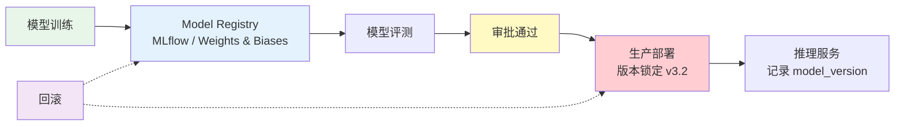
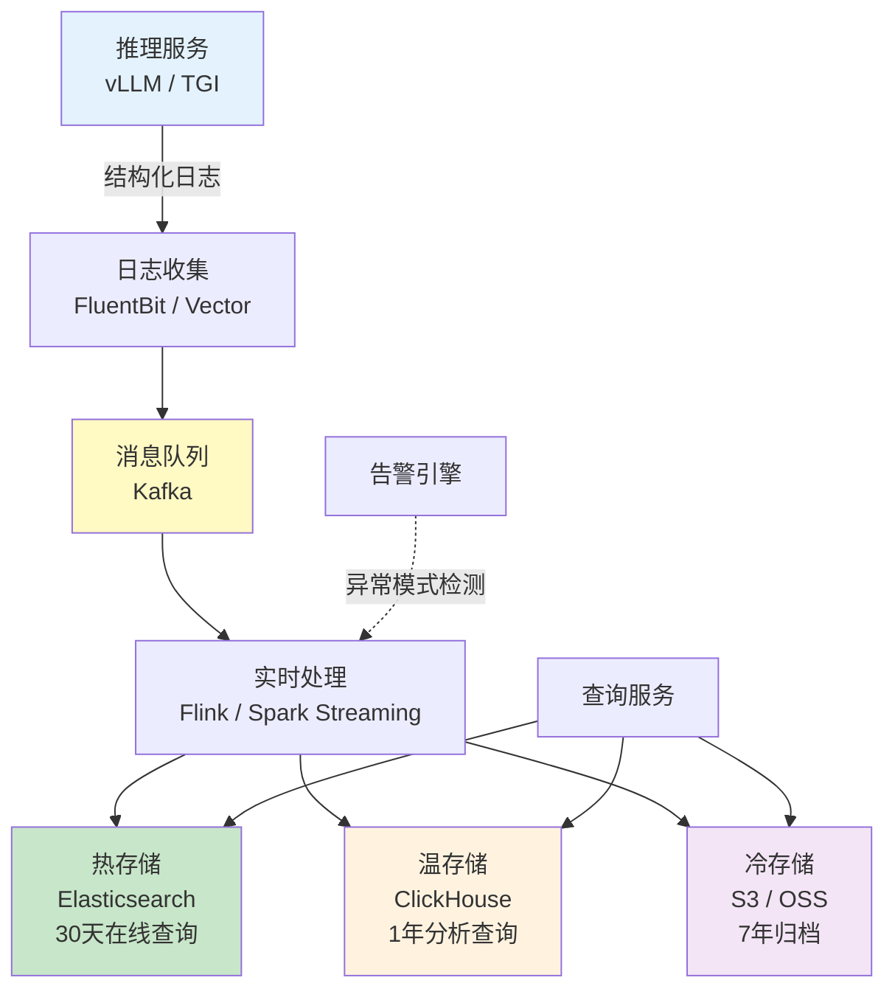

# 审计与可解释性 — AI 决策的可追溯体系

> AI 不只是"给出答案"，更要"解释为什么给出这个答案"。审计日志是合规的底线，可解释性是信任的基石，两者共同构成 AI 决策可追溯的核心能力。

---

## 前置知识

- [数据隐私](./data-privacy.md)
- [KV Cache 详解](../02-model-architecture/kv-cache.md)
- [Decoding 策略](../02-model-architecture/decoding-strategies.md)

---

## 核心概念

### 为什么需要审计日志

| 驱动因素 | 要求 | 具体规定 |
|----------|------|----------|
| **金融监管** | 银保监会 AI 风险管理指引 | 信贷决策必须可追溯，模型输出需有完整记录 |
| **医疗合规** | HIPAA 安全规则 | 患者数据的访问和修改必须有审计记录 |
| **欧盟 GDPR** | 自动化决策可解释权 | 用户有权了解自动化决策的逻辑和依据 |
| **法律纠纷** | 电子证据保全 | AI 输出作为决策依据时，需能证明未被篡改 |
| **内部治理** | 模型风险管理 | 模型性能漂移、异常输出需可追溯分析 |

### 推理链记录设计

#### 记录什么

| 字段 | 类型 | 说明 | 示例 |
|------|------|------|------|
| `request_id` | UUID | 全局唯一请求标识 | "req-a7b3c9d2..." |
| `timestamp` | ISO 8601 | 请求时间（UTC） | "2024-12-01T10:30:00Z" |
| `user_context` | Object | 用户身份、角色、会话信息 | `` {user_id: "u123", role: "loan_officer"} `` |
| `model_version` | String | 使用的模型及版本号 | "qwen2.5-72b-v3.2" |
| `prompt_hash` | String | Prompt 的 SHA-256（不存原始 Prompt） | "e3b0c44298fc..." |
| `parameters` | Object | 温度、top_p、max_tokens 等 | `` {temperature: 0.3, top_p: 0.9} `` |
| `input_summary` | String | 脱敏后的输入摘要 | "贷款申请：金额50万，期限30年" |
| `output_summary` | String | 脱敏后的输出摘要 | "审批结果：通过，利率3.85%" |
| `latency_ms` | Number | 推理耗时 | 1250 |
| `cost_tokens` | Number | 消耗 token 数 | 2847 |
| `guardrail_result` | Object | 安全网关检查结果 | `` {injection: false, toxicity: 0.02} `` |

#### 不记录什么

| 不记录内容 | 原因 |
|-----------|------|
| 原始 PII（身份证号、手机号等） | 违反数据最小化原则，泄露风险大 |
| 完整 Prompt 原文 | 可能包含敏感信息，用 hash + 摘要替代 |
| 内部思考过程（Thinking Models） | Thinking Models 的中间推理可能包含不当内容 |
| 用户原始生物特征 | 极度敏感，任何形式存储都有风险 |

#### 存储格式：JSON 结构化日志

```json
{
  "request_id": "req-a7b3c9d2e1f0",
  "timestamp": "2024-12-01T10:30:00.123Z",
  "user_context": {
    "user_id": "u_12345",
    "role": "loan_officer",
    "session_id": "sess_abc"
  },
  "model": {
    "name": "qwen2.5-72b",
    "version": "v3.2",
    "deployment": "prod-cluster-a"
  },
  "input": {
    "prompt_hash": "e3b0c44298fc1c149afbf4c8996fb924",
    "summary": "贷款申请：金额50万，期限30年，申请人年龄34岁",
    "token_count": 1523
  },
  "parameters": {
    "temperature": 0.3,
    "top_p": 0.9,
    "max_tokens": 2048
  },
  "output": {
    "summary": "审批建议：通过，建议利率3.85%，需补充收入证明",
    "token_count": 324,
    "finish_reason": "stop"
  },
  "performance": {
    "latency_ms": 1250,
    "ttft_ms": 320,
    "cost_usd": 0.0085
  },
  "safety": {
    "injection_detected": false,
    "toxicity_score": 0.02,
    "pii_detected": false
  }
}
```

### 模型版本管理与追溯

#### Model Registry + 版本锁定



关键原则：
- **不可变版本**：一旦部署到生产，模型权重不可修改
- **版本锁定**：每个请求记录具体的 model_version，而非仅记录 "qwen2.5-72b"
- **灰度发布**：新版本先小流量，与旧版本对比业务指标
- **快速回滚**：发现异常，5 分钟内回退到上一个稳定版本

#### 蓝绿部署中的版本对应

```
时间线：
T1 ── 绿环境 v3.1（100% 流量）── 所有请求记录 model_version=v3.1
T2 ── 部署蓝环境 v3.2（0% 流量）── 预热验证
T3 ── 切换：绿 10% / 蓝 90% ── 请求分别记录对应版本
T4 ── 绿环境下线 ── 所有请求记录 model_version=v3.2

如果 T3 发现问题 → 立即切回绿环境 v3.1 → 审计日志中可追溯哪些请求受影响
```

### A/B 测试记录

| 维度 | 记录内容 |
|------|----------|
| 实验配置 | 实验名称、分组比例、测试模型版本、起止时间 |
| 分组记录 | 用户 ID → 实验组/对照组映射（支持事后审计） |
| 业务指标 | 审批通过率、平均利率、客户满意度、投诉率 |
| 模型指标 | 延迟、token 消耗、幻觉率、安全拦截率 |
| 结果统计 | 统计显著性检验（p-value）、效应量（effect size） |
| 归档 | 实验完整快照（配置、数据、结论）保存至少 3 年 |

### 可解释性技术

#### 注意力可视化

展示哪些输入 token 对输出影响最大：

```
输入："申请人张三，月收入15000元，征信记录良好，申请房贷50万。"

注意力权重热力图：
[月收入15000元] ████████████████████ 0.32  ← 最强信号
[征信记录良好]  ██████████████ 0.22
[申请房贷50万]  ████████████ 0.18
[申请人张三]    ████ 0.06  ← 个人身份信息（弱信号，合理）
```

这说明模型主要基于收入、征信和贷款金额做判断，而非个人身份信息——这在公平性审计中很重要。

#### 特征归因（Feature Attribution）

量化每个输入特征对输出的贡献度：

```python
# 使用 LIME 或 SHAP 分析特征贡献
features = {
    "月收入":        +0.35,   # 正向贡献，收入越高越可能获批
    "征信评分":      +0.28,   # 正向贡献
    "负债率":        -0.22,   # 负向贡献，负债越高越可能拒绝
    "工作年限":      +0.12,   # 正向贡献
    "年龄":          +0.03,   # 微弱影响（理想状态）
    "性别":          +0.00,   # 零影响（排除歧视）
}
```

#### 对比分析（Counterfactual Analysis）

"如果换个输入会怎样？"

```
原始输入：  月收入15000元，征信良好 → 审批通过
反事实1：   月收入8000元，征信良好  → 审批拒绝（收入不够）
反事实2：   月收入15000元，征信不良 → 审批拒绝（征信问题）
反事实3：   月收入15000元，征信良好，女性 → 审批通过（性别不影响，排除歧视）
```

这种方法在法律和合规场景特别有用——可以证明决策是基于合理的业务因素，而非歧视性因素。

## 部署视角

### 审计数据流架构



### 存储选型

| 存储 | 用途 | 查询能力 | 成本 |
|------|------|----------|------|
| Elasticsearch | 热数据，全文检索，实时查询 | 强大（Lucene） | 高 |
| ClickHouse | 温数据，聚合分析，报表 | 强（列式分析） | 中 |
| S3 / OSS + Parquet | 冷数据，归档，合规保留 | 有限（需扫描） | 低 |

### 保留策略

| 数据层 | 保留时间 | 存储 | 查询延迟 | 用途 |
|--------|----------|------|----------|------|
| 热数据 | 30 天 | Elasticsearch | `<` 1s | 日常查询、监控告警 |
| 温数据 | 1 年 | ClickHouse | `<` 5s | 业务分析、模型评估 |
| 冷数据 | 7 年 | S3 归档 | 分钟级 | 合规审计、法律取证 |

超过保留期后，按照数据安全标准执行销毁流程。

## 面试视角

### 满分回答："为什么拒了这个贷款申请？——设计完整审计链"

**面试官问题**："用户投诉 AI 信贷系统无理由拒绝了他的申请，你怎么设计审计链来应对？"

**满分回答框架**：

**第一步：快速定位**

> "首先通过 request_id 或用户信息定位到该笔申请的完整推理记录。审计日志中记录了：
> - 使用的模型版本（如 qwen2.5-72b-v3.2）
> - 输入摘要（脱敏后）：贷款金额、期限、收入、征信评分等
> - 模型参数：temperature=0.3（低随机性，确保稳定性）
> - 输出摘要：审批建议及关键理由
> - 安全检查结果：是否触发规则拦截"

**第二步：追溯决策依据**

> "从审计日志中提取决策的关键特征归因：
> - 收入：12000 元/月（阈值要求 15000，贡献 -0.30）
> - 负债率：65%（阈值要求 `<`50%，贡献 -0.25）
> - 征信评分：620（阈值要求 650，贡献 -0.20）
> - 工作年限：2 年（贡献 -0.05）
>
> 可以明确告诉用户：拒绝是因为收入、负债率和征信评分三个因素综合评估未达标，而非基于性别、年龄等歧视性因素。"

**第三步：版本追溯**

> "确认该笔申请使用的模型版本，并对比：
> - 该版本的审批通过率是否异常偏低？
> - 同期是否有其他类似被拒的案例？
> - 模型是否有已知偏差？
>
> 如果发现模型版本有问题，立即回滚并重新评估受影响的所有申请。"

**第四步：人工复核**

> "启动人工复核流程：
> - 将完整审计记录提交给信贷审批专员
> - 专员基于相同数据独立判断
> - 对比 AI 建议与人工判断的差异
> - 如人工判断应通过，则修正结果并记录差异原因用于模型改进"

## 最佳实践

1. **结构化优先**：所有审计日志使用 JSON 格式，避免自由文本
2. **不可篡改**：审计日志写入后不可修改，使用 WORM（Write Once Read Many）存储
3. **全链路追踪**：从用户请求到模型推理到最终结果，一个 trace_id 贯穿
4. **定期验证**：每季度随机抽样审计日志，验证其完整性和准确性
5. **异常告警**：对模型输出突然变化（审批通过率骤降/骤升）设置自动告警
6. **脱敏存储**：审计日志中不存原始 PII，用 hash + 摘要替代
7. **访问审计**：对审计日志本身的访问也要记录（谁在什么时候查了什么）
8. **法规对齐**：根据行业要求调整保留期限（金融 7 年、医疗 6 年等）

---

*上一节：[数据隐私](./data-privacy.md)* *下一节：[Prompt 安全](./prompt-safety.md)*
