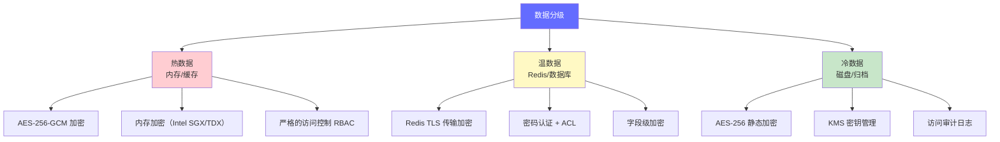

# 数据隐私 — AI 系统的隐私保护体系

> 数据隐私不是"加个加密"就完事的事，而是从数据收集、传输、处理、存储到销毁的全生命周期保护，尤其在 LLM 场景下，Prompt 中的 PII 泄露是最容易被忽视的风险。

---

## 前置知识

- [概述](./index.md)
- [生产部署架构](../07-production-deployment/deployment-architecture.md)
- [KV Cache 详解](../02-model-architecture/kv-cache.md)

---

## 核心概念

### PII 的定义与分类

PII（Personally Identifiable Information，个人可识别信息）是数据隐私保护的核心对象。按照识别能力的强弱，可以分为三类：

#### 1. 直接标识符（Direct Identifiers）

能单独识别到特定个人的信息：

| 类型 | 示例 | 风险等级 |
|------|------|----------|
| 姓名 | 张三 | 高 |
| 身份证号 | 110105199001011234 | 极高 |
| 手机号 | 13800138000 | 高 |
| 邮箱 | zhangsan@example.com | 高 |
| 社保卡号 | 110000199001011234 | 极高 |
| 生物特征 | 指纹、人脸、虹膜 | 极高 |

#### 2. 间接标识符（Indirect Identifiers）

单独使用时无法识别个人，但结合其他信息可能识别：

| 类型 | 示例 | 风险等级 |
|------|------|----------|
| IP 地址 | 192.168.1.100 | 中 |
| 设备 ID | IDFA、Android ID | 中 |
| 精确位置 | GPS 坐标 | 中高 |
| Cookie ID | sessionId=abc123 | 中 |
| 账户 ID | user_id: 284719 | 中 |

#### 3. 准标识符（Quasi-Identifiers）

单条无法识别，但组合后可唯一确定个人。研究表明，**87% 的美国人可以通过"出生日期 + 性别 + 邮编"三个字段唯一识别**（Latanya Sweeney 研究）：

| 准标识符组合 | 识别率 | 说明 |
|-------------|--------|------|
| 出生日期 + 性别 + 邮编 | 87% | 经典三要素 |
| 职业 + 公司 + 城市 | 73% | 职场场景 |
| 就诊科室 + 日期 + 医院 | 91% | 医疗场景 |

### PII 在 Prompt 中的处理

LLM 场景下，用户可能在 Prompt 中无意输入 PII。处理方式有三种：

#### 脱敏（Masking）

用占位符替换敏感信息，原始数据不保留：

```python
# 脱敏前
prompt = "用户张三（身份证：110105199001011234，手机：13800138000）申请了 50 万房贷"

# 脱敏后
prompt = "用户 [NAME]（身份证：[ID_CARD]，手机：[PHONE]）申请了 50 万房贷"
```

#### 匿名化（Anonymization）

彻底删除 PII，不可恢复。适用于统计分析场景：

```python
# 匿名化后
prompt = "某用户申请了住房贷款，金额 50 万，年龄 34 岁"
```

#### 假名化（Pseudonymization）

用可逆的哈希值替换，保留关联能力但隐藏真实身份：

```python
import hashlib

def pseudonymize(value: str, salt: str) -> str:
    """假名化：相同值生成相同哈希，但不可直接反推"""
    return hashlib.sha256(f"{salt}{value}".encode()).hexdigest()[:16]

name_hash = pseudonymize("张三", "project-salt-2024")
# 输出: "a7b3c9d2e1f0..."
```

#### 三种方法对比

| 方法 | 可恢复 | 保留统计特性 | 适用场景 | 合规程度 |
|------|--------|-------------|----------|----------|
| 脱敏 | 否 | 部分保留 | 模型推理 | 中高（GDPR 认可） |
| 匿名化 | 否 | 基本保留 | 数据分析/训练 | 高（不再算 PII） |
| 假名化 | 是（有密钥） | 完全保留 | 需要关联的业务 | 中（GDPR 下仍算 PII） |

### 法规要求对 AI 系统的具体要求

#### GDPR（欧盟通用数据保护条例）

| 条款 | 要求 | AI 场景影响 |
|------|------|-------------|
| 第 15 条 访问权 | 用户可要求查看被收集的数据 | 需要能导出用户的所有 Prompt 历史 |
| 第 17 条 删除权（被遗忘权） | 用户可要求删除个人数据 | 需要从训练集、缓存、日志中彻底删除 |
| 第 20 条 可移植权 | 用户可获取结构化的数据副本 | 需要提供用户数据的 JSON/CSV 导出 |
| 第 22 条 自动化决策 | 用户有权拒绝纯自动化决策 | 金融/医疗等场景需提供人工复核通道 |
| 第 25 条 数据保护设计 | 默认采用数据最小化原则 | Prompt 中不应包含超出需求的个人信息 |

#### 中国个保法（PIPL）

| 要求 | 说明 | AI 场景影响 |
|------|------|-------------|
| 境内存储 | 中国公民个人数据存储在境内 | 不能使用境外云 API 处理中国用户数据 |
| 单独同意 | 处理敏感个人信息需单独取得同意 | AI 服务需单独弹窗告知，不能捆绑在用户协议中 |
| 最小必要 | 只收集实现目的所必需的数据 | Prompt 不应收集与任务无关的个人信息 |
| 影响评估 | 处理敏感数据前做个人信息保护影响评估 | 上线 AI 功能前需做 PIA 报告 |

#### 数据安全法

- **数据分级分类**：将数据分为一般数据、重要数据、核心数据三级
- **重要数据目录**：企业需建立重要数据识别和管理目录
- **出境安全评估**：向境外提供重要数据需通过安全评估

### 数据出境问题

#### 跨境传输风险

使用云 API（OpenAI / Anthropic / Google）时，用户数据会传输到境外服务器：

```
用户设备 → 企业服务器 → [跨境传输] → OpenAI/Anthropic API（美国） → 返回结果
                        ↑
                    风险点：数据在境外服务器上处理，受当地法律管辖
```

主要风险：
- 数据可能被他国政府依据法律调取（如美国 CLOUD Act）
- 违反中国 PIPL 的境内存储要求
- 行业监管（金融、医疗）可能明确禁止数据出境

#### 解决方案

| 方案 | 适用场景 | 成本 | 效果 |
|------|----------|------|------|
| 本地部署开源模型 | 数据完全不出境 | 高（GPU 硬件） | 最优 |
| 数据代理（Proxy 脱敏） | 允许出境但需保护 PII | 中 | 较好 |
| 边缘推理 | 数据在用户设备上处理 | 中 | 较好（受限于模型大小） |
| 合规云（阿里云/腾讯云） | 使用境内云服务 | 低 | 合规 |

### Prompt 缓存中的敏感数据泄露

#### KV Cache 中的 PII 残留

vLLM 等推理引擎使用 KV Cache 加速推理。如果缓存命中，之前的 Prompt 内容可能在缓存中残留：

```
场景：
1. 用户 A 发送："张三的信用卡余额是 50000 元，能否贷款？"
2. KV Cache 缓存了此 Prompt 的 K/V 值
3. 用户 B 发送相似结构的 Prompt
4. 缓存命中，但极端情况下可能导致信息泄漏
```

防护措施：
- 启用 KV Cache 的 per-request 隔离
- 定期清理缓存
- Prompt 脱敏后再送入推理引擎

#### Prompt 缓存（Redis/内存）加密

```python
# Redis 中缓存的 Prompt 应加密存储
import hashlib
import hmac
from cryptography.fernet import Fernet

class SecurePromptCache:
    def __init__(self, encryption_key: bytes):
        self.fernet = Fernet(encryption_key)

    def store(self, cache_key: str, prompt: str):
        encrypted = self.fernet.encrypt(prompt.encode())
        redis_client.setex(cache_key, 3600, encrypted)  # 1小时过期

    def retrieve(self, cache_key: str) -> str:
        encrypted = redis_client.get(cache_key)
        if encrypted:
            return self.fernet.decrypt(encrypted).decode()
        return ""
```

## 部署视角

### 数据分级 + 加密存储方案



#### 热数据（内存）

- **加密方式**：AES-256-GCM（带认证的加密模式，防篡改）
- **硬件支持**：Intel SGX / TDX 加密内存 enclave
- **访问控制**：基于角色的细粒度权限，每个请求独立上下文
- **清理策略**：请求完成后立即清理内存中的 PII

#### 温数据（Redis）

- **传输加密**：Redis 6.0+ 原生 TLS
- **认证**：强密码 + ACL 权限控制
- **字段级加密**：对 PII 字段单独加密，非 PII 明文存储以便索引
- **过期策略**：设置合理的 TTL，避免长期留存

#### 冷数据（磁盘）

- **加密**：AES-256 静态加密（LUKS / AWS EBS 加密）
- **密钥管理**：使用 KMS（AWS KMS / HashiCorp Vault），密钥与数据分离存储
- **归档策略**：审计日志等依法规要求保留 7 年
- **销毁**：过期数据使用安全擦除（NIST 800-88 标准）

## 面试视角

### 满分回答：设计一个金融场景的隐私合规方案

**面试官问题**："我们准备上线一个 AI 信贷审批系统，请设计完整的隐私合规方案。"

**满分回答框架**：

**第一步：数据分类分级**

> "首先对涉及的数据进行分类分级。信贷场景涉及的数据包括：
> - 核心级（极高敏感）：身份证号、银行账号、征信报告
> - 高敏感：姓名、手机号、收入、职业
> - 中敏感：申请时间、贷款金额、产品类型
> - 低敏感：脱敏后的统计特征
>
> 不同级别采用不同的保护策略。"

**第二步：处理链路设计**

> "用户提交申请后，数据流如下：
> 1. **前端采集**：表单直接 HTTPS 传输，前端做基础格式校验
> 2. **接入层**：API Gateway 做 PII 脱敏，将身份证号替换为 `[ID_CARD_HASH]`，姓名替换为 `[NAME]`
> 3. **推理层**：脱敏后的 Prompt 送入 LLM（本地部署开源模型，不跨境），KV Cache 启用 per-request 隔离
> 4. **存储层**：原始 PII 用 AES-256-GCM 加密存入数据库，仅审批人员通过 RBAC 可查看
> 5. **输出层**：审批结果脱敏后返回用户，完整记录存入审计日志"

**第三步：合规保障**

> "合规方面：
> - 用户提交前展示单独的隐私告知，明确说明 AI 参与审批，获取单独同意
> - 提供人工复核通道（GDPR 第 22 条要求）
> - 所有审计日志加密存储，保留 7 年
> - 支持用户的数据导出和删除请求（PIPL 要求）
> - 定期做个人信息保护影响评估（PIA）"

**第四步：应急响应**

> "如果有数据泄露：
> - 72 小时内通知监管机构（GDPR 要求）
> - 立即轮换加密密钥
> - 追溯泄露范围，通知受影响用户
> - 启动安全审计，修补漏洞"

## 最佳实践

1. **默认脱敏**：所有进入 LLM 的 Prompt 先过脱敏层，宁可多脱不可少脱
2. **本地优先**：敏感场景优先本地部署，避免数据出境
3. **最小必要**：Prompt 中只传入完成任务必需的信息
4. **定期审计**：每季度做一次数据权限审查，清理过期数据
5. **密钥轮换**：加密密钥定期轮换，旧密钥安全销毁
6. **员工培训**：开发团队需要知道哪些数据能进 Prompt，哪些不能
7. **供应商评估**：使用第三方 API 前评估其数据保护能力
8. **隐私设计**：在系统设计阶段就考虑隐私保护，而不是事后补救

---

*上一节：[概述](./index.md)* *下一节：[审计与可解释性](./audit-explainability.md)*
