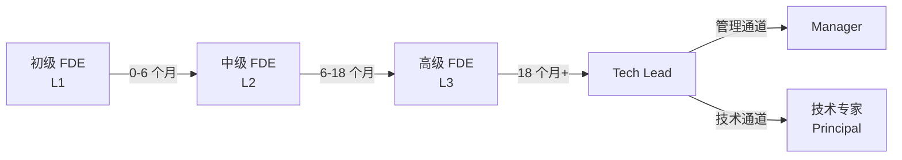

# 成长路径

> 为每个 FDE 设计清晰的成长通道，让"成长必然发生"而不是"随缘进步"

---

## 工程师成长路径总览



每个阶段的核心特征：

| 阶段 | 时间 | 核心目标 | 关键能力 |
|------|------|----------|----------|
| L1 初级 | 0-6 个月 | 能独立完成单模型部署和基础优化 | 学习、执行 |
| L2 中级 | 6-18 个月 | 能负责生产级推理服务，独立完成优化 | 分析、优化 |
| L3 高级 | 18 个月+ | 能设计推理平台架构，带领团队 | 设计、推动 |
| Tech Lead | 24 个月+ | 负责整个技术方向，跨部门推动 | 规划、协调 |
| Manager | 36 个月+ | 管理整个团队，制定战略方向 | 管理、战略 |
| 技术专家 | 36 个月+ | 行业级技术影响力，前沿探索 | 创新、引领 |

---

## 三级成长路径详细设计

### L1：入门 FDE（0-6 个月）

**核心目标**：能独立完成单模型部署和基础优化

#### 学习路径

| 月 | 学习内容 | 实践任务 | 验收标准 |
|----|----------|----------|----------|
| 第 1 月 | Transformer 架构、GPU 基础 | 部署 7B 模型 | 能独立完成部署，写好文档 |
| 第 2 月 | vLLM 核心特性 | 部署 13B 模型，做性能分析 | 能看懂 profiling，找到瓶颈 |
| 第 3 月 | 量化技术（INT8/INT4） | 给 7B 模型做量化 | 能评估量化精度，产出精度报告 |
| 第 4 月 | Continuous Batching | 优化 13B 模型的吞吐 | 有优化前后的对比数据 |
| 第 5 月 | 监控与告警 | 搭建完整的监控 dashboard | 4 个核心指标覆盖 |
| 第 6 月 | 线上故障排查 | 处理 1-2 次线上问题 | 能独立排查和修复常见问题 |

#### 能力要求

- 能独立部署 7B / 13B 模型
- 能看懂 GPU profiling 数据，定位性能瓶颈
- 能写清晰的技术文档
- 能处理常见的线上问题

#### 升 L2 标准

- 独立完成至少 3 个模型的部署和优化
- 产出至少 5 篇技术文档
- 能做一次团队内的技术分享
- 通过 L2 能力评估

### L2：成熟 FDE（6-18 个月）

**核心目标**：能负责生产级推理服务，独立完成优化项目

#### 学习路径

| 阶段 | 学习内容 | 实践任务 | 验收标准 |
|------|----------|----------|----------|
| 深度技术 | 推理引擎源码阅读 | 理解 vLLM Scheduler 机制 | 产出源码分析报告 |
| 分布式推理 | TP / PP 原理和配置 | 部署 70B 模型（TP2） | 能解释并行策略选择 |
| 高级量化 | FP8、AWQ、GPTQ | 在 70B 模型上实践 | 有完整的精度评估报告 |
| 性能调优 | Flash Attention、kernel 优化 | 优化核心场景性能 | 有量化的性能提升数据 |
| 架构设计 | 推理平台架构设计 | 参与/主导一个小平台项目 | 方案被团队采纳 |
| 故障处理 | 复杂线上问题排查 | 独立处理 3+ 次线上故障 | 有完整的故障复盘报告 |

#### 能力要求

- 能独立负责一个生产级推理服务
- 有量化的优化成果（延迟、吞吐、成本）
- 能做技术方案设计和评审
- 能独立处理复杂的线上故障

#### 升 L3 标准

- 主导过至少 1 个中等规模的优化项目
- 有清晰的方法论和可复用的经验
- 能指导 L1 级别的同学
- 在公司范围内有技术影响力

### L3：高级 / Lead FDE（18 个月+）

**核心目标**：能设计推理平台架构，带领团队完成技术攻关

#### 能力要求

- 能设计公司级推理平台的架构方案
- 能制定技术方向和发展规划
- 能跨部门推动技术方案落地
- 能做技术选型和重大决策
- 能带团队，培养新人

#### 核心工作

| 领域 | 职责 |
|------|------|
| 技术方向 | 制定推理引擎、量化、分布式等方向的技术规划 |
| 架构设计 | 设计公司级推理平台的整体架构 |
| 团队建设 | 培养团队成员，提升团队整体技术水平 |
| 跨部门协作 | 与算法、运维、产品等部门协同推进技术方案 |
| 前沿探索 | 跟踪最新技术动态，评估引入价值 |

---

## FDE 岗位的职业发展路径

### 技术通道

```
L1 初级 FDE → L2 中级 FDE → L3 高级 FDE → Senior FDE → Principal FDE（技术专家）
```

技术通道的核心是**技术深度和行业影响力**：

- 持续深耕推理引擎、量化、分布式推理等核心技术
- 在行业会议/技术社区做分享
- 参与开源项目贡献
- 推动技术创新

### 管理通道

```
L1 初级 FDE → L2 中级 FDE → L3 高级 FDE → Tech Lead → Manager → Director
```

管理通道的核心是**团队管理和业务推动能力**：

- 从带 3-5 人小团队开始
- 逐步扩大管理范围
- 从技术管理到业务管理
- 制定战略方向

### 双通道对比

| 维度 | 技术通道 | 管理通道 |
|------|----------|----------|
| 核心能力 | 技术深度、创新能力 | 团队管理、业务推动 |
| 评估标准 | 技术产出、行业影响力 | 团队成果、业务影响 |
| 日常工作 | 技术攻关、方案设计、开源贡献 | 团队管理、项目推动、战略规划 |
| 晋升路径 | Senior → Principal → Fellow | Tech Lead → Manager → Director |
| 适合的人 | 热爱技术、喜欢钻研 | 擅长协调、喜欢带团队 |

### 通道的灵活性

两个通道不是完全隔离的。在 FDE 这个岗位上，技术和管理是相辅相成的：

- **Tech Lead 需要技术深度**：没有技术深度无法做正确的技术决策
- **Manager 也需要懂技术**：不懂技术的 Manager 无法评估技术方案的可行性
- **技术专家也需要沟通能力**：没有沟通能力无法推动技术方案落地

所以建议：
- L1-L2 阶段不分通道，全面发展
- L3 阶段开始根据自己的兴趣和优势，选择偏技术或偏管理的方向
- 但无论选哪个通道，另一个方向的能力不能丢

---

## 成长追踪与评估

### 个人成长 Dashboard

每个团队成员都应该有一个个人成长 Dashboard，追踪以下指标：

| 指标 | 追踪方式 | 频率 |
|------|----------|------|
| 技术产出 | 部署的模型数量、优化项目数 | 月度 |
| 文档贡献 | 技术文档、模型卡片、踩坑记录数量 | 月度 |
| 技术分享 | 团队内分享次数 | 月度 |
| 能力评估 | 五维能力模型打分（1-5 分） | 季度 |
| 故障处理 | 独立处理的线上问题数量和复杂度 | 月度 |

### 升评估流程

```
个人申请 → 直属上级评估 → 团队评审 → 管理层审批 → 生效
```

- **个人申请**：认为自己达到下一个级别的标准后主动申请
- **直属上级评估**：上级根据能力标准做初步评估
- **团队评审**：在团队内做一次技术分享，展示自己的能力
- **管理层审批**：最终审批，确认升级

---

## 面试视角：如何在面试中展示成长路径

当面试官问"你的职业规划是什么"或"你希望在这个岗位怎么成长"时：

```
"我希望在 FDE 方向深耕，走技术和管理相结合的发展路线。
短期内（1-2 年），我希望在推理引擎和量化技术上达到专家级别，
同时能独立负责一个生产级的推理服务。
中期（3-5 年），我希望成长为 Tech Lead，
能设计公司级的推理平台架构，并带领团队完成技术攻关。
长期来看，我希望成为这个领域的技术专家，
既能做深度的技术贡献，也能带团队推动技术落地。"
```

---

*下一节：[培养机制](./training-mechanism.md)*
