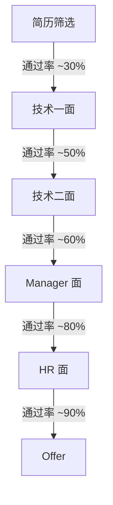

# 招聘策略

> 招聘是团队建设的第一关 — 用系统化的流程招到对的人，比事后培养成本低得多

---

## FDE 招聘漏斗



每个环节的目标：

| 环节 | 时长 | 面试官 | 核心目标 |
|------|------|--------|----------|
| 简历筛选 | 10 分钟/份 | HR + Tech Lead | 筛选出有潜力的候选人 |
| 技术一面 | 45 分钟 | 高级工程师 | 验证技术深度 |
| 技术二面 | 45 分钟 | 技术总监 | 验证项目经验和架构能力 |
| Manager 面 | 30 分钟 | 部门经理 | 验证技术规划和协作能力 |
| HR 面 | 30 分钟 | HRBP | 验证稳定性和文化匹配 |

---

## FDE 岗位的人才画像

### 必备条件

| 维度 | 要求 |
|------|------|
| 经验 | 2-5 年后端开发经验，至少 1 年 AI 部署相关经验 |
| 技术栈 | 熟悉 Python/Go/Java 至少一种，有 Linux 基础 |
| AI 能力 | 了解 Transformer 架构，有模型部署或优化经验 |
| 工程能力 | 有线上服务部署和运维经验 |

### 加分项

- 深入使用过推理引擎（vLLM、TGI、TensorRT-LLM）
- 有量化部署经验（INT8、FP8）
- 有 GPU profiling 和性能调优经验
- 有 K8s 部署经验
- 在 AI 相关方向有技术博客或开源贡献
- 有团队管理经验

### 红旗信号

| 红旗 | 说明 |
|------|------|
| 只调 API | 只会调 API，没有深入过底层 |
| 纯算法 | 只关心模型精度，不关心工程落地 |
| 工具收集癖 | 用过很多工具但没有深度 |
| 缺乏热情 | 对 AI 方向没有真实兴趣，只是找工作 |
| 不写文档 | 没有技术文档的习惯 |

---

## 面试流程详细设计

### 一面：工程能力（45 分钟）

**考察重点**：编码能力、系统设计、基础知识

```
时间分配：
0-5 min   自我介绍
5-25 min  编码题（中等难度，考察工程习惯和代码质量）
25-40 min  系统设计题（设计一个推理服务）
40-45 min  反问
```

**编码题示例**：
- 实现一个高效的 LRU Cache（考察数据结构和编码习惯）
- 实现一个简单的 token izer（考察对 NLP 基础的理解）
- 实现一个并发请求聚合器（考察并发编程能力）

**系统设计题示例**：
- "设计一个支持 1000 QPS 的大模型推理服务"
- "怎么监控一个推理服务的健康状况？"

### 二面：AI 理解力（45 分钟）

**考察重点**：模型原理、推理引擎、量化、前沿技术

```
时间分配：
0-5 min   暖场
5-25 min  AI 技术深度问答（原理 + 实践）
25-40 min  场景题（线上故障排查 / 性能优化方案）
40-45 min  反问
```

**高频问题**：
- "解释 PagedAttention 的原理"
- "INT8 和 FP8 量化怎么选？"
- "流量翻 10 倍怎么扛？"
- "线上 P99 延迟突然升高怎么排查？"

### 三面：实战经验（45 分钟）

**考察重点**：项目深度、故障处理、技术决策

```
时间分配：
0-5 min   暖场
5-25 min  项目深挖（选候选人最自豪的项目）
25-40 min  故障处理场景
40-45 min  反问
```

**项目深挖要点**：
- 项目背景和目标是否清晰
- 候选人的具体角色和贡献
- 技术选型的决策过程
- 量化成果
- 复盘和反思

### 四面：协作能力（30 分钟）

**考察重点**：跨团队推进、技术变革、沟通能力

```
时间分配：
0-5 min   暖场
5-20 min  行为面问题
20-25 min  技术方向讨论
25-30 min  反问
```

**行为面问题**：
- "讲一次你推动技术变革的经历"
- "和上级意见不一致怎么办？"
- "讲一次跨团队协作的经历"

### 终面：Manager（30 分钟）

**考察重点**：动机、成长潜力、文化匹配

```
时间分配：
0-10 min  职业规划和发展方向
10-20 min  技术视野和前沿观点
20-30 min  反问
```

---

## 面试评估表

### 技术面评估表

| 维度 | 权重 | 1 分 | 2 分 | 3 分 | 4 分 | 5 分 |
|------|------|------|------|------|------|------|
| 技术深度 | 25% | 只知概念 | 知道原理 | 有实践经验 | 能优化调参 | 源码级理解 |
| 工程能力 | 20% | 不会部署 | 能部署 | 能优化 | 能设计架构 | 能建平台 |
| 问题分析 | 15% | 无从下手 | 能按指引排查 | 能独立排查 | 能系统化分析 | 能建排查体系 |
| 编码质量 | 15% | 跑不通 | 跑通但粗糙 | 能跑且规范 | 有异常处理 | 考虑性能 |
| 沟通表达 | 15% | 表达不清 | 基本能听懂 | 逻辑清晰 | 有感染力 | 能影响他人 |
| 学习热情 | 10% | 不学习 | 被动学习 | 主动学习 | 有方法论 | 影响他人 |

**综合评分 = 各维度得分 × 权重**

| 综合评分 | 结论 |
|----------|------|
| ≥ 4.0 | Strong Hire |
| 3.5-4.0 | Hire |
| 3.0-3.5 | Weak Hire |
| 2.5-3.0 | No Hire |
| < 2.5 | Strong No Hire |

### Manager 面评估表

| 维度 | 权重 | 评估要点 |
|------|------|----------|
| 技术规划 | 25% | 有没有技术视野和规划能力 |
| 管理意识 | 20% | 有没有带团队的经验和方法论 |
| 沟通能力 | 20% | 表达是否清晰，能否跨团队推进 |
| 成长潜力 | 20% | 学习能力和自我驱动力 |
| 文化匹配 | 15% | 和团队价值观是否一致 |

### HR 面评估表

| 维度 | 权重 | 评估要点 |
|------|------|----------|
| 稳定性 | 25% | 离职原因合理、过往经历稳定 |
| 文化匹配 | 25% | 沟通真诚自然、认同公司价值观 |
| 职业规划 | 20% | 规划清晰、与岗位匹配 |
| 薪资合理 | 15% | 期望在市场范围内 |
| 动机真实 | 15% | 对新岗位有真实兴趣 |

---

## 面试官指南

### 面试前

- [ ] 提前阅读候选人简历
- [ ] 准备 2-3 个针对性问题
- [ ] 确认面试评估表
- [ ] 和上一轮面试官对齐（如果有面试笔记）

### 面试中

- [ ] 给候选人足够的展示时间
- [ ] 追问细节（"你具体做了什么？"不是"你们团队做了什么？"）
- [ ] 记录关键信息，不只是最终结论
- [ ] 注意观察候选人的沟通方式和思维过程

### 面试后

- [ ] 10 分钟内完成评估表（趁记忆新鲜）
- [ ] 写下面试笔记摘要
- [ ] 给出明确的 Hire / No Hire 结论和理由
- [ ] 如果 Hire，说明候选人的优势和风险点

### 面试官常见错误

- ❌ "光环效应"：因为候选人的公司背景就降低标准
- ❌ "镜像偏见"：只喜欢和自己相似的人
- ❌ "首因效应"：被前 5 分钟的表现影响全局判断
- ❌ "确认偏见"：带着预设结论去找证据
- ❌ 不给候选人反问时间

---

## 招聘渠道

| 渠道 | 特点 | 建议 |
|------|------|------|
| 内推 | 质量最高、成本低 | 鼓励团队成员内推 |
| 技术社区 | 候选人技术热情高 | GitHub、技术博客作者 |
| 猎头 | 覆盖面广、成本高 | 用于招中高级候选人 |
| 招聘会/会议 | 能直接接触候选人 | GTC、NeurIPS 等会议 |
| 公开招聘 | 覆盖面最广 | 筛选成本高 |

---

## 面试视角：如何在面试中展示招聘策略

当面试官问"你怎么招人"或"你怎么判断一个候选人好不好"时：

```
"我的招聘理念是'画像清晰、流程系统、数据驱动'。
首先，我们有一个明确的 FDE 人才画像 — 五维能力模型，
招聘时不是看候选人会什么工具，而是看他的 AI 理解力、
工程能力、运营意识、学习力和协作力。
面试流程是五轮，每轮有不同的考察重点，
而且有标准化的评估表，不只是凭感觉。
我最看重的三个信号是：
第一，技术热情 — 是不是真的对 AI 有兴趣，有个人项目；
第二，问题拆解能力 — 能不能自己分析问题，而不是等别人告诉怎么做；
第三，质量意识 — 是只关心'能不能跑'，还是会关注性能、成本、可维护性。"
```

---

*管理篇完成*
