# 团队文化

> 技术团队的文化决定了团队能不能持续产出高质量成果、留住优秀人才

---

## FDE 人才画像与五维能力模型

### 五维能力模型

```
              AI 理解力
            (原理+前沿)
                /\
               /  \
              /    \
  工程能力 -------- 运营意识
 (编码+部署)        (成本+效率)
        \          /
         \        /
          \      /
        学习力 × 协作力
     (自驱+跟进) (沟通+推进)
```

五个维度的含义：

| 维度 | 含义 | 评估方式 |
|------|------|----------|
| AI 理解力 | 对模型原理、架构、前沿的理解深度 | 技术面答题、新技术评估报告 |
| 工程能力 | 编码质量、系统架构、部署运维能力 | 代码 Review、线上故障率 |
| 运营意识 | 对成本、效率、SLA 的敏感度 | 项目成果中的数据表现 |
| 学习力 | 自驱学习的能力和速度 | 技术分享频率、新技术上手速度 |
| 协作力 | 跨团队沟通、方案推动、冲突处理 | 同事反馈、项目推进效率 |

### 理想候选人特征

- 2-5 年后端开发经验（Java/Go/Python），有扎实的系统编程基础
- 对 AI 有真实热情（不只是工作需求，自己有个人项目或深入探索）
- 有 Linux / 系统编程基础，理解底层运行机制
- 有持续学习的习惯（关注 arXiv、参加技术会议、写技术博客）
- 能用数据说话，有量化思维
- 有团队协作意识，不只关注自己的代码

### 不适合的人

- 纯算法研究员：不关心工程落地，只追求模型指标
- 纯业务开发：不懂底层原理，只会调 API
- 纯运维：不会开发，只能操作现成工具
- 工具收集癖：用了很多工具但没有深度理解任何一个
- 独狼型：技术很好但不愿意分享和协作

---

## 技术团队文化建设的核心要素

### 1. 技术氛围

一个健康的 FDE 团队应该有浓厚的技术氛围：

- **技术分享机制**：每周/每两周一次，轮流分享（详见 [培养机制](./training-mechanism.md)）
- **技术辩论文化**：鼓励在技术方案上激烈讨论，但决策后全力执行（disagree and commit）
- **动手实践**：不只是讨论，每个人都要有实际的项目产出
- **前沿跟踪**：定期跟踪最新论文和开源项目，评估引入价值

### 2. 信任与安全

- **心理安全**：允许犯错，鼓励坦诚沟通。踩坑后做复盘，不追究个人责任
- **技术信任**：相信每个人的技术判断，不 micromanage
- **向上透明**：每个成员都清楚团队的目标、进展和挑战

### 3. 认可与激励

- **技术贡献被看见**：技术分享、文档贡献、代码 Review 都要被记录和认可
- **成长可见**：每个人都能感受到自己的进步（L1 → L2 → L3 的成长路径清晰）
- **成果被传播**：团队的技术成果在公司内部被传播和认可

### 4. 工程师文化

- **代码质量**：不因为赶进度就降低代码质量标准
- **自动化优先**：能自动化的流程就自动化，减少手工操作
- **文档即产品**：文档的质量和代码一样重要
- **技术债管理**：定期清理技术债，不让它无限累积

---

## 工程师文化 vs 业务文化的平衡

### 冲突点

| 维度 | 工程师视角 | 业务视角 |
|------|------------|----------|
| 优先级 | 先做好技术，再谈交付 | 先交付，技术后面再优化 |
| 技术选型 | 选最好的技术方案 | 选最快能上线的方案 |
| 质量标准 | 追求性能和优雅 | 追求能用就行 |
| 时间分配 | 70% 开发 + 30% 学习 | 100% 开发 |

### 平衡策略

**FDE 团队的定位是"技术驱动业务"**，所以需要在两者之间找到平衡：

1. **基线标准**：不能因为赶交付就低于基线质量（SLA、安全性、可观测性）
2. **分阶段交付**：
   - MVP 阶段：快速上线，用最简单方案
   - 优化阶段：根据数据做性能优化
   - 稳定阶段：完善监控和自动化
3. **技术投入配额**：每月至少 20% 时间用于技术学习和基础设施建设
4. **用数据说服**：当业务方追求速度时，用数据说明技术债的代价（"如果现在不做优化，下个月容量就会成为瓶颈"）

---

## 知识分享机制

### 技术分享日历

```mermaid
gantt
    title 月度技术分享计划
    dateFormat  X
    axisFormat 第%d周

    section 第一周
    深度技术分享           :a1, 0, 5d

    section 第二周
    前沿论文解读           :a2, 7, 5d

    section 第三周
    实战案例复盘           :a3, 14, 5d

    section 第四周
    开放式讨论             :a4, 21, 5d
```



### 分享形式

| 类型 | 频率 | 时长 | 内容 |
|------|------|------|------|
| 深度分享 | 每两周 | 45 分钟 | 某个技术方向的深度讲解 |
| 论文解读 | 每周 | 20 分钟 | 最新 arXiv 论文的解读和评估 |
| 实战复盘 | 每月 | 30 分钟 | 线上项目或故障的复盘总结 |
| 开放讨论 | 每月 | 60 分钟 | 无固定主题，自由讨论技术方向 |

### 分享的质量保障

- **轮流主讲**：每个人都要准备，不能总是同一两个人
- **有产出物**：每次分享必须有一篇文档或笔记沉淀到知识库
- **有反馈**：分享后收集反馈，持续改进分享质量
- **有跟进**：分享的知识点如果在项目中有应用价值，安排后续实践

---

## 团队文化建设的落地动作

### 短期（1 个月内可以做）

- [ ] 建立技术分享日历
- [ ] 搭建知识库的初始结构
- [ ] 启动 1v1 机制
- [ ] 明确团队的五维能力模型

### 中期（1-3 个月）

- [ ] 完成第一轮技术轮转
- [ ] 建立新人 onboarding 流程
- [ ] 产出第一批模型卡片和最佳实践
- [ ] 完成首次技术雷达更新

### 长期（3-6 个月）

- [ ] 团队成员有明确的成长路径（L1 → L2）
- [ ] 知识库成为团队的核心资产
- [ ] 有团队成员在公司级别做技术分享
- [ ] 招聘到新的团队成员并快速上手

---

*下一节：[成长路径](./growth-path.md)*
