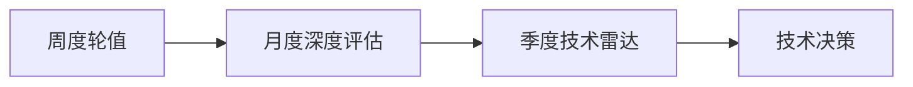

# 培养机制

> 用技术轮转、实战训练营和持续反馈，让团队的能力持续进化

---

## 技术轮转机制

### 核心理念

技术轮转的目标是**让每个人在 12 个月内完整了解 FDE 方向的所有核心技术栈**，而不是只熟悉自己负责的那一块。这样：

- 团队成员之间可以互相 Backup
- 每个人都是"T 型"人才（一个方向深，多个方向广）
- 技术决策更有全局视野

### 轮转计划（年度）

| 月份 | 主题 | 具体内容 | 产出物 |
|------|------|----------|--------|
| 1 月 | 推理引擎源码 | vLLM / TGI / TensorRT-LLM 核心模块分析 | 源码分析报告 |
| 2 月 | 量化技术 | INT8 / INT4 / FP8 / AWQ / GPTQ 原理与实践 | 量化对比报告 |
| 3 月 | 批处理优化 | Continuous Batching、chunked prefill | 性能优化报告 |
| 4 月 | 分布式推理 | Tensor Parallel、Pipeline Parallel、混合并行 | 分布式部署方案 |
| 5 月 | GPU 底层 | CUDA 基础、显存模型、profiling 工具 | GPU 性能分析 |
| 6 月 | 可观测性 | 监控体系、告警策略、故障排查 | 监控方案设计 |
| 7 月 | 前沿技术 | Reasoning 优化、Agentic 推理、FP4 量化 | 前沿技术评估 |
| 8 月 | 新模型适配 | LLaMA 4、Qwen3、Claude 4 等新模型部署 | 新模型部署文档 |
| 9 月 | 服务治理 | SLA 设计、容量规划、弹性伸缩 | 服务治理方案 |
| 10 月 | 安全与合规 | 模型安全、数据安全、隐私保护 | 安全评估报告 |
| 11 月 | 成本优化 | GPU 成本分析、Spot 实例、资源调度 | 成本优化方案 |
| 12 月 | 年度回顾 | 全年技术回顾、明年技术方向规划 | 年度技术报告 |

### 轮转执行方式

1. **每月选定主题**：月初由团队讨论确定当月主题
2. **每人负责一个子方向**：如果有 4 个人，就把主题拆成 4 个子方向
3. **月底做分享**：每人用 15-20 分钟分享自己的 deep dive 成果
4. **产出文档**：分享后必须产出文档，沉淀到知识库

### 轮转效果评估

| 指标 | 目标 |
|------|------|
| 每人每月 deep dive 数量 | ≥ 1 个 |
| 每月技术分享数量 | ≥ 2 场 |
| 每月新文档数量 | ≥ 4 篇 |
| 季度知识覆盖度 | 覆盖 ≥ 3 个核心主题 |

---

## 新人 Onboarding 流程

### 第一周：熟悉环境

| 天 | 内容 | 负责人 |
|----|------|--------|
| Day 1 | 团队介绍、环境搭建（GPU 服务器、开发环境） | Tech Lead |
| Day 2 | 阅读核心文档（五维能力模型、成长路径、知识库结构） | 导师 |
| Day 3 | 第一个任务：部署一个 7B 模型（在测试环境） | 导师 |
| Day 4 | Code Review 和部署复盘 | 导师 |
| Day 5 | 1v1 沟通：了解第一周感受和疑问 | Tech Lead |

### 第一个月：基础能力建设

| 周 | 目标 | 具体内容 |
|----|------|----------|
| 第 1 周 | 环境熟悉 | 见上表 |
| 第 2 周 | 推理引擎 | 学习 vLLM 核心特性，做一份对比分析 |
| 第 3 周 | 量化实践 | 给 7B 模型做 INT8 量化，评估精度 |
| 第 4 周 | 独立任务 | 独立完成一个完整的模型部署和优化项目 |

### 第三个月：融入团队

| 目标 | 具体内容 |
|------|----------|
| 第一次技术分享 | 在团队内做一个 20 分钟的技术分享 |
| 第一次代码 Review | Review 其他同事的代码 |
| 第一次线上支持 | 参与一次线上故障排查 |
| Onboarding 完成评估 | 由导师和 Tech Lead 做综合评估 |

### Onboarding Checklist

```
环境准备：
[ ] GPU 服务器账号和权限
[ ] 代码仓库权限
[ ] 文档知识库访问权限
[ ] 监控平台账号

导师安排：
[ ] 指定导师（资深 FDE）
[ ] 制定第一个月的学习计划
[ ] 安排每周 1v1

学习任务：
[ ] 阅读五维能力模型文档
[ ] 阅读成长路径文档
[ ] 部署第一个模型（7B）
[ ] 做第一次量化实践
[ ] 独立完成一个模型部署项目

融入团队：
[ ] 参加技术分享
[ ] 做一次技术分享
[ ] 参与一次线上故障排查
[ ] Onboarding 完成评估
```

---

## 实战训练营（每季度）

### 设计原则

实战训练营不是"上课"，而是用**真实场景**挑战团队，让每个人在解决实际问题的过程中成长。

### 季度训练营主题

| 季度 | 主题 | 挑战 |
|------|------|------|
| Q1 | 新模型上线 | 从 0 到 1 部署一个全新模型 |
| Q2 | 性能优化 | 在有限 GPU 下把延迟降低 30% |
| Q3 | 故障演练 | 模拟线上故障，限时排查和修复 |
| Q4 | 架构设计 | 设计支撑 10 万 QPS 的推理平台 |

### 训练营流程

```
发布挑战 → 组队设计 → 方案评审 → 实施验证 → 成果展示 → 复盘总结
```

1. **发布挑战**（1 天）：明确挑战目标和约束条件
2. **组队设计**（2 天）：2-3 人一组，设计方案
3. **方案评审**（1 天）：团队评审方案，提出改进意见
4. **实施验证**（3-5 天）：实施方案，产出数据
5. **成果展示**（1 天）：各组展示成果和数据
6. **复盘总结**（1 天）：总结经验和教训，沉淀到知识库

---

## 1v1 机制（每两周）

### 1v1 的定位

1v1 不是"汇报工作"，而是关注**个人成长**和**工作状态**的深度对话。

### 1v1 议程模板

| 环节 | 时长 | 内容 |
|------|------|------|
| 开场 | 5 分钟 | 最近怎么样？工作状态如何？ |
| 技术成长 | 10 分钟 | 最近在学什么？有什么困难？ |
| 职业发展 | 5 分钟 | 对职业规划有什么想法？ |
| 当前挑战 | 5 分钟 | 工作中有什么障碍？需要什么支持？ |
| 行动项 | 5 分钟 | 下次 1v1 之前要完成什么？ |

### 1v1 的注意事项

- **频率**：每两周一次，固定时间，不轻易取消
- **氛围**：轻松、坦诚、不评判
- **记录**：记录关键行动项，下次 review
- **双向**：不只是 Manager 问，成员也可以提问题和建议

---

## 持续学习机制

### 前沿技术跟踪



| 频率 | 动作 | 负责人 | 产出 |
|------|------|--------|------|
| 每周 | 轮值整理最新论文和开源项目 | 轮值人员 | 周报摘要 |
| 每月 | 对高价值技术做深度评估 | 指定人员 | 深度评估报告 |
| 每季度 | 更新技术雷达（采纳/试验/评估/暂缓） | 团队 | 技术雷达图 |
| 每半年 | 回顾技术方向，调整学习重点 | Tech Lead | 方向调整方案 |

### 学习资源池

| 类型 | 资源 |
|------|------|
| 论文 | arXiv（cs.LG、cs.DC）、NeurIPS、ICML、OSDI |
| 博客 | vLLM blog、NVIDIA blog、Meta AI blog |
| 课程 | CUDA 课程（Udacity）、LLM 系统优化课程 |
| 社区 | GitHub issues、Discord、Slack 技术频道 |
| 会议 | GTC、NeurIPS、PyTorch Conference |

### 学习激励机制

- **学习基金**：每人每年有固定的学习预算（会议、课程、书籍）
- **学习时间**：每月有固定的一天用于自主学习（不安排项目任务）
- **分享激励**：技术分享的质量和数量纳入绩效评估
- **认证奖励**：获得相关技术认证有额外奖励

---

## 面试视角：如何在面试中展示培养机制

当面试官问"你怎么培养新人"或"团队怎么持续学习"时：

```
"我的培养理念是建一个让'成长必然发生'的系统，而不是指望人自觉。
具体有三个机制：
第一，技术轮转。每月选定一个技术主题，每人 deep dive 一个子方向，
确保一年下来每个人都完整了解所有核心技术栈。
第二，实战训练营。每季度用真实场景挑战团队，
在做中学而不是上课。
第三，1v1 机制。每两周一次，关注个人成长和工作状态，
不只是汇报工作。
这套机制的效果是，团队平均 6 个月可以从 L1 成长到 L2，
而且每个人的技术视野都很全面。"
```

---

*下一节：[知识管理](./knowledge-management.md)*
