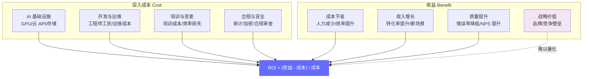
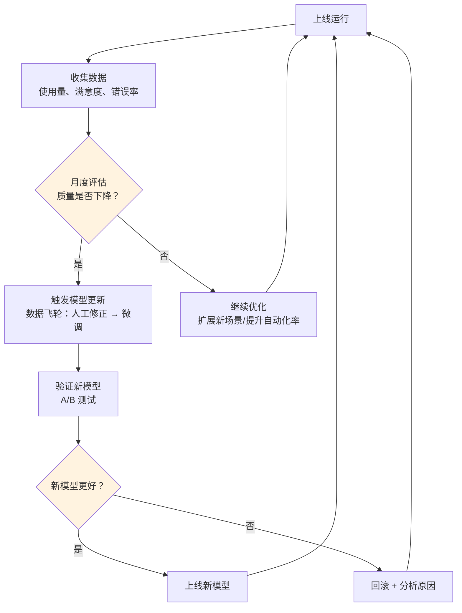

# ROI 度量框架 — 向 CEO 证明 AI 值得投资

> AI 项目的 ROI 不只是"省了多少人力成本"，而是成本节省、收入增长、质量提升的综合体现。一个清晰的投资回报率框架是持续获得投入的关键。

---

## 前置知识

- [灰度上线策略](./rollout-strategy.md)
- [业务指标体系](../10-business-workflows/business-metrics.md)

---

## ROI 度量全景图



## ROI 三大维度详解

### 1. 成本节省（最容易量化）

```
月度人力节省 = (AI 处理工单数 × 人工平均处理时间 × 人工时薪) - AI 运营成本

示例计算：
  月度工单量: 50,000 件
  AI 自动处理率: 62% → 31,000 件
  人工平均处理时间: 15 分钟 = 0.25 小时
  人工时薪: ¥60/小时
  节省人力成本: 31,000 × 0.25 × 60 = ¥465,000/月

  AI 运营成本:
    GPU 服务器: ¥80,000/月
    API 调用: ¥20,000/月
    运维人力: ¥40,000/月
    总成本: ¥140,000/月

  净节省: ¥465,000 - ¥140,000 = ¥325,000/月
  年化: ¥3,900,000/年
```

**成本节省明细表：**

| 项目 | 计算方式 | 月度金额 |
|------|---------|---------|
| 客服人力节省 | 31,000 工单 × 0.25h × ¥60 | ¥465,000 |
| 培训成本降低 | AI 辅助减少新员工培训时间 40% | ¥30,000 |
| 加班成本减少 | 峰值时段不再需要额外加班 | ¥25,000 |
| **总成本节省** | | **¥520,000** |
| AI 运营成本 | GPU + API + 运维 | -¥140,000 |
| **净节省** | | **¥380,000** |

### 2. 收入增长（需要归因分析）

```
AI 驱动的收入增长主要来自：

1. 转化率提升
   AI 个性化推荐 → 购买转化率从 3.2% 提升到 4.1%
   增量收入 = (4.1% - 3.2%) × 月访客量 × 客单价

2. 响应速度提升
   从 24 小时响应到 3 分钟响应 → 客户留存率提升
   留存率每提升 1% → 年收入增长约 5-10%

3. 新场景开拓
   原来人工无法覆盖的长尾问题 → AI 可以处理
   新场景收入 = 长尾问题量 × 转化率 × 客单价
```

**收入增长示例：**

| 增长驱动 | 基线 | AI 后 | 增量计算 | 月度增量 |
|---------|------|-------|---------|---------|
| 购买转化率 | 3.2% | 4.1% | 0.9% × 100K × ¥200 | ¥180,000 |
| 客户留存率 | 85% | 87% | 2% × ¥5M 月收入 × 12/12 | ¥100,000 |
| 长尾场景覆盖 | 0 | 5K 工单 | 5K × 2% × ¥500 | ¥50,000 |
| **总收入增长** | | | | **¥330,000** |

### 3. 质量提升（间接价值，但重要）

| 质量指标 | 基线 | AI 后 | 价值映射 |
|---------|------|-------|---------|
| 错误率 | 8% | 2% | 减少客户投诉 → 降低补偿成本 ¥50K/月 |
| 一致性 | 不同客服回答差异大 | 标准化回答 | 品牌一致性提升，长期价值 |
| NPS（净推荐值） | 35 | 48 | NPS 每提升 10 分 → 收入增长约 2-3% |
| 员工满意度 | 6.2/10 | 7.8/10 | 降低员工流失率 → 减少招聘成本 |

## AI 项目 ROI 增长曲线

| 月份 | 1 | 2 | 3 | 4 | 5 | 6 | 7 | 8 | 9 | 10 | 11 | 12 |
|------|---|---|---|---|---|---|---|---|---|----|----|----|
| 累计成本（万元） | -30 | -50 | -60 | -65 | -68 | -70 | -72 | -74 | -76 | -78 | -80 | -82 |
| 累计收益（万元） | 0 | 5 | 20 | 45 | 75 | 110 | 150 | 195 | 245 | 300 | 360 | 425 |
| 净 ROI（万元） | -30 | -45 | -40 | -20 | 7 | 40 | 78 | 121 | 169 | 222 | 280 | 343 |

> **解读：** AI 项目在前 2-3 个月是纯投入阶段（建设 + 试点），第 4-5 个月开始转正（规模化上线），之后收益加速增长（规模效应 + 模型优化）。

## 持续优化的反馈循环



**优化周期：**

| 周期 | 动作 | 产出 |
|------|------|------|
| 每周 | 用户反馈收集 + 错误分析 | 问题列表 + 优先级排序 |
| 每月 | LLM-as-a-Judge 质量评估 + ROI 计算 | 质量报告 + ROI 仪表盘 |
| 每季度 | 模型微调 + 场景扩展 | 新模型版本 + 新用例上线 |
| 每半年 | 全面的战略回顾 | 投资/继续/调整/停止决策 |

## 常见 ROI 陷阱

| 陷阱 | 描述 | 如何避免 |
|------|------|---------|
| **只算成本不算收入** | 只关注"省了多少人"，忽略了 AI 驱动的收入增长 | 建立完整的收入归因模型 |
| **忽略隐性成本** | 没算培训、合规、变更管理的成本 | 用全景图（如上）列全所有成本 |
| **过度乐观** | 假设 AI 第一天就达到 95% 准确率 | 用实际试点数据建模，不用理论值 |
| **一次性计算** | 只算首月 ROI，忽略持续优化带来的增长 | 做 12 个月的滚动 ROI 预测 |
| **忽略质量价值** | NPS 提升、品牌一致性提升等难以量化的价值没算 | 用间接指标（留存率、复购率）映射 |
| **成本不分摊** | AI 基础设施成本全算在一个项目上 | 按用量/请求量分摊到各业务线 |

## 面试视角

### "怎么向 CEO 证明 AI 项目值得投资？"满分回答

```
面试官：你怎么向 CEO 证明一个 AI 项目的 ROI？

1. 先说投入，再说回报（30 秒）
   → "我们首期投入 ¥200K/月，3 个月后每月净省 ¥380K，
     年化 ¥456 万，ROI 约 190%，投资回收期 5 个月。"

2. 拆解收益来源（1 分钟）
   → "收益来自三块：
     成本节省 ¥380K/月：AI 处理 62% 工单，减少 8 个客服人力
     收入增长 ¥330K/月：转化率提升 0.9 个百分点 + 留存率提升 2%
     质量改善 ¥50K/月：错误率从 8% 降到 2%，减少投诉补偿

     总收益 ¥760K - 成本 ¥140K = 净收益 ¥620K/月"

3. 展示增长曲线（30 秒）
   → "前 3 个月是投入期，第 4 个月盈亏平衡，第 6 个月累计
     收益超过 ¥40 万。之后每月收益加速增长，因为模型越用越准，
     自动化率持续提升。"

4. 坦诚风险和边界（30 秒）
   → "前提条件：试点数据已经验证了这些数字。
     风险是：如果新型工单量增加，准确率可能短期下降 5-10%。
     我们有 Fallback 方案，准确率低于 85% 自动转人工，
     不会影响客户体验。"

核心要点：用实际数据说话，不用假设；收益拆分清楚；主动谈风险。
```

---

## 最佳实践

1. **先建 ROI 模型再开工**：项目启动时就用试点数据建立 ROI 预测，不是上线后再算
2. **用保守估算**：ROI 报告中的数字用保守值，实际结果高于预期永远好于低于预期
3. **月度滚动更新**：每个月的实际数据更新 ROI 模型，保持预测准确
4. **成本要全算**：GPU/API 成本只是冰山一角，培训、合规、运维、变更管理都要算
5. **收益要分拆**：成本节省、收入增长、质量改善分开算，让 CEO 看到全景图
6. **建立数据飞轮**：人工修正的数据要回流到模型训练，让 AI 越用越准
7. **定期战略回顾**：每季度做一次全面的 ROI 分析，决定是加大投入、维持还是调整方向
8. **对标行业基准**：了解同行业 AI 项目的平均 ROI 水平，设定合理的目标

---

*上一节：[灰度上线策略](./rollout-strategy.md)*
