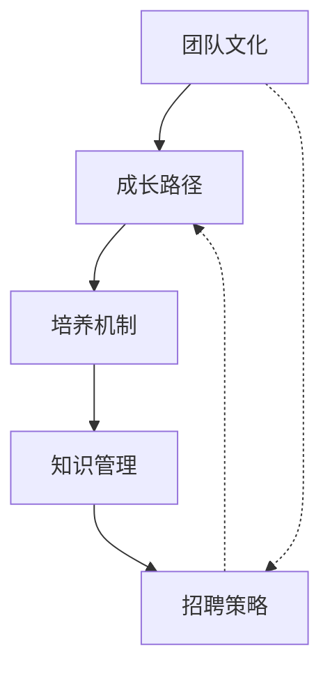

# 管理篇概述

> FDE 团队培养体系建设方案 — 既是面试答题素材，也是入职后的团队建设蓝图

---

## 为什么需要专门讲管理

市场上几乎没有"即插即用"的 FDE。原因有三：

1. **技术栈太新**：vLLM、FP8 量化、Speculative Decoding — 这些都是近两年的技术，没有成熟的培养体系
2. **能力太综合**：既要懂模型原理，又要会工程部署，还要能做性能调优
3. **变化太快**：今天的最优方案下个月可能就被新方法替代

**所以不能靠"招现成的"，必须自己培养。**

培养理念的核心转变：不是让人"自己成长"，而是建一个让"成长必然发生"的系统。

---

## 团队建设的核心模块

这五个模块相互关联，形成一个闭环：

| 模块 | 解决什么问题 | 关键产出 |
|------|-------------|----------|
| [团队文化](./team-culture.md) | 什么样的人适合这里、我们鼓励什么行为 | 人才画像、五维能力模型 |
| [成长路径](./growth-path.md) | 从入门到资深怎么走 | L1/L2/L3 三级成长路径 |
| [培养机制](./training-mechanism.md) | 怎么让人持续进步 | 技术轮转、实战训练营、1v1 |
| [知识管理](./knowledge-management.md) | 怎么让经验沉淀和传承 | 知识库、模型卡片、踩坑记录 |
| [招聘策略](./hiring-strategy.md) | 怎么持续招到对的人 | 面试流程、判断标准 |

---

## 管理篇的使用场景

### 场景一：面试答题

当面试官问到"你怎么带团队"、"怎么培养新人"、"技术团队怎么建设"等问题时，
你可以直接引用本文档中的体系和案例，展示你有系统的管理方法论。

### 场景二：入职后的团队搭建

如果你入职后需要从零搭建或接手一个 FDE 团队，
本文档提供了一个完整的建设蓝图，可以直接作为行动指南。

### 场景三：晋升答辩

当你需要从"个人贡献者"晋升到"团队管理者"时，
本文档中的体系可以作为你管理能力的证明。

---

## 管理理念：五个原则

### 原则一：系统大于个人

不依赖某个"明星员工"的自发成长，而是建一个让每个人都能成长的系统。
技术轮转、知识分享、1v1 — 这些都是"系统"的一部分。

### 原则二：数据驱动

技术决策用数据说话，管理决策也用数据说话。
每个人的成长有数据追踪，每个项目的成果有量化指标。

### 原则三：持续迭代

管理方案不是一成不变的。技术方向在变、团队结构在变、业务需求在变，
管理方案也要定期 review 和调整。

### 原则四：工程师文化

鼓励动手实践、鼓励技术分享、鼓励质疑现状。
最好的学习方式是做真实的项目，最好的分享是公开演讲。

### 原则五：人才密度

团队质量决定产出上限。宁可人少勿滥，保持高标准，
让每个加入的人都能从团队中学到东西。

---

## 文档导航

| 文档 | 内容 |
|------|------|
| [团队文化](./team-culture.md) | 人才画像、五维能力模型、文化建设 |
| [成长路径](./growth-path.md) | L1/L2/L3 三级成长路径、双通道发展 |
| [培养机制](./training-mechanism.md) | 技术轮转、实战训练营、1v1、前沿跟踪 |
| [知识管理](./knowledge-management.md) | 模型卡片、知识库、踩坑记录、文档规范 |
| [招聘策略](./hiring-strategy.md) | 面试流程、人才画像、评估表 |

---

*上一节：[变更管理与组织采纳](/13-change-adoption/)* *下一节：[团队文化](./team-culture.md)*
