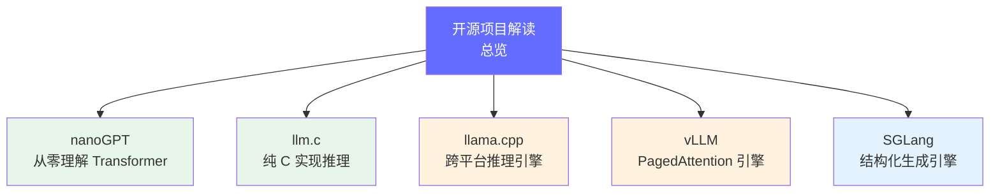

# 开源项目深度解读

> 通过阅读优秀开源项目的源码，将前面学到的知识落到实处。每个项目对应一个核心知识点。

## 导航图

| 难度 | 项目 | 对应知识 | 核心看点 | 阅读时长 |
|------|------|---------|---------|---------|
| ⭐ | [nanoGPT](./nanogpt.md) | Transformer 架构 | 从零实现 GPT，理解 Attention | 2-3 小时 |
| ⭐⭐ | [llm.c](./llm-c.md) | 推理引擎底层 | 纯 C 实现 LLM 推理 | 3-4 小时 |
| ⭐⭐ | [llama.cpp](./llama-cpp.md) | 量化与跨平台推理 | GGUF 格式、CPU 优化 | 3-4 小时 |
| ⭐⭐⭐ | [vLLM](./vllm.md) | 推理引擎架构 | PagedAttention、Continuous Batching | 4-6 小时 |
| ⭐⭐⭐ | [SGLang](./sglang.md) | 结构化生成 | RadixAttention、FSM 约束生成 | 3-4 小时 |

## 阅读建议

1. **先看文档，再读代码**：每个项目先读懂 README 和架构文档
2. **带着问题读**：比如 "vLLM 的 PagedAttention 怎么实现的？"
3. **写笔记**：读完每个项目写一段总结
4. **做对比**：读完 vLLM 再读 SGLang，对比两者的架构差异

---

*返回 [FDE 学习路径](/01-ai-basics/01-what-is-fde)*
