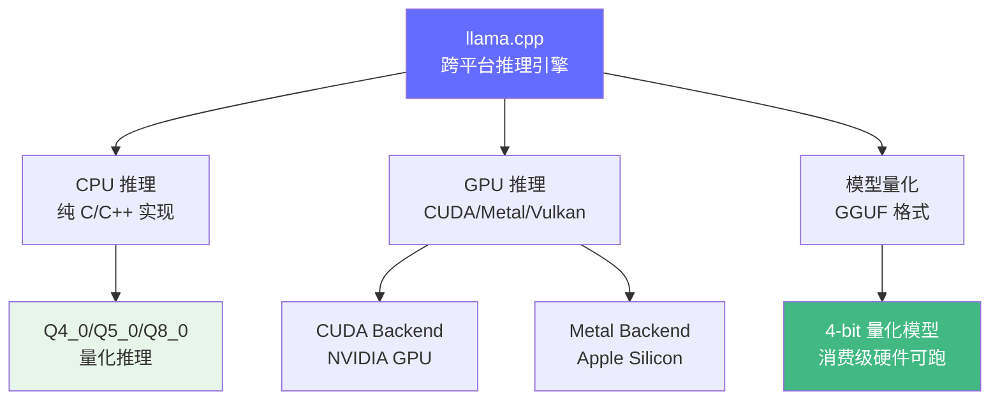
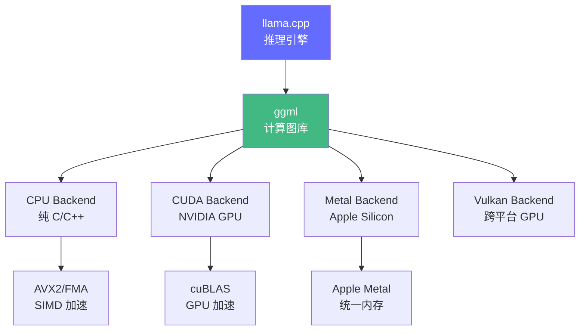

# llama.cpp 深度解读

> llama.cpp 是当前最流行的跨平台推理引擎，纯 C/C++ 实现，支持 CPU/GPU 混合推理。它的 GGUF 格式已成为模型量化的事实标准。

**GitHub**: https://github.com/ggerganov/llama.cpp

## 前置知识

- [量化基础](../04-inference-optimization/quantization-basics.md) — 了解量化概念
- [llm.c 纯 C 实现](./llm-c.md) — 理解底层推理的基本流程
- [GPU 基础](../03-gpu-basics/gpu-overview.md) — 了解 GPU 计算特性

## 项目定位

llama.cpp 解决的核心问题：**如何在不依赖 GPU 的前提下，让消费级硬件也能跑通大模型推理？**



## 核心代码解读

### 1. GGUF 文件格式

GGUF（GPT-Generated Unified Format）是 llama.cpp 的模型存储格式，也是当前量化模型的事实标准：

```
GGUF 文件结构:
┌──────────────────────────────────────────┐
│ Header                                    │
│   magic: "GGUF" (4 bytes)                 │
│   version: 3 (4 bytes)                    │
│   tensor_count (8 bytes)                  │
│   metadata_kv_count (8 bytes)             │
├──────────────────────────────────────────┤
│ Metadata KV (键值对存储模型配置)           │
│   key: "general.architecture" → "llama"   │
│   key: "llama.context_length" → 4096      │
│   key: "llama.embedding_length" → 4096    │
│   key: "llama.head_count" → 32            │
│   ...                                     │
├──────────────────────────────────────────┤
│ Tensor Info + Data                        │
│   tensor_0: name, type, shape, offset     │
│   tensor_0_data: ...                      │
│   tensor_1: ...                           │
└──────────────────────────────────────────┘
```

**支持的量化类型**：

| 类型 | 每 weight 位数 | 大小 | 精度损失 |
|------|---------------|------|---------|
| F32 | 32 bits | 原始 | 无 |
| F16 | 16 bits | 1/2 | 极小 |
| Q8_0 | 8 bits | 1/4 | 几乎无 |
| Q5_0 | 5 bits | ~1/6 | 小 |
| Q4_0 | 4 bits | 1/8 | 中等 |

### 2. 量化推理核心（4-bit 量化矩阵乘法）

```cpp
// Q4_0 格式: 每 32 个权重打包成一个 block
struct block_q4_0 {
    float16 d;           // scale factor (16 bits)
    uint8_t qs[QK4_0/2]; // quantized values (4 bits each)
};

// 量化矩阵乘法: C = A @ B(Q4_0)
void ggml_compute_forward_mul_mat_q4_0(
    const struct ggml_compute_params *params,
    const struct ggml_tensor *src0,  // 量化权重 Q4_0
    const struct ggml_tensor *src1,  // 激活值 F32
    struct ggml_tensor *dst          // 输出 F32
) {
    // 1. 遍历输出矩阵的每个 block
    for (int i = 0; i < ne01; i++) {
        const block_q4_0 *x = (const block_q4_0 *) (src0->data + i * nb01);
        const float *y = (const float *) (src1->data + i * nb11);

        // 2. 解包 4-bit 权重 + 反量化 + 累加
        for (int l = 0; l < ne00; l += QK4_0) {
            float d = GGML_FP16_TO_FP32(x[l/QK4_0].d);
            const uint8_t *qs = x[l/QK4_0].qs;

            for (int j = 0; j < QK4_0; j += 2) {
                // 解包: 一个字节存两个 4-bit 值
                int8_t v0 = (int8_t)(qs[j/2] & 0x0F) - 8;
                int8_t v1 = (int8_t)(qs[j/2] >> 4)   - 8;
                sum += (v0 * y[l+j] + v1 * y[l+j+1]) * d;
            }
        }
        dst->data[i] = sum;
    }
}
```

**关键点**：
- 4-bit 量化：32 个 float 权重 → 16 字节（128 bits）
- 反量化在运行时进行，避免存储完整精度权重
- 每个 block 一个 scale factor，保证量化后的数值范围正确

### 3. KV Cache 实现

llama.cpp 使用环形缓冲区实现 KV Cache，支持长上下文：

```cpp
struct llama_kv_cache {
    struct ggml_tensor *k;  // key cache [n_embd * n_ctx * n_layer]
    struct ggml_tensor *v;  // value cache [n_embd * n_ctx * n_layer]
    uint32_t head;          // 当前写入位置
    uint32_t size;          // 已使用大小

    bool find_slot(uint32_t n_tokens, uint32_t n_ctx) {
        // 环形缓冲区：如果末尾空间不够，从头开始找空位
        if (head + n_tokens > n_ctx) {
            head = 0;  // wrap around
        }
        return true;
    }
};
```

### 4. 多后端架构



llama.cpp 的计算后端统一由 `ggml` 库管理，每个后端实现相同的计算接口：

```cpp
// 统一的计算接口
struct ggml_backend_i {
    void (*compute)(struct ggml_tensor *tensor, ...);
    void (*free)(void *data);
};

// 不同后端的实现
ggml_backend_cpu_init();      // CPU
ggml_backend_cuda_init(0);   // NVIDIA GPU
ggml_backend_metal_init();   // Apple Silicon
```

## 与 vLLM 的对比

| 维度 | llama.cpp | vLLM |
|------|-----------|------|
| 语言 | C/C++ | Python + CUDA |
| 部署 | 单进程、嵌入式 | 服务端、多进程 |
| GPU 支持 | CUDA/Metal/Vulkan | 仅 NVIDIA CUDA |
| 量化 | Q4/Q5/Q8 原生支持 | 需要额外转换 |
| 并发 | 单请求 | Continuous Batching |
| 适合场景 | 本地部署、嵌入式、Mac | 云端服务、高并发 |

## 代码量统计

| 模块 | 代码行数 | 职责 |
|------|---------|------|
| `llama.cpp` | ~8,000 行 | 模型加载、推理、KV Cache |
| `ggml.c` | ~15,000 行 | 计算图、各种算子实现 |
| `ggml-cuda/` | ~5,000 行 | CUDA 后端 |
| `ggml-metal/` | ~3,000 行 | Metal 后端 |

## 面试视角

| 面试官问题 | llama.cpp 对应的答案 |
|-----------|-------------------|
| "4-bit 量化是怎么工作的？" | 32 个权重打包成 block，每 weight 4 bits + 1 个 scale |
| "为什么 llama.cpp 在 Mac 上快？" | Metal 后端直接利用 Apple Silicon 的统一内存 |
| "GGUF 和 GGML 的区别？" | GGML 是内存格式，GGUF 是文件格式 |
| "llama.cpp 适合什么场景？" | 本地部署、消费级硬件、低并发、边缘设备 |

## 延伸阅读

- 读完 llama.cpp 后，看 [vLLM](./vllm.md) 理解高并发场景的推理引擎
- 再看 [SGLang](./sglang.md) 理解结构化生成的特殊需求

---

*上一节：[llm.c](./llm-c.md) | 下一节：[vLLM](./vllm.md)*
