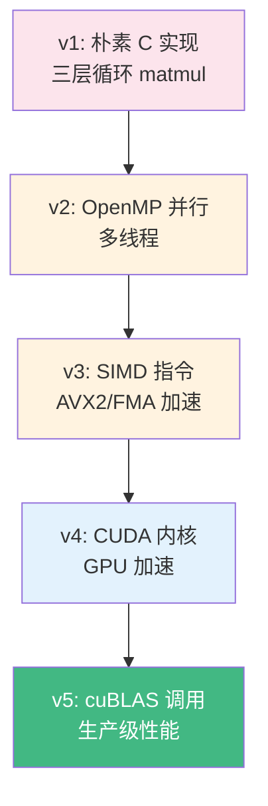

# llm.c 深度解读

> Karpathy 的 llm.c 用纯 C 语言实现了 GPT-2 的推理，展示了从高层 Python 到底层 C 的完整映射过程。它让你理解推理引擎的物理执行过程。

**GitHub**: https://github.com/karpathy/llm.c

## 前置知识

- [GPU 基础](../03-gpu-basics/gpu-overview.md) — 了解 GPU 的计算特性
- [Transformer 概述](../02-model-architecture/transformer-overview.md) — 理解模型架构

## 项目定位

llm.c 解决一个核心问题：**从 Python 的 PyTorch 代码到 C 语言的推理引擎，到底发生了什么变化？**


**从 nanoGPT 到 llm.c 的映射关系**：

| Python (nanoGPT) | C 语言 (llm.c) | 变化 |
|-----------------|---------------|------|
| `nn.Linear` | 手动分配权重矩阵 + `matmul()` | 框架依赖 → 手动实现 |
| `F.softmax` | 手动实现 exp + 归一化 | 内置函数 → 手写数学 |
| `torch.matmul` | 三层循环矩阵乘法 | GPU 加速 → CPU 标量 |
| `torch.Tensor` | `float*` 数组 | 高级类型 → 原始内存 |

## 核心代码解读

### 1. 矩阵乘法（推理的瓶颈操作）

```c
// 最朴素的三层循环矩阵乘法: C = A @ B
void matmul_forward(float* C, float* A, float* B, int BT, int OC, int BC) {
    for (int b = 0; b < BT; b++) {        // batch dimension
        for (int o = 0; o < OC; o++) {    // output column
            float val = 0.0f;
            for (int i = 0; i < BC; i++) { // inner product
                val += A[b * BC + i] * B[i * OC + o];
            }
            C[b * OC + o] = val;
        }
    }
}
```

**为什么这段代码很重要**：
- Transformer 中 90%+ 的计算量来自矩阵乘法
- PyTorch 的 `matmul` 底层调用的是 cuBLAS（CUDA BLAS）
- llm.c 先写朴素版本，再逐步优化到 OpenMP 并行、SIMD、CUDA

### 2. 注意力机制的 C 实现

```c
void attention_forward(float* out, float* att, float* Q, float* K, float* V,
                       int B, int T, int C, int NH) {
    int C3 = C * 3;  // Q, K, V 合并
    float scale = 1.0 / sqrtf(C / NH);  // 1/sqrt(d_k)

    for (int b = 0; b < B; b++) {
        for (int t = 0; t < T; t++) {
            // 1. 计算 Q @ K^T 得到 attention scores
            for (int t2 = 0; t2 <= t; t2++) {  // Causal: 只看 t2 <= t
                float val = 0.0f;
                for (int h = 0; h < NH; h++) {
                    for (int i = 0; i < C / NH; i++) {
                        val += Q[b*T*C + t*C + h*C/NH + i] *
                               K[b*T*C + t2*C + h*C/NH + i];
                    }
                }
                val *= scale;
                att[b*T*T*NH + t*T*NH + t2*NH + 0] = val;
            }

            // 2. Softmax 归一化
            float maxval = -INFINITY;
            for (int t2 = 0; t2 <= t; t2++) {
                maxval = fmaxf(maxval, att[b*T*T*NH + t*T*NH + t2*NH + 0]);
            }
            float sum = 0.0f;
            for (int t2 = 0; t2 <= t; t2++) {
                float e = expf(att[b*T*T*NH + t*T*NH + t2*NH + 0] - maxval);
                sum += e;
                att[b*T*T*NH + t*T*NH + t2*NH + 0] = e;
            }
            for (int t2 = 0; t2 <= t; t2++) {
                att[b*T*T*NH + t*T*NH + t2*NH + 0] /= sum;
            }

            // 3. Attention @ V 得到输出
            for (int i = 0; i < C; i++) {
                float val = 0.0f;
                for (int t2 = 0; t2 <= t; t2++) {
                    val += att[b*T*T + t*T + t2] * V[b*T*C + t2*C + i];
                }
                out[b*T*C + t*C + i] = val;
            }
        }
    }
}
```

**与 [nanoGPT](./nanogpt.md) 的对比**：
- nanoGPT 用 `torch.matmul` 一行搞定，这里需要三层循环
- Causal mask 通过 `t2 <= t` 的循环边界隐式实现
- Softmax 需要手动实现（减最大值防溢出 → exp → 归一化）

### 3. 模型权重加载

```c
// 从 .bin 文件加载预训练权重
void malloc_and_allocate_weights(float** weights, long size) {
    *weights = (float*)malloc(size * sizeof(float));
    // 从文件读取权重数据
    fread(*weights, sizeof(float), size, weights_file);
}

// 权重文件结构:
// [magic_number: 20240326]
// [version: 3]
// [num_parameters: 124,440,576]  // GPT-2 small
// [param_0_data...] [param_1_data...] ...
```

## 优化路径：从朴素到高效

llm.c 展示了完整的优化路径：



| 版本 | 优化手段 | 性能提升 | 适用场景 |
|------|---------|---------|---------|
| v1 朴素 C | 三层循环 | 基准 | 教学 |
| v2 OpenMP | 多线程并行 | 4-8x | 多核 CPU |
| v3 SIMD | AVX2/FMA 向量指令 | 2-4x | 现代 CPU |
| v4 CUDA | 手写 GPU kernel | 10-50x | NVIDIA GPU |
| v5 cuBLAS | 调用厂商优化库 | 最优 | 生产环境 |

## 代码量统计

| 文件 | 代码行数 | 职责 |
|------|---------|------|
| `train_gpt2.c` | ~1,200 行 | 训练（朴素 C） |
| `train_gpt2cu.c` | ~2,000 行 | 训练（CUDA 优化） |
| `run.c` | ~800 行 | 推理（朴素 C） |
| `runq.c` | ~1,500 行 | 推理（量化版本） |

## 面试视角

| 面试官问题 | llm.c 对应的答案 |
|-----------|-------------------|
| "推理引擎的底层计算是什么？" | 90%+ 是矩阵乘法，其余是 LayerNorm、Softmax、GELU |
| "为什么需要 CUDA 优化？" | 朴素 C 的 matmul 太慢，GPU 并行计算可以快 50x |
| "量化在底层是怎么做的？" | FP32 → INT8，权重提前量化，推理时用 INT8 计算 |
| "CPU 推理和 GPU 推理的差异？" | CPU 靠 SIMD + 多线程，GPU 靠数千核心并行 |

## 延伸阅读

- 读完 llm.c 后，可以看 [llama.cpp](./llama-cpp.md) 了解更完善的 C++ 推理引擎
- 再看 [vLLM](./vllm.md) 理解现代推理引擎如何优化显存和调度

---

*上一节：[nanoGPT](./nanogpt.md) | 下一节：[llama.cpp](./llama-cpp.md)*
