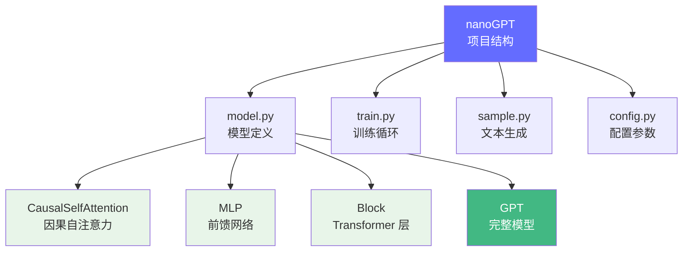

# nanoGPT 深度解读

> Karpathy 的 nanoGPT 是最精简的 GPT 实现，不到 300 行代码就能跑通训练和推理。它是理解 Transformer 核心组件的最佳入门材料。

**GitHub**: https://github.com/karpathy/nanoGPT

## 前置知识

- [Transformer 概述](../02-model-architecture/transformer-overview.md) — 了解模型架构
- [Attention 机制](../02-model-architecture/attention-mechanism.md) — 理解 Self-Attention 的计算过程

## 项目定位

nanoGPT 不是用来生产的，它是 **教学工具**。它用最少的代码实现了一个完整的 GPT 训练和推理流程，让你能看到 Transformer 的每个组件是如何用代码表达的。



## 核心代码解读

### 1. Causal Self-Attention（因果自注意力）

这是 nanoGPT 最核心的部分，完整实现了 [Attention 机制](../02-model-architecture/attention-mechanism.md) 中描述的 QKV 计算流程：

```python
class CausalSelfAttention(nn.Module):
    def __init__(self, config):
        super().__init__()
        # 三个线性层分别生成 Q, K, V
        self.c_attn = nn.Linear(config.n_embd, 3 * config.n_embd, bias=config.bias)
        # 输出投影层
        self.c_proj = nn.Linear(config.n_embd, config.n_embd, bias=config.bias)
        # 因果 mask（防止看到未来 token）
        self.register_buffer("bias", torch.tril(torch.ones(config.block_size, config.block_size))
                                        .view(1, 1, config.block_size, config.block_size))

    def forward(self, x):
        B, T, C = x.size()  # batch, sequence length, embedding dimension

        # 1. 生成 Q, K, V (B, T, 3C) -> 拆成三个 (B, T, C)
        q, k, v = self.c_attn(x).split(self.n_embd, dim=2)

        # 2. 多头拆分: (B, T, C) -> (B, nh, T, hs)
        #    nh = number of heads, hs = head size (C // nh)
        k = k.view(B, T, self.n_head, C // self.n_head).transpose(1, 2)
        q = q.view(B, T, self.n_head, C // self.n_head).transpose(1, 2)
        v = v.view(B, T, self.n_head, C // self.n_head).transpose(1, 2)

        # 3. 计算 Attention: Q @ K^T / sqrt(d_k)
        att = (q @ k.transpose(-2, -1)) * (1.0 / math.sqrt(k.size(-1)))

        # 4. 加上因果 mask（只看左边的 token）
        att = att.masked_fill(self.bias[:, :, :T, :T] == 0, float('-inf'))

        # 5. Softmax 归一化
        att = F.softmax(att, dim=-1)

        # 6. V @ Attention 权重
        y = att @ v

        # 7. 多头拼接 + 输出投影
        y = y.transpose(1, 2).contiguous().view(B, T, C)
        y = self.c_proj(y)
        return y
```

**对应理论知识点**：
- QKV 的生成 → 对应 [Attention 机制](../02-model-architecture/attention-mechanism.md) 中的公式
- Causal Mask → 保证自回归生成（只能看到左边的 token）
- 多头拆分 → `transpose(1, 2)` 是关键的维度变换

### 2. Transformer Block（单层 Transformer 层）

```python
class Block(nn.Module):
    def __init__(self, config):
        super().__init__()
        self.ln_1 = nn.LayerNorm(config.n_embd, bias=config.bias)
        self.attn = CausalSelfAttention(config)
        self.ln_2 = nn.LayerNorm(config.n_embd, bias=config.bias)
        self.mlp = nn.ModuleDict(dict(
            c_fc    = nn.Linear(config.n_embd, 4 * config.n_embd),  # 扩展
            c_proj  = nn.Linear(4 * config.n_embd, config.n_embd),  # 压缩
        ))

    def forward(self, x):
        # Pre-Norm 架构：先 LayerNorm 再 Attention
        x = x + self.attn(self.ln_1(x))
        x = x + self.mlp.c_proj(F.gelu(self.mlp.c_fc(self.ln_2(x))))
        return x
```

**关键设计**：
- **Pre-Norm**：先 LayerNorm 再 Attention/MLP，这是 GPT-2 的架构
- **GELU 激活**：比 ReLU 更平滑的非线性
- **4 倍扩展**：FFN 的 hidden dim 是 embedding dim 的 4 倍

### 3. 完整模型（GPT）

```python
class GPT(nn.Module):
    def __init__(self, config):
        super().__init__()
        self.transformer = nn.ModuleDict(dict(
            wte = nn.Embedding(config.vocab_size, config.n_embd),    # Token 嵌入
            wpe = nn.Embedding(config.block_size, config.n_embd),    # 位置嵌入
            h   = nn.ModuleList([Block(config) for _ in range(config.n_layer)]),
            ln_f = nn.LayerNorm(config.n_embd),
        ))
        self.lm_head = nn.Linear(config.n_embd, config.vocab_size, bias=False)

    def forward(self, idx, targets=None):
        b, t = idx.size()
        assert t <= self.config.block_size, "序列太长"

        # 1. Token + 位置嵌入
        tok_emb = self.transformer.wte(idx)
        pos_emb = self.transformer.wpe(torch.arange(t, device=idx.device))
        x = tok_emb + pos_emb

        # 2. 多层 Transformer Block
        for block in self.transformer.h:
            x = block(x)

        # 3. 最终 LayerNorm
        x = self.transformer.ln_f(x)

        # 4. 输出 logits
        logits = self.lm_head(x)
        loss = None
        if targets is not None:
            loss = F.cross_entropy(logits.view(-1, logits.size(-1)), targets.view(-1))
        return logits, loss
```

### 4. 训练循环（train.py 核心逻辑）

```python
# 伪代码概括
for step in range(max_iters):
    # 1. 获取一个 batch 的数据
    X, Y = get_batch('train')

    # 2. 前向传播
    logits, loss = model(X, Y)

    # 3. 反向传播
    optimizer.zero_grad()
    loss.backward()
    optimizer.step()

    # 4. 每 100 步评估一次
    if step % eval_interval == 0:
        val_loss = estimate_loss()
        print(f"step {step}: val_loss {val_loss:.4f}")
```

## 代码量统计

| 文件 | 代码行数 | 职责 |
|------|---------|------|
| `model.py` | ~200 行 | GPT 模型定义（Attention + MLP + Block） |
| `train.py` | ~400 行 | 训练循环、学习率调度、Checkpoint |
| `sample.py` | ~30 行 | 文本生成 |
| `config.py` | ~50 行 | 超参数配置 |

## 面试视角

| 面试官问题 | nanoGPT 对应的答案 |
|-----------|-------------------|
| "Transformer 的核心计算是什么？" | Q @ K^T / sqrt(d_k)，然后 V @ softmax(result) |
| "为什么需要 Causal Mask？" | 保证自回归生成不依赖未来 token |
| "Pre-Norm 和 Post-Norm 的区别？" | nanoGPT 用 Pre-Norm（先 LN 再计算），训练更稳定 |
| "多头 Attention 怎么实现的？" | 拆分维度 + transpose 实现并行计算 |
| "GPT 的 FFN 为什么是 4 倍扩展？" | 经验公式，给模型足够的表示能力 |

## 延伸阅读

- 读完 nanoGPT 后，可以对比 [GPT-2 架构](../02-model-architecture/transformer-overview.md) 看看工业级实现多了哪些组件（Rotary Embedding、Flash Attention 等）
- 再看 [llm.c](./llm-c.md) 理解同样的架构如何用 C 语言实现

---

*上一节：[开源项目解读总览](./index.md) | 下一节：[llm.c 纯 C 实现](./llm-c.md)*
