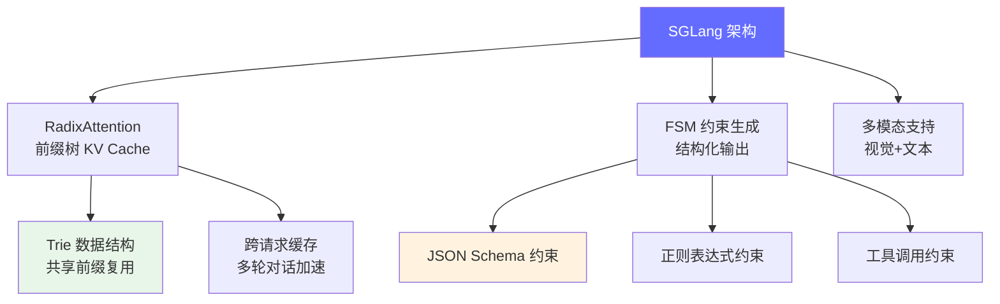
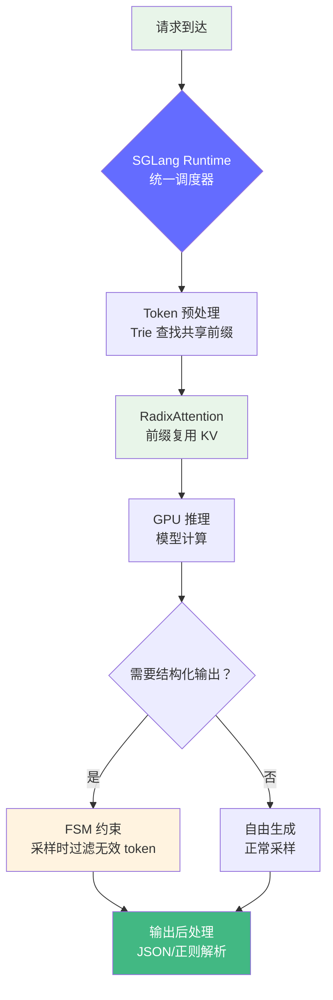

# SGLang 深度解读

> SGLang 是专注于结构化生成的推理引擎，通过 RadixAttention（前缀树 KV Cache 管理）实现了多轮对话和函数调用场景下的极致性能。

**GitHub**: https://github.com/sgl-project/sglang

## 前置知识

- [vLLM 深度解读](./vllm.md) — 理解 PagedAttention 和 Continuous Batching
- [KV Cache 详解](../02-model-architecture/kv-cache.md) — 理解 KV Cache 的工作原理

## 项目定位

vLLM 优化的是 **通用推理吞吐**，SGLang 优化的是 **结构化生成**（JSON、函数调用、多轮对话）。



## 核心代码解读

### 1. RadixAttention — 前缀树 KV Cache

RadixAttention 是 SGLang 的核心创新，它用 **Trie（前缀树）** 管理 KV Cache，而不是 vLLM 的 block 列表：

```
vLLM 的 KV Cache 管理（Block Table）：
请求1: [Block0, Block1]         每个 block 固定大小
请求2: [Block2, Block3, Block4]  无法共享前缀

SGLang 的 KV Cache 管理（Trie）：
root
├── "User: 你好" → [Block0]
│   ├── "助手: 你好！有什么" → [Block1]
│   │   └── "能帮你的？" → [Block2]  (请求1 的完整对话)
│   └── "User: 今天天气如何" → [Block3]  (请求2，共享前缀)
│       └── "助手: 今天北京" → [Block4]
└── "User: 写一段代码" → [Block5]  (请求3，全新对话)
```

**Trie 数据结构核心**：

```python
class TreeNode:
    """前缀树中的一个节点"""
    def __init__(self):
        self.children: Dict[int, TreeNode] = {}  # token_id → child node
        self.parent: Optional[TreeNode] = None
        self.key: Optional[int] = None           # token ID
        self.value: Optional[Tensor] = None      # KV cache tensor
        self.ref_counter: int = 0                # 引用计数

    def match(self, token_ids: List[int]) -> Tuple[int, List[int]]:
        """在 Trie 中匹配最长公共前缀"""
        node = self
        matched_len = 0
        for i, token_id in enumerate(token_ids):
            if token_id not in node.children:
                break
            node = node.children[token_id]
            matched_len += 1
        remaining = token_ids[matched_len:]
        return matched_len, remaining

    def insert(self, token_ids: List[int], kv_cache: Tensor):
        """插入新的 KV cache 到 Trie"""
        node = self
        for token_id in token_ids:
            if token_id not in node.children:
                new_node = TreeNode()
                new_node.key = token_id
                new_node.parent = node
                node.children[token_id] = new_node
                node = new_node
            else:
                node = node.children[token_id]
                node.ref_counter += 1
            node.value = kv_cache
```

**RadixAttention 的优势**：

| 场景 | vLLM (Block Table) | SGLang (Trie) |
|------|-------------------|---------------|
| 多轮对话 | 每轮重新计算前缀 KV | 共享前缀直接复用 |
| 相同 System Prompt | 每个请求独立计算 | 一次计算，所有请求复用 |
| 函数调用模板 | 每次从头计算 | 模板 KV 被复用 |
| 内存利用率 | 70-80% | 90%+ |

### 2. FSM 约束生成（结构化输出）

SGLang 使用有限状态机（FSM）约束模型的 token 生成，保证输出符合预定义的格式：

```python
# JSON Schema 约束生成
@sgl.function
def json_extraction(s, schema: str, text: str):
    s += "Extract information from the text:\n"
    s += text + "\n"
    s += "Result (in JSON format):\n"
    s += sgl.gen("json_output",
                 regex=r'\{[^}]*\}')  # 正则约束：只能生成 JSON

    # 结果自动解析为 JSON
    result = json.loads(s["json_output"])
    return result

# 使用示例
result = json_extraction.run(
    schema='{"name": str, "age": int}',
    text="张三，28岁，北京"
)
# 保证返回 {"name": "张三", "age": 28}
# 不会出现 "张三今年28岁，他住在..." 这样的自由文本
```

**FSM 约束在底层的工作原理**：

```python
class FSMConstraint:
    """有限状态机约束 token 生成"""

    def __init__(self, regex_pattern: str):
        self.fsm = regex_dfa_compile(regex_pattern)
        self.state = 0  # 初始状态

    def allowed_tokens(self) -> Set[int]:
        """返回当前状态下允许的 token 集合"""
        allowed = set()
        for token_id in tokenizer.vocab:
            token_str = tokenizer.decode([token_id])
            if self._can_transition(token_str):
                allowed.add(token_id)
        return allowed

    def _can_transition(self, token_str: str) -> bool:
        """检查 token 是否能在 FSM 中产生合法转移"""
        for char in token_str:
            if char not in self.fsm[self.state]:
                return False
            self.state = self.fsm[self.state][char]
        return True
```

### 3. 与 vLLM 的架构差异



## 代码量统计

| 模块 | 代码行数 | 职责 |
|------|---------|------|
| `sglang/srt/managers/scheduler.py` | ~800 行 | 调度器（RadixAttention + Continuous Batching） |
| `sglang/srt/mem_cache/radix_cache.py` | ~600 行 | Trie KV Cache 管理 |
| `sglang/srt/constrained_decoding/` | ~1,000 行 | FSM 约束生成 |
| `sglang/lang/interpreter.py` | ~500 行 | SGLang 语言解释器 |

## 与 vLLM / llama.cpp 的对比

| 维度 | SGLang | vLLM | llama.cpp |
|------|--------|------|-----------|
| 核心创新 | RadixAttention (Trie) | PagedAttention (Block) | GGUF 量化 |
| 结构化生成 | 原生支持 (FSM) | 需额外集成 | 不支持 |
| 多轮对话 | Trie 缓存复用 KV | 独立计算每个请求 | 独立计算 |
| 部署方式 | 服务端 (Python) | 服务端 (Python) | 本地/边缘 (C++) |
| 适合场景 | Agent、函数调用、JSON | 通用 API 服务 | 本地部署 |

## 面试视角

| 面试官问题 | SGLang 对应的答案 |
|-----------|-------------------|
| "RadixAttention 和 PagedAttention 的区别？" | Trie vs Block，前者共享前缀，后者按需分页 |
| "怎么保证 LLM 输出合法 JSON？" | FSM 约束生成，采样时过滤不符合 Schema 的 token |
| "多轮对话场景下怎么优化性能？" | 用 Trie 缓存共享前缀的 KV，避免重复计算 |
| "什么时候选 SGLang 而不是 vLLM？" | 需要函数调用、结构化输出、Agent 场景时 |

## 延伸阅读

- 对比 [vLLM](./vllm.md) 理解两种 KV Cache 管理策略的差异
- 了解 [Agent 架构](../08-ai-engineering-tech-stack/agent-architecture.md) 理解结构化生成在 Agent 中的作用

---

*上一节：[vLLM](./vllm.md) | 下一节：[开源项目解读总览](./index.md)*
