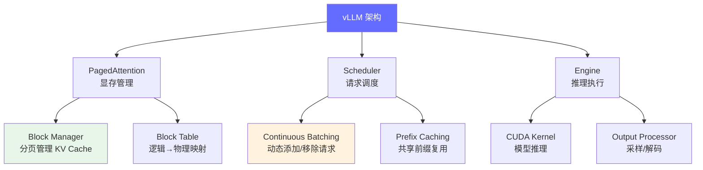
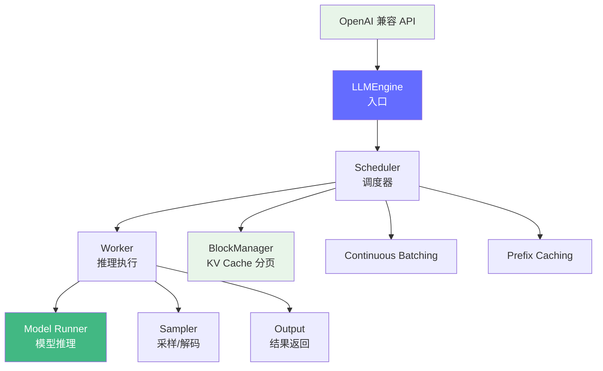

# vLLM 深度解读

> vLLM 是当前最流行的开源 LLM 推理引擎，其核心创新 PagedAttention 将操作系统中的分页内存管理引入推理过程，带来了 2-4x 的吞吐提升。

**GitHub**: https://github.com/vllm-project/vllm

## 前置知识

- [KV Cache 详解](../02-model-architecture/kv-cache.md) — 理解 KV Cache 的作用和显存消耗
- [推理引擎概述](../04-inference-optimization/engine-overview.md) — 了解推理引擎的核心职责
- [Continuous Batching](../04-inference-optimization/engine-overview.md) — 理解批处理优化

## 项目定位

vLLM 解决的核心问题：**传统推理引擎的显存浪费在哪里？PagedAttention 如何像操作系统的虚拟内存一样高效管理 KV Cache？**



## 核心代码解读

### 1. PagedAttention — 核心创新

传统推理引擎为每个请求预分配固定的 KV Cache 空间，导致严重碎片化：

```
传统方式（预分配固定空间）：
请求1: [████████████████████████████]  分配了 2048 token，实际用了 500
请求2: [████████████████████████████]  分配了 2048 token，实际用了 1200
请求3: [████████████████████████████]  分配了 2048 token，实际用了 300
浪费: ~70% 的 KV Cache 空间

PagedAttention 方式（分页管理）：
请求1: [Block0][Block1]                按需分配，按需释放
请求2: [Block2][Block3][Block4]        每个 block 固定大小
请求3: [Block5]                        只分配需要的 block
```

**Block Manager 核心逻辑**：

```python
class BlockTable:
    """管理一个请求的 KV Cache 物理 block 映射"""

    def __init__(self, block_size: int = 16):
        self.block_size = block_size  # 每个 block 存 16 个 token 的 KV
        self.physical_blocks: List[int] = []  # 物理 block ID 列表
        self.num_tokens = 0  # 当前已生成的 token 数

    def append_token(self) -> int:
        """添加一个 token，空间不够时分配新 block"""
        if self.num_tokens % self.block_size == 0:
            new_block = self.block_manager.allocate()
            self.physical_blocks.append(new_block)
        self.num_tokens += 1
        return self.num_tokens

    def get_block_table(self) -> List[int]:
        """返回物理 block 映射表，传给 CUDA kernel 使用"""
        return self.physical_blocks
```

**CUDA Kernel 中的 PagedAttention**：

```python
# 伪代码: CUDA kernel 使用 block_table 做 attention
def paged_attention_forward(
    q: Tensor,              # [batch_size, num_heads, head_size]
    k_cache: Tensor,        # [num_blocks, block_size, num_heads, head_size]
    v_cache: Tensor,        # [num_blocks, block_size, num_heads, head_size]
    block_tables: Tensor,   # [batch_size, max_num_blocks]
    context_lens: Tensor,   # [batch_size]
) -> Tensor:
    """
    对于每个请求，根据 block_tables 找到对应的 KV block，
    在这些 block 上做 attention 计算。
    """
    for batch_idx in range(batch_size):
        blocks = block_tables[batch_idx]  # 获取该请求的 block 列表
        context_len = context_lens[batch_idx]

        for block_idx in blocks:
            # 从分散的物理 block 中读取 KV
            k = k_cache[block_idx]
            v = v_cache[block_idx]
            # 计算 attention
            output += attention(q, k, v)
    return output
```

### 2. Scheduler — Continuous Batching

vLLM 的调度器实现了 Continuous Batching，可以在一个 batch 中动态添加新请求、移除已完成的请求：

```python
class Scheduler:
    def schedule(self) -> Tuple[List[SequenceGroup], SamplingMetadata]:
        # 1. 移除已完成的请求
        self.running_seq_groups = [
            seq for seq in self.running_seq_groups
            if not seq.is_finished()
        ]

        # 2. 尝试从等待队列中添加新请求
        while self.waiting_seq_groups:
            next_seq = self.waiting_seq_groups[0]
            if self.block_manager.can_allocate(next_seq):
                # 分配 KV Cache block，加入 running 队列
                self.block_manager.allocate(next_seq)
                self.running_seq_groups.append(next_seq)
                self.waiting_seq_groups.remove(next_seq)
            else:
                break  # 空间不够，等待下一轮

        # 3. 构建 batch
        return self.running_seq_groups
```

**与传统 Batching 的对比**：

| 传统 Batching | Continuous Batching |
|-------------|-------------------|
| 等所有请求完成才能加新请求 | 一个请求完成就立刻加新请求 |
| 短请求被长请求阻塞（tail latency） | 短请求快速完成，不被阻塞 |
| GPU 利用率低 | GPU 利用率接近 100% |

### 3. Prefix Caching — 共享前缀

多轮对话场景中，前面的 conversation 是共享的，vLLM 通过 block 级别的 hash 实现前缀缓存：

```python
class PrefixCaching:
    def __init__(self):
        self.cached_blocks: Dict[bytes, int] = {}  # block hash → block ID

    def get_cached_block(self, token_ids: Tuple[int]) -> Optional[int]:
        """检查是否有共享前缀的缓存 block"""
        block_hash = self._compute_hash(token_ids)
        return self.cached_blocks.get(block_hash)

    def _compute_hash(self, token_ids: Tuple[int]) -> bytes:
        return hashlib.sha256(
            struct.pack(f"{len(token_ids)}i", *token_ids)
        ).digest()
```

## 代码量统计

| 模块 | 代码行数 | 职责 |
|------|---------|------|
| `vllm/core/block_manager.py` | ~800 行 | PagedAttention 显存管理 |
| `vllm/core/scheduler.py` | ~600 行 | Continuous Batching 调度 |
| `vllm/worker/worker.py` | ~400 行 | 模型推理执行 |
| `vllm/attention/` | ~1,200 行 | Attention 实现（PagedAttention、FlashAttention） |
| `vllm/engine/` | ~500 行 | 推理引擎核心 |

## 架构设计



## 与 llama.cpp / SGLang 的对比

| 维度 | vLLM | llama.cpp | SGLang |
|------|------|-----------|--------|
| 语言 | Python + CUDA | C/C++ | Python + CUDA |
| 核心创新 | PagedAttention | GGUF 量化格式 | RadixAttention |
| 并发 | Continuous Batching | 单请求 | RadixAttention + 结构化生成 |
| KV Cache | 分页管理 | 线性/环形缓冲 | 前缀树管理 |
| 适合场景 | 高并发 API 服务 | 本地/边缘部署 | Agent/函数调用 |

## 面试视角

| 面试官问题 | vLLM 对应的答案 |
|-----------|-------------------|
| "PagedAttention 解决了什么问题？" | 传统推理引擎的 KV Cache 碎片化，PagedAttention 按需分配 block |
| "Continuous Batching 的原理？" | 不等待 batch 中所有请求完成，一个完成就加新请求 |
| "vLLM 的吞吐为什么比 TGI 高？" | PagedAttention + Continuous Batching 提升 GPU 利用率 |
| "Prefix Caching 在多轮对话中的效果？" | 共享 conversation 的 KV block 被复用，减少重复计算 |

## 延伸阅读

- 读完 vLLM 后，看 [SGLang](./sglang.md) 理解结构化生成引擎的设计差异
- 对比 [llama.cpp](./llama-cpp.md) 理解本地部署 vs 云端部署的不同优化方向

---

*上一节：[llama.cpp](./llama-cpp.md) | 下一节：[SGLang](./sglang.md)*
