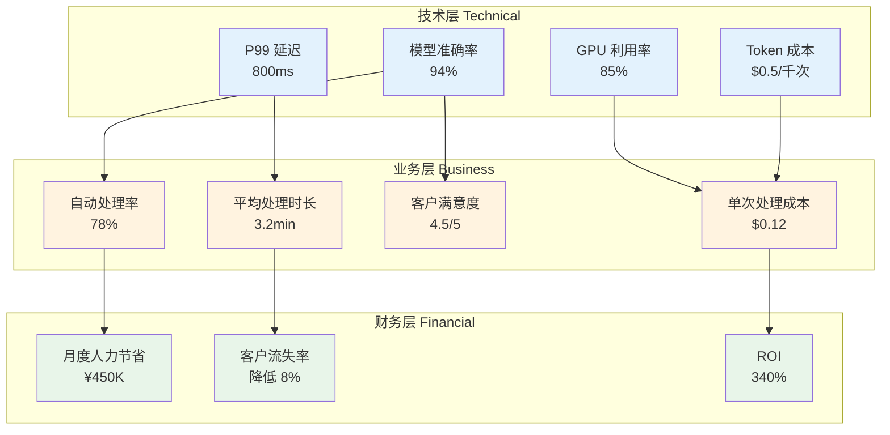
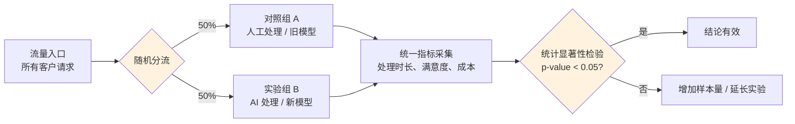
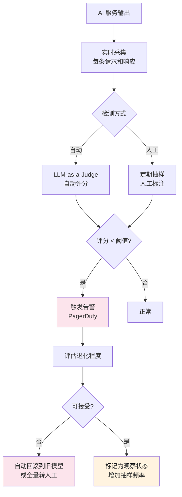
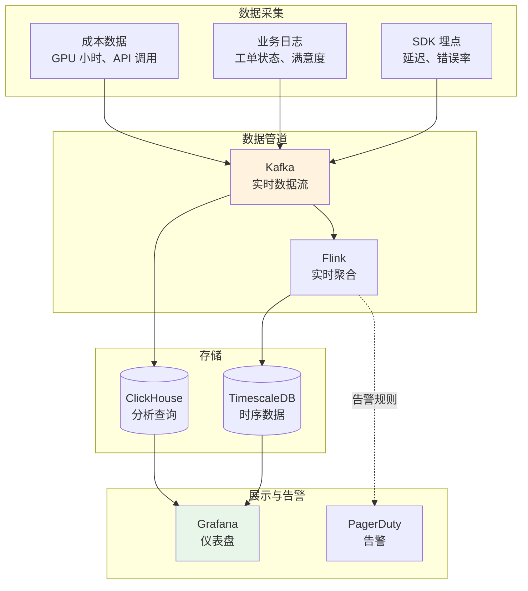

# 业务指标体系 — 让技术成果被看见

> 技术指标再漂亮，如果无法映射到业务价值，就无法获得持续投入。本章讲解如何将 LLM 的技术指标转化为 CEO 听得懂的业务语言。

---

## 前置知识

- [企业系统集成](./enterprise-integration.md)
- [AI 评测入门](../08-ai-engineering-tech-stack/ai-evaluation.md)

---

## 为什么技术指标不够

技术团队往往关注 TTFT（首 Token 延迟）、吞吐量、GPU 利用率等指标，但业务决策者关心的是完全不同的东西：

```
工程师汇报：  我们的模型 TTFT 降低到 200ms，吞吐量提升 3 倍！
CEO 的反应：  所以呢？这能为公司省多少钱？多赚多少钱？

工程师汇报：  AI 工单处理准确率 92%，平均处理时长从 15 分钟降到 3 分钟！
CEO 的反应：  很好，这意味着什么？需要多少投入？ROI 是多少？
```

**核心原则：** 每个技术指标都必须能映射到至少一个业务指标。

---

## 技术指标 vs 业务指标映射

| 技术指标 | 业务指标 | 映射方法 |
|---------|---------|---------|
| Token 生成速度 | 工单平均处理时长 | 统计响应时间与处理时长的相关性 |
| 模型准确率 | 客户满意度 / NPS | A/B 测试对比 |
| GPU 利用率 | 单次业务调用成本 | 成本分摊计算 |
| 并发数 | 峰值时段服务客户数 | 容量规划 |
| 幻觉率 | 工单升级率（Escalation Rate） | 人工介入比例统计 |
| 工具调用成功率 | 自动化流程完成率 | 端到端成功率统计 |

---

## 指标映射架构



**映射公式示例：**

```
单次处理成本 = (GPU 小时成本 / 每小时处理工单数) + API 调用成本
月度人力节省 = (AI 处理工单数 × 人工平均处理时间 × 人工时薪) - AI 运营成本
ROI = (月度人力节省 + 额外收入 - AI 总成本) / AI 总成本 × 100%
```

---

## 如何定义 AI 项目的成功指标（OKR 方法）

用 OKR 框架定义 AI 项目目标，确保技术目标和业务目标对齐：

```
Objective: 用 AI 将客服工单处理效率提升 50%

Key Results:
  KR1: 工单自动处理率从 20% 提升到 60%（业务指标）
  KR2: 平均工单处理时长从 15 分钟降到 8 分钟（业务指标）
  KR3: AI 处理工单的客户满意度 ≥ 人工处理的 90%（质量指标）
  KR4: 单次工单处理成本降低 40%（成本指标）
  KR5: 模型幻觉率 < 3%（技术指标，支撑 KR3）
```

**制定 OKR 的注意事项：**

1. **有基线**：没有基线就无法衡量进步（"目前自动处理率 20%"）
2. **可测量**：每个 KR 必须有明确的计算方法和数据来源
3. **有挑战但可达**：OKR 达成 60-80% 是合理的
4. **区分领先指标和滞后指标**：
   - 领先指标（Leading）：自动化率、API 调用量 → 可实时影响
   - 滞后指标（Lagging）：客户满意度、收入 → 反映长期效果

---

## A/B 测试在 AI 项目中的应用

### 实验设计



### 关键设计要素

| 要素 | 说明 | 示例 |
|------|------|------|
| **随机化** | 确保实验组和对照组的用户特征分布一致 | 用用户 ID 的 hash 值分流 |
| **样本量** | 基于预期效应大小和统计功效计算 | 检测 10% 差异，需要每组 2000+ 样本 |
| **实验周期** | 覆盖完整的业务周期（至少 1-2 周） | 包含工作日和周末 |
| **主要指标** | 实验关注的核心指标（不超过 3 个） | 工单处理时长、客户满意度 |
| **护栏指标** | 不能恶化的指标 | 系统可用性、错误率 |

### 统计显著性判断

```python
from scipy import stats

# A/B 测试：比较两组客户满意度
control_scores = [4.2, 3.8, 4.5, ...]  # 对照组
treatment_scores = [4.5, 4.1, 4.7, ...]  # 实验组

t_stat, p_value = stats.ttest_ind(treatment_scores, control_scores)

if p_value < 0.05:
    print(f"结果统计显著 (p={p_value:.4f})，实验组优于对照组")
else:
    print(f"结果不显著 (p={p_value:.4f})，需要更多样本")
```

### 常见陷阱

| 陷阱 | 描述 | 如何避免 |
|------|------|---------|
| **辛普森悖论** | 分组看都赢了，合起来却输了 | 分析时考虑用户分层，按用户类型分别看 |
| **选择偏差** | 实验组和对照组的用户特征不一致 | 严格随机分流，分流后检查特征分布 |
| **新奇效应** | 用户刚开始用觉得新鲜，效果好，后来下降 | 实验周期至少 2 周，观察效果是否衰减 |
| **P-hacking** | 反复看数据，等 p < 0.05 就停 | 预先确定实验周期和样本量，不中途看结果 |
| **多指标问题** | 测了 20 个指标，碰巧有 1 个显著 | 预先确定 1-3 个主要指标，其他作为参考 |

---

## Drift Detection — 模型输出质量退化检测

### 为什么需要

AI 模型的输出质量会随时间退化，原因包括：

1. **训练数据老化**：模型训练时的数据模式与现实不再匹配
2. **用户行为变化**：用户提问方式、关注点发生变化
3. **业务规则变更**：公司政策、产品功能变更导致 AI 的回答过时
4. **外部依赖变化**：API 返回的数据格式或内容变化

```
典型案例：
  上线时 AI 分类准确率 95% → 3 个月后降至 82%
  原因：新增了 3 种工单类型，但模型没见过这些类型的样本
```

### 检测方法



### LLM-as-a-Judge 实现

```python
from pydantic import BaseModel

class QualityScore(BaseModel):
    accuracy: int  # 1-5 分
    completeness: int  # 1-5 分
    helpfulness: int  # 1-5 分
    overall: float  # 0-100

def judge_response(request: str, response: str, ground_truth: str) -> QualityScore:
    """用强模型评估弱模型的输出质量"""
    prompt = f"""作为评估专家，请对以下 AI 回答进行评分：

用户请求：{request}
AI 回答：{response}
参考答案：{ground_truth}

请从准确性、完整性、有用性三个维度评分（1-5 分），并给出总体得分（0-100）。"""

    response = llm.with_structured_output(QualityScore).invoke(prompt)
    return response

# 每日自动评估
daily_scores = []
for sample in daily_sample_100():
    score = judge_response(sample.request, sample.response, sample.ground_truth)
    daily_scores.append(score.overall)

avg_score = sum(daily_scores) / len(daily_scores)
if avg_score < BASELINE_SCORE * 0.9:  # 低于基线 10% 告警
    alert(f"模型质量下降：当前 {avg_score:.1f}，基线 {BASELINE_SCORE}")
```

### 告警与自动回滚策略

```yaml
drift_detection:
  # 检测频率
  schedule: "*/6h"  # 每 6 小时评估一次

  # 告警阈值
  alert:
    quality_drop_threshold: 10%  # 质量下降超过 10% 告警
    volume_threshold: 500        # 评估样本至少 500 条

  # 自动回滚条件
  auto_rollback:
    conditions:
      - quality_drop > 20% AND duration > 24h
      - error_rate > 15% AND duration > 1h
      - customer_complaint_rate > 5%

  # 回滚动作
  rollback_actions:
    - switch_to_previous_model  # 切回上一个稳定版本
    - increase_human_review     # 提升人工审核比例
    - enable_fallback_rules     # 启用规则引擎兜底
```

---

## 部署视角：指标采集架构



**关键仪表盘设计：**

| 仪表盘 | 受众 | 核心指标 | 更新频率 |
|--------|------|---------|---------|
| 技术运营 | 工程师 | 延迟、错误率、GPU 利用率、队列深度 | 实时（10s） |
| 业务运营 | 运营经理 | 自动处理率、人工介入率、处理时长 | 5 分钟 |
| 高管报告 | CEO/CFO | 月度人力节省、ROI、客户满意度变化 | 每日 |

---

## 面试视角

### "怎么向 CEO 汇报 AI 项目的效果？"满分回答

```
面试官：你怎么向 CEO 汇报 AI 项目的效果？

1. 先说结论，不说技术细节（30 秒）
   → "AI 客服上线 3 个月，自动处理了 62% 的工单，节省了 ¥450K/月人力成本，
     客户满意度保持在 4.5/5，和人工持平。"

2. 展示 ROI 数据（30 秒）
   → "投入：AI 基础设施 + 开发成本 ≈ ¥200K/月
      节省：减少 8 个客服人员 ≈ ¥480K/月
      ROI：(480-200)/200 = 140%，预计 2 个月回本"

3. 展示趋势和对比（30 秒）
   → "和上线前比：平均处理时长从 15min 降到 3.2min（-79%）
      和上季度比：客户满意度从 4.3 提升到 4.5
      自动处理率：从 20% 逐月提升到 62%，每月增长约 15%"

4. 坦诚风险和下一步计划（30 秒）
   → "当前风险：模型准确率在新型工单上有下降趋势（已发现并告警）
      下一步：计划扩展到售前咨询场景，预计可再节省 ¥200K/月
      需要什么支持：需要增加 1 个数据工程师做数据管道优化"

关键要点：用数字说话，先说结果再说过程，坦诚风险，给出清晰的下一步。
```

---

## 最佳实践

1. **先定义成功再开工**：项目启动时就明确 OKR，不要等上线了才想怎么衡量
2. **技术 + 业务双仪表盘**：工程师看技术指标，管理层看业务指标，两者都要有
3. **基线！基线！基线！**：没有基线就无法衡量进步，上线前务必收集至少 2 周的基线数据
4. **A/B 测试要严谨**：预先确定样本量和实验周期，不要"看看数据再说"
5. **建立质量基线**：上线时对 AI 输出质量做全面评估，作为后续 Drift Detection 的基准
6. **定期质量巡检**：每月做一次 LLM-as-a-Judge 全量评估，不要等用户投诉了才发现
7. **成本透明化**：每次请求的成本要可计算、可分摊到具体业务线
8. **告警要分级别**：P0（自动回滚）、P1（2 小时内响应）、P2（工作日内处理），不要所有告警都一样紧急

---

*上一节：[企业系统集成](./enterprise-integration.md)*
