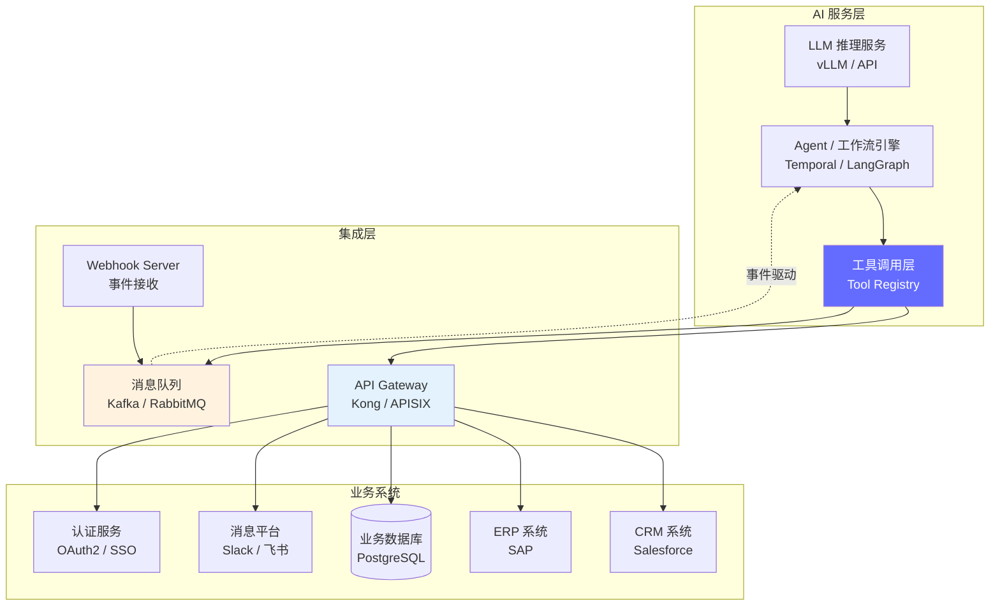
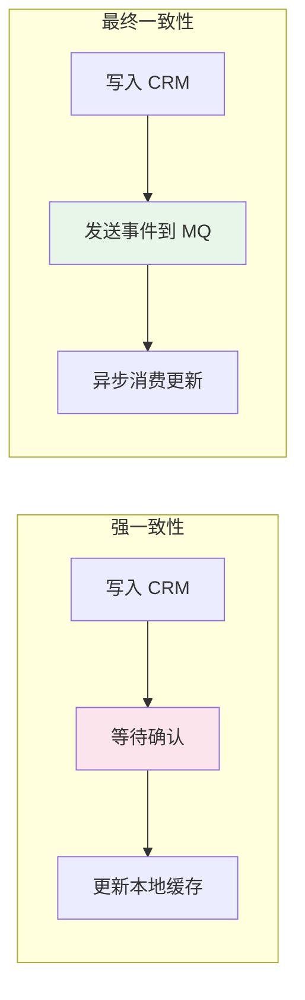
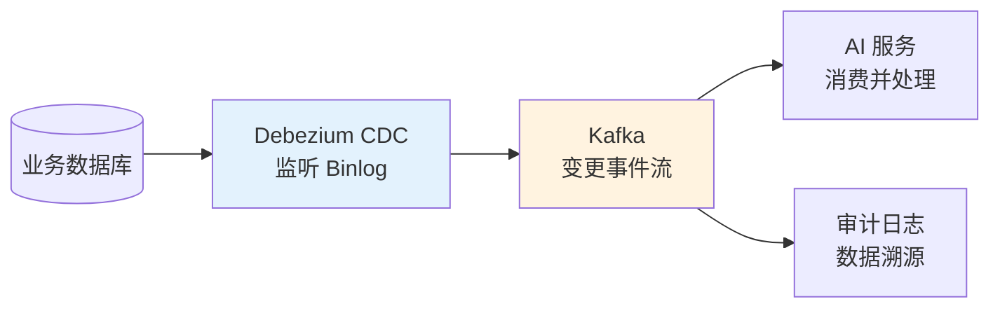
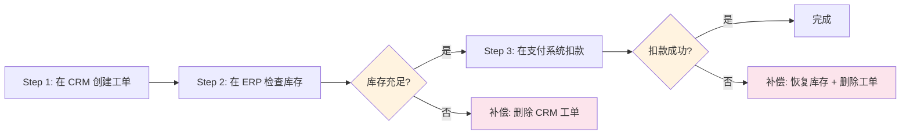
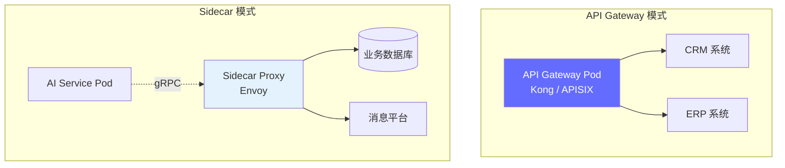

# 企业系统集成 — AI 与业务系统的桥梁

> AI 不能孤立运行，它必须能读写 CRM 客户数据、查 ERP 库存状态、调内部审批 API —— 集成能力决定了 AI 能否真正"办事"。

---

## 前置知识

- [业务流程编排](./workflow-orchestration.md)
- [生产部署架构](../06-production-deployment/deployment-architecture.md)

---

## AI 需要对接的企业系统全景

### 系统分类与对接目的

| 系统类型 | 代表产品 | AI 读取的数据 | AI 写入的数据 | 典型场景 |
|---------|---------|-------------|-------------|---------|
| **CRM** | Salesforce、HubSpot | 客户画像、工单历史、购买记录 | 创建工单、更新状态、添加备注 | 智能客服、销售辅助 |
| **ERP** | SAP、Oracle | 订单状态、库存数量、财务数据 | 创建订单、更新库存 | 订单自动处理 |
| **内部 API** | 自研系统 | 权限信息、审批状态、计费数据 | 发起审批、更新权限 | 内部流程自动化 |
| **消息平台** | Slack、飞书、企业微信 | 消息内容、群组信息 | 发送通知、创建频道 | 智能通知、告警 |
| **数据库** | PostgreSQL、MySQL | 业务状态查询、数据聚合 | 更新记录、插入日志 | 数据分析、报表 |

### 集成复杂度矩阵

```
低复杂度：    只读 + REST API + 同步调用    → 知识库检索、信息查询
中复杂度：    读写 + REST API + 异步调用     → 工单创建、状态更新
高复杂度：    读写 + 多种协议 + 事务保证     → 订单处理、库存扣减
```

---

## AI 系统集成架构



**架构说明：**
- AI 服务不直接调用业务系统 API，而是通过 API Gateway 统一路由和管理
- 事件通过消息队列异步传递，实现解耦
- Webhook Server 接收外部系统的事件通知（如 CRM 工单更新）

---

## Webhook 与事件驱动架构

### 事件驱动 vs 轮询

| 对比维度 | 轮询 (Polling) | 事件驱动 (Webhook) |
|---------|---------------|-------------------|
| 延迟 | 高（取决于轮询间隔，通常 1-5 分钟） | 低（实时推送，秒级） |
| 资源消耗 | 高（无效请求多） | 低（只在有事件时触发） |
| 实现复杂度 | 低（定时任务） | 中（需要签名验证、重试） |
| 可靠性 | 中（漏轮询会丢失） | 高（可配合消息队列保证） |
| 适用场景 | 低频数据同步 | 实时响应场景 |

```
推荐做法：核心流程用 Webhook 事件驱动，非关键数据用定时轮询兜底。
```

### Webhook 安全验证

Webhook 必须验证发送方身份，防止伪造请求：

```python
import hmac
import hashlib

def verify_webhook_signature(payload: bytes, signature: str, secret: str) -> bool:
    """验证 Webhook 的 HMAC-SHA256 签名"""
    expected = hmac.new(
        secret.encode("utf-8"),
        payload,
        hashlib.sha256
    ).hexdigest()

    # 使用时间安全的比较，防止时序攻击
    return hmac.compare_digest(f"sha256={expected}", signature)

# 使用示例
@app.post("/webhook/salesforce")
async def handle_salesforce_webhook(request: Request):
    body = await request.body()
    signature = request.headers.get("X-Salesforce-Signature", "")

    if not verify_webhook_signature(body, signature, WEBHOOK_SECRET):
        raise HTTPException(status_code=401, detail="Invalid signature")

    event = parse_cloud_event(body)
    await process_event(event)
    return {"status": "ok"}
```

### 事件格式标准化（CloudEvents）

采用 [CloudEvents](https://cloudevents.io/) 规范统一事件格式：

```json
{
  "specversion": "1.0",
  "type": "com.salesforce.ticket.updated",
  "source": "/crm/salesforce",
  "id": "evt-12345-abcde",
  "time": "2025-06-15T10:30:00Z",
  "data": {
    "ticket_id": "TKT-7890",
    "status": "escalated",
    "customer_id": "CUST-123",
    "assigned_to": "agent-456"
  }
}
```

**字段说明：**

| 字段 | 必填 | 说明 |
|------|------|------|
| `specversion` | 是 | CloudEvents 版本 |
| `type` | 是 | 事件类型，反向域名格式 |
| `source` | 是 | 事件来源 |
| `id` | 是 | 全局唯一事件 ID（用于去重） |
| `time` | 是 | 事件发生时间（ISO 8601） |
| `data` | 否 | 事件载荷 |

---

## 数据同步与一致性保证

### 最终一致性 vs 强一致性



| 策略 | 延迟 | 可靠性 | 复杂度 | 适用场景 |
|------|------|--------|--------|---------|
| 强一致性 | 高（同步等待） | 最高 | 低 | 支付、库存扣减 |
| 最终一致性 | 低（异步处理） | 中 | 中 | 客户信息同步、状态更新 |
| 混合模式 | 中 | 高 | 高 | 关键数据强一致，非关键最终一致 |

### CDC（Change Data Capture）模式

用 CDC 监听数据库变更，自动触发 AI 处理：

```
数据库 Binlog → CDC (Debezium) → Kafka → AI 服务消费事件
```



**CDC 的优势：**
- 不侵入业务代码，监听数据库层面变更
- 保证变更事件的顺序和至少一次送达
- 可以同时服务于多个消费者（AI 服务、审计日志、报表）

### 数据版本控制

当 AI 读取数据后，业务数据可能被其他系统修改。需要版本控制来避免基于过期数据做决策：

```python
# 乐观锁模式：读取时获取版本号，写入时验证版本
def update_customer(customer_id: str, data: dict, expected_version: int) -> bool:
    """更新客户数据，如果版本不匹配则拒绝"""
    current = db.get_customer(customer_id)
    if current.version != expected_version:
        raise ConflictError(f"Version mismatch: expected {expected_version}, got {current.version}")

    current.update(data)
    current.version += 1
    db.save(current)
    return True
```

---

## 错误重试与补偿机制

### 指数退避重试

```python
import asyncio
import random

async def exponential_backoff_retry(func, max_retries=3, base_delay=1.0):
    """指数退避重试，带随机抖动"""
    last_error = None
    for attempt in range(max_retries):
        try:
            return await func()
        except (TimeoutError, ConnectionError) as e:
            last_error = e
            delay = base_delay * (2 ** attempt) + random.uniform(0, 1)  # 加抖动防"惊群"
            await asyncio.sleep(delay)
            logger.warning(f"Retry {attempt + 1}/{max_retries} after {delay:.1f}s")
    raise last_error
```

**重试策略矩阵：**

| 错误类型 | 是否重试 | 策略 |
|---------|---------|------|
| 网络超时 | 是 | 指数退避，最多 3 次 |
| 4xx 客户端错误 | 否 | 记录日志，返回错误 |
| 429 限流 | 是 | 等待 Retry-After 头指定的时间 |
| 5xx 服务端错误 | 是 | 指数退避，最多 3 次 |
| 业务逻辑错误 | 否 | 转入人工处理 |

### Saga 模式（补偿事务）

当 AI 工作流需要跨多个系统操作时，用 Saga 模式保证最终一致性：



```python
# Saga 补偿事务示例
class TicketSaga:
    async def execute(self, ticket_data: dict) -> str:
        try:
            # 正向操作
            ticket_id = await self.crm.create_ticket(ticket_data)
            stock = await self.erp.check_stock(ticket_data["product_id"])
            if not stock.sufficient:
                await self.compensate(ticket_id)  # 回滚
                raise InsufficientStockError()
            payment_id = await self.payment.charge(ticket_data["amount"])
            return ticket_id
        except Exception as e:
            # 补偿操作
            await self.compensate(ticket_id)
            raise

    async def compensate(self, ticket_id: str):
        """按正向操作的逆序执行补偿"""
        await self.crm.cancel_ticket(ticket_id)
        # 如果有库存操作，需要恢复库存
        # 如果有支付操作，需要退款
```

### 死信队列与人工介入

```
正常请求 → 处理成功 → 返回结果
             ↓ 失败
         重试队列 → 重试成功 → 返回结果
             ↓ 超过最大重试次数
         死信队列 (DLQ) → 人工介入处理
```

死信队列中的消息必须包含完整的上下文，方便人工理解和处理：

```json
{
  "original_message": {...},
  "error": "Salesforce API returned 500",
  "retry_count": 3,
  "first_attempt": "2025-06-15T10:00:00Z",
  "last_attempt": "2025-06-15T10:07:00Z",
  "context": {"ticket_id": "TKT-7890", "customer_id": "CUST-123"}
}
```

---

## 企业 API 的认证和限流模式

### 认证方式对比

| 认证方式 | 安全性 | 复杂度 | 适用场景 |
|---------|--------|--------|---------|
| **API Key** | 低 | 极低 | 内部服务间调用 |
| **OAuth2 Client Credentials** | 中 | 中 | 服务间认证 |
| **OAuth2 Authorization Code** | 高 | 高 | 用户授权的 API 调用 |
| **mTLS (双向 TLS)** | 极高 | 高 | 金融、医疗等高安全场景 |
| **JWT (Bearer Token)** | 中 | 低 | 无状态认证 |

### 速率限制与配额管理

```yaml
# API Gateway 限流配置 (Kong)
plugins:
- name: rate-limiting
  config:
    hour: 10000          # 每小时 10000 次请求
    policy: redis        # 用 Redis 做分布式计数
    limit_by: consumer   # 按消费者（而非 IP）限流

- name: request-size-limiting
  config:
    allowed_payload_size: 1  # 最大 1MB 请求体

- name: correlation-id
  config:
    header_name: X-Request-ID  # 全链路追踪 ID
```

---

## 部署视角

### 集成层在 K8s 中的实现



| 模式 | 优点 | 缺点 | 推荐场景 |
|------|------|------|---------|
| API Gateway | 集中管理、统一限流、统一认证 | 单点瓶颈、运维复杂 | 对外 API、多服务共享 |
| Sidecar (Service Mesh) | 透明代理、服务间 mTLS、细粒度控制 | 资源开销（每个 Pod 一个 Sidecar） | 微服务架构、内部服务通信 |

---

## 面试视角

### "设计一个 AI + Salesforce 的客户支持系统"满分回答

```
面试官：设计一个 AI + Salesforce 的客户支持系统。

1. 架构（1 分钟）
   → 事件驱动：Salesforce 工单变更 → Webhook → Kafka → AI 服务消费
   → AI 服务用 Temporal 编排：读取工单 → 查客户历史 → 生成回复 → 写回 Salesforce
   → API Gateway 做认证和限流，Sidecar 做 mTLS 加密

2. 数据流（1 分钟）
   → 写操作：AI 通过 Salesforce REST API 更新工单状态（强一致）
   → 读操作：CDC 同步 Salesforce 数据到本地 PostgreSQL（最终一致，用于快速查询）
   → 缓存：Redis 缓存客户画像，TTL 5 分钟

3. 容错设计（1 分钟）
   → Salesforce API 限流（429）：等待 Retry-After 后重试
   → Salesforce API 宕机（5xx）：指数退避重试 3 次，失败后入死信队列
   → AI 服务宕机：Temporal 保证工作流状态持久化，恢复后从断点继续
   → 数据不一致：定期全量比对 + 差异修复任务

4. 安全措施（30 秒）
   → Webhook 签名验证（HMAC-SHA256）
   → Salesforce API 用 OAuth2 Client Credentials
   → 敏感数据（客户信息）加密存储，不落日志
   → API 限流：每 AI 服务实例 1000 req/hour

5. 监控指标（30 秒）
   → 技术指标：API 调用延迟、错误率、队列深度
   → 业务指标：工单自动处理率、平均处理时长、客户满意度
```

---

## 最佳实践

1. **统一事件格式**：所有外部事件统一用 CloudEvents 格式，降低解析复杂度
2. **Webhook 必验签**：不验证签名的 Webhook 等于公开 API，必须用 HMAC 签名
3. **幂等性设计**：所有写操作必须幂等（用业务 ID 做去重键），防止重试导致数据重复
4. **超时和限流**：每个外部 API 调用设超时（建议 30s），客户端做限流防止打垮下游
5. **补偿先行**：设计跨系统操作时，先想好怎么回退，再想怎么正向执行
6. **本地缓存兜底**：关键数据（客户画像、产品目录）做本地缓存，外部系统不可用时降级读取缓存
7. **全链路追踪**：每个请求带 X-Request-ID，贯穿 AI 服务 → Gateway → 业务系统
8. **定期健康检查**：定时探测所有外部系统 API 的可用性，提前发现故障

---

*上一节：[业务流程编排](./workflow-orchestration.md)* *下一节：[业务指标体系](./business-metrics.md)*
