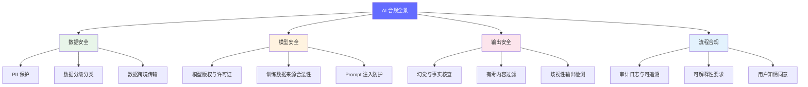

# AI 合规与安全概述

> AI 合规不是"锦上添花"，而是"入场门票"——技术再先进，合规不过关就不能上线；一次数据泄露足以摧毁整个项目。

---

## 前置知识

- [什么是 FDE](../01-ai-basics/01-what-is-fde.md)
- [生产部署架构](../06-production-deployment/deployment-architecture.md)
- [可观测性体系](../06-production-deployment/observability.md)

---

## 为什么合规是 AI 落地的第一道门槛

很多企业花数月做模型选型、调优、部署，却在上线前夕被合规审查卡住。核心原因：

1. **技术可以迭代，法规不能违反**——模型效果差可以调优，但违规罚款是刚性的。欧盟 GDPR 最高罚 2000 万欧元或全球营收 4%。
2. **AI 引入新的风险维度**——传统软件不涉及"模型幻觉输出"、"训练数据版权"、"Prompt 注入"等问题。
3. **行业监管趋严**——金融、医疗、法律等高风险行业的 AI 应用受到更严格的审查。
4. **供应链合规要求**——使用 OpenAI API 意味着数据出境；使用开源模型涉及许可证合规。

## 各行业的合规要求概览

| 行业 | 核心法规 | 关键要求 | AI 特有风险 |
|------|----------|----------|-------------|
| **金融** | 银保监会 AI 指引、巴塞尔协议 | 模型可解释、决策可追溯、数据不出境 | 信贷歧视、模型漂移导致风控失效 |
| **医疗** | HIPAA（美）、医疗器械软件监管（中） | 患者隐私、数据最小化、访问审计 | 误诊责任归属、训练数据偏差 |
| **法律** | 律师法、GDPR 自动化决策条款 | 决策可解释、客户保密 | AI 法律建议的准确性责任 |
| **教育** | 未成年人保护法、教育数据安全规范 | 未成年人数据特殊保护、内容分级 | 不当内容影响、学习数据滥用 |

## 本系列文档导航

| 文档 | 内容 |
|------|------|
| [数据隐私](./data-privacy.md) | PII 分类与处理、GDPR/PIPL 要求、数据出境方案、Prompt 缓存安全 |
| [审计与可解释性](./audit-explainability.md) | 审计日志设计、模型版本追溯、可解释性技术、拒贷案例审计链 |
| [Prompt 安全](./prompt-safety.md) | Prompt 注入攻击与防御、内容过滤、红队测试、行业合规标准 |

## 快速自检清单

在 AI 项目上线前，对照以下清单自查：

- [ ] 是否完成了数据分级分类？敏感数据是否加密存储？
- [ ] 用户数据是否出境？是否有跨境传输合规审批？
- [ ] 系统是否记录了完整的推理链日志？
- [ ] 模型版本是否锁定？回滚方案是否测试？
- [ ] Prompt 输入是否有注入防护？
- [ ] 输出是否有内容安全过滤？
- [ ] 是否做过红队测试？
- [ ] 用户是否知情并同意 AI 服务的数据使用方式？

---

*下一节：[数据隐私](./data-privacy.md)*
