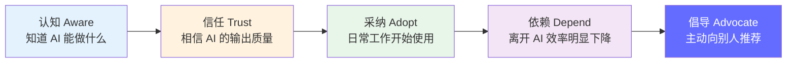

# 变更管理与组织采纳 — 让 AI 真正被用起来

> 技术部署只是第一步，组织采纳才是终点。统计显示 70% 的 AI 项目失败不是因为技术不行，而是因为没人用。

---

## 前置知识

- [AI 商业工作流概述](../18-ai-business-workflows/index.md)
- [业务指标体系](../18-ai-business-workflows/business-metrics.md)
- [面试答题方法](../10-interview/interview-framework.md)

---

## 为什么技术部署只是开始

```
技术团队视角：  GPU 部署完成 ✅ | 模型准确率 94% ✅ | API 延迟 200ms ✅ → 项目完成！
业务现实：      客服团队拒绝使用 | 主管不信任 AI 输出 | 员工不知道 AI 能做什么 → 项目失败
```

**AI 项目失败的常见原因（按频率排序）：**

| 原因 | 占比 | 说明 |
|------|------|------|
| **缺乏信任** | 35% | 业务主管不信任 AI 的决策质量 |
| **流程不匹配** | 25% | AI 的输出无法嵌入现有工作流 |
| **技能缺口** | 15% | 团队不知道如何有效使用 AI |
| **恐惧替代** | 12% | 员工担心 AI 会取代自己的工作 |
| **指标不清晰** | 8% | 无法证明 AI 的价值 |
| **技术故障** | 5% | 延迟、错误、幻觉等技术问题 |

> 一行话：**技术问题是第五大原因，前四大都是人的问题。**

## AI 采纳的生命周期



每个阶段需要不同的策略：

| 阶段 | 目标 | 关键策略 | 衡量指标 |
|------|------|---------|---------|
| 认知 | 让团队理解 AI 的能力边界 | Demo 演示、内部培训、用例分享 | 培训参与率 |
| 信任 | 证明 AI 可靠且有用 | 小范围试点、数据对比、透明化 | 试点满意度 |
| 采纳 | 融入日常工作流程 | 工具集成、流程改造、激励措施 | 日活跃使用率 |
| 依赖 | 成为不可替代的工具 | 持续优化、扩展场景 | 使用频率增长 |
| 倡导 | 自传播 | 案例分享、内部竞赛 | 推荐率 |

## 本系列文档导航

| 文档 | 内容 |
|------|------|
| [灰度上线策略](./rollout-strategy.md) | 三阶段上线、团队培训、Fallback 设计、业务主管沟通 |
| [ROI 度量框架](./roi-measurement.md) | 成本节省/收入增长计算、增长曲线、持续优化、常见 ROI 陷阱 |

---

*上一节：[Prompt 安全](../19-ai-compliance-security/prompt-safety.md)* *下一节：[灰度上线策略](./rollout-strategy.md)*
