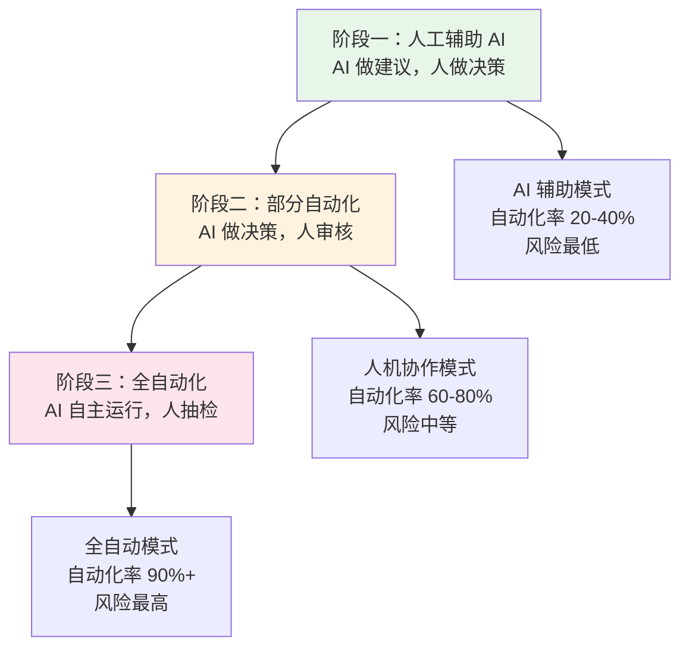
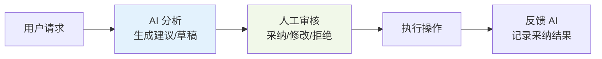
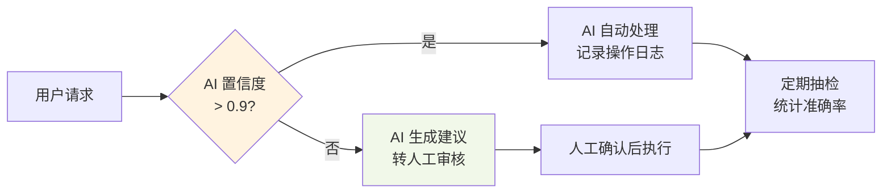
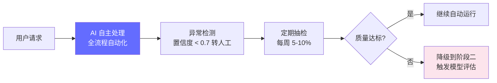
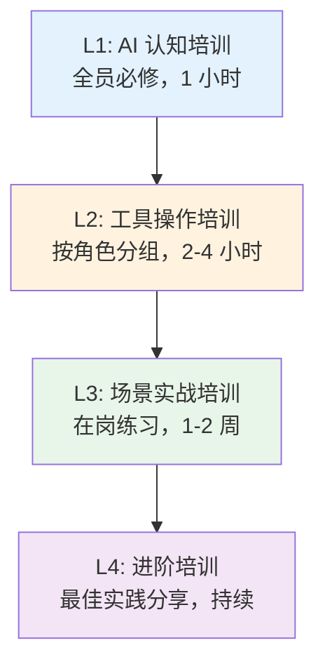
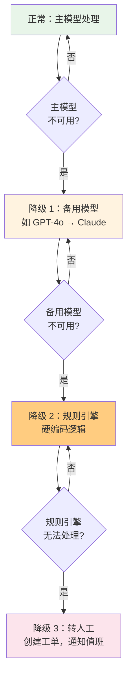

# 灰度上线策略 — 从试点到全量

> AI 系统不是"发布即稳定"的软件，它需要逐步建立信任、验证质量、调整流程。灰度上线是降低风险、提高采纳率的关键策略。

---

## 前置知识

- [概述](./index.md)
- [业务流程编排](../18-ai-business-workflows/workflow-orchestration.md)
- [业务指标体系](../18-ai-business-workflows/business-metrics.md)

---

## AI 灰度上线的三阶段模型



### 阶段一：人工辅助 AI（AI Copilot）

AI 提供建议和信息，人工做最终决策。



**特征：**

| 维度 | 说明 |
|------|------|
| AI 角色 | 助手/顾问，不直接操作 |
| 人工介入 | 每个决策都需要人工确认 |
| 自动化率 | 20-40%（AI 完成准备工作，人工做最终决策） |
| 上线周期 | 2-4 周 |
| 目标 | 让团队体验 AI 价值，建立初步信任 |

**实践要点：**
- AI 的建议旁必须标注"AI 生成，请核实"
- 记录每次采纳/修改/拒绝，用于分析 AI 质量
- 定期收集用户反馈，识别最常见的问题场景

### 阶段二：部分自动化（AI Autopilot with Oversight）

AI 自主完成大部分操作，但关键决策仍需人工审核。



**特征：**

| 维度 | 说明 |
|------|------|
| AI 角色 | 执行者，高置信度时自主操作 |
| 人工介入 | 低置信度场景 + 定期抽检 |
| 自动化率 | 60-80% |
| 上线周期 | 4-8 周 |
| 目标 | 验证 AI 在真实场景中的稳定性和准确率 |

**进入条件（从阶段一升级）：**
- AI 建议采纳率 > 85%（连续 2 周）
- 用户满意度评分 > 4.0/5.0
- 未发生任何严重错误（导致客户投诉或经济损失）

### 阶段三：全自动化（Full Autonomy）

AI 完全自主运行，人工只做异常监控和定期抽检。



**特征：**

| 维度 | 说明 |
|------|------|
| AI 角色 | 独立执行者，仅异常时转人工 |
| 人工介入 | 异常处理 + 定期抽检 |
| 自动化率 | 90%+ |
| 上线周期 | 8 周+ |
| 目标 | 最大化效率提升，降低人力成本 |

**进入条件（从阶段二升级）：**
- AI 自主决策准确率 > 95%（连续 4 周）
- 人工抽检合格率 > 95%
- 客户满意度不低于人工处理水平
- 完整的 Fallback 和降级机制已验证

## 业务团队培训方法

### 培训金字塔



| 层级 | 内容 | 受众 | 时长 | 评估方式 |
|------|------|------|------|---------|
| L1 认知 | AI 能做什么/不能做什么、能力边界、常见误区 | 全员 | 1 小时 | 问卷 |
| L2 操作 | 具体工具的使用、输入输出格式、快捷键 | 直接使用者 | 2-4 小时 | 实操测试 |
| L3 实战 | 在真实场景中使用 AI，导师陪同 | 直接使用者 | 1-2 周 | 任务完成率 |
| L4 进阶 | 高效使用技巧、Prompt 模板、案例分享 | 资深用户 | 持续 | 贡献度 |

### 培训中的常见阻力与应对

| 阻力类型 | 典型表现 | 应对策略 |
|---------|---------|---------|
| **技能焦虑** | "我不会用 AI，太复杂了" | 提供模板化的 Prompt 库，一键使用 |
| **恐惧替代** | "AI 会取代我的工作" | 强调 AI 是辅助工具，非替代品；展示效率提升数据 |
| **信任不足** | "AI 经常出错，不如我自己来" | 透明展示 AI 的准确率数据，承认局限性 |
| **流程惯性** | "以前的方式挺好的" | 量化对比：AI vs 人工的效率差异，让数据说话 |
| **管理层不支持** | "没时间搞这个" | 为管理层定制 ROI 报告，用业务指标证明价值 |

## Fallback 与降级设计

AI 系统必须有多层次的降级机制，确保在任何情况下都能提供服务。

### 降级层级



### 降级触发条件

| 降级级别 | 触发条件 | 预期效果 | 恢复条件 |
|---------|---------|---------|---------|
| 降级 1（备用模型） | 主模型 API 超时/5xx | 延迟 +50-200ms，质量略降 | 主模型恢复后自动切回 |
| 降级 2（规则引擎） | 所有 LLM 不可用 | 只能处理标准化场景 | LLM 恢复后自动切回 |
| 降级 3（转人工） | 规则引擎也无法处理 | 客户等待时间增加 | 全系统恢复后处理积压 |

### 置信度阈值设计

```python
# 基于置信度的动态路由
CONFIDENCE_THRESHOLDS = {
    "auto_process": 0.90,     # >= 0.90 自动处理
    "human_review": 0.70,     # 0.70-0.90 人工审核
    "human_handle": 0.00,     # < 0.70 直接转人工
}

def route_by_confidence(ai_result: dict) -> str:
    confidence = ai_result.get("confidence", 0.0)
    if confidence >= CONFIDENCE_THRESHOLDS["auto_process"]:
        return "auto_process"
    elif confidence >= CONFIDENCE_THRESHOLDS["human_review"]:
        return "human_review"
    else:
        return "human_handle"
```

## 面试视角

### "向 skeptical 的业务主管推销 AI 项目"满分回答

```
面试官：你怎么向一个 skeptical 的业务主管推销 AI 项目？

1. 理解他的顾虑（1 分钟）
   → 先听他说：担心什么？质量？成本？团队接受度？
   → 不要反驳，先共情："理解你的担心，我们刚开始也有这些顾虑"

2. 用小数据证明，不是大承诺（1 分钟）
   → "我们不做'全面 AI 化'的承诺。先选 20% 的工单做试点，跑 2 周。"
   → "如果 2 周后处理时长没降 30%，满意度没降，我们自动停止，你零损失。"

3. 让数据说话，不让技术说话（1 分钟）
   → 不说："我们用 GPT-4o，attention 机制多先进"
   → 说："试点数据显示，AI 辅助的工单平均处理时长 3.2 分钟，
     人工的是 15 分钟。客户满意度 4.5 vs 4.3。"

4. 让他参与设计，而不是被动接受（30 秒）
   → "你觉得哪些场景最适合先试？你来选，不是我们定。"
   → "审核规则你来定，AI 什么情况下该转人工，你说了算。"

5. 承诺退出机制（30 秒）
   → "如果试点失败，我们有一个干净的退出方案：
     所有数据导出、流程回退到原来状态，团队零影响。"

核心逻辑：不是"推销"，而是"降低风险 + 让对方有控制权"。
```

---

## 最佳实践

1. **从最小可信实验开始**：先选一个高频、低风险、易衡量的场景试点
2. **数据对比是最好的说服工具**：AI vs 人工的效率/质量对比数据胜过千言万语
3. **让业务主管参与设计**：让他们定义规则、设定阈值、选择场景，增强控制感
4. **透明展示 AI 的局限**：主动告诉业务方 AI 会出错，比他们自己发现好得多
5. **建立退出机制**：每个阶段都有回退方案，降低决策风险
6. **培训要分角色定制**：管理层看 ROI，一线员工看操作，不要一套 PPT 给所有人
7. **持续收集反馈**：每周做一次用户访谈，识别痛点并快速响应
8. **庆祝小胜利**：每个阶段达成时公开分享成果，增强团队信心

---

*上一节：[概述](./index.md)* *下一节：[ROI 度量框架](./roi-measurement.md)*
